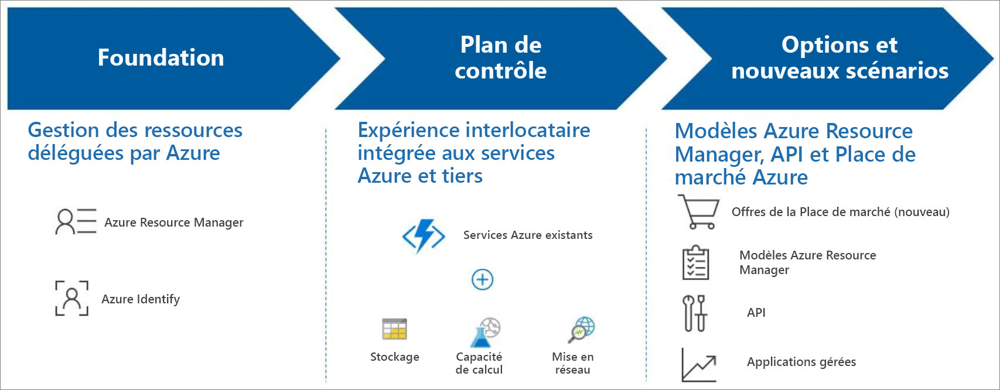

# Qu’est-ce qu’Azure Lighthouse ?

Azure Lighthouse offre une gestion inter- et multi-locataire, ce qui permet d’améliorer l’automatisation, la scalabilité et la gouvernance entre les ressources et les locataires. Avec Azure Lighthouse, les fournisseurs de services peuvent fournir des services managés à l’aide des outils de gestion complets et robustes intégrés dans la plateforme Azure. Cette offre peut également aider les organisations informatiques d’entreprise à gérer les ressources de plusieurs locataires.

## Avantages

Azure Lighthouse vous aide à créer et à fournir des services managés de manière rentable et efficace. Voici les avantages :

- **Gestion à grande échelle** : les opérations d’engagement client et de gestion du cycle de vie des ressources des clients sont plus simples et plus évolutives. Les API, les outils de gestion et les workflows existants peuvent être utilisés avec les ressources déléguées, quelles que soient les régions où ils se trouvent.
- **Visibilité et précision accrues pour les clients** : les clients ont une meilleure visibilité de vos actions et peuvent contrôler avec précision l’étendue de la gestion qu’ils délèguent, notamment la capacité à supprimer intégralement l’accès tout en préservant votre adresse IP.
- **Outillage de plateforme complet et unifié** : notre outillage est adapté aux principaux scénarios des fournisseurs de services, notamment aux modèles de licences multiples tels que Contrat Entreprise, Fournisseur de solutions cloud et paiement à l’utilisation. Les nouvelles fonctionnalités opèrent avec des outils et API, des modèles de licence et des programmes de partenaires tels que le [programme Fournisseur de solutions cloud (CSP)](/partner-center/csp-overview) existants. Vous pouvez intégrer Azure Lighthouse à vos workflows et applications existants, et vous pouvez suivre votre impact sur l’engagement des clients et recevoir un crédit Partenaires en [liant votre ID partenaire](./how-to/partner-earned-credit.md).

Aucun coût supplémentaire n’est associé à l’utilisation d’Azure Lighthouse pour gérer les ressources Azure. Tout client ou partenaire Azure peut utiliser Azure Lighthouse.

## Fonctionnalités

Azure Lighthouse offre plusieurs moyens de simplifier l’engagement et la gestion :

- **Gestion des ressources déléguées Azure** : gérez les ressources Azure de vos clients en toute sécurité à partir de votre propre locataire, sans avoir à changer de contexte ou de plan de contrôle. Les abonnements et les groupes de ressources peuvent être délégués à des utilisateurs et des rôles spécifiés dans le locataire gérant, avec la possibilité de supprimer l’accès si besoin. Pour plus d’informations, voir [Gestion des ressources déléguées Azure](concepts/azure-delegated-resource-management.md).
- **Nouvelles expériences du portail Azure** : Affichez les informations multilocataires dans la page [**Mes clients** du](./how-to/view-manage-customers.md) portail Azure. Une page [**Fournisseurs de services** correspondante](how-to/view-manage-service-providers.md) permet à vos clients de voir et gérer l’accès du fournisseur de services.
- **Modèles Microsoft Azure Resource Manager** : Nos modèles vous aident à effectuer des tâches de gestion multilocataires et à intégrer des ressources client déléguées. Pour en savoir plus, consultez [Référentiel d’exemples](https://github.com/Azure/Azure-Lighthouse-samples/tree/master/templates) et [Intégrer un client à Azure Lighthouse](how-to/onboard-customer.md).
- **Offres de services managés de la Place de marché Azure** : Offrez vos services aux clients via des offres privées ou publiques et intégrez-les automatiquement à Azure Lighthouse. Pour plus d’informations, consultez [Offres de services managés sur la Place de marché Azure](concepts/managed-services-offers.md).

## Étapes suivantes

- Découvrez [Gestion des ressources déléguées Azure](concepts/azure-delegated-resource-management.md).
- Explorez les [expériences de la gestion multilocataire](concepts/cross-tenant-management-experience.md).
- Découvrez comment [utiliser Azure Lighthouse au sein d’une d’entreprise](concepts/enterprise.md).
