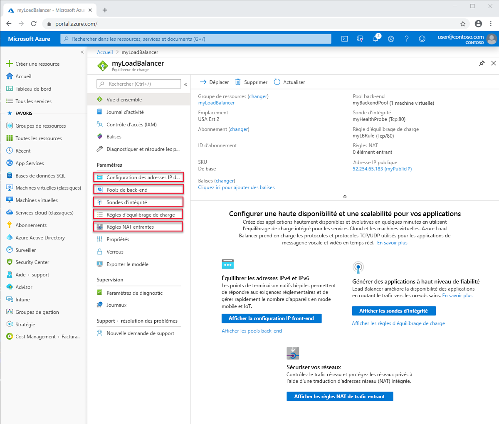

# Composants Azure Load Balancer

Azure Load Balancer contient plusieurs composants clés pour son fonctionnement. Ces composants peuvent être configurés dans votre abonnement par le biais du portail Azure, d’Azure CLI, d’Azure PowerShell ou de modèles.

## Configurations d’adresses IP frontales

Adresse IP de l’équilibreur de charge. Il s’agit du point de contact pour les clients. Ces adresses peuvent être :

- **Adresse IP publique**
- **Adresse IP privée**

La sélection de l’adresse IP détermine le **type** d’équilibreur de charge créé. La sélection d’une adresse IP privée crée un équilibreur de charge interne. La sélection d’une adresse IP publique crée un équilibreur de charge public.

|  | Équilibreur de charge public  | Équilibreur de charge interne |
| ---------- | ---------- | ---------- |
| Configuration d’adresses IP frontales| Adresse IP publique | Adresse IP privée|
| Description | Un équilibreur de charge public mappe l’adresse IP publique et le port du trafic entrant à l’adresse IP privée et au port de la machine virtuelle. L’équilibreur de charge mappe le trafic dans l’autre sens pour le trafic de réponse provenant de la machine virtuelle. Vous pouvez distribuer des types de trafic donnés entre plusieurs machines virtuelles ou services en appliquant des règles d’équilibrage de charge. Par exemple, vous pouvez répartir la charge du trafic des requêtes web entre plusieurs serveurs web.| Un équilibreur de charge interne distribue le trafic entre les ressources qui se trouvent à l’intérieur d’un réseau virtuel. Azure limite l’accès aux adresses IP front-end d’un réseau virtuel qui sont soumises à l’équilibrage de charge. Les adresses IP du serveur frontal et les réseaux virtuels ne sont jamais directement exposés à un point de terminaison Internet. Les applications métier internes s’exécutent dans Azure et sont accessibles à partir d’Azure ou à partir des ressources locales. |
| Références SKU prises en charge | De base, Standard | De base, Standard |

## Pool principal

Groupe de machines virtuelles ou d’instances dans un groupe de machines virtuelles identiques qui distribuent la requête entrante. Pour une mise à l’échelle économique visant à répondre à des volumes élevés de trafic entrant, il est généralement recommandé d’ajouter davantage d’instances au pool de back-ends. 

L’équilibreur de charge se reconfigure instantanément par le biais d’une reconfiguration automatique quand vous effectuez un scale-up ou un scale-down des instances. Quand vous ajoutez ou supprimez des machines virtuelles du pool de back-ends, l’équilibreur de charge est reconfiguré sans opération supplémentaire. L’étendue du pool de back-ends est toute machine virtuelle du réseau virtuel. 

Quand vous envisagez la conception de votre pool de back-ends, concevez le moins de ressources de pool de back-ends individuelles pour optimiser la longueur des opérations de gestion. Il n’existe aucune différence de performances ou de mise à l’échelle du plan de données.

## Sondes d’intégrité

Une sonde d’intégrité est utilisée pour déterminer l’intégrité des instances incluses dans le pool de back-ends. Vous pouvez définir le seuil de défaillance sur le plan de l’intégrité pour vos sondes d’intégrité. Lorsqu’une sonde ne répond pas, l’équilibrage de charge n’envoie plus de nouvelles connexions aux instances défaillantes. Un échec de la sonde n’affecte pas les connexions existantes. La connexion se poursuit :

- Jusqu’à ce que l’application termine le flux
- Jusqu’à ce que le délai d’inactivité soit atteint
- Jusqu’à ce que la machine virtuelle s’arrête

Azure Load Balancer fournit différents types de sondes d’intégrité pour les points de terminaison :

- TCP
- HTTP
- HTTPS

L’équilibreur de charge de base ne prend pas en charge les sondes HTTPS. Il ferme toutes les connexions TCP (y compris les connexions établies).

## Règles d’équilibrage de charge

Les règles d’équilibrage de charge indiquent à l’équilibreur de charge ce qu’il faut faire. Une règle d’équilibrage de charge mappe un port et une configuration IP front-end donnés à plusieurs ports et adresses IP back-end.

## Règles NAT entrantes

Les règles NAT de trafic entrant transfèrent le trafic depuis l’adresse IP front-end vers une instance back-end au sein du réseau virtuel. Ce réacheminement de port est accompli à l’aide de la même distribution basée sur le hachage que l’équilibrage de charge. 

À titre d’exemple, citons l’utilisation de sessions RDP (Remote Desktop Protocol) ou SSH (Secure Shell) pour séparer les instances de machine virtuelle au sein d’un réseau virtuel. Plusieurs points de terminaison internes peuvent être mappés à des ports sur la même adresse IP front-end. Les adresses IP front-end peuvent être utilisées pour administrer à distance vos machines virtuelles sans serveur de rebond supplémentaire.

## Règles de trafic sortant

Une règle de trafic sortant configure la traduction d’adresses réseau (NAT) du trafic sortant pour toutes les machines virtuelles ou instances identifiées par le pool de back-ends.

L’équilibreur de charge de base ne prend pas en charge les règles de trafic sortant.

## Étapes suivantes

- Pour bien démarrer avec les équilibreurs de charge, consultez [Créer un équilibreur de charge standard public](quickstart-load-balancer-standard-public-portal.md).
- En savoir plus sur [Azure Load Balancer](load-balancer-overview.md).
- Découvrez les [adresses IP publiques](https://docs.microsoft.com/azure/virtual-network/virtual-network-public-ip-address).
- Découvrez les [adresses IP privées](https://docs.microsoft.com/azure/virtual-network/virtual-network-ip-addresses-overview-arm#private-ip-addresses).
- Découvrez comment utiliser [Standard Load Balancer et les zones de disponibilité](load-balancer-standard-availability-zones.md).
- En savoir plus sur les [Diagnostics Load Balancer Standard](load-balancer-standard-diagnostics.md).
- En savoir plus sur la [réinitialisation TCP au terme du délai d’inactivité](load-balancer-tcp-reset.md).
- Découvrez [Load Balancer Standard avec les règles d’équilibrage de charge des ports HA](load-balancer-ha-ports-overview.md).
- Découvrez comment utiliser [Load Balancer avec plusieurs serveurs frontaux](load-balancer-multivip-overview.md).
- En savoir plus sur les [groupes de sécurité réseau](../virtual-network/security-overview.md).
- Découvrez les [types de sondes](load-balancer-custom-probe-overview.md#types).
- Découvrez-en plus sur les [limites des équilibreurs de charge](https://docs.microsoft.com/azure/azure-resource-manager/management/azure-subscription-service-limits#load-balancer).
- Découvrez l’utilisation du [réacheminement de port](https://docs.microsoft.com/azure/load-balancer/tutorial-load-balancer-port-forwarding-portal).
- Découvrez-en plus sur les [règles de trafic sortant des équilibreurs de charge](https://docs.microsoft.com/azure/load-balancer/load-balancer-outbound-rules-overview).
