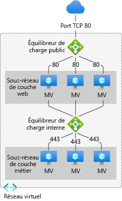
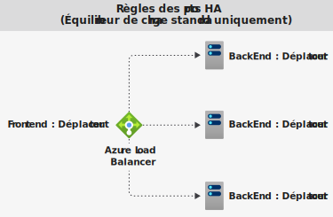

# Composants Azure Load Balancer

Azure Load Balancer inclut quelques composants clés. Ces composants peuvent être configurés dans votre abonnement via :

* Portail Azure
* Azure CLI
* Azure PowerShell
* Modèles de Gestionnaire des ressources

## Configuration IP front-end 

Adresse IP de l’équilibreur de charge Azure Load Balancer. Il s’agit du point de contact pour les clients. Ces adresses IP peuvent être de deux types :

- **Adresse IP publique**
- **Adresse IP privée**

La nature de l’adresse IP détermine le **type** d’équilibreur de charge créé. La sélection d’une adresse IP privée crée un équilibreur de charge interne. La sélection d’une adresse IP publique crée un équilibreur de charge public.

|  | Équilibreur de charge public  | Équilibreur de charge interne |
| ---------- | ---------- | ---------- |
| **Configuration IP front-end**| Adresse IP publique | Adresse IP privée|
| **Description** | Un équilibreur de charge public mappe l’adresse IP publique et le port du trafic entrant à l’adresse IP privée et au port de la machine virtuelle. L’équilibreur de charge mappe le trafic dans l’autre sens pour le trafic de réponse provenant de la machine virtuelle. Vous pouvez distribuer des types de trafic donnés entre plusieurs machines virtuelles ou services en appliquant des règles d’équilibrage de charge. Par exemple, vous pouvez répartir la charge du trafic des requêtes web entre plusieurs serveurs web.| Un équilibreur de charge interne distribue le trafic entre les ressources qui se trouvent à l’intérieur d’un réseau virtuel. Azure limite l’accès aux adresses IP front-end d’un réseau virtuel qui sont soumises à l’équilibrage de charge. Les adresses IP du serveur frontal et les réseaux virtuels ne sont jamais directement exposés à un point de terminaison Internet. Les applications métier internes s’exécutent dans Azure et sont accessibles à partir d’Azure ou à partir des ressources locales. |
| **Références SKU prises en charge** | De base, Standard | De base, Standard |

Load Balancer peut avoir plusieurs adresses IP de front-end. En savoir plus sur les [serveurs frontaux multiples](load-balancer-multivip-overview.md).

## Pool principal

Groupe de machines virtuelles ou d’instances dans un groupe de machines virtuelles identiques qui distribuent la requête entrante. Pour une mise à l’échelle économique visant à répondre à des volumes élevés de trafic entrant, il est généralement recommandé d’ajouter davantage d’instances au pool de back-ends.

L’équilibreur de charge se reconfigure instantanément par le biais d’une reconfiguration automatique quand vous effectuez un scale-up ou un scale-down des instances. Quand vous ajoutez ou supprimez des machines virtuelles du pool de back-ends, l’équilibreur de charge est reconfiguré sans opération supplémentaire. L’étendue du pool de back-ends est toute machine virtuelle du réseau virtuel.

Quand vous envisagez la conception de votre pool de back-ends, concevez le moins de ressources de pool de back-ends individuelles pour optimiser la longueur des opérations de gestion. Il n’existe aucune différence de performances ou de mise à l’échelle du plan de données.

## Sondes d’intégrité

Une sonde d’intégrité sert à déterminer l’état d’intégrité des instances du pool de back-ends. Pendant la création de l’équilibreur de charge, configurez une sonde d’intégrité qu’il pourra utiliser.  Cette sonde d’intégrité déterminera si une instance est saine et peut recevoir du trafic.

Vous pouvez définir le seuil de défaillance sur le plan de l’intégrité pour vos sondes d’intégrité. Lorsqu’une sonde ne répond pas, l’équilibrage de charge n’envoie plus de nouvelles connexions aux instances défaillantes. Un échec de la sonde n’affecte pas les connexions existantes. La connexion se poursuit :

- Jusqu’à ce que l’application termine le flux
- Jusqu’à ce que le délai d’inactivité soit atteint
- Jusqu’à ce que la machine virtuelle s’arrête

L’équilibreur de charge fournit différents types de sondes d’intégrité pour les points de terminaison : TCP, HTTP et HTTPS. [En savoir plus sur les sondes d’intégrité Load Balancer](load-balancer-custom-probe-overview.md).

L’équilibreur de charge de base ne prend pas en charge les sondes HTTPS. Il ferme toutes les connexions TCP (y compris les connexions établies).

## Règles d’équilibrage de la charge

Une règle d’équilibreur de charge sert à définir la manière dont le trafic entrant est distribué à **toutes** les instances du pool de back-ends. Une règle d’équilibrage de charge fait correspondre une configuration d’adresse IP frontale et un port donnés à plusieurs adresses IP frontales et ports.

Par exemple, utilisez une règle d’équilibrage de charge pour le port 80 afin de router le trafic de votre adresse IP de front-end vers le port 80 de vos instances de back-end.

:::image type="content" source="./media/load-balancer-components/lbrules.png" alt-text="Diagramme de référence de règle d’équilibreur de charge" border="false":::

*Figure : Règles d’équilibrage de charge*

## Ports à haute disponibilité

Une règle d’équilibreur de charge configurée avec **tous les protocoles et le port 0**. 

Cette règle permet de fournir une seule règle pour équilibrer la charge de tous les flux TCP et UDP qui arrivent sur tous les ports d’un équilibreur de charge standard interne. 

La décision d’équilibrage de charge est prise par flux. Cette action est basée sur la connexion à cinq tuples suivante : 

1. adresse IP source
2. port source
3. adresse IP de destination
4. port de destination
5. protocol

Les règles d’équilibrage de charge des ports haute disponibilité sont utiles dans les scénarios critiques, comme pour la haute disponibilité et la mise à l’échelle d’appliances virtuelles réseau dans des réseaux virtuels. La fonctionnalité peut servir quand un grand nombre de ports doit avoir une charge équilibrée.

  

*Figure : Règles des ports HA*

Découvrez-en plus sur les [ports à haute disponibilité](load-balancer-ha-ports-overview.md).

## Règles NAT entrantes

Une règle NAT de trafic entrant transfère le trafic entrant envoyé à la combinaison de l’adresse IP frontale et du port. Le trafic est envoyé à une machine virtuelle ou instance **spécifique** dans le pool back-end. Ce réacheminement de port est accompli à l’aide de la même distribution basée sur le hachage que l’équilibrage de charge.

:::image type="content" source="./media/load-balancer-components/inboundnatrules.png" alt-text="Diagramme de référence de règle NAT de trafic entrant" border="false":::

*Figure : Règles NAT de trafic entrant*

Les règles NAT de trafic entrant dans le contexte de Virtual Machine Scale Sets sont des pools NAT entrants. Découvrez-en plus sur les [composants de Load Balancer et le groupe de machines virtuelles identiques](../virtual-machine-scale-sets/virtual-machine-scale-sets-networking.md#azure-virtual-machine-scale-sets-with-azure-load-balancer).

## Règles de trafic sortant

Une règle de trafic sortant configure la traduction d’adresses réseau (NAT) du trafic sortant pour toutes les machines virtuelles ou instances identifiées par le pool de back-ends. Cette règle permet aux instances du back-end de communiquer (vers l’extérieur) sur Internet ou vers d’autres points de terminaison.

En savoir plus sur les [connexions sortantes et les règles](load-balancer-outbound-connections.md).

L’équilibreur de charge de base ne prend pas en charge les règles de trafic sortant.

:::image type="content" source="./media/load-balancer-components/outbound-rules.png" alt-text="Diagramme de référence de règle de trafic sortant" border="false":::

*Figure : Règles de trafic sortant*

## Limites

- Découvrez les [limites](../azure-resource-manager/management/azure-subscription-service-limits.md) des équilibreurs de charge. 
- L’équilibreur de charge offre un équilibrage de charge et le réacheminement de ports pour les protocoles TCP ou UDP spécifiques. Les règles d’équilibrage de charge et les règles NAT de trafic entrant prennent en charge les protocoles TCP et UDP, mais aucun autre protocole IP, notamment ICMP.
- Le flux sortant depuis une machine virtuelle back-end vers un front-end d’un équilibreur de charge interne est voué à l’échec.
- Une règle d’équilibreur de charge ne peut pas s’étendre sur deux réseaux virtuels.  Les front-ends et leurs instances back-end doivent être dans le même réseau virtuel.  
- Les fragments d’adresse IP de transfert ne sont pas pris en charge sur les règles d’équilibrage de charge. La fragmentation IP des paquets UDP et TCP n’est pas prise en charge sur les règles d’équilibrage de charge. Les règles d’équilibrage de charge des ports HA peuvent être utilisées pour transférer des fragments IP existants. Pour plus d’informations, consultez [Présentation des ports de haute disponibilité](load-balancer-ha-ports-overview.md).

## Étapes suivantes

- Pour bien démarrer avec un équilibreur de charge, consultez [Créer un équilibreur de charge standard public](quickstart-load-balancer-standard-public-portal.md).
- En savoir plus sur [Azure Load Balancer](load-balancer-overview.md).
- Découvrez les [adresses IP publiques](../virtual-network/virtual-network-public-ip-address.md).
- Découvrez les [adresses IP privées](../virtual-network/private-ip-addresses.md).
- Découvrez comment utiliser [un équilibreur de charge standard et les zones de disponibilité](load-balancer-standard-availability-zones.md).
- Découvrez les [diagnostics des équilibreurs de charge standard](load-balancer-standard-diagnostics.md).
- En savoir plus sur la [réinitialisation TCP au terme du délai d’inactivité](load-balancer-tcp-reset.md).
- Découvrez un [équilibreur de charge standard avec des règles d’équilibrage de charge des ports HA](load-balancer-ha-ports-overview.md).
- En savoir plus sur les [groupes de sécurité réseau](../virtual-network/network-security-groups-overview.md).
- Découvrez-en plus sur les [limites des équilibreurs de charge](../azure-resource-manager/management/azure-subscription-service-limits.md#load-balancer).
- Découvrez l’utilisation du [réacheminement de port](./tutorial-load-balancer-port-forwarding-portal.md).