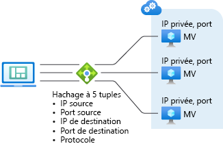

# Concepts relatifs à Azure Load Balancer

L’équilibreur de charge offre plusieurs fonctionnalités pour les applications UDP et TCP. 

## Algorithme d’équilibrage de charge
Vous pouvez créer une règle d’équilibrage de charge pour répartir le trafic entre le front-end et un pool de back-ends. Azure Load Balancer utilise un algorithme de hachage pour la distribution des flux entrants (pas d’octets). L’équilibreur de charge réécrit les en-têtes des flux dans les instances du pool de back-ends. Un serveur est disponible pour recevoir les nouveaux flux quand une sonde d’intégrité indique un point de terminaison de serveur principal sain.

Par défaut, l’équilibreur de charge utilise un hachage à cinq tuples.

Le hachage comprend les éléments suivants :

- **Une adresse IP source**
- **Port source**
- **Une adresse IP de destination**
- **Port de destination**
- **Un numéro de protocole IP pour mapper des flux sur les serveurs disponibles**

L’affinité avec une adresse IP source est créée à l’aide d’un hachage à deux ou trois tuples. Les paquets d’un même flux arrivent sur la même instance derrière le front-end soumis à l’équilibrage de charge. 

Le port source change quand un client démarre un nouveau flux à partir de la même adresse IP source. Ainsi, le hachage à cinq tuples peut provoquer l’acheminement du trafic vers un autre point de terminaison back-end.
Pour plus d’informations, consultez [Configuration du mode de distribution pour Azure Load Balancer](./load-balancer-distribution-mode.md).

L’image suivante montre la distribution basée sur le hachage :

  

  *Figure : Distribution basée sur le hachage*

## Indépendance d’application et transparence

L’équilibreur de charge n’interagit pas directement avec TCP, UDP ou la couche Application. Tous les scénarios d’application TCP ou UDP peuvent être pris en charge. L’équilibreur de charge ne ferme pas de flux, n’en démarre pas ou n’interagit pas avec la charge utile du flux. L’équilibreur de charge ne fournit pas de fonctionnalité de passerelle de couche Application. Les liaisons de protocole se produisent toujours directement entre le client et l’instance de pool principal. La réponse à un flux entrant provient toujours d’une machine virtuelle. Lorsque le flux arrive sur la machine virtuelle, l’adresse IP source d’origine est également conservée.

* Chaque point de terminaison obtient une réponse d’une machine virtuelle. Par exemple, l’établissement d’une liaison TCP se fait entre le client et la machine virtuelle du back-end sélectionnée. La réponse à une demande d’un serveur frontal est une réponse générée par la machine virtuelle du serveur principal. Quand vous validez correctement la connectivité à un front-end, vous validez la connectivité de bout en bout jusqu’à au moins une machine virtuelle du back-end.
* Les charges utiles d’application sont transparentes pour l’équilibreur de charge. Toutes les applications UDP ou TCP peuvent être prises en charge.
* Étant donné que l’équilibreur de charge n’interagit pas avec la charge utile TCP et fournit le déchargement TLS, vous pouvez générer des scénarios chiffrés complets. L’utilisation de l’équilibreur de charge permet d’obtenir de vastes systèmes de scale-out pour les applications TLS en mettant fin à la connexion TLS sur la machine virtuelle. Par exemple, la capacité de création de clés pour votre session TLS est uniquement limitée par le type et le nombre de machines virtuelles que vous ajoutez au pool du serveur principal.

## Terminologie Load Balancer
| Concept | Qu’est-ce que cela signifie ? | Document détaillé |
| ---------- | ---------- | ----------|
Connexions sortantes | Les flux du pool de back-ends vers des adresses IP publiques sont mappés au front-end. Azure traduit les connexions sortantes en l’adresse IP front-end publique par le biais de la règle de trafic sortant d’équilibrage de charge. Cette configuration offre les avantages suivants. Elle permet une mise à niveau et une récupération d’urgence simples des services, étant donné que le serveur frontal peut être dynamiquement mappé à une autre instance du service. Elle facilite la gestion des listes de contrôle d’accès (ACL). Les ACL exprimées comme des adresses IP de serveur frontal ne changent pas quand les services montent en puissance, descendent en puissance ou sont redéployés. La traduction des connexions sortantes en un plus petit nombre d’adresses IP que de machines réduit la charge liée à l’implémentation de listes vertes de destinataires.| Pour en savoir plus sur SNAT (Source Network Address Translation) et Azure Load Balancer, consultez [SNAT et Azure Load Balancer](load-balancer-outbound-connections.md).
Zones de disponibilité | L’équilibreur de charge standard prend en charge des fonctionnalités supplémentaires dans les régions où les Zones de disponibilité sont disponibles. Ces fonctionnalités sont incrémentielles pour tous les équilibreurs de charge standard fournis.  Des configurations de zones de disponibilité sont disponibles pour les deux types d’équilibreur de charge standard : public et interne. Un front-end redondant interzone résiste aux défaillances de zone en utilisant une infrastructure dédiée dans toutes les zones simultanément. En outre, vous pouvez garantir un serveur frontal dans une zone spécifique. Un serveur front-end zonal est pris en charge par une infrastructure dédiée dans une seule zone. L’équilibrage de charge entre les zones est disponible pour le pool de back-ends. Toute ressource de machine virtuelle d’un réseau virtuel peut faire partie d’un pool de back-ends. Un équilibreur de charge De base ne prend pas en charge les zones.| Pour plus d’informations, consultez [Présentation détaillée des fonctionnalités liées aux zones de disponibilité](load-balancer-standard-availability-zones.md) et [Vue d’ensemble des zones de disponibilité](../availability-zones/az-overview.md).
| Ports HA | Vous pouvez configurer des règles d’équilibrage de charge pour les ports HA afin de mettre à l’échelle votre application et d’améliorer sa fiabilité. Ces règles fournissent l’équilibrage de charge par flux sur les ports de courte durée de l’adresse IP front-end de l’équilibreur de charge interne. Cette fonctionnalité s’avère utile quand il est difficile ou qu’il n’est pas souhaitable de spécifier les ports individuels. Une règle de ports HA vous permet de créer des scénarios actif-passif ou actif-actif n+1. Ces scénarios sont destinés aux appliances virtuelles réseau et à toute application qui nécessite de grandes plages de ports entrants. Une sonde d’intégrité peut être utilisée pour déterminer quels back-ends devraient recevoir de nouveau flux.  Vous pouvez utiliser un groupe de sécurité réseau pour émuler un scénario de plage de ports. L’équilibreur de charge de base ne prend pas en charge les ports HA. | Consultez [Présentation détaillée des ports HA](load-balancer-ha-ports-overview.md).
| Plusieurs serveurs frontaux | L’équilibreur de charge prend en charge plusieurs règles avec plusieurs front-ends.  Standard Load Balancer étend cette fonctionnalité aux scénarios sortants. Les règles de trafic sortant sont l’inverse d’une règle de trafic entrant. La règle de trafic sortant crée une association pour les connexions sortantes. L’équilibreur de charge standard utilise tous les front-ends associés à une ressource de machine virtuelle via une règle d’équilibrage de charge. De plus, un paramètre sur la règle de l’équilibrage de charge vous permet de supprimer une règle d’équilibrage de charge pour les besoins de la connectivité sortante, ce qui permet de sélectionner des front-ends spécifiques, y compris aucun. À des fins de comparaison, l’équilibreur de charge De base sélectionne un front-end unique au hasard. Vous n’avez pas la possibilité de contrôler quel front-end est sélectionné.|

## Limitations

- Une règle d’équilibreur de charge ne peut pas s’étendre sur deux réseaux virtuels.  Les front-ends et leurs instances back-end doivent être dans le même réseau virtuel.  

- Les rôles Worker web sans réseau virtuel et d’autres services de plateforme Microsoft peuvent être accessibles seulement à partir d’instances qui se trouvent derrière un équilibreur de charge interne Standard. Ne comptez pas sur cette accessibilité, car le service lui-même ou la plateforme sous-jacente sont susceptibles de changer sans préavis. Si une [connectivité sortante](load-balancer-outbound-connections.md) est nécessaire lors de l’utilisation d’un équilibreur de charge interne standard, elle doit être configurée.

- L’équilibreur de charge offre un équilibrage de charge et le réacheminement de ports pour les protocoles TCP ou UDP spécifiques. Les règles d’équilibrage de charge et les règles NAT de trafic entrant prennent en charge les protocoles TCP et UDP, mais aucun autre protocole IP, notamment ICMP.

- Le flux sortant depuis une machine virtuelle back-end vers un front-end d’un équilibreur de charge interne est voué à l’échec.

- Les fragments d’adresse IP de transfert ne sont pas pris en charge sur les règles d’équilibrage de charge. La fragmentation IP des paquets UDP et TCP n’est pas prise en charge sur les règles d’équilibrage de charge. Les règles d’équilibrage de charge des ports HA peuvent être utilisées pour transférer des fragments IP existants. Pour plus d’informations, consultez [Présentation des ports de haute disponibilité](load-balancer-ha-ports-overview.md).

## Étapes suivantes

- Consultez [Créer un service Standard Load Balancer public](quickstart-load-balancer-standard-public-portal.md) pour bien démarrer avec Load Balancer : créez un équilibreur de charge, créez des machines virtuelles avec une extension IIS personnalisée installée et équilibrez la charge de l’application web entre les machines virtuelles.
- Découvrez les [connexions sortantes d’Azure Load Balancer](load-balancer-outbound-connections.md).
- En savoir plus sur [Azure Load Balancer](load-balancer-overview.md).
- Découvrez les [sondes d’intégrité](load-balancer-custom-probe-overview.md).
- En savoir plus sur les [Diagnostics Load Balancer Standard](load-balancer-standard-diagnostics.md).
- En savoir plus sur les [groupes de sécurité réseau](../virtual-network/security-overview.md).
