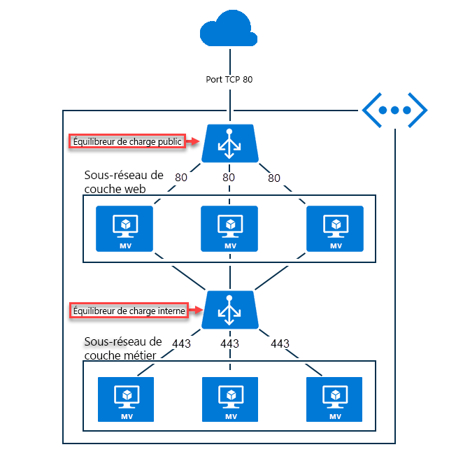

# Qu’est-ce qu’Azure Load Balancer ?

L’*équilibrage de charge* fait référence à une distribution efficace de la charge ou du trafic réseau entrant au sein d’un groupe de ressources ou serveurs back-end. Azure propose une [variété d’options d’équilibrage de charge](https://docs.microsoft.com/azure/architecture/guide/technology-choices/load-balancing-overview) que vous pouvez choisir en fonction de vos besoins. Ce document présente Azure Load Balancer.

Azure Load Balancer opère à la couche quatre du modèle OSI (Open Systems Interconnection). Il s’agit du point de contact unique pour les clients. Load Balancer distribue les nouveaux flux entrants arrivant sur le serveur front-end de Load Balancer aux instances de pool de back-ends selon des règles d’équilibrage de charge et des sondes d’intégrité spécifiées. Les instances de pool de back-ends peuvent être des machines virtuelles Azure ou des instances d’un groupe de machines virtuelles identiques. 

Azure Load Balancer vous permet de mettre à l’échelle vos applications et de créer des services à haute disponibilité. Load Balancer prend à la fois en charge les scénarios entrants et sortants, offre une latence faible et un débit élevé, et permet d’effectuer un scale-up jusqu’à des millions de flux pour toutes les applications TCP et UDP.

Un **[équilibreur de charge public](#publicloadbalancer)** peut fournir des connexions sortantes pour des machines virtuelles à l’intérieur de votre réseau virtuel en traduisant leurs adresses IP privées en adresses IP publiques. Les équilibreurs de charge publics sont utilisés pour équilibrer la charge du trafic Internet sur vos machines virtuelles.

Un **[équilibreur de charge interne (ou privé)](#internalloadbalancer)** peut être utilisé dans les scénarios où seules des adresses IP privées sont nécessaires sur le front-end. Les équilibreurs de charge internes sont utilisés pour équilibrer la charge du trafic au sein d’un réseau virtuel. Vous pouvez également communiquer avec un serveur frontal d’équilibreur de charge à partir d’un réseau local dans le cadre d’un scénario hybride.

## Composants Load Balancer
* **Configurations IP front-end** : Adresse IP de l’équilibreur de charge. Il s’agit du point de contact pour les clients. Il peut s’agir d’adresses IP publiques ou privées, qui créent ainsi des équilibreurs de charge publics ou internes, respectivement.
* **Pool principal** : Groupe de machines virtuelles ou d’instances dans le groupe de machines virtuelles identiques qui vont servir la requête entrante. Pour une mise à l’échelle rentable visant à répondre à des volumes élevés de trafic entrant, les bonnes pratiques de calcul recommandent généralement d’ajouter plus d’instances au pool de back-ends. Load Balancer se reconfigure instantanément par le biais d’une reconfiguration automatique quand vous effectuez un scale-up ou un scale-down des instances. Quand vous ajoutez ou supprimez des machines virtuelles du pool du serveur principal, l’équilibreur de charge est reconfiguré sans opérations supplémentaires sur la ressource Load Balancer.
* **Sondes d’intégrité** : Une sonde d’intégrité est utilisée pour déterminer l’intégrité des instances incluses dans le pool de back-ends. Vous pouvez définir le seuil de défaillance sur le plan de l’intégrité pour vos sondes d’intégrité. Quand une sonde ne répond pas, l’équilibreur de charge n’envoie plus de nouvelles connexions aux instances défaillantes. Un échec de la sonde n’affecte pas les connexions existantes. La connexion est maintenue tant que l’application ne met pas fin au flux, qu’un délai d’inactivité n’a pas lieu ou que la machine virtuelle n’est pas arrêtée. Load Balancer fournit des types de sonde d’intégrité différents pour les points de terminaison TCP, HTTP et HTTPS. Pour plus d’informations, consultez [Types de sondes](load-balancer-custom-probe-overview.md#types).
* **Règles d’équilibrage de charge** : Les règles d’équilibrage de charge sont celles qui indiquent à Load Balancer ce qui doit être fait et quand. 
* **Règles NAT entrantes** : Une règle NAT de trafic entrant réachemine le trafic d’un port spécifique d’une adresse IP donnée du serveur front-end vers un port spécifique d’une instance donnée du serveur back-end à l’intérieur du réseau virtuel. Ce réacheminement de port est accompli à l’aide de la même distribution basée sur le hachage que l’équilibrage de charge. Les scénarios courants pour cette fonctionnalité incluent les sessions de protocole RDP (Remote Desktop Protocol) ou SSH (Secure Shell) avec des instances de machines virtuelles individuelles à l’intérieur du réseau virtuel Azure. Vous pouvez mapper plusieurs points de terminaison internes à des ports sur la même adresse IP de serveur frontal. Vous pouvez utiliser les adresses IP frontales pour administrer à distance vos machines virtuelles sans serveur de rebond supplémentaire.
* **Règles de trafic sortant** : Une règle de trafic sortant configure la traduction d’adresses réseau (NAT) du trafic sortant pour que toutes les machines virtuelles ou instances identifiées par le pool de back-ends soient traduites sur le front-end.

## Concepts de Load Balancer

Load Balancer offre les fonctionnalités de base suivantes pour les applications TCP et UDP :

* **Algorithme d’équilibrage de charge** : Azure Load Balancer permet de créer une règle pour distribuer le trafic arrivant sur un serveur front-end sur des instances de pool de back-ends. Load Balancer utilise un algorithme de hachage pour la distribution des flux entrants et réécrit les en-têtes des flux sur les instances de pool de back-ends. Un serveur est disponible pour recevoir les nouveaux flux quand une sonde d’intégrité indique un point de terminaison de serveur principal sain.
Par défaut, Load Balancer utilise un hachage à 5 tuples. Le hachage est composé de l’adresse IP source, du port source, de l’adresse IP de destination, du port de destination et du numéro de protocole IP pour mapper les flux vers les serveurs disponibles. Vous pouvez créer une affinité avec une adresse IP source en utilisant un hachage à 2 ou 3 tuples pour une règle donnée. Tous les paquets d’un même flux arrivent sur la même instance derrière le serveur frontal soumis à l’équilibrage de charge. Quand le client démarre un nouveau flux à partir de la même adresse IP source, le port source est modifié. Par conséquent, le hachage à 5 tuples peut provoquer l’acheminement du trafic vers un autre point de terminaison back-end.
Pour plus d’informations, consultez [Configuration du mode de distribution pour Azure Load Balancer](load-balancer-distribution-mode.md). L’image suivante montre la distribution basée sur le hachage :

  

  *Figure : Distribution basée sur le hachage*

* **Indépendance d’application et transparence** : Load Balancer n’interagit pas directement avec TCP, UDP ou la couche Application. Tous les scénarios d’application TCP ou UDP peuvent être pris en charge. Load Balancer ne met pas fin aux flux ou n’initie pas de flux, n’interagit pas avec la charge utile du flux et ne fournit aucune fonction de passerelle de couche Application. Les liaisons de protocole se produisent toujours directement entre le client et l’instance de pool principal. La réponse à un flux entrant provient toujours d’une machine virtuelle. Lorsque le flux arrive sur la machine virtuelle, l’adresse IP source d’origine est également conservée.
  * Chaque point de terminaison obtient uniquement une réponse d’une machine virtuelle. Par exemple, l’établissement d’une liaison TCP se fait toujours entre le client et la machine virtuelle du serveur principal sélectionnée. La réponse à une demande d’un serveur frontal est une réponse générée par la machine virtuelle du serveur principal. Lorsque vous validez correctement la connectivité à un serveur frontal, vous validez la connectivité de bout en bout à au moins une machine virtuelle du serveur principal.
  * Les charges utiles d’application sont transparentes pour Load Balancer. Toutes les applications UDP ou TCP peuvent être prises en charge.
  * Étant donné que Load Balancer n'interagit pas avec la charge utile TCP et fournit le déchargement TLS, vous pouvez générer des scénarios chiffrés de bout en bout. L’utilisation de Load Balancer permet d’obtenir de vastes systèmes de montée en charge pour les applications TLS en mettant fin à la connexion TLS sur la machine virtuelle proprement dite. Par exemple, la capacité de création de clés pour votre session TLS est uniquement limitée par le type et le nombre de machines virtuelles que vous ajoutez au pool du serveur principal.

* **Connexions sortantes (SNAT)**  : Tous les flux sortants circulant d’adresses IP privées à l’intérieur de votre réseau virtuel vers des adresses IP publiques sur Internet peuvent être traduits en une adresse IP de serveur frontal de Load Balancer. Quand un serveur frontal public est lié à une machine virtuelle de serveur principal par le biais d’une règle d’équilibrage de charge, Azure traduit les connexions sortantes en adresses IP du serveur frontal public. Cette configuration offre les avantages suivants :
  * Elle permet une mise à niveau et une récupération d’urgence simples des services, étant donné que le serveur frontal peut être dynamiquement mappé à une autre instance du service.
  * Elle facilite la gestion des listes de contrôle d’accès (ACL). Les ACL exprimées comme des adresses IP de serveur frontal ne changent pas quand les services montent en puissance, descendent en puissance ou sont redéployés. La traduction des connexions sortantes en un plus petit nombre d’adresses IP que de machines réduit la charge liée à l’implémentation de listes vertes de destinataires.
Pour plus d’informations, consultez [Connexions sortantes dans Azure](load-balancer-outbound-connections.md).
La référence SKU Standard de Load Balancer offre des fonctionnalités spécifiques en plus de ces capacités de base, comme décrit ci-dessous.

##  Comparaison des références SKU de Load Balancer

Load Balancer prend en charge les références SKU De base et Standard. Ces références SKU présentent des différences en termes d’échelle de scénario, de fonctionnalités et de tarification. N’importe quel scénario possible avec la référence SKU De base de Load Balancer peut être créé avec la référence SKU Standard. Les API sont identiques pour ces deux références SKU et sont appelées en spécifiant une référence SKU. Les références SKU pour Load Balancer et les adresses IP publiques sont prises en charge à partir de la version d’API `2017-08-01`. Les deux références SKU présentent les mêmes API et structure générales.

La configuration du scénario complet peut varier légèrement selon la référence SKU. Dans la documentation relative à Load Balancer, les articles applicables uniquement à une référence SKU spécifique sont signalés. Pour comparer les références SKU et comprendre leurs différences, consultez le tableau ci-dessous. Pour plus d’informations, consultez [Vue d’ensemble du niveau Standard d’Azure Load Balancer](load-balancer-standard-overview.md).

>[!NOTE]
> Microsoft recommande Standard Load Balancer.
Les machines virtuelles autonomes, les groupes à haute disponibilité et les groupes de machines virtuelles identiques peuvent uniquement être connectés à une référence SKU, jamais aux deux. Les références SKU de Load Balancer et des adresses IP publiques doivent correspondre lorsque vous les utilisez avec des adresses IP publiques. Les références SKU de Load Balancer et des adresses IP publiques ne sont pas mutables.

[!INCLUDE [comparison table](../../includes/load-balancer-comparison-table.md)]

Pour plus d’informations, consultez [Limites de Load balancer](https://aka.ms/lblimits). Pour obtenir plus d’informations sur la référence SKU Standard de Load Balancer, consultez également la [présentation](load-balancer-standard-overview.md), la page relative à la [tarification](https://aka.ms/lbpricing) et la page relative au [SLA](https://aka.ms/lbsla).

## Types d’équilibreurs de charge

### Équilibreur de charge public

Un Load Balancer public mappe l’adresse IP publique et le port du trafic entrant à l’adresse IP privée et au port de la machine virtuelle. Load Balancer mappe le trafic dans l’autre sens pour le trafic de réponse provenant de la machine virtuelle. Vous pouvez distribuer des types de trafic donnés entre plusieurs machines virtuelles ou services en appliquant des règles d’équilibrage de charge. Par exemple, vous pouvez répartir la charge du trafic des requêtes web entre plusieurs serveurs web.

>[!NOTE]
>Vous ne pouvez implémenter qu’un Load Balancer public et qu’un Load Balancer interne par groupe à haute disponibilité.

La figure suivante présente un point de terminaison à charge équilibrée pour le trafic web partagé entre trois machines virtuelles pour le port TCP 80 et public. Celles-ci sont incluses dans un jeu d’équilibrage de la charge.

*Figure : Équilibrage du trafic web à l’aide d’un Load Balancer public*

Les clients Internet envoient des requêtes de page web à l’adresse IP publique d’une application web sur le port TCP 80. Azure Load Balancer répartit les requêtes entre les trois machines virtuelles du groupe à charge équilibrée. Pour plus d’informations sur les algorithmes de Load Balancer, consultez [Concepts de Load Balancer](load-balancer-overview.md##load-balancer-concepts).

Azure Load Balancer répartit par défaut le trafic réseau équitablement sur plusieurs instances de machine virtuelle. Vous pouvez également configurer l’affinité de session. Pour plus d’informations, consultez [Configuration du mode de distribution pour Azure Load Balancer](load-balancer-distribution-mode.md).

###  Équilibreur de charge interne

Un Load Balancer interne dirige le trafic uniquement vers les ressources qui se trouvent à l’intérieur d’un réseau virtuel ou qui utilisent un VPN pour accéder à l’infrastructure Azure, contrairement à un Load Balancer public. L’infrastructure Azure limite l’accès aux adresses IP du serveur frontal soumis à l’équilibrage de charge au sein d’un réseau virtuel. Les adresses IP du serveur frontal et les réseaux virtuels ne sont jamais directement exposés à un point de terminaison Internet. Les applications métier internes s’exécutent dans Azure et sont accessibles à partir d’Azure ou à partir des ressources locales.

Un équilibreur de charge interne permet d’effectuer les types d’équilibrage de charge suivants :

* **Dans un réseau virtuel** : Équilibrage de charge des machines virtuelles dans le réseau virtuel vers un ensemble de machines virtuelles qui se trouvent dans le même réseau virtuel.
* **Pour un réseau virtuel entre sites locaux** : Équilibrage de charge des ordinateurs locaux vers un ensemble de machines virtuelles qui se trouvent dans le même réseau virtuel.
* **Pour les applications multiniveaux** : Équilibrage de charge pour les applications multiniveaux accessibles sur Internet dans lesquelles les niveaux back-end ne sont pas accessibles sur Internet. Les niveaux principaux nécessitent un équilibrage de la charge du trafic du niveau accessible sur Internet. Voir la figure suivante.
* **Pour les applications métier** : Équilibrage de charge pour les applications métier hébergées dans Azure, sans matériel ou logiciel d’équilibreur de charge supplémentaire. Ce scénario inclut des serveurs locaux dans l’ensemble d’ordinateurs dont la charge du trafic est équilibrée.

*Figure : Équilibrage d’applications multiniveaux à l’aide d’un Load Balancer public et d’un Load Balancer interne*

## Tarifs

L'utilisation de Standard Load Balancer est facturée.

* Nombre de règles de trafic sortant et d’équilibrage de la charge configurées. Les règles NAT de trafic entrant ne sont pas comptabilisées dans le nombre total de règles.
* Volume entrant et sortant de données traitées indépendamment des règles.

Pour plus d’informations sur la tarification de Load Balancer Standard, consultez [Tarification de Load Balancer](https://azure.microsoft.com/pricing/details/load-balancer/).

La référence SKU De base de Load Balancer est proposée gratuitement.

## Contrat SLA

Pour plus d’informations sur le contrat de niveau de service (SLA) de Load Balancer Standard, consultez [SLA pour Load Balancer](https://aka.ms/lbsla).

## Limites

* Load Balancer offre un équilibrage de charge et le réacheminement de ports pour les protocoles TCP ou UDP spécifiques. Les règles d’équilibrage de charge et les règles NAT de trafic entrant prennent en charge les protocoles TCP et UDP, mais aucun autre protocole IP, notamment ICMP.

  Load Balancer ne met pas fin, ne répond pas ou n’interagit d’aucune autre manière avec la charge utile d’un flux UDP ou TCP. Il ne s’agit pas d’un proxy. La validation de la connectivité avec un serveur frontal doit avoir lieu dans la bande avec le même protocole que celui utilisé dans un équilibrage de charge ou une règle NAT de trafic entrant. Au moins une de vos machines virtuelles doit générer une réponse pour qu’un client voie une réponse d’un serveur frontal.

  L’absence de réponse de la part du serveur frontal Load Balancer dans la bande indique qu’aucune machine virtuelle n’a pu répondre. Rien ne peut interagir avec un serveur frontal Load Balancer si aucune machine virtuelle ne peut répondre. Ce principe vaut également pour les connexions sortantes où la traduction d’adresses réseau avec masquage de port est uniquement prise en charge pour les protocoles TCP et UDP. Tous les autres protocoles IP, y compris ICMP, échoueront. Assignez une adresse IP publique de niveau d’instance pour résoudre ce problème. Pour plus d’informations, consultez [Compréhension de la traduction d’adresses réseau et des jetons d'accès personnel](load-balancer-outbound-connections.md#snat).

* Les Load Balancer internes ne traduisent pas les connexions sortantes vers le serveur frontal d’un Load Balancer interne, car ils se trouvent tous deux dans un espace d’adressage IP privé. Les Load Balancer publics offrent des [connexions sortantes](load-balancer-outbound-connections.md) d’adresses IP privées à l’intérieur du réseau virtuel vers des adresses IP publiques. Pour les Load Balancer internes, cette approche évite le risque d’épuisement du port SNAT à l’intérieur de l’espace d’adressage IP interne unique lorsque la traduction n’est pas requise.

  Un effet secondaire est que, si un flux sortant d’une machine virtuelle dans le pool principal tente un flux vers le serveur frontal du Load Balancer interne dans son pool _et_ s’il est mappé à lui-même, les deux aspects du flux ne correspondent pas. Étant donné qu’ils ne correspondent pas, le flux échoue. Le flux réussit s’il n’a pas été mappé avec la même machine virtuelle du pool principal que celle qui a créé le flux vers le serveur frontal.

  Lorsque le flux est mappé avec lui-même, le flux sortant apparaît comme provenant de la machine virtuelle vers le serveur frontal et le flux entrant correspondant apparaît comme étant issu de la machine virtuelle vers elle-même. Du point de vue du système d’exploitation invité, les parties entrante et sortante d’un même flux ne correspondent pas à l’intérieur de la machine virtuelle. La pile TCP ne reconnaît pas ces deux moitiés de flux comme faisant partie du même flux. La source et la destination ne correspondent pas. Lorsque le flux est mappé avec une autre machine virtuelle dans le pool principal, les parties du flux correspondent et la machine virtuelle peut répondre au flux.

  Le symptôme pour repérer ce scénario est la présence de délais d’expiration de connexion intermittents lorsque le flux revient au serveur principal qui est à l’origine du flux. Les solutions de contournement courantes incluent l’insertion d’une couche de proxy derrière le Load Balancer interne et l’utilisation de règles de style de retour direct du serveur (DSR). Pour plus d’informations, consultez [Serveurs frontaux multiples dans Azure Load Balancer](load-balancer-multivip-overview.md).

  Vous pouvez combiner un Load Balancer interne avec un proxy tiers ou utiliser une [Application Gateway](../application-gateway/application-gateway-introduction.md) interne pour les scénarios de proxy limités à HTTP/HTTPS. Vous pouvez utiliser un Load Balancer public pour résoudre ce problème, mais le scénario qui en résulte est sujet aux [épuisements SNAT](load-balancer-outbound-connections.md#snat). Évitez cette deuxième approche, sauf si elle est soigneusement gérée.

* En règle générale, les fragments d’adresse IP de transfert ne sont pas pris en charge sur les règles d’équilibrage de charge. La fragmentation IP des paquets UDP et TCP n’est pas prise en charge sur les règles d’équilibrage de charge. Les règles d’équilibrage de charge des ports à haute disponibilité peuvent être utilisées pour transférer des fragments IP existants. Pour plus d’informations, consultez [Présentation des ports de haute disponibilité](load-balancer-ha-ports-overview.md).

## Étapes suivantes

Consultez [Créer un service Standard Load Balancer public](quickstart-load-balancer-standard-public-portal.md) pour bien démarrer avec Load Balancer : créez un équilibreur de charge, créez des machines virtuelles avec une extension IIS personnalisée installée et équilibrez la charge de l’application web entre les machines virtuelles.
