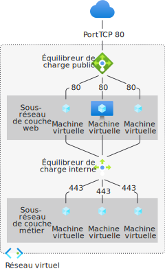

# Qu’est-ce qu’Azure Load Balancer ?

L’*équilibrage de charge* correspond à une répartition équilibrée de la charge ou du trafic réseau entrant au sein d’un groupe de ressources ou serveurs back-end. 

Azure Load Balancer opère à la couche quatre du modèle OSI (Open Systems Interconnection). Il s’agit du point de contact unique pour les clients. Load Balancer distribue les flux entrants arrivant sur le serveur front-end de l’équilibreur de charge sur des instances du pool de back-ends. Ces flux dépendent des règles d’équilibrage de charge et des sondes d’intégrité configurées. Les instances de pool de back-ends peuvent être des machines virtuelles Azure ou des instances d’un groupe de machines virtuelles identiques.

Un **[équilibreur de charge public](./components.md#frontend-ip-configurations)** permet des connexions sortantes pour les machines virtuelles de votre réseau virtuel. Ces connexions s’effectuent par la traduction de leurs adresses IP privées en adresses IP publiques. Les équilibreurs de charge publics sont utilisés pour équilibrer la charge du trafic Internet sur vos machines virtuelles.

Un **[équilibreur de charge interne (ou privé)](./components.md#frontend-ip-configurations)** est utilisé lorsque des adresses IP privées sont nécessaires uniquement au niveau du serveur front-end. Les équilibreurs de charge internes sont utilisés pour équilibrer la charge du trafic au sein d’un réseau virtuel. Vous pouvez accéder au front-end d’un équilibreur de charge à partir d’un réseau local dans le cadre d’un scénario hybride.

  

*Figure : Équilibrage d’applications multiniveaux à l’aide d’un Load Balancer public et d’un Load Balancer interne*

Pour plus d’informations sur les composants de l’équilibreur de charge, consultez [Composants Azure Load Balancer](./components.md).

## Pourquoi utiliser Azure Load Balancer ?
Standard Load Balancer vous permet de mettre à l’échelle vos applications et de créer des services à haute disponibilité. Load Balancer prend en charge à la fois les scénarios entrants et les scénarios sortants. Un équilibreur de charge offre une latence faible et un débit élevé, et peut augmenter l’échelle jusqu’à des millions de flux pour toutes les applications TCP et UDP.

Voici les principaux scénarios que vous pouvez gérer avec Standard Load Balancer :

- Équilibrer la charge du trafic **[interne](https://docs.microsoft.com/azure/load-balancer/tutorial-load-balancer-standard-internal-portal)** et **[externe](https://docs.microsoft.com/azure/load-balancer/tutorial-load-balancer-standard-manage-portal)** sur les machines virtuelles Azure

- Augmenter la disponibilité en répartissant les ressources **[au sein des zones](https://docs.microsoft.com/azure/load-balancer/tutorial-load-balancer-standard-public-zonal-portal)** et **[entre les zones](https://docs.microsoft.com/azure/load-balancer/tutorial-load-balancer-standard-public-zone-redundant-portal)**

- Configurer la **[connectivité sortante](https://docs.microsoft.com/azure/load-balancer/load-balancer-outbound-connections)** pour les machines virtuelles Azure

- Utiliser des **[sondes d’intégrité](https://docs.microsoft.com/azure/load-balancer/load-balancer-custom-probe-overview)** pour superviser les ressources à charge équilibrée

- Utiliser le **[réacheminement de port ](https://docs.microsoft.com/azure/load-balancer/tutorial-load-balancer-port-forwarding-portal)** pour accéder aux machines virtuelles d’un réseau virtuel via une adresse IP publique et un port

- Activer la prise en charge de l’ **[équilibrage de charge](https://docs.microsoft.com/azure/virtual-network/virtual-network-ipv4-ipv6-dual-stack-standard-load-balancer-powershell)** de **[IPv6](https://docs.microsoft.com/azure/virtual-network/ipv6-overview)**

- Standard Load Balancer fournit des métriques multidimensionnelles via [Azure Monitor](https://docs.microsoft.com/azure/azure-monitor/overview).  Ces métriques peuvent être filtrées, regroupées et réparties pour une dimension donnée.  Elles fournissent des analyses en cours et historiques sur les performances et l’intégrité de votre service.  Resource Health est également pris en charge. Pour plus d’informations, consultez **[Diagnostics de Standard Load Balancer](load-balancer-standard-diagnostics.md)** .

- Équilibrer la charge des services sur **[plusieurs ports, plusieurs adresses IP ou les deux](https://docs.microsoft.com/azure/load-balancer/load-balancer-multivip-overview)**

- Déplacer des ressources d’équilibreur de charge **[internes](https://docs.microsoft.com/azure/load-balancer/move-across-regions-internal-load-balancer-portal)** et **[externes](https://docs.microsoft.com/azure/load-balancer/move-across-regions-external-load-balancer-portal)** entre les différentes régions Azure

- Équilibrer simultanément la charge du flux TCP et UDP sur tous les ports à l’aide des **[ports haute disponibilité](https://docs.microsoft.com/azure/load-balancer/load-balancer-ha-ports-overview)** .

### Sécuriser par défaut

Standard Load Balancer repose sur le modèle de sécurité réseau Confiance Zéro. Standard Load Balancer est sécurisé par défaut et fait partie de votre réseau virtuel. Le réseau virtuel est un réseau privé et isolé.  Cela signifie que les équilibreurs de charge Standard et les adresses IP publiques standard sont fermés aux flux entrants, sauf s’ils sont ouverts par des groupes de sécurité réseau. Les groupes de sécurité réseau sont utilisés pour autoriser explicitement le trafic autorisé.  Si vous n’avez pas de groupe de sécurité réseau sur un sous-réseau ou une carte réseau de votre ressource de machine virtuelle, le trafic n’est pas autorisé à atteindre cette ressource. Pour plus d’informations sur les Groupes de sécurité réseau et la façon de les appliquer à votre scénario, consultez [Filtrer le trafic réseau avec les groupes de sécurité réseau](../virtual-network/security-overview.md).
Par défaut, Basic Load Balancer est ouvert sur Internet. En outre, Load Balancer ne stocke pas les données client.

## Tarifs et contrat SLA

Pour plus d’informations sur la tarification de Load Balancer Standard, consultez [Tarification de Load Balancer](https://azure.microsoft.com/pricing/details/load-balancer/).
La référence SKU De base de Load Balancer est proposée gratuitement.
Consultez [Contrat SLA pour Load Balancer](https://aka.ms/lbsla). Basic Load Balancer n’a pas de contrat SLA.

## Nouveautés

Abonnez-vous au flux RSS et découvrez les dernières mises à jour des fonctionnalités Azure Load Balancer dans la page [Mises à jour Azure](https://azure.microsoft.com/updates/?category=networking&query=load%20balancer).

## Étapes suivantes

Pour bien démarrer avec les équilibreurs de charge, consultez [Créer un équilibreur de charge standard public](quickstart-load-balancer-standard-public-portal.md).

Pour plus d’informations sur les limitations et les composants d’Azure Load Balancer, consultez [Composants Azure Load Balancer](./components.md) et [Concepts relatifs à Azure Load Balancer](./concepts.md).

