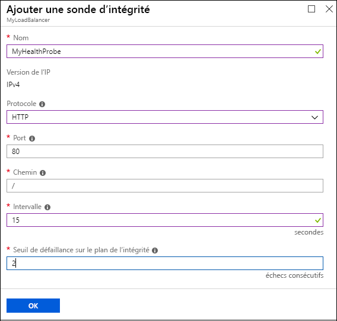

# <a name="quickstart-create-a-basic-load-balancer-by-using-the-azure-portal"></a>Démarrage rapide : Créer un équilibreur de charge de base à l’aide du portail Azure

L’équilibrage de charge offre un niveau plus élevé de disponibilité et d’évolutivité en répartissant les requêtes entrantes sur des machines virtuelles. Vous pouvez utiliser le portail Azure pour créer un équilibreur de charge et équilibrer le trafic entre des machines virtuelles. Ce guide de démarrage rapide vous montre comment créer et configurer un équilibreur de charge, des serveurs back-ends et des ressources réseau au niveau de tarification De Base.

Si vous n’avez pas d’abonnement Azure, créez un [compte gratuit](https://azure.microsoft.com/free/?WT.mc_id=A261C142F) avant de commencer. 

Pour toutes les tâches de ce guide de démarrage rapide, connectez-vous au [portail Azure](https://portal.azure.com).

## <a name="create-a-basic-load-balancer"></a>Créer un équilibreur de charge de base public

Commencez par créer un équilibreur de charge de base public à l’aide du portail. Le nom et l’adresse IP publique que vous créez sont automatiquement configurés comme front-end de l’équilibreur de charge.

1. En haut à gauche de l’écran, cliquez sur **Créer une ressource** > **Mise en réseau** > **Équilibreur de charge**.
2. Dans l’onglet **De base** de la page **Créer un équilibreur de charge**, entrez ou sélectionnez les informations suivantes, acceptez les valeurs par défaut pour les autres paramètres, puis choisissez **Vérifier + créer** :

    | Paramètre                 | Valeur                                              |
    | ---                     | ---                                                |
    | Abonnement               | Sélectionnez votre abonnement.    |    
    | Groupe de ressources         | Sélectionnez **Créer** et tapez *MyResourceGroupLB* dans la zone de texte.|
    | Nom                   | *myLoadBalancer*                                   |
    | Région         | Sélectionnez **Europe Ouest**.                                        |
    | Type          | Sélectionnez **Public**.                                        |
    | SKU           | Sélectionnez **De base**.                          |
    | Adresse IP publique | Sélectionnez **Créer nouveau**. |
    | Nom de l’adresse IP publique              | *MyPublicIP*   |
    | Affectation| statique|

3. Dans l’onglet **Vérifier + créer**, cliquez sur **Créer**.   


## <a name="create-back-end-servers"></a>Créer des serveurs principaux

Créez ensuite un réseau virtuel et deux machines virtuelles pour le pool back-end de votre équilibreur de charge de base. 

### <a name="create-a-virtual-network"></a>Créez un réseau virtuel

1. En haut à gauche du portail, sélectionnez **Créer une ressource** > **Mise en réseau** > **Réseau virtuel**.
   
1. Dans le volet **Créer un réseau virtuel**, tapez ou sélectionnez les valeurs suivantes :
   
   - **Nom** : Entrez *MyVnet*.
   - **Groupe de ressources** : Faites défiler la liste déroulante **Sélectionner** et choisissez **MyResourceGroupLB**. 
   - **Sous-réseau** > **Nom** : Entrez *MyBackendSubnet*.
   
1. Sélectionnez **Créer**.

   

### <a name="create-virtual-machines"></a>Créer des machines virtuelles

1. En haut à gauche du portail, sélectionnez **Créer une ressource** > **Calcul** > **Windows Server 2016 Datacenter**. 
   
1. Dans **Créer une machine virtuelle**, tapez ou sélectionnez les valeurs suivantes sous l’onglet **De base** :
   - **Abonnement** > **Groupe de ressources** : Faites défiler la liste et sélectionnez **MyResourceGroupLB**.
   - **Détails de l’instance** > **Nom de la machine virtuelle** : Entrez *MyVM1*.
   - **Détails de l’instance** > **Options de disponibilité** : 
     1. Faites défiler la liste déroulante vers le bas, puis sélectionnez **Groupe à haute disponibilité**. 
     2. Sélectionnez **Créer**, tapez *MyAvailabilitySet*, puis sélectionnez **OK**.
  
1. Sélectionnez l'onglet **Mise en réseau** ou choisissez **Suivant : Disques**, puis **Suivant : Mise en réseau**. 
   
   Vérifiez que les éléments suivants sont sélectionnés :
   - **Réseau virtuel** : **MyVnet**
   - **Sous-réseau** : **MyBackendSubnet**
   - **Adresse IP publique** : **MyVM1-ip**
   
   Pour créer un groupe de sécurité réseau (NSG, un type de pare-feu), sous **Groupe de sécurité réseau**, sélectionnez **Avancé**. 
   1. Dans le champ **Configurer le groupe de sécurité réseau**, sélectionnez **Créer**. 
   1. Tapez *MyNetworkSecurityGroup*, puis sélectionnez **OK**. 
   
1. Sélectionnez l’onglet **Gestion** ou sélectionnez **Suivant** > **Gestion**. Sous **Supervision**, définissez **Diagnostics de démarrage** sur **Désactivé**.
   
1. Sélectionnez **Revoir + créer**.
   
1. Passez en revue les paramètres, puis sélectionnez **Créer**. 

1. Suivez la procédure de création d’une deuxième machine virtuelle nommée *MyVM2*, avec l’**Adresse IP publique** *MyVM2-ip* et tous les autres paramètres identiques à ceux de MyVM1. 

### <a name="create-nsg-rules-for-the-vms"></a>Créer des règles NSG pour les machines virtuelles

Dans cette section, vous créez des règles de groupe de sécurité réseau (NSG) pour les machines virtuelles afin d’autoriser les connexions Bureau à distance (RDP) et Internet (HTTP) entrantes.

1. Sélectionnez **Toutes les ressources** dans le menu de gauche. Dans la liste des ressources, sélectionnez **MyNetworkSecurityGroup** dans le groupe de ressources **MyResourceGroupLB**.
   
1. Sous **Paramètres**, sélectionnez **Règles de sécurité de trafic entrant**, puis sélectionnez **Ajouter**.
   
1. Dans la boîte de dialogue **Ajouter une règle de sécurité de trafic entrant**, pour la règle HTTP, tapez ou sélectionnez les éléments suivants :
   
   - **Source** : Sélectionnez **Balise du service**.  
   - **Balise du service source** : Sélectionnez **Internet**. 
   - **Plages de ports de destination** : Entrez *80*.
   - **Protocole** : Sélectionnez **TCP**. 
   - **Action** : Sélectionnez **Autoriser**.  
   - **Priorité** : Entrez *100*. 
   - **Nom** : Entrez *MyHTTPRule*. 
   - **Description** : Entrez *Autoriser HTTP*. 
   
1. Sélectionnez **Ajouter**. 
   
   
   
1. Répétez ces étapes pour la règle RDP entrante, avec les valeurs différentes suivantes :
   - **Plages de ports de destination** : Entrez *3389*.
   - **Priorité** : Entrez *200*. 
   - **Nom** : Entrez *MyRDPRule*. 
   - **Description** : Entrez *Autoriser HTTP*. 

## <a name="create-resources-for-the-load-balancer"></a>Créer des ressources pour l’équilibreur de charge

Dans cette section, vous allez configurer les paramètres de l’équilibreur de charge pour un pool d’adresses back-end, une sonde d’intégrité et une règle d’équilibreur de charge.

### <a name="create-a-backend-address-pool"></a>Créer un pool d’adresses principal

Pour répartir le trafic entre les machines virtuelles, l’équilibreur de charge utilise un pool d’adresses back-end. Le pool d’adresses back-end contient les adresses IP des cartes d’interface réseau virtuelles connectées à l’équilibreur de charge. 

**Pour créer un pool d’adresses back-end qui inclut VM1 et VM2 :**

1. Sélectionnez **Toutes les ressources** dans le menu de gauche, puis sélectionnez **MyLoadBalancer** dans la liste de ressources.
   
1. Sous **Paramètres**, sélectionnez **Pools principaux**, puis **Ajouter**.
   
1. Dans la page **Ajouter un pool de backends**, tapez ou sélectionnez les valeurs suivantes :
   
   - **Nom** : Entrez *MyBackEndPool*.
   - **Associé à** : Faites défiler la liste déroulante vers le bas, puis sélectionnez **Groupe à haute disponibilité**.
   - **Groupe à haute disponibilité** : Sélectionnez **MyAvailabilitySet**.
   
1. Sélectionnez **Ajouter une configuration IP de réseau cible**. 
   1. Ajoutez chaque machine virtuelle (**MyVM1** et **MyVM2**) que vous avez créée au pool back-end.
   2. Une fois chaque machine ajoutée, faites défiler la liste déroulante vers le bas, puis sélectionnez sa **Configuration IP réseau**. 
   
1. Sélectionnez **OK**.
   
   
   
1. Dans la page **Pools back-ends**, développez **MyBackendPool**, puis vérifiez que **VM1** et **VM2** sont listées.

### <a name="create-a-health-probe"></a>Créer une sonde d’intégrité

Pour permettre à l’équilibreur de charge de superviser l’état d’une machine virtuelle, vous utilisez une sonde d’intégrité. La sonde d’intégrité ajoute ou supprime dynamiquement des machines virtuelles de la rotation d’équilibrage de charge en fonction de leur réponse aux vérifications d’intégrité. 

**Pour créer une sonde d’intégrité en vue de superviser l’intégrité des machines virtuelles :**

1. Sélectionnez **Toutes les ressources** dans le menu de gauche, puis sélectionnez **MyLoadBalancer** dans la liste de ressources.
   
1. Sous **Paramètres**, sélectionnez **Health probes** (Sondes d’intégrité), puis **Ajouter**.
   
1. Dans la page **Ajouter une sonde d’intégrité**, tapez ou sélectionnez les valeurs suivantes :
   
   - **Nom** : Entrez *MyHealthProbe*.
   - **Protocole** : Faites défiler et sélectionnez **HTTP**. 
   - **Port** : Entrez *80*. 
   - **Chemin d’accès** : Acceptez */* comme URI par défaut. Vous pouvez remplacer cette valeur avec n’importe quel autre URI. 
   - **Intervalle** : Entrez *15*. L’intervalle est le nombre de secondes entre les tentatives de la sonde.
   - **Seuil de défaillance sur le plan de l’intégrité** : Entrez *2*. Cette valeur est le nombre d’échecs de sonde consécutifs qui se produisent avant qu’une machine virtuelle soit considérée comme défaillante.
   
1. Sélectionnez **OK**.
   
   

### <a name="create-a-load-balancer-rule"></a>Créer une règle d’équilibreur de charge

Une règle d’équilibreur de charge définit la distribution du trafic vers les machines virtuelles. La règle définit la configuration IP front-end pour le trafic entrant, le pool d’adresses IP front-end pour recevoir le trafic ainsi que les ports source et de destination nécessaires. 

La règle d’équilibreur de charge nommée **MyLoadBalancerRule** écoute sur le port 80 dans le front-end **LoadBalancerFrontEnd**. La règle envoie le trafic réseau au pool d’adresses front-end **MyBackEndPool** ainsi que sur le port 80. 

**Pour créer la règle d’équilibreur de charge :**


1. Sélectionnez **Toutes les ressources** dans le menu de gauche, puis sélectionnez **MyLoadBalancer** dans la liste de ressources.
   
1. Sous **Paramètres**, sélectionnez **Règles d'équilibrage de charge**, puis **Ajouter**.
   
1. Dans la page **Ajouter une règle d’équilibrage de charge**, tapez ou sélectionnez les valeurs suivantes :
   
   - **Nom** : Entrez *MyLoadBalancerRule*.
   - **Adresse IP du serveur frontal :** Entrez *LoadBalancerFrontend*.
   - **Protocole** : Sélectionnez **TCP**.
   - **Port** : Entrez *80*.
   - **Port principal** : Entrez *80*.
   - **Pool principal** : Sélectionnez **MyBackendPool**.
   - **Sonde d’intégrité** : Sélectionnez **MyHealthProbe**. 
   
1. Sélectionnez **OK**.
   
   

## <a name="test-the-load-balancer"></a>Tester l’équilibreur de charge

Vous allez utiliser l’adresse IP publique pour tester l’équilibreur de charge sur les machines virtuelles. 

Dans le portail, sur la page **Vue d’ensemble** de **MyLoadBalancer**, recherchez son adresse IP publique sous **Adresse IP publique**. Pointez sur l’adresse, puis sélectionnez l’icône **Copier** pour la copier. 

### <a name="install-iis-on-the-vms"></a>Installer IIS sur les machines virtuelles

Installez Internet Information Services (IIS) sur les machines virtuelles pour faciliter le test de l’équilibreur de charge.

**Pour se connecter à distance (via RDP) à la machine virtuelle :**

1. Dans le portail, sélectionnez **Toutes les ressources** dans le menu de gauche. Dans la liste de ressources, sélectionnez **MyVM1** dans le groupe de ressources **MyResourceGroupLB**.
   
1. Sur la page **Vue d’ensemble**, sélectionnez **Se connecter**, puis **Télécharger le fichier RDP**. 
   
1. Ouvrez le fichier RDP que vous avez téléchargé, puis sélectionnez **Se connecter**.
   
1. Dans l’écran Sécurité Windows, sélectionnez **Plus de choix**, puis **Utiliser un autre compte**. 
   
   Entrez un nom d’utilisateur et un mot de passe, puis sélectionnez **OK**.
   
1. Répondez **Oui** à toute invite de certificat. 
   
   Le bureau de la machine virtuelle s’ouvre dans une nouvelle fenêtre. 
   
**Pour installer IIS**

1. Sélectionnez **Tous les services** dans le menu de gauche, sélectionnez **Toutes les ressources**, puis dans la liste de ressources, sélectionnez **myVM1** qui se trouve dans le groupe de ressources *myResourceGroupSLB*.
2. Sur la page **Vue d’ensemble**, sélectionnez **Connexion** à RDP dans la machine virtuelle.
5. Connectez-vous à la machine virtuelle avec les informations d’identification fournies lors de sa création. Cela lance une session Bureau à distance avec une machine virtuelle, *myVM1*.
6. Sur le bureau du serveur, accédez à **Outils d’administration Windows**>**Windows PowerShell**.
7. Dans la fenêtre PowerShell, exécutez les commandes suivantes pour installer le serveur IIS, supprimez le fichier iisstart.htm par défaut, puis ajoutez un nouveau fichier iisstart.htm qui affiche le nom de la machine virtuelle :

   ```azurepowershell
    
    # install IIS server role
    Install-WindowsFeature -name Web-Server -IncludeManagementTools
    
    # remove default htm file
    remove-item  C:\inetpub\wwwroot\iisstart.htm
    
    # Add a new htm file that displays server name
    Add-Content -Path "C:\inetpub\wwwroot\iisstart.htm" -Value $("Hello World from " + $env:computername)
   ```
6. Fermez la session RDP avec *myVM1*.
7. Répétez les étapes 1 à 6 pour installer IIS et le fichier iisstart.htm mis à jour sur *myVM2*.
   
1. Répétez ces étapes pour la machine virtuelle **MyVM2**, excepté que vous devez définir **MyVM2** comme serveur de destination.

### <a name="test-the-load-balancer"></a>Tester l’équilibreur de charge

Ouvrez un navigateur et collez l’adresse IP publique de votre équilibreur de charge dans la barre d’adresse du navigateur. La page par défaut du serveur web IIS doit s’afficher dans le navigateur.


Pour visualiser la distribution de trafic par l’équilibreur de charge sur les deux machines virtuelles exécutant votre application, vous pouvez forcer l’actualisation de votre navigateur web.
## <a name="clean-up-resources"></a>Supprimer des ressources

Pour supprimer l’équilibreur de charge et toutes les ressources associées quand vous n’en avez plus besoin, ouvrez le groupe de ressources **MyResourceGroupLB**, puis sélectionnez **Supprimer un groupe de ressources**.

## <a name="next-steps"></a>Étapes suivantes

Dans ce guide de démarrage rapide, vous avez créé un équilibreur de charge de niveau de base. Vous avez créé et configuré un groupe de ressources, des ressources réseau, des serveurs back-ends, une sonde d’intégrité et des règles à utiliser avec l’équilibreur de charge. Vous avez installé IIS sur les machines virtuelles et vous l’avez utilisé pour tester l’équilibreur de charge. 

Pour en savoir plus sur Azure Load Balancer, continuez à consulter les tutoriels.

> [!div class="nextstepaction"]
> [Didacticiels Azure Load Balancer](tutorial-load-balancer-basic-internal-portal.md)
