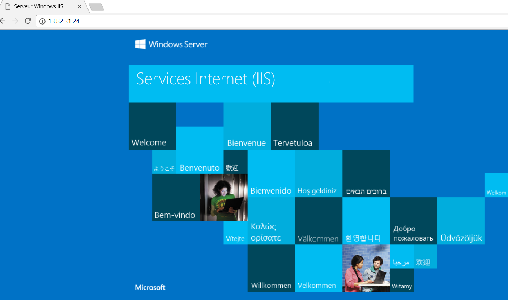

# Démarrage rapide : Créer un équilibreur de charge standard pour équilibrer la charge des machines virtuelles à l’aide du portail Azure

L’équilibrage de charge offre un niveau plus élevé de disponibilité et d’évolutivité en répartissant les demandes entrantes sur plusieurs machines virtuelles. Vous pouvez utiliser le portail Azure pour créer un équilibreur de charge qui équilibre la charge des machines virtuelles. Ce démarrage rapide vous montre comment équilibrer la charge des machines virtuelles à l’aide d’un équilibreur de charge standard.

Si vous n’avez pas d’abonnement Azure, créez un [compte gratuit](https://azure.microsoft.com/free/?WT.mc_id=A261C142F) avant de commencer. 

## Connexion à Azure

Connectez-vous au portail Azure sur [https://portal.azure.com](https://portal.azure.com).

## Créer un équilibreur de charge standard

Dans cette section, vous créez un Standard Load Balancer qui équilibre la charge des machines virtuelles. L’équilibreur de charge standard prend uniquement en charge une adresse IP publique standard. Lorsque vous créez un équilibreur de charge standard, vous devez également créer une nouvelle adresse IP publique standard configurée en tant que frontale (nommée *LoadBalancerFrontend* par défaut) pour cet équilibreur de charge standard. 

1. Dans l’angle supérieur gauche de l’écran, cliquez sur **Créer une ressource** > **Mise en réseau** > **Load Balancer**.
2. Sous l’onglet **De base** de la page **Créer un équilibreur de charge**, entrez ou sélectionnez les informations suivantes, acceptez les valeurs par défaut pour les autres paramètres, puis choisissez **Vérifier + créer** :

    | Paramètre                 | Valeur                                              |
    | ---                     | ---                                                |
    | Abonnement               | Sélectionnez votre abonnement.    |    
    | Groupe de ressources         | Sélectionnez **Créer** et entrez *myResourceGroupSLB* dans la zone de texte.|
    | Nom                   | *myLoadBalancer*                                   |
    | Région         | Sélectionnez **Europe Ouest**.                                        |
    | Type          | Sélectionnez **Public**.                                        |
    | SKU           | Sélectionnez **Standard**.                          |
    | Adresse IP publique | Sélectionnez **Créer nouveau**. |
    | Nom de l’adresse IP publique              | Tapez *myPublicIP* dans la zone de texte.   |
    |Zone de disponibilité| Sélectionnez **Redondant dans une zone**.    |
3. Sous l’onglet **Review + create (Vérifier + créer)**, sélectionnez **Créer**.   

    

## Créer des ressources Load Balancer

Dans cette section, vous allez configurer les paramètres Load Balancer pour un pool d’adresses principal, mettre en place une sonde d’intégrité, puis spécifier une règle d’équilibrage.

### Créer un pool d’adresses principal

Pour distribuer le trafic vers les machines virtuelles, un pool d’adresses backend contient les adresses IP des cartes d’interface réseau virtuelles connectées à Load Balancer. Créez le pool d’adresses backend *myBackendPool* pour inclure des machines virtuelles pour l’équilibrage de charge du trafic Internet.

1. Sélectionnez **Tous les services** dans le menu de gauche, **Toutes les ressources**, puis **myLoadBalancer** dans la liste des ressources.
2. Sous **Paramètres**, sélectionnez **Pools principaux**, puis **Ajouter**.
3. Sur la page **Ajouter un pool de backends**, saisissez *myBackendPool* comme nom de votre pool principal, puis sélectionnez **Ajouter**.

### Créer une sonde d’intégrité

Pour permettre à Load Balancer de surveiller l’état de votre application, vous utilisez une sonde d’intégrité. La sonde d’intégrité ajoute ou supprime dynamiquement des machines virtuelles de la rotation Load Balancer en fonction de leur réponse aux vérifications d’intégrité. Créez une sonde d’intégrité *myHealthProbe* pour surveiller l’intégrité des machines virtuelles.

1. Sélectionnez **Tous les services** dans le menu de gauche, **Toutes les ressources**, puis **myLoadBalancer** dans la liste des ressources.
2. Sous **Paramètres**, sélectionnez **Sondes d’intégrité**, puis **Ajouter**.
    
    | Paramètre | Valeur |
    | ------- | ----- |
    | Nom | Entrez *MyHealthProbe*. |
    | Protocole | Sélectionnez **HTTP**. |
    | Port | Entrez *80*.|
    | Intervalle | Entrez *15* pour **l’intervalle** en secondes entre les tentatives de la sonde. |
    | Seuil de défaillance sur le plan de l’intégrité | Sélectionnez *2* pour le **Seuil de défaillance sur le plan de l’intégrité** ou d’échecs de sonde consécutifs qui se produisent avant qu’une machine virtuelle soit considérée comme défaillante.|
    | Sonde d’intégrité | Sélectionnez *myHealthProbe*. |
4. Sélectionnez **OK**.

### Créer une règle d’équilibreur de charge
Une règle d’équilibreur de charge sert à définir la distribution du trafic vers les machines virtuelles. Vous définissez la configuration IP frontale pour le trafic entrant et le pool d’adresses IP principal pour recevoir le trafic, ainsi que le port source et le port de destination requis. Créez une règle Load Balancer *myLoadBalancerRuleWeb* pour écouter le port 80 dans le *FrontendLoadBalancer* frontal et envoyer le trafic réseau équilibré en charge vers le pool d’adresses backend *myBackEndPool* qui utilise également le port 80. 

1. Sélectionnez **Tous les services** dans le menu de gauche, **Toutes les ressources**, puis **myLoadBalancer** dans la liste des ressources.
2. Sous **Paramètres**, sélectionnez **Règles d’équilibrage de charge**, puis **Ajouter**.
3. Utilisez ces valeurs pour configurer la règle d’équilibrage de charge :
    
    | Paramètre | Valeur |
    | ------- | ----- |
    | Nom | Entrez *MyHTTPRule*. |
    | Protocole | Sélectionnez **TCP**. |
    | Port | Entrez *80*.|
    | Port principal | Entrez *80*. |
    | Pool principal | Sélectionnez *MyBackendPool*.|
    | Sonde d’intégrité | Sélectionnez *myHealthProbe*. |
4. Laissez les autres valeurs par défaut et sélectionnez **OK**.
4. Sélectionnez **OK**.

## Créer des serveurs principaux

Dans cette section, vous créez un réseau virtuel ainsi que deux machines virtuelles pour le pool de backend Load Balancer, puis vous installez IIS sur les machines virtuelles afin de tester Load Balancer.

### Créez un réseau virtuel
1. Dans le coin supérieur gauche de l’écran, sélectionnez **Créer une ressource** > **Mise en réseau** > **Réseau virtuel**.

1. Dans **Créer un réseau virtuel**, entrez ou sélectionnez ces informations :

    | Paramètre | Valeur |
    | ------- | ----- |
    | Nom | Entrez *myVNet*. |
    | Espace d’adressage | Entrez *10.1.0.0/16*. |
    | Abonnement | Sélectionnez votre abonnement.|
    | Groupe de ressources | Sélectionner un groupe de ressources existant - *myResourceGroupSLB*. |
    | Lieu | Sélectionnez **Europe Ouest**.|
    | Sous-réseau - Nom | Entrez *myBackendSubnet*. |
    | Plage d’adresses du sous-réseau | Entrez *10.1.0.0/24*. |
1. Laissez les autres valeurs par défaut et sélectionnez **Créer**.

### Créer des machines virtuelles
Standard Load Balancer prend uniquement en charge des adresses IP publiques Standard dans le pool de backends. Dans cette section, vous allez créer 2 machines virtuelles (*myVM1* et *myVM2*) avec une adresse IP publique Standard dans deux zones différentes (*Zone 1* et *Zone 2*) qui sont ajoutées au pool de backends Standard Load Balancer qui a été créé précédemment.

1. En haut à gauche du portail, sélectionnez **Créer une ressource** > **Calcul** > **Windows Server 2016 Datacenter**. 
   
1. Dans **Créer une machine virtuelle**, tapez ou sélectionnez les valeurs suivantes sous l’onglet **De base** :
   - **Abonnement** > **Groupe de ressources** : Sélectionnez **myResourceGroupSLB**.
   - **Détails de l’instance** > **Nom de la machine virtuelle** : Entrez *MyVM1*.
   - **Détails de l’instance** > **Région** > Sélectionnez **Europe Ouest**.
   - **Détails de l’instance** > **Options de disponibilité** > Sélectionnez **Zones de disponibilité**. 
   - **Détails de l’instance** > **Zones de disponibilité** > Sélectionnez **1**.
  
1. Sélectionnez l'onglet **Mise en réseau** ou choisissez **Suivant : Disques**, puis **Suivant : Mise en réseau**. 
   
   - Vérifiez que les éléments suivants sont sélectionnés :
       - **Réseau virtuel** : *MyVNet*
       - **Sous-réseau** : *MyBackendSubnet*
       - **Adresse IP publique** > Sélectionnez **Créer**, puis, dans la fenêtre **Créer une adresse IP publique**, pour **Référence (SKU)**, sélectionnez **Standard**, et pour **Zone de disponibilité**, sélectionnez **Redondant interzone**, puis **OK**.
   - Pour créer un groupe de sécurité réseau (NSG, un type de pare-feu), sous **Groupe de sécurité réseau**, sélectionnez **Avancé**. 
       1. Dans le champ **Configurer le groupe de sécurité réseau**, sélectionnez **Créer**. 
       1. Tapez *myNetworkSecurityGroup*, puis sélectionnez **OK**.
   - Pour que la machine virtuelle devienne un composant du pool de backends de Load Balancer, procédez comme suit :
        - Dans **Équilibrage de charge**, pour **Placer cette machine virtuelle derrière une solution d’équilibrage de charge existante ?**, sélectionnez **Oui**.
        - Dans **Paramètres d’équilibrage de charge**, pour **Options d’équilibrage de charge**, sélectionnez **Équilibreur de charge Azure**.
        - Pour **Sélectionner un équilibreur de charge**, sélectionnez *MyLoadBalancer*. 
1. Sélectionnez l’onglet **Gestion** ou sélectionnez **Suivant** > **Gestion**. Sous **Supervision**, définissez **Diagnostics de démarrage** sur **Désactivé**. 
1. Sélectionnez **Revoir + créer**.   
1. Passez en revue les paramètres, puis sélectionnez **Créer**.
1. Suivez les étapes pour créer une deuxième machine virtuelle nommée *myVM2*, avec une adresse IP publique de référence SKU Standard nommée *myVM2-ip* et le paramètre **Zone de disponibilité** de **2** et tous les autres paramètres identiques à ceux de la machine virtuelle *myVM1*. 

### Création de la règle de groupe de sécurité réseau

Dans cette section, vous créez une règle de groupe de sécurité réseau pour autoriser les connexions entrantes à l’aide de HTTP.

1. Sélectionnez **Tous les services** dans le menu de gauche, sélectionnez **Toutes les ressources**, puis dans la liste de ressources, sélectionnez **myNetworkSecurityGroup** qui se trouve dans le groupe de ressources **myResourceGroupSLB**.
2. Sous **Paramètres**, sélectionnez **Règles de sécurité de trafic entrant**, puis sélectionnez **Ajouter**.
3. Entrez ces valeurs pour la règle de sécurité entrante nommée *myHTTPRule* afin d’autoriser les connexions HTTP entrantes à l’aide du port 80 :
    - *Service Tag* : pour **Source**.
    - *Internet* : pour **Balise de service source**
    - *80* : pour **Plages de port de destination**
    - *TCP* : pour **Protocole**
    - *Allow* : pour **Action**
    - *100* pour **Priorité**
    - *myHTTPRule* pour le nom
    - *Allow HTTP* pour la description
4. Sélectionnez **OK**.
 
### Installer IIS

1. Sélectionnez **Tous les services** dans le menu de gauche, sélectionnez **Toutes les ressources**, puis dans la liste de ressources, sélectionnez **myVM1** qui se trouve dans le groupe de ressources *myResourceGroupSLB*.
2. Sur la page **Vue d’ensemble**, sélectionnez **Connexion** à RDP dans la machine virtuelle.
3. Connectez-vous à la machine virtuelle avec le nom d’utilisateur *azureuser*.
4. Sur le bureau du serveur, accédez à **Outils d’administration Windows**>**Gestionnaire de serveur**.
5. Dans le Gestionnaire de serveur, sélectionnez **Ajouter des rôles et fonctionnalités**.
6. Dans l’Assistant **Ajouter des rôles et fonctionnalités**, utilisez les valeurs suivantes :
    - Dans la page **Sélectionner le type d’installation**, sélectionnez **Installation basée sur un rôle ou une fonctionnalité**.
    - Dans la page **Sélectionner un serveur de destination**, sélectionnez **myVM1**.
    - Dans la page **Sélectionner le rôle du serveur**, sélectionnez **Serveur Web (IIS)**.
    - Suivez les instructions jusqu’à la fin de l’Assistant 
7. Répétez les étapes 1 à 6 pour la machine virtuelle *myVM2*.

## Tester l’équilibreur de charge
1. Recherchez l’adresse IP publique de l’équilibreur de charge sur l’écran **Vue d’ensemble**. Sélectionnez **Tous les services** dans le menu de gauche, sélectionnez **Toutes les ressources**, puis sélectionnez **myPublicIP**.

2. Copiez l’adresse IP publique, puis collez-la dans la barre d’adresses de votre navigateur. La page par défaut du serveur Web IIS s’affiche sur le navigateur.

      

Pour visualiser la distribution de trafic Load Balancer sur les trois machines virtuelles exécutant votre application, vous pouvez forcer l’actualisation de votre navigateur web.

## Supprimer des ressources

Lorsque vous n’en avez plus besoin, supprimez le groupe de ressources, l’équilibreur de charge Load Balancer et toutes les ressources associées. Pour ce faire, sélectionnez le groupe de ressources (*myResourceGroupSLB*) qui contient l’équilibreur de charge Load Balancer, puis cliquez sur **Supprimer**.

## Étapes suivantes

Dans ce démarrage rapide, vous avez créé un Standard Load Balancer, associé des machines virtuelles à celui-ci, configuré la règle de trafic d’équilibreur de charge, la sonde d’intégrité, puis testé Load Balancer. Pour en savoir plus sur Azure Load Balancer, consultez les didacticiels qui lui sont consacrés.

> [!div class="nextstepaction"]
> [Didacticiels Azure Load Balancer](tutorial-load-balancer-standard-public-zone-redundant-portal.md)
