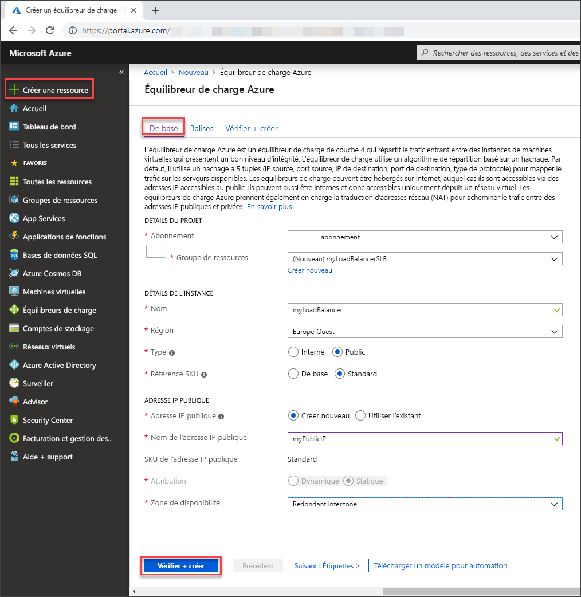

# <a name="quickstart-create-a-load-balancer-to-load-balance-vms-using-the-azure-portal"></a>Démarrage rapide : Créer un équilibreur de charge pour équilibrer la charge des machines virtuelles à l’aide du portail Azure

L’équilibrage de charge offre un niveau plus élevé de disponibilité et d’évolutivité en répartissant les demandes entrantes sur plusieurs machines virtuelles. Vous pouvez utiliser le portail Azure pour créer un équilibreur de charge qui équilibre la charge des machines virtuelles. Ce guide de démarrage rapide vous montre comment équilibrer la charge des machines virtuelles à l’aide d’un équilibreur de charge public.

Si vous n’avez pas d’abonnement Azure, créez un [compte gratuit](https://azure.microsoft.com/free/?WT.mc_id=A261C142F) avant de commencer. 

## <a name="sign-in-to-azure"></a>Connexion à Azure

Connectez-vous au portail Azure sur [https://portal.azure.com](https://portal.azure.com).

## <a name="create-a-load-balancer"></a>Créer un équilibreur de charge

Dans cette section, vous créez un équilibreur de charge qui équilibre la charge des machines virtuelles. Vous pouvez créer un équilibreur de charge public ou un équilibreur de charge interne. Lorsque vous créez un équilibreur de charge public, vous devez également créer une adresse IP publique configurée comme le front-end (nommée *LoadBalancerFrontend* par défaut) pour l’équilibreur de charge.

1. Dans l’angle supérieur gauche de l’écran, cliquez sur **Créer une ressource** > **Mise en réseau** > **Load Balancer**.
2. Sous l’onglet **De base** de la page **Créer un équilibreur de charge**, entrez ou sélectionnez les informations suivantes, acceptez les valeurs par défaut pour les autres paramètres, puis choisissez **Vérifier + créer** :

    | Paramètre                 | Valeur                                              |
    | ---                     | ---                                                |
    | Subscription               | Sélectionnez votre abonnement.    |    
    | Resource group         | Sélectionnez **Créer**, puis entrez *myResourceGroupSLB* dans la zone de texte.|
    | Name                   | *myLoadBalancer*                                   |
    | Région         | Sélectionnez **Europe Ouest**.                                        |
    | Type          | Sélectionnez **Public**.                                        |
    | SKU           | Sélectionnez **Standard** ou **De base**. Microsoft recommande de sélectionner Standard pour les charges de travail de production.  |
    | Adresse IP publique | Sélectionnez **Créer nouveau**. Si vous avez une adresse IP publique existante que vous souhaitez utiliser, sélectionnez **Utiliser l’existant**. |
    | Nom de l’adresse IP publique              | Tapez *myPublicIP* dans la zone de texte.   |
    | Zone de disponibilité | Tapez *redondant interzone* pour créer un équilibreur de charge résilient. Pour créer un équilibreur de charge zonal, sélectionnez une zone spécifique parmi 1, 2 ou 3. |

3. Sous l’onglet **Review + create (Vérifier + créer)** , sélectionnez **Créer**.   

    

## <a name="create-load-balancer-resources"></a>Créer des ressources d’équilibreur de charge

Dans cette section, vous allez configurer des paramètres d’équilibreur de charge pour un pool d’adresses principal et une sonde d’intégrité, puis spécifier une règle d’équilibreur de charge.

### <a name="create-a-backend-pool"></a>Créer un pool back-end

Pour distribuer le trafic aux machines virtuelles, un pool d’adresses principal contient les adresses IP des cartes d’interface réseau virtuelles connectées à l’équilibreur de charge. Créez le pool d’adresses principal *myBackendPool* afin d’inclure des machines virtuelles pour l’équilibrage de charge du trafic Internet.

1. Sélectionnez **Tous les services** dans le menu de gauche, **Toutes les ressources**, puis **myLoadBalancer** dans la liste des ressources.
2. Sous **Paramètres**, sélectionnez **Pools principaux**, puis **Ajouter**.
3. Dans la page **Ajouter un pool de backends**, entrez *myBackendPool* comme nom de votre pool principal, puis sélectionnez **Ajouter**.

### <a name="create-a-health-probe"></a>Créer une sonde d’intégrité

Pour permettre à l’équilibreur de charge de surveiller l’état de votre application, vous utilisez une sonde d’intégrité. La sonde d’intégrité ajoute ou supprime de façon dynamique des machines virtuelles dans la rotation de l’équilibreur de charge en fonction de leur réponse aux contrôles d’intégrité. Créez une sonde d’intégrité *myHealthProbe* pour surveiller l’intégrité des machines virtuelles.

1. Sélectionnez **Tous les services** dans le menu de gauche, **Toutes les ressources**, puis **myLoadBalancer** dans la liste des ressources.
2. Sous **Paramètres**, sélectionnez **Sondes d’intégrité**, puis **Ajouter**.
    
    | Paramètre | Valeur |
    | ------- | ----- |
    | Name | Entrez *MyHealthProbe*. |
    | Protocol | Sélectionnez **HTTP**. |
    | Port | Entrez *80*.|
    | Intervalle | Entrez *15* pour **l’intervalle** en secondes entre les tentatives de la sonde. |
    | Seuil de défaillance sur le plan de l’intégrité | Sélectionnez **2** pour le **Seuil de défaillance sur le plan de l’intégrité**, soit le nombre d’échecs de sonde consécutifs qui peuvent se produire avant qu’une machine virtuelle soit considérée comme non saine.|
    | | |
4. Sélectionnez **OK**.

### <a name="create-a-load-balancer-rule"></a>Créer une règle d’équilibreur de charge
Une règle d’équilibreur de charge sert à définir la distribution du trafic vers les machines virtuelles. Vous définissez la configuration IP frontale pour le trafic entrant et le pool d’adresses IP principal pour recevoir le trafic, ainsi que le port source et le port de destination requis. Créez une règle d’équilibreur de charge *myLoadBalancerRuleWeb* pour écouter le port 80 dans le *FrontendLoadBalancer* frontal et envoyer le trafic réseau équilibré en charge au pool d’adresses principal *myBackEndPool* qui utilise également le port 80. 

1. Sélectionnez **Tous les services** dans le menu de gauche, **Toutes les ressources**, puis **myLoadBalancer** dans la liste des ressources.
2. Sous **Paramètres**, sélectionnez **Règles d’équilibrage de charge**, puis **Ajouter**.
3. Utilisez ces valeurs pour configurer la règle d’équilibrage de charge :
    
    | Paramètre | Valeur |
    | ------- | ----- |
    | Name | Entrez *MyHTTPRule*. |
    | Protocol | Sélectionnez **TCP**. |
    | Port | Entrez *80*.|
    | Port principal | Entrez *80*. |
    | Pool principal | Sélectionnez *MyBackendPool*.|
    | Sonde d’intégrité | Sélectionnez *myHealthProbe*. |
4. Laissez les autres valeurs par défaut, puis sélectionnez **OK**.


## <a name="create-backend-servers"></a>Créer des serveurs principaux

Dans cette section, vous allez créer un réseau virtuel ainsi que trois machines virtuelles pour le pool principal de l’équilibreur de charge, puis installer IIS sur les machines virtuelles afin de tester l’équilibreur de charge.

### <a name="create-a-virtual-network"></a>Créez un réseau virtuel
1. Dans le coin supérieur gauche de l’écran, sélectionnez **Créer une ressource** > **Mise en réseau** > **Réseau virtuel**.

1. Dans **Créer un réseau virtuel**, entrez ou sélectionnez ces informations :

    | Paramètre | Valeur |
    | ------- | ----- |
    | Name | Entrez *myVNet*. |
    | Espace d’adressage | Entrez *10.1.0.0/16*. |
    | Subscription | Sélectionnez votre abonnement.|
    | Resource group | Sélectionner une ressource existante – *myResourceGroupSLB*. |
    | Location | Sélectionnez **Europe Ouest**.|
    | Sous-réseau - Nom | Entrez *myBackendSubnet*. |
    | Plage d’adresses du sous-réseau | Entrez *10.1.0.0/24*. |
1. Conservez les autres valeurs par défaut et sélectionnez **Créer**.

### <a name="create-virtual-machines"></a>Créer des machines virtuelles
Les références SKU d’adresse IP publique et d’équilibreur de charge doivent correspondre. Pour Standard Load Balancer, utilisez des machines virtuelles auxquelles sont associées des adresses IP standard dans le pool back-end. Dans cette section, vous allez créer trois machines virtuelles (*myVM1*, *myVM2* et *myVM3*) avec une adresse IP publique standard dans trois zones différentes (*Zone 1*, *Zone 2* et *Zone 3*) qui sont ajoutées ultérieurement au pool back-end de l’équilibreur de charge créé précédemment. Si vous avez sélectionné De base, utilisez des machines virtuelles avec des adresses IP de base.

1. En haut à gauche du portail, sélectionnez **Créer une ressource** > **Calcul** > **Windows Server 2019 Datacenter**. 
   
1. Dans **Créer une machine virtuelle**, tapez ou sélectionnez les valeurs suivantes sous l’onglet **De base** :
   - **Abonnement** > **Groupe de ressources** : Sélectionnez **myResourceGroupSLB**.
   - **Détails de l’instance** > **Nom de la machine virtuelle** : Entrez *MyVM1*.
   - **Détails de l’instance** > **Région** > sélectionnez **Europe Ouest**.
   - **Détails de l’instance** > **Options de disponibilité** > sélectionnez **Zones de disponibilité**. 
   - **Détails de l’instance** > **Zones de disponibilité** > sélectionnez **1**.
   - **Compte d’administrateur**> Entrez les informations **Nom d’utilisateur**, **Mot de passe** et **Confirmer le mot de passe**.
   - Sélectionnez l'onglet **Mise en réseau** ou choisissez **Suivant : Disques**, puis **Suivant : Mise en réseau**.
  
1. Dans l’onglet **Mise en réseau**, vérifiez que les points suivants sont sélectionnés :
   - **Réseau virtuel** : *MyVNet*
   - **Sous-réseau** : *MyBackendSubnet*
   - **Adresse IP publique** > Sélectionnez **Créer**, puis, dans la fenêtre **Créer une adresse IP publique**, pour **Référence (SKU)** , sélectionnez **Standard**, et pour **Zone de disponibilité**, sélectionnez **Redondant interzone**, puis **OK**. Si vous avez créé un équilibreur de charge de base, sélectionnez De base. Microsoft recommande d’utiliser la référence SKU Standard pour les charges de travail de production.
   - Pour créer un groupe de sécurité réseau (NSG, un type de pare-feu), sous **Groupe de sécurité réseau**, sélectionnez **Avancé**. 
       1. Dans le champ **Configurer le groupe de sécurité réseau**, sélectionnez **Créer**. 
       1. Tapez *myNetworkSecurityGroup*, puis sélectionnez **OK**.
   - Pour que la machine virtuelle fasse partie du pool principal de l’équilibreur de charge, procédez comme suit :
        - Dans **Équilibrage de charge**, pour **Placer cette machine virtuelle derrière une solution d’équilibrage de charge existante ?** , sélectionnez **Oui**.
        - Dans **Paramètres d’équilibrage de charge**, pour **Options d’équilibrage de charge**, sélectionnez **Équilibreur de charge Azure**.
        - Pour **Sélectionner un équilibreur de charge**, sélectionnez *MyLoadBalancer*.
        - Sélectionnez l’onglet **Gestion** ou sélectionnez **Suivant** > **Gestion**.
2. Dans l’onglet **Gestion**, sous **Supervision**, définissez **Diagnostics de démarrage** sur **Désactivé**. 
1. Sélectionnez **Revoir + créer**.   
1. Passez en revue les paramètres, puis sélectionnez **Créer**.
1. Suivez les étapes 2 à 6 pour créer deux machines virtuelles supplémentaires avec les valeurs suivantes et tous les autres paramètres identiques à ceux de *myVM1* :

    | Paramètre | Machine virtuelle 2| Machine virtuelle 3|
    | ------- | ----- |---|
    | Name |  *myVM2* |*myVM3*|
    | Zone de disponibilité | 2 |3|
    |Adresse IP publique| Référence **Standard**|Référence **Standard**|
    | Adresse IP publique - zone de disponibilité| **Redondant dans une zone** |**Redondant dans une zone**|
    | Groupe de sécurité réseau | Sélectionnez le *groupe myNetworkSecurity* existant| Sélectionnez le *groupe myNetworkSecurity* existant|

 ### <a name="create-nsg-rule"></a>Création de la règle de groupe de sécurité réseau

Dans cette section, vous créez une règle de groupe de sécurité réseau pour autoriser les connexions entrantes utilisant le protocole HTTP.

1. Sélectionnez **Tous les services** dans le menu de gauche, sélectionnez **Toutes les ressources**, puis dans la liste de ressources, sélectionnez **myNetworkSecurityGroup** qui se trouve dans le groupe de ressources **myResourceGroupSLB**.
2. Sous **Paramètres**, sélectionnez **Règles de sécurité de trafic entrant**, puis sélectionnez **Ajouter**.
3. Entrez ces valeurs pour la règle de sécurité entrante nommée *myHTTPRule* afin d’autoriser les connexions HTTP entrantes à l’aide du port 80 :
    - **Source** : *Balise du service*
    -  **Balise du service source** : *Internet*
    - **Plages de ports de destination** : *80*
    - **Protocole** : *TCP*
    - **Action** : *Autoriser*
    - **Priorité** : *100*
    - **Nom** : *myHTTPRule* 
    - **Description** : *Autoriser HTTP* 
4. Sélectionnez **Ajouter**.
5. Répétez ces étapes pour la règle RDP entrante, si besoin, avec les valeurs différentes suivantes :
   - **Plages de ports de destination** : Entrez *3389*.
   - **Priorité** : Entrez *200*. 
   - **Name** : Entrez *MyRDPRule*. 
   - **Description** : Entrez *Autoriser HTTP*. 
 
### <a name="install-iis"></a>Installer IIS

1. Sélectionnez **Tous les services** dans le menu de gauche, sélectionnez **Toutes les ressources**, puis dans la liste de ressources, sélectionnez **myVM1** qui se trouve dans le groupe de ressources *myResourceGroupSLB*.
2. Sur la page **Vue d’ensemble**, sélectionnez **Connexion** à RDP dans la machine virtuelle.
5. Connectez-vous à la machine virtuelle avec les informations d’identification fournies lors de sa création. Cela lance une session Bureau à distance avec une machine virtuelle, *myVM1*.
6. Sur le bureau du serveur, accédez à **Outils d’administration Windows**>**Windows PowerShell**.
7. Dans la fenêtre PowerShell, exécutez les commandes suivantes pour installer le serveur IIS, supprimez le fichier iisstart.htm par défaut, puis ajoutez un nouveau fichier iisstart.htm qui affiche le nom de la machine virtuelle :

   ```azurepowershell-interactive
    
    # install IIS server role
    Install-WindowsFeature -name Web-Server -IncludeManagementTools
    
    # remove default htm file
     remove-item  C:\inetpub\wwwroot\iisstart.htm
    
    # Add a new htm file that displays server name
     Add-Content -Path "C:\inetpub\wwwroot\iisstart.htm" -Value $("Hello World from " + $env:computername)
   ```
6. Fermez la session RDP avec *myVM1*.
7. Répétez les étapes 1 à 6 pour installer IIS et le fichier iisstart.htm mis à jour sur *myVM2* et *myVM3*.

## <a name="test-the-load-balancer"></a>Tester l’équilibreur de charge
1. Recherchez l’adresse IP publique de l’équilibreur de charge sur l’écran **Vue d’ensemble**. Sélectionnez **Tous les services** dans le menu de gauche, sélectionnez **Toutes les ressources**, puis sélectionnez **myPublicIP**.

2. Copiez l’adresse IP publique, puis collez-la dans la barre d’adresses de votre navigateur. La page par défaut du serveur Web IIS s’affiche sur le navigateur.

   

Pour voir l’équilibreur de charge répartir le trafic entre les trois machines virtuelles, vous pouvez personnaliser la page par défaut du serveur Web IIS de chaque machine virtuelle, puis forcer votre navigateur à s’actualiser à partir de l’ordinateur client.

## <a name="clean-up-resources"></a>Nettoyer les ressources

Lorsque vous n’en avez plus besoin, supprimez le groupe de ressources, l’équilibreur de charge Load Balancer et toutes les ressources associées. Pour ce faire, sélectionnez le groupe de ressources (*myResourceGroupSLB*) qui contient l’équilibreur de charge Load Balancer, puis cliquez sur **Supprimer**.

## <a name="next-steps"></a>Étapes suivantes

Dans ce démarrage rapide, vous avez créé un Standard Load Balancer, associé des machines virtuelles à celui-ci, configuré la règle de trafic d’équilibreur de charge, la sonde d’intégrité, puis testé Load Balancer. Pour en savoir plus sur Azure Load Balancer, consultez les [tutoriels Azure Load Balancer](tutorial-load-balancer-standard-public-zone-redundant-portal.md).

Découvrez-en plus sur les [équilibreurs de charge et les zones de disponibilité](load-balancer-standard-availability-zones.md).
