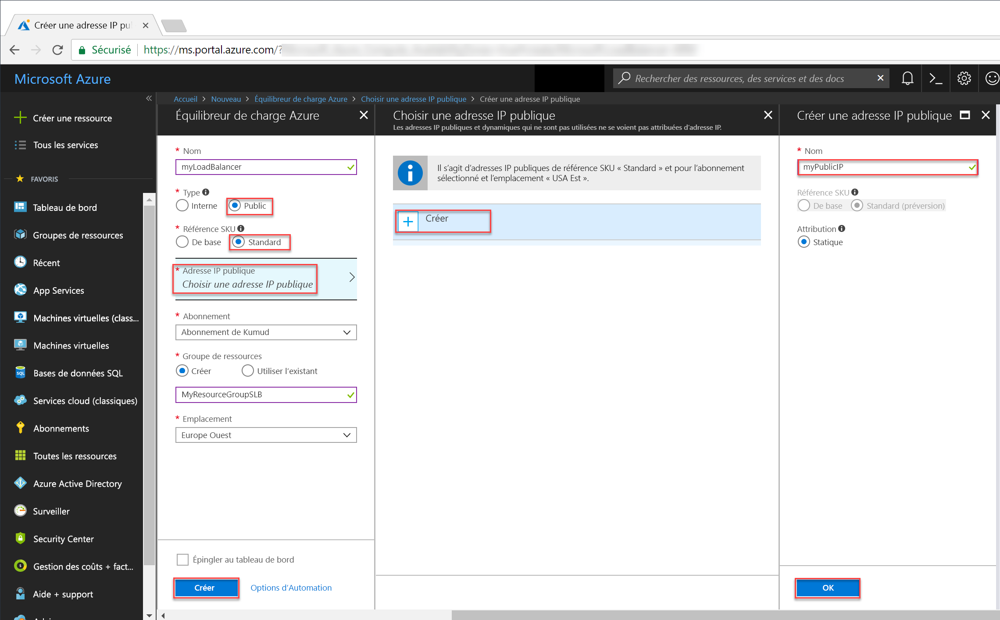
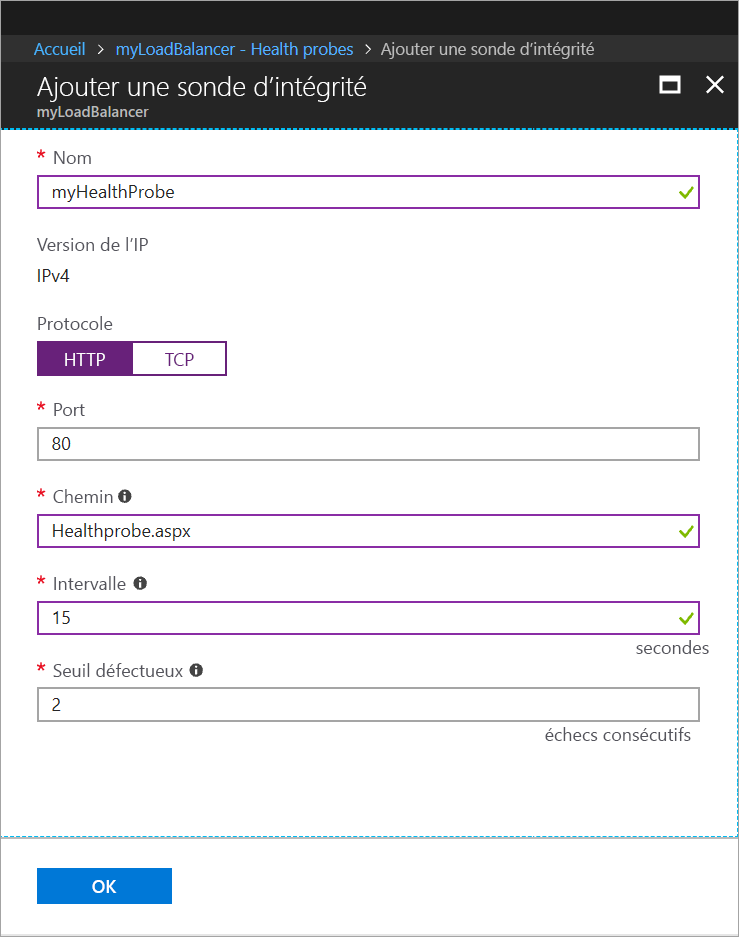
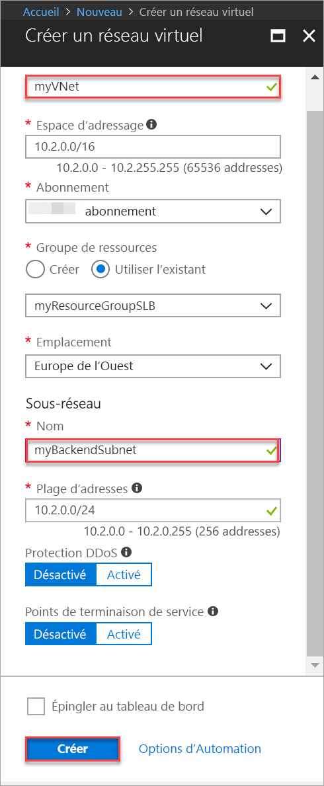

# <a name="tutorial-create-and-manage-standard-load-balancer-using-the-azure-portal"></a>Didacticiel : créer et gérer un Standard Load Balancer (équilibreur de charge standard) avec le portail Azure

L’équilibrage de charge offre un niveau plus élevé de disponibilité et d’évolutivité en répartissant les demandes entrantes sur plusieurs machines virtuelles. Dans ce didacticiel, vous allez découvrir les différents composants du Standard Load Balancer (équilibreur de charge standard) Azure qui répartissent le trafic et fournissent une haute disponibilité. Vous allez apprendre à effectuer les actions suivantes :


> [!div class="checklist"]
> * Crée un équilibrage de charge Azure
> * Créer une sonde d’intégrité d’équilibreur de charge
> * Créer des règles de trafic pour l’équilibrage de charge
> * Créer des machines virtuelles et installer le serveur IIS
> * Attacher des machines virtuelles à un équilibreur de charge
> * Afficher un équilibrage de charge en action
> * Ajouter et supprimer des machines virtuelles d’un équilibreur de charge


Si vous n’avez pas d’abonnement Azure, créez un [compte gratuit](https://azure.microsoft.com/free/?WT.mc_id=A261C142F) avant de commencer. 

## <a name="log-in-to-azure"></a>Connexion à Azure

Connectez-vous au portail Azure à l’adresse [http://portal.azure.com](http://portal.azure.com).

## <a name="create-a-standard-load-balancer"></a>Créer un équilibreur de charge standard

Dans cette section, vous créez un équilibreur de charge public qui équilibre la charge des machines virtuelles. L’équilibreur de charge standard prend uniquement en charge une adresse IP publique standard. Lorsque vous créez un Standard Load Balancer (équilibreur de charge standard), vous devez également créer une nouvelle adresse IP publique standard configurée en tant que frontale (nommée *LoadBalancerFrontend* par défaut) pour ce Standard Load Balancer. 

1. En haut à gauche de l’écran, cliquez sur **Créer une ressource** > **Mise en réseau** > **Équilibreur de charge**.
2. Dans la page **Créer un équilibreur de charge**, entrez les valeurs suivantes pour l’équilibreur de charge :
    - *myLoadBalancer* : pour le nom de l’équilibreur de charge.
    - **Public** : pour le type de l’équilibreur de charge.
    - **Standard** : pour la version de référence SKU de l’équilibreur de charge.
     - *myPublicIP* : pour la **nouvelle** IP publique que vous créez.
    - *myResourceGroupSLB* : pour le nom du **nouveau** groupe de ressources à créer sélectionné.
    - **westeurope** : pour l’emplacement.
3. Cliquez sur **Créer** pour générer l’équilibreur de charge.


   
## <a name="create-load-balancer-resources"></a>Créer les ressources d’équilibreur de charge

Dans cette section, vous configurez les paramètres de l’équilibreur de charge pour un pool d’adresses principal et une sonde d’intégrité, puis spécifiez les règles de l’équilibreur de charge.

### <a name="create-a-backend-address-pool"></a>Créer un pool d’adresses principal

Pour distribuer le trafic vers les machines virtuelles, un pool d’adresses principal contient les adresses IP des cartes d’interface réseau virtuelles connectées à l’équilibreur de charge. Créez le pool d’adresses principal *myBackendPool* pour inclure *VM1* et *VM2*.

1. Cliquez sur **Toutes les ressources** dans le menu de gauche, puis cliquez sur **myLoadBalancer** dans la liste des ressources.
2. Cliquez sur **Paramètres**, sur **Pools principaux**, puis sur **Ajouter**.
3. Sur la page **Add a backend pool** (Ajouter un pool principal), pour le nom, saisissez *myBackEndPool* comme nom de votre pool principal, puis cliquez sur **OK**.

### <a name="create-a-health-probe"></a>Créer une sonde d’intégrité

Pour permettre à l’équilibrage de charge de surveiller l’état de votre application, vous utilisez une sonde d’intégrité. La sonde d’intégrité ajoute ou supprime dynamiquement des machines virtuelles de la rotation d’équilibrage de charge en fonction de leur réponse aux vérifications d’intégrité. Créez une sonde d’intégrité *myHealthProbe* pour surveiller l’intégrité des machines virtuelles.

1. Cliquez sur **Toutes les ressources** dans le menu de gauche, puis cliquez sur **myLoadBalancer** dans la liste des ressources.
2. Cliquez sur **Paramètres**, sur **Sondes d’intégrité**, puis sur **Ajouter**.
3. Utilisez ces valeurs pour créer la sonde d’intégrité :
    - *myHealthProbe* : pour le nom de la sonde d’intégrité.
    - **HTTP** : pour le type de protocole.
    - *80* : pour le numéro de port.
    - *15* : pour **l’intervalle** en secondes entre les tentatives de la sonde.
    - *2* : pour le nombre de **seuils de défaillance** ou d’échecs de sonde consécutifs qui se produisent avant qu’une machine virtuelle soit considérée comme défaillante.
4. Cliquez sur **OK**.

   

### <a name="create-a-load-balancer-rule"></a>Créer une règle d’équilibreur de charge

Une règle d’équilibrage de charge est utilisée pour définir la distribution du trafic vers les machines virtuelles. Vous définissez la configuration IP frontale pour le trafic entrant et le pool d’adresses IP principal pour recevoir le trafic, ainsi que le port source et le port de destination requis. Créez une règle d’équilibreur de charge *myLoadBalancerRuleWeb* pour écouter le port 80 dans le frontal *FrontendLoadBalancer* et envoyer le trafic réseau équilibré en charge vers le pool d’adresses principal *myBackEndPool* qui utilisé également le port 80. 

1. Cliquez sur **Toutes les ressources** dans le menu de gauche, puis cliquez sur **myLoadBalancer** dans la liste des ressources.
2. Cliquez sur **Paramètres**, **Règles d’équilibrage de charge**, puis sur **Ajouter**.
3. Utilisez ces valeurs pour configurer la règle d’équilibrage de charge :
    - *myHTTPRule* : pour que le nom de la règle d’équilibrage de charge.
    - **TCP** : pour le type de protocole.
    - *80* : pour le numéro de port.
    - *80* : pour le port principal.
    - *myBackendPool* : pour le nom du pool principal.
    - *myHealthProbe* : pour le nom de la sonde d’intégrité.
4. Cliquez sur **OK**.
    
## <a name="create-backend-servers"></a>Créer des serveurs principaux

Dans cette section, vous créez un réseau virtuel ainsi que trois machines virtuelles pour le pool principal de votre équilibreur de charge, puis installez IIS sur les machines virtuelles afin de tester l’équilibreur de charge.

### <a name="create-a-virtual-network"></a>Créez un réseau virtuel
1. Sur le côté gauche de l’écran, cliquez sur **Nouveau** > **Réseau** > **Réseau virtuel** et entrez ces valeurs pour le réseau virtuel :
    - *myVnet* : pour le nom du réseau virtuel.
    - *myResourceGroupSLB* : pour le nom du groupe de ressources existant
    - *myBackendSubnet* : pour le nom du sous-réseau.
2. Cliquez sur **Créer** pour créer le réseau virtuel.

    

### <a name="create-virtual-machines"></a>Créer des machines virtuelles

1. Sur le côté gauche de l’écran, cliquez sur **Nouveau** > **Calcul** > **Windows Server 2016 Datacenter** et entrez ces valeurs pour la machine virtuelle :
    - *myVM1* : pour le nom de la machine virtuelle.        
    - *azureuser* : pour le nom d’utilisateur administrateur.    
    - *myResourceGroupSLB* : pour **Groupe de ressources**, sélectionnez **Utiliser existant**, puis *myResourceGroupSLB*.
2. Cliquez sur **OK**.
3. Sélectionnez **DS1_V2** pour la taille de la machine virtuelle, puis cliquez sur **Sélectionner**.
4. Entrez ces valeurs pour les paramètres de la machine virtuelle :
    -  *myVNet* : vérifiez qu’il est sélectionné en tant que réseau virtuel.
    - *myBackendSubnet* : vérifiez qu’il est sélectionné en tant que sous-réseau.
    - *myNetworkSecurityGroup* : pour le nom du nouveau groupe de sécurité réseau (pare-feu) que vous devez créer.
5. Cliquez sur **Désactivé** pour désactiver les diagnostics de démarrage.
6. Cliquez sur **OK**, vérifiez les paramètres sur la page de résumé, puis cliquez sur **Créer**.
7. Créez deux autres machines virtuelles nommées *VM2* et *VM3* avec *myVnet* en tant que réseau virtuel, *myBackendSubnet* en tant que sous-réseau et **myNetworkSecurityGroup* en tant que groupe de sécurité réseau à l’aide des étapes 1 à 6. 

### <a name="create-nsg-rules"></a>Créer les règles du groupe de sécurité réseau

Dans cette section, vous créez des règles du groupe de sécurité réseau pour autoriser les connexions entrantes à l’aide de HTTP et RDP.

1. Cliquez sur **Toutes les ressources** dans le menu de gauche, puis dans la liste de ressources, cliquez sur **myNetworkSecurityGroup** qui se trouve dans le groupe de ressources **myResourceGroupSLB**.
2. Sous **Paramètres**, cliquez sur **Règles de sécurité entrantes**, puis sur **Ajouter**.
3. Entrez ces valeurs pour la règle de sécurité entrante nommée *myHTTPRule* afin d’autoriser les connexions HTTP entrantes à l’aide du port 80 :
    - *Service Tag* : pour **Source**.
    - *Internet* : pour **Balise de service source**
    - *80* : pour **Plages de port de destination**
    - *TCP* : pour **Protocole**
    - *Allow* : pour **Action**
    - *100* pour **Priorité**
    - *myHTTPRule* pour le nom
    - *Allow HTTP* pour la description
4. Cliquez sur **OK**.
 
 
5. Répétez les étapes 2 à 4 pour créer une autre règle nommée *myRDPRule* pour autoriser une connexion RDP entrante à l’aide du port 3389 avec les valeurs suivantes :
    - *Service Tag* : pour **Source**.
    - *Internet* : pour **Balise de service source**
    - *3389* : pour **Plages de port de destination**
    - *TCP* : pour **Protocole**
    - *Allow* : pour **Action**
    - *200* pour **Priorité**
    - *myRDPRule* pour le nom
    - *Allow RDP* pour la description

### <a name="install-iis-on-vms"></a>Installer IIS sur des machines virtuelles

1. Cliquez sur **Toutes les ressources** dans le menu de gauche puis, dans la liste de ressources, cliquez sur **myVM1** qui se trouve dans le groupe de ressources *myResourceGroupILB*.
2. Sur la page **Vue d’ensemble**, cliquez sur **Connexion** à RDP dans la machine virtuelle.
3. Connectez-vous à la machine virtuelle avec le nom d’utilisateur *azureuser*.
4. Sur le bureau du serveur, accédez à **Outils d’administration Windows**>**Windows PowerShell**.
5. Dans la fenêtre PowerShell, exécutez les commandes suivantes pour installer le serveur IIS, supprimez le fichier iisstart.htm par défaut, puis ajoutez un nouveau fichier iisstart.htm qui affiche le nom de la machine virtuelle :

   ```azurepowershell-interactive
    
    # install IIS server role
    Install-WindowsFeature -name Web-Server -IncludeManagementTools
    
    # remove default htm file
     remove-item  C:\inetpub\wwwroot\iisstart.htm
    
    # Add a new htm file that displays server name
     Add-Content -Path "C:\inetpub\wwwroot\iisstart.htm" -Value $("Hello World from" + $env:computername)
   ```
6. Fermez la session RDP avec *myVM1*.
7. Répétez les étapes 1 à 6 pour installer IIS et le fichier iisstart.htm mis à jour sur *myVM2* et *myVM3*.

## <a name="add-vms-to-the-backend-address-pool"></a>Ajouter des machines virtuelles au pool d’adresses principal

Pour distribuer le trafic vers les machines virtuelles, ajoutez les machines virtuelles *VM1*, *VM2* et *VM3* au pool d’adresses principal *myBackendPool* créé précédemment. Le pool d’adresses principal contient les adresses IP des cartes d’interface réseau virtuelles connectées à l’équilibreur de charge.

1. Cliquez sur **Toutes les ressources** dans le menu de gauche, puis cliquez sur **myLoadBalancer** dans la liste des ressources.
2. Sous **Paramètres**, cliquez sur **Pools principaux** puis, dans la liste du pool principal, cliquez sur **myBackendPool**.
3. Sur la page **myBackendPool**, procédez comme suit :
    - Cliquez sur **Ajouter une configuration IP de réseau cible** pour ajouter chaque machine virtuelle (*myVM1*, *myVM2* et *myVM3*) créée au pool principal.
    - Cliquez sur **OK**.

4. Vérifiez que le paramètre du pool principal de l’équilibreur de charge affiche les trois machines virtuelles : **VM1**, **VM2** et **myVM3**.

## <a name="test-the-load-balancer"></a>Tester l’équilibreur de charge
1. Recherchez l’adresse IP publique de l’équilibreur de charge sur l’écran **Vue d’ensemble**. Cliquez sur **Toutes les ressources**, puis sur **myPublicIP**.

2. Copiez l’adresse IP publique, puis collez-la dans la barre d’adresses de votre navigateur. La page par défaut du serveur Web IIS s’affiche sur le navigateur.

      

Pour visualiser la distribution de trafic par l’équilibreur de charge sur les trois machines virtuelles exécutant votre application, vous pouvez forcer l’actualisation de votre navigateur web.

## <a name="remove-or-add-vms-from-the-backend-pool"></a>Supprimer ou ajouter des machines virtuelles à partir du pool principal
Vous devrez peut-être effectuer la maintenance sur la machine virtuelle exécutant votre application, avec par exemple l’installation des mises à jour du système d’exploitation. Pour faire face à une augmentation du trafic vers votre application, vous devrez peut-être ajouter des machines virtuelles supplémentaires. Cette section vous indique comment supprimer ou ajouter une machine virtuelle pour l’équilibrage de charge.

1. Cliquez sur **Toutes les ressources** dans le menu de gauche, puis cliquez sur **myLoadBalancer** dans la liste des ressources.
2. Sous **Paramètres**, cliquez sur **Pools principaux** puis, dans la liste du pool principal, cliquez sur **myBackendPool**.
3. Sur la page **myBackendPool**, sous **Target network IP configurations** (Configurations IP réseau cible), pour supprimer *VM1* du pool principal, cliquez sur l’icône de suppression en regard **Machine virtuelle : myVM1**

Lorsque *myVM1* ne figure plus dans le pool d’adresses principal, vous pouvez effectuer des tâches de maintenance sur *myVM1*, comme l’installation de mises à jour logicielles. En l’absence de *VM1**, la charge est maintenant équilibrée entre *myVM2* et *myVM3*. 

Pour rajouter *myVM1* au pool principal, suivez la procédure décrite dans la section *Ajouter des machines virtuelles au pool principal* de cet article.

## <a name="clean-up-resources"></a>Supprimer des ressources

Lorsque vous n’en avez plus besoin, supprimez le groupe de ressources, l’équilibreur de charge et toutes les ressources associées. Pour ce faire, sélectionnez le groupe de ressources qui contient l’équilibreur de charge, puis cliquez sur **Supprimer**.

## <a name="next-steps"></a>Étapes suivantes

Dans ce didacticiel, vous avez créé un Standard Load Balancer (équilibreur de charge standard), associé des machines virtuelles à celui-ci, configuré la règle de trafic d’équilibreur de charge, la sonde d’intégrité, puis testé l’équilibreur de charge. Vous avez également supprimé une machine virtuelle de l’ensemble avec équilibrage de charge et rajouté la machine virtuelle au pool d’adresses principal. Pour en savoir plus sur Azure Load Balancer, consultez les didacticiels qui lui sont consacrés.

> [!div class="nextstepaction"]
> [Didacticiels Azure Load Balancer](tutorial-load-balancer-standard-public-zone-redundant-portal.md)
