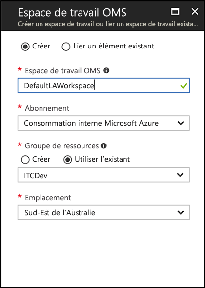

# Créer un espace de travail Log Analytics dans le portail Azure
Dans le Portail Azure, vous pouvez configurer un espace de travail Log Analytics, environnement Log Analytics unique doté de ses propres référentiel de données, sources de données et solutions.  Vous devez suivre les étapes décrites dans cet article si vous souhaitez collecter des données à partir des sources suivantes :

* Ressources Azure dans votre abonnement
* Ordinateurs locaux surveillés par System Center Operations Manager
* Collections d’appareils de System Center Configuration Manager 
* Données de diagnostics et de journaux du Stockage Azure

Pour les autres sources, telles que les machines virtuelles Azure et les ordinateurs Windows ou Linux dans votre environnement, consultez les rubriques suivantes :

*  [Collecter des données sur les machines virtuelles Azure](log-analytics-quick-collect-azurevm.md) 
*  [Collecter des données sur les ordinateurs Linux](log-analytics-quick-collect-linux-computer.md)
*  [Collecter des données sur les ordinateurs Windows](log-analytics-quick-collect-windows-computer.md)

Si vous n’avez pas d’abonnement Azure, créez un [compte gratuit](https://azure.microsoft.com/free/?WT.mc_id=A261C142F) avant de commencer.

## Connexion au portail Azure
Connectez-vous au portail Azure à l’adresse [https://portal.azure.com](https://portal.azure.com). 

## Créer un espace de travail
1. Dans le portail Azure, cliquez sur **Tous les services**. Dans la liste de ressources, saisissez **Log Analytics**. Au fur et à mesure de la saisie, la liste est filtrée. Sélectionnez **Log Analytics**.       
2. Cliquez sur **Créer**, puis sélectionnez des options pour les éléments suivants :

  * Attribuez un nom au nouvel **Espace de travail OMS**, en l’occurrence *DefaultLAWorkspace*. 
  * Dans la liste déroulante **Abonnement**, sélectionnez un abonnement à lier si la valeur par défaut sélectionnée n’est pas appropriée.
  * Pour **Groupe de ressources**, choisissez d’utiliser un groupe de ressources déjà configuré ou créez-en un.  
  * Sélectionnez un **Emplacement** disponible.  Pour en savoir plus, découvrez dans quelles [régions Log Analytics est disponible](https://azure.microsoft.com/regions/services/).
  * Si vous créez un espace de travail dans un nouvel abonnement créé après le 2 avril 2018, il utilisera automatiquement le plan tarifaire *Par Go* et l’option pour sélectionner un niveau de tarification ne sera pas disponible.  Si vous créez un espace de travail pour un abonnement existant créé avant le 2 avril ou pour un abonnement lié à une inscription EA existante, sélectionnez le niveau tarifaire de votre choix.  Pour plus d’informations sur les différents niveaux proposés, consultez le [détail des tarifs de Log Analytics](https://azure.microsoft.com/pricing/details/log-analytics/).

           

3. Après avoir entré les informations requises dans le volet **Espace de travail OMS**, cliquez sur **OK**.  

Pendant que les informations sont vérifiées et l’espace de travail créé, vous pouvez suivre la progression sous **Notifications** dans le menu. 

## Étapes suivantes
Disposant à présent d’un espace de travail, vous pouvez configurer la collecte des données de télémétrie de surveillance, exécuter des recherches dans les journaux pour analyser ces données et ajouter une solution de gestion pour fournir des données et insights analytiques supplémentaires. 

* Pour activer la collecte de données à partir de ressources Azure avec Azure Diagnostics ou le stockage Azure, consultez [Collecte des journaux et des métriques des services Azure à utiliser dans Log Analytics](log-analytics-azure-storage.md).  
* [Ajoutez System Center Operations Manager comme source de données](log-analytics-om-agents.md) pour collecter des données à partir des agents rattachés à votre groupe d’administration Operations Manager et les stocker dans votre référentiel d’espace de travail Log Analytics. 
* Connectez [Configuration Manager](log-analytics-sccm.md) pour importer des ordinateurs qui sont membres de collections dans la hiérarchie.  
* Examinez les [solutions de gestion](/log-analytics-add-solutions.md) disponibles et la façon d’ajouter ou de supprimer une solution dans votre espace de travail.

