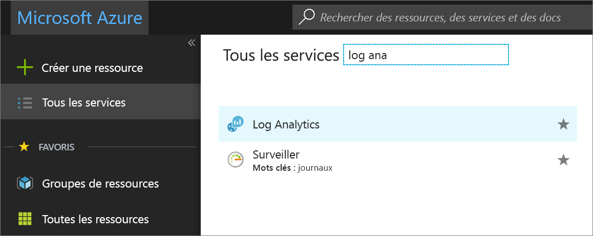
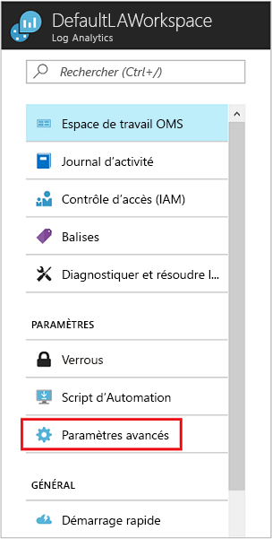

# Connexion de Configuration Manager à Log Analytics
Vous pouvez connecter votre environnement System Center Configuration Manager Azure Log Analytics pour synchroniser des données de regroupement d’appareils et faire référence à ces regroupements dans Log Analytics et Azure Automation.  

## Prérequis

Log Analytics prend en charge la branche actuelle de System Center Configuration Manager, version 1606 et supérieure.  

## Présentation de la configuration
Les étapes suivantes récapitulent les étapes de configuration de l’intégration de Configuration Manager avec Log Analytics.  

1. Dans le portail Azure, inscrivez Configuration Manager en tant qu’application web et/ou application API web, et assurez-vous de disposer de l’ID et de la clé secrète client résultant de l’inscription à partir d’Azure Active Directory. Pour plus d’informations sur cette étape, consultez [Utiliser le portail pour créer une application et un principal du service Active Directory pouvant accéder aux ressources](../active-directory/develop/howto-create-service-principal-portal.md).
2. Dans le portail Azure, [attribuez à Configuration Manager (l’application web inscrite) l’autorisation d’accéder à Log Analytics](#grant-configuration-manager-with-permissions-to-log-analytics).
3. Dans Configuration Manager, [ajoutez une connexion à l’aide de l’Assistant Ajout de connexion OMS](#add-an-oms-connection-to-configuration-manager).
4. Dans Configuration Manager, [mettez à jour les propriétés de connexion](#update-oms-connection-properties) en cas d’expiration ou de perte du mot de passe ou de la clé secrète client.
5. [Téléchargez et installez Microsoft Monitoring Agent](#download-and-install-the-agent) sur l’ordinateur exécutant le rôle de système de site de point de connexion de service de Configuration Manager. L’agent envoie les données de Configuration Manager vers l’espace de travail Log Analytics.
6. Dans Log Analytics, [importez les collections de Configuration Manager](#import-collections) en tant que groupes d’ordinateurs.
7. Dans Log Analytics, affichez les données de Configuration Manager en tant que [groupes d’ordinateurs](log-analytics-computer-groups.md).

Pour plus d’informations sur la connexion de Configuration Manager à Log Analytics, voir [Synchroniser des données de Configuration Manager sur Microsoft Log Analytics](https://technet.microsoft.com/library/mt757374.aspx).

## Accorder à Configuration Manager les autorisations d’accès à Log Analytics
Dans la procédure suivante, vous attribuez le rôle *Contributeur* dans votre espace de travail Log Analytics à l’application et au principal de service AD que vous avez créés précédemment pour Configuration Manager.  Si vous ne disposez pas déjà d’un espace de travail, consultez [Créer un espace de travail dans Azure Log Analytics](log-analytics-quick-create-workspace.md) avant de continuer.  Cela permet à Configuration Manager de s’authentifier et de se connecter à votre espace de travail Log Analytics.  

> [!NOTE]
> Vous devez spécifier des autorisations dans Log Analytics pour Configuration Manager. Sinon, vous recevez un message d’erreur quand vous utilisez l’Assistant Configuration dans Configuration Manager.
>

1. Dans le portail Azure, cliquez sur **Tous les services** en haut à gauche. Dans la liste de ressources, saisissez **Log Analytics**. Au fur et à mesure de la saisie, la liste est filtrée. Sélectionnez **Log Analytics**.       
2. Dans votre liste d’espaces de travail Log Analytics, sélectionnez l’espace de travail à modifier.
3. Dans le volet gauche, sélectionnez **Contrôle d’accès (IAM)**.
4. Dans la page Contrôle d’accès, cliquez sur **Ajouter** pour faire apparaître le volet **Ajouter des autorisations**.
5. Dans le volet **Ajouter des autorisations**, ouvrez la liste déroulante **Rôle** et sélectionnez le rôle **Contributeur**.  
6. Dans la liste déroulante **Attribuer l’accès à**, sélectionnez l’application Configuration Manager créée précédemment dans AD, puis cliquez sur **OK**.  

## Téléchargement et installation de l’agent
Consultez l’article [Connecter des ordinateurs Windows au service Log Analytics dans Azure](log-analytics-agent-windows.md) afin de mieux comprendre les méthodes disponibles pour l’installation de Microsoft Monitoring Agent sur l’ordinateur qui héberge le rôle de système de site de point de connexion de service de Configuration Manager.  

## Ajouter une connexion Log Analytics à Configuration Manager
Pour que vous puissiez ajouter une connexion Log Analytics, il faut que votre environnement Configuration Manager ait un [point de connexion de service](https://technet.microsoft.com/library/mt627781.aspx) configuré pour le mode en ligne.

1. Dans l’espace de travail **Administration** de Configuration Manager, sélectionnez **Connecteur OMS**. Cette opération ouvre l’**Assistant Ajout de connexion Log Analytics**. Sélectionnez **Suivant**.

   >[!NOTE]
   >OMS est désormais appelé Log Analytics.
   
2. Dans l’écran **Général**, vérifiez que vous avez effectué les actions suivantes et que vous disposez des détails de chaque élément, puis sélectionnez **Suivant**.

   1. Dans le portail Azure, vous avez inscrit Configuration Manager en tant qu’application web et/ou application API web, et vous disposez de [l’ID client résultant de l’inscription](../active-directory/develop/quickstart-v1-integrate-apps-with-azure-ad.md).
   2. Dans le portail Azure, vous avez créé une clé secrète d’application pour l’application inscrite dans Azure Active Directory.  
   3. Dans le portail Azure, vous avez accordé à l’application web inscrite l’autorisation d’accéder à Log Analytics.  
      
3. Dans l’écran **Azure Active Directory**, configurez vos paramètres de connexion à Log Analytics en complétant les champs **Locataire**, **ID client** et **Clé secrète du client**, puis sélectionnez **Suivant**.  
   
4. Si vous avez correctement accompli toutes les autres procédures, les informations de l’écran **Configuration de la connexion OMS** s’affichent automatiquement dans cette page. Les informations des paramètres de connexion doivent s’afficher pour **Abonnement Azure**, **Groupe de ressources Azure** et **Espace de travail Operations Management Suite**.  
   
5. L’Assistant se connecte au service Log Analytics en utilisant les informations que vous avez entrées. Sélectionnez les regroupements d’appareils à synchroniser avec le service, puis cliquez sur **Ajouter**.  
   
6. Vérifiez vos paramètres de connexion dans l’écran **Résumé**, puis sélectionnez **Suivant**. L’écran **Progression** affiche l’état de la connexion, puis doit afficher **Terminé**.

> [!NOTE]
> Vous devez connecter le site de niveau supérieur de votre hiérarchie à Log Analytics. Si vous connectez un site principal autonome à Log Analytics, puis ajoutez un site d’administration centrale à votre environnement, vous devez supprimer la connexion et la recréer au sein de la nouvelle hiérarchie.
>
>

Après avoir lié Configuration Manager à Log Analytics, vous pouvez ajouter ou supprimer des regroupements, et afficher les propriétés de la connexion.

## Mettre à jour les propriétés de connexion Log Analytics
En cas d’expiration ou de perte de mot de passe ou de clé secrète du client, vous devez mettre à jour manuellement les propriétés de connexion Log Analytics.

1. Dans Configuration Manager, accédez à **Services cloud**, puis sélectionnez **Connecteur OMS** pour ouvrir la page **Propriétés de connexion OMS**.
2. Dans cette page, cliquez sur l’onglet **Azure Active Directory** pour afficher vos informations **Client**, **ID client** et **Expiration de clé secrète client**. **Vérifiez** votre **Clé secrète client** pour voir si elle a expiré.

## Importer des regroupements
Après l’ajout d’une connexion Log Analytics à Configuration Manager et l’installation de l’agent sur l’ordinateur exécutant le rôle de système de site de point de connexion de service de Configuration Manager, l’étape suivante consiste à importer des regroupements de Configuration Manager dans Log Analytics en tant que groupes d’ordinateurs.

Après la configuration initiale de l’importation des regroupements d’appareils à partir de votre hiérarchie, les informations d’appartenance au regroupement sont récupérées toutes les 3 heures dans l’optique de maintenir l’appartenance à jour. Vous pouvez désactiver cette fonction à tout moment.

1. Dans le portail Azure, cliquez sur **Tous les services** en haut à gauche. Dans la liste de ressources, saisissez **Log Analytics**. Au fur et à mesure de la saisie, la liste est filtrée. Sélectionnez **Log Analytics**.
2. Dans la liste des espaces de travail Log Analytics, sélectionnez l’espace de travail avec lequel Configuration Manager est inscrit.  
3. Sélectionnez **Paramètres avancés**.       
4. Sélectionnez **Groupes d’ordinateurs**, puis **SCCM**.  
5. Sélectionnez **Importer les appartenances aux regroupements Configuration Manager**, puis cliquez sur **Enregistrer**.  
   

## Afficher les données de Configuration Manager
Après l’ajout d’une connexion Log Analytics à Configuration Manager et l’installation de l’agent sur l’ordinateur exécutant le rôle de système de site de point de connexion de service de Configuration Manager, les données de l’agent sont envoyées à Log Analytics. Dans Log Analytics, vos regroupements Configuration Manager apparaissent sous la forme de [groupes d’ordinateurs](log-analytics-computer-groups.md). Vous pouvez afficher les groupes à partir de la page **Configuration Manager**, sous **Paramètres\Groupes d’ordinateurs**.

Une fois les regroupements importés, vous pouvez voir combien d’ordinateurs avec des appartenances à des regroupements ont été détectés. Vous pouvez également voir le nombre de regroupements importés.

Lorsque vous cliquez sur l’un deux, la fenêtre Recherche s’ouvre, affichant tous les groupes importés ou tous les ordinateurs appartenant à chaque groupe. Dans [Recherche de journal](log-analytics-log-searches.md), vous pouvez démarrer une analyse approfondie des données Configuration Manager.

## Étapes suivantes
* Utilisez [Recherche de journal](log-analytics-log-searches.md) pour afficher des informations détaillées sur vos données Configuration Manager.
