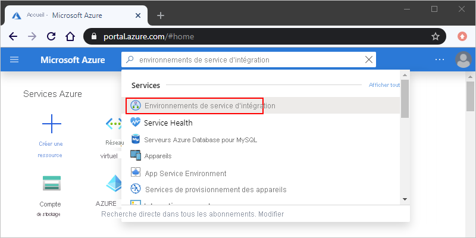
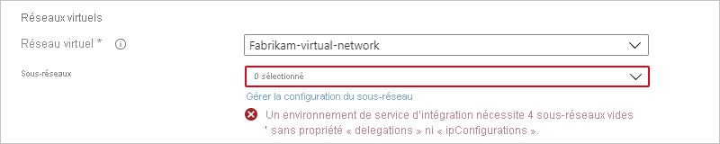
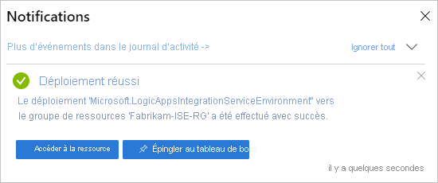

# Connexion à des réseaux virtuels Azure à partir d’Azure Logic Apps à l'aide d'un environnement de service d’intégration (ISE)

Pour les scénarios où vos applications logiques et vos comptes d’intégration ont besoin d’accéder à un [réseau virtuel Azure](../virtual-network/virtual-networks-overview.md), créez un [*environnement de service d’intégration* (ISE)](../logic-apps/connect-virtual-network-vnet-isolated-environment-overview.md). Un ISE est un environnement dédié qui utilise un stockage dédié et d’autres ressources qui sont conservées séparément du service Logic Apps multilocataire « mondial ». Cette séparation réduit également l’impact que d’autres locataires Azure peuvent avoir sur les performances de vos applications. Un environnement ISE vous fournit également vos propres adresses IP statiques. Ces adresses IP sont séparées des adresses IP statiques qui sont partagées par les applications logiques dans le service multilocataire public.

Quand vous créez un environnement ISE, Azure *l’injecte* dans votre réseau virtuel Azure, qui déploie ensuite le service Logic Apps dans votre réseau virtuel. Quand vous créez une application logique ou un compte d’intégration, sélectionnez votre environnement ISE comme emplacement. Votre application logique ou votre compte d’intégration peut ensuite accéder directement à des ressources, comme des machines virtuelles, des serveurs, des systèmes et des services, dans votre réseau virtuel.

> [!IMPORTANT]
> Pour que les applications logiques et les comptes d’intégration fonctionnent ensemble dans un environnement ISE, il faut que tous deux utilisent le *même ISE* que leur emplacement.

Un ISE dispose de limites accrues quant à la durée d’exécution, la conservation du stockage, le débit, le délai d’attente des requêtes et réponses HTTP, la taille des messages et les requêtes de connecteur personnalisé. Pour plus d’informations, consultez [Limites et configuration pour Azure Logic Apps](../logic-apps/logic-apps-limits-and-config.md). Pour en savoir plus sur les ISE, consultez [Accéder aux ressources Réseau virtuel Microsoft Azure à partir d’Azure Logic Apps](../logic-apps/connect-virtual-network-vnet-isolated-environment-overview.md).

Cet article explique comment effectuer ces tâches à l'aide du portail Azure :

* Activez l’accès pour votre ISE.
* Créez votre ISE.
* Ajoutez de la capacité supplémentaire à votre ISE.

Vous pouvez également créer un environnement ISE en utilisant l’[exemple de modèle de démarrage rapide Azure Resource Manager](https://github.com/Azure/azure-quickstart-templates/tree/master/201-integration-service-environment) ou à l’aide de l’API REST Logic Apps, notamment en configurant des clés gérées par le client :

* [Créer un environnement de service d'intégration (ISE) à l'aide de l'API REST Logic Apps](../logic-apps/create-integration-service-environment-rest-api.md)
* [Configurer des clés gérées par le client pour chiffrer les données au repos des environnements ISE](../logic-apps/customer-managed-keys-integration-service-environment.md)

## Prérequis

* Un compte et un abonnement Azure. Si vous n’avez pas d’abonnement Azure, [inscrivez-vous pour bénéficier d’un compte Azure gratuit](https://azure.microsoft.com/free/).

  > [!IMPORTANT]
  > Les applications logiques, les déclencheurs et actions intégrés et les connecteurs qui s’exécutent dans votre ISE utilisent un autre plan de tarification que celui basé sur la consommation. Pour plus d’informations sur la tarification et la facturation des environnements de service d’intégration, consultez le [modèle de tarif pour Logic Apps](../logic-apps/logic-apps-pricing.md#fixed-pricing). Pour connaître la tarification, consultez [Tarification Logic Apps](../logic-apps/logic-apps-pricing.md).

* Un [réseau virtuel Azure](../virtual-network/virtual-networks-overview.md). Votre réseau virtuel doit avoir quatre sous-réseaux *vides*, nécessaires à la création et au déploiement de ressources dans votre environnement ISE et utilisés par ces composants internes et masqués :

  * Logic Apps Compute
  * App Service Environment interne (connecteurs)
  * Gestion des API interne (connecteurs)
  * Redis interne pour la mise en cache et les performances
  
  Vous pouvez créer ces sous-réseaux à l’avance, ou vous pouvez attendre jusqu’à la création de votre ISE afin de créer les sous-réseaux en même temps. Toutefois, avant de créer vos sous-réseaux, examinez les [exigences relatives aux sous-réseaux](#create-subnet).

  > [!IMPORTANT]
  >
  > N’utilisez pas les espaces d’adressage IP suivants pour votre ou vos sous-réseaux virtuels, car ils ne peuvent pas être résolus par Azure Logic Apps :

  > 
  > * 0.0.0.0/8
  > * 100.64.0.0/10
  > * 127.0.0.0/8
  > * 168.63.129.16/32
  > * 169.254.169.254/32

  * Assurez-vous que votre réseau virtuel [permet d’accéder à votre ISE](#enable-access) afin que votre environnement ISE puisse fonctionner correctement et rester accessible.

  * Si vous utilisez ou souhaitez utiliser [ExpressRoute](../expressroute/expressroute-introduction.md) avec [tunneling forcé](../firewall/forced-tunneling.md), vous devez [créer une table de routage](../virtual-network/manage-route-table.md) avec l’itinéraire spécifique suivant et lier la table de routage à chaque sous-réseau utilisé par votre ISE :

    **Nom** : <*nom d’itinéraire*> 
    **Préfixe de l’adresse** : 0.0.0.0/0 
    **Tronçon suivant** : Internet
    
    Cette table de route est requise pour que les composants Logic Apps puissent communiquer avec d’autres services Azure dépendants, par exemple Stockage Azure et Azure SQL DB. Pour plus d’informations sur cet itinéraire, consultez [le préfixe d’adresse 0.0.0.0/0](../virtual-network/virtual-networks-udr-overview.md#default-route). Si vous n’utilisez pas le tunneling forcé avec ExpressRoute, vous n’avez pas besoin de cette table de routage spécifique.
    
    ExpressRoute vous permet d’étendre vos réseaux locaux au cloud de Microsoft et à vous connecter aux services de cloud computing Microsoft via une connexion privée assurée par le fournisseur de connectivité. Plus précisément, ExpressRoute est un réseau privé virtuel qui achemine le trafic sur un réseau privé plutôt que sur l’Internet public. Les applications logiques peuvent se connecter à des ressources locales qui se trouvent dans le même réseau virtuel lorsqu’elles se connectent via ExpressRoute ou un réseau privé virtuel.
   
  * Si vous utilisez une [appliance réseau virtuelle (Network Virtual Appliance)](../virtual-network/virtual-networks-udr-overview.md#user-defined), assurez-vous de ne pas activer l’arrêt TLS/SSL ni modifier le trafic TLS/SSL sortant. En outre, assurez-vous de ne pas activer l’inspection pour le trafic provenant du sous-réseau ISE. Pour plus d’informations, consultez [Routage du trafic de réseau virtuel](../virtual-network/virtual-networks-udr-overview.md).

  * Si vous souhaitez utiliser des serveurs DNS personnalisés pour votre réseau virtuel Azure, [configurez ces serveurs en suivant ces étapes](../virtual-network/virtual-networks-name-resolution-for-vms-and-role-instances.md) avant de déployer votre ISE sur votre réseau virtuel. Pour plus d'informations sur la gestion des paramètres d'un serveur DNS, consultez [Créer, modifier ou supprimer un réseau virtuel](../virtual-network/manage-virtual-network.md#change-dns-servers).

    > [!NOTE]
    > Si vous changez votre serveur DNS ou modifiez ses paramètres, vous devez redémarrer votre ISE afin qu’il prenne en compte ces modifications. Pour plus d’informations, consultez [Réinitialiser votre ISE](../logic-apps/ise-manage-integration-service-environment.md#restart-ISE).

## Activer l’accès pour ISE

Lorsque vous utilisez un ISE avec un réseau virtuel Azure, il arrive souvent qu'un ou plusieurs ports soient bloqués. Les connecteurs que vous utilisez pour créer les connexions entre votre ISE et les systèmes de destination peuvent également avoir leurs propres exigences en matière de port. Par exemple, si vous communiquez avec un système FTP en utilisant le connecteur FTP, le port que vous utilisez sur votre système FTP doit être disponible, comme le port 21 par exemple, pour l'envoi de commandes.

Pour vous assurer que votre environnement de service d’intégration est accessible et que ses applications logiques peuvent communiquer entre les sous-réseaux de votre réseau virtuel, [ouvrez les ports décrits dans ce tableau pour chaque sous-réseau](#network-ports-for-ise). Si certains des ports requis ne sont pas disponibles, votre ISE ne fonctionnera pas correctement.

* Si vous avez plusieurs instances d’ISE devant accéder à d’autres points de terminaison qui ont des restrictions d’adresse IP, déployez un [pare-feu Azure](../firewall/overview.md) ou une [appliance virtuelle réseau](../virtual-network/virtual-networks-overview.md#filter-network-traffic) dans votre réseau virtuel, et routez le trafic sortant via ce pare-feu ou cette appliance virtuelle réseau. Vous pouvez ensuite [configurer une adresse IP unique, sortante, publique, statique et prédictible](connect-virtual-network-vnet-set-up-single-ip-address.md) que toutes les instances de l’environnement ISE dans votre réseau virtuel peuvent utiliser pour communiquer avec les systèmes de destination. De cette façon, vous n’avez pas besoin de configurer des ouvertures de pare-feu supplémentaires sur ces systèmes de destination pour chaque environnement ISE.

   > [!NOTE]
   > Vous pouvez utiliser cette approche pour un environnement ISE unique lorsque votre scénario nécessite de limiter le nombre d’adresses IP qui ont besoin d’un accès. Déterminez si les coûts supplémentaires pour le pare-feu ou l’appliance de réseau virtuel ont un sens pour votre scénario. Découvrez plus en détail la [tarification du Pare-feu Azure](https://azure.microsoft.com/pricing/details/azure-firewall/).

* Si vous avez créé un réseau virtuel Azure et des sous-réseaux sans contraintes, vous n'avez pas besoin de configurer des [groupes de sécurité réseau](../virtual-network/security-overview.md#network-security-groups) dans votre réseau virtuel pour contrôler le trafic sur les sous-réseaux.

* Pour un réseau virtuel existant, vous pouvez *éventuellement* configurer des [groupes de sécurité réseau (NSG)](../virtual-network/security-overview.md#network-security-groups) en [filtrant le trafic entre sous-réseaux](../virtual-network/tutorial-filter-network-traffic.md). Si vous souhaitez accéder à cet itinéraire ou si vous utilisez déjà des NSG, veillez à [ouvrir les ports figurant dans ce tableau](#network-ports-for-ise) pour ces NSG.

  Quand vous configurez des [règles de sécurité NSG](../virtual-network/security-overview.md#security-rules), vous devez utiliser *simultanément* les protocoles **TCP** et **UDP**, ou vous pouvez sélectionner **Tous** pour ne pas avoir à créer de règles distinctes pour chaque protocole. Les règles de sécurité de groupe de sécurité réseau décrivent les ports que vous devez ouvrir pour les adresses IP qui doivent accéder à ces ports. Assurez-vous que tous les pare-feu, routeurs ou autres éléments existant entre ces points de terminaison gardent également ces ports accessibles à ces adresses IP.

* Si vous configurez le tunneling forcé via votre pare-feu pour rediriger le trafic Internet, passez en revue les [conditions requises pour le tunneling forcé supplémentaires](#forced-tunneling).

### Ports réseau utilisés par votre ISE

Ce tableau décrit les ports dont votre ISE a besoin pour être accessible et leur rôle. Pour vous faciliter la tâche lors de la configuration de règles de sécurité, le tableau utilise des [balises de service](../virtual-network/service-tags-overview.md) qui représentent les groupes de préfixes d’adresse IP d’un service Azure spécifique. Lorsque cela est mentionné, l’*ISE interne* et l’*ISE externe* font référence au [point de terminaison d’accès sélectionné lors de la création de l’ISE](connect-virtual-network-vnet-isolated-environment.md#create-environment). Pour plus d’informations, consultez l’article [Accès au point de terminaison](../logic-apps/connect-virtual-network-vnet-isolated-environment-overview.md#endpoint-access).

> [!IMPORTANT]
> Pour toutes les règles, veillez à définir les ports source sur `*`, car ils sont éphémères.

#### Règles de sécurité de trafic entrant

| Objectif | Balise de service ou adresses IP sources | Ports source | Balise de service ou adresses IP de destination | Ports de destination | Notes |
|---------|------------------------------------|--------------|-----------------------------------------|-------------------|-------|
| Communication interne aux sous-réseaux au sein du réseau virtuel | Espace d’adressage pour le réseau virtuel et les sous-réseaux ISE | * | Espace d’adressage pour le réseau virtuel et les sous-réseaux ISE | * | Nécessaire pour que le trafic circule *entre* les sous-réseaux de votre réseau virtuel. 

**Important !** Pour que le trafic circule entre les *composants* de chaque sous-réseau, veillez à ouvrir tous les ports de chaque sous-réseau. |
| Les deux : 
Communication vers votre application logique 

Historique des exécutions de l’application logique| ISE interne :  **VirtualNetwork** 

ISE externe : **Internet**, ou voir **Notes** | * | **VirtualNetwork** | 443 | Au lieu d’utiliser la balise de service **Internet**, vous pouvez spécifier l’adresse IP source pour les éléments suivants : 

– L’ordinateur ou le service appelant un déclencheur de requête ou un webhook quelconque dans votre application logique 
– L’ordinateur ou le service à partir duquel vous souhaitez accéder à l’historique des exécutions de l’application logique 

**Important !** Fermer ou bloquer ce port empêche les appels vers les applications logiques dotées de déclencheurs de requête ou de webhooks. Vous ne pouvez pas non plus accéder aux entrées et aux sorties pour chaque étape de l’historique des exécutions. Toutefois, cela ne vous empêche d’accéder à l’historique des exécutions de l’application logique.|
| Concepteur d’applications logiques – Propriétés dynamiques | **LogicAppsManagement** | * | **VirtualNetwork** | 454 | Les demandes proviennent des [adresses IP entrantes](../logic-apps/logic-apps-limits-and-config.md#inbound) du point de terminaison d’accès de Logic Apps pour cette région. |
| Déploiement du connecteur | **AzureConnectors** | * | **VirtualNetwork** | 454 | Nécessaire pour déployer et mettre à jour des connecteurs. La fermeture ou le blocage de ce port entraîne l’échec des déploiements de l’ISE et empêche les correctifs ou mises à jour du connecteur. |
| Vérification de l’intégrité du réseau | **LogicApps** | * | **VirtualNetwork** | 454 | Les demandes proviennent des [adresses IP entrantes](../logic-apps/logic-apps-limits-and-config.md#inbound) et des [adresses IP sortantes](../logic-apps/logic-apps-limits-and-config.md#outbound) du point de terminaison d’accès de Logic Apps pour cette région. |
| Dépendance de gestion App Service | **AppServiceManagement** | * | **VirtualNetwork** | 454, 455 ||
| Communication à partir d’Azure Traffic Manager | **AzureTrafficManager** | * | **VirtualNetwork** | ISE interne : 454 

ISE externe : 443 ||
| Les deux : 
Déploiement de la stratégie de connecteur 
Gestion des API - Point de terminaison de gestion | **APIManagement** | * | **VirtualNetwork** | 3443 | Pour le déploiement de la stratégie de connecteur, l’accès au port est nécessaire pour déployer et mettre à jour les connecteurs. La fermeture ou le blocage de ce port entraîne l’échec des déploiements de l’ISE et empêche les correctifs ou mises à jour du connecteur. |
| Accès aux instances du Cache Azure pour Redis entre instances de rôle | **VirtualNetwork** | * | **VirtualNetwork** | 6379 à 6383, et voir **Notes**| Pour qu’ISE fonctionne avec Azure Cache pour Redis, vous devez ouvrir les [ports entrants et sortants décrits dans le FAQ sur Azure Cache pour Redis](../azure-cache-for-redis/cache-how-to-premium-vnet.md#outbound-port-requirements). |
|||||||

#### Règles de sécurité de trafic entrant

| Objectif | Balise de service ou adresses IP sources | Ports source | Balise de service ou adresses IP de destination | Ports de destination | Notes |
|---------|------------------------------------|--------------|-----------------------------------------|-------------------|-------|
| Communication interne aux sous-réseaux au sein du réseau virtuel | Espace d’adressage pour le réseau virtuel et les sous-réseaux ISE | * | Espace d’adressage pour le réseau virtuel et les sous-réseaux ISE | * | Nécessaire pour que le trafic circule *entre* les sous-réseaux de votre réseau virtuel. 

**Important !** Pour que le trafic circule entre les *composants* de chaque sous-réseau, veillez à ouvrir tous les ports de chaque sous-réseau. |
| Communication depuis votre application logique | **VirtualNetwork** | * | Varie selon la destination | 80, 443 | La destination varie en fonction des points de terminaison du service externe avec lesquels votre application logique doit communiquer. |
| Azure Active Directory | **VirtualNetwork** | * | **AzureActiveDirectory** | 80, 443 ||
| Dépendance du Stockage Azure | **VirtualNetwork** | * | **Stockage** | 80, 443, 445 ||
| Gestion des connexions | **VirtualNetwork** | * | **AppService** | 443 ||
| Publication de journaux de diagnostic et de métriques | **VirtualNetwork** | * | **AzureMonitor** | 443 ||
| Dépendance Azure SQL | **VirtualNetwork** | * | **SQL** | 1433 ||
| Azure Resource Health | **VirtualNetwork** | * | **AzureMonitor** | 1886 | Nécessaire pour publier l’état d’intégrité sur Resource Health. |
| Dépendance du journal pour la stratégie Event Hub et l’agent de surveillance | **VirtualNetwork** | * | **EventHub** | 5672 ||
| Accès aux instances du Cache Azure pour Redis entre instances de rôle | **VirtualNetwork** | * | **VirtualNetwork** | 6379 à 6383, et voir **Notes**| Pour qu’ISE fonctionne avec Azure Cache pour Redis, vous devez ouvrir les [ports entrants et sortants décrits dans le FAQ sur Azure Cache pour Redis](../azure-cache-for-redis/cache-how-to-premium-vnet.md#outbound-port-requirements). |
| Résolution de noms DNS | **VirtualNetwork** | * | Adresses IP des serveurs DNS (Domain Name System) personnalisés de votre réseau virtuel | 53 | Obligatoire uniquement lorsque vous utilisez des serveurs DNS personnalisés sur votre réseau virtuel |
|||||||

En outre, vous devez ajouter des règles de trafic sortant pour [App Service Environment (ASE)](../app-service/environment/intro.md) :

* Si vous utilisez le Pare-feu Azure, vous devez configurer votre pare-feu avec la [balise de nom de domaine complet (FQDN)](../firewall/fqdn-tags.md#current-fqdn-tags) App Service Environment (ASE), qui autorise l’accès sortant au trafic de la plateforme ASE.

* Si vous utilisez une appliance de Pare-feu autre que le pare-feu Azure, vous devez configurer votre pare-feu avec *toutes* les règles répertoriées dans les [dépendances d’intégration de pare-feu](../app-service/environment/firewall-integration.md#dependencies) requises pour App Service Environment.

#### Conditions requises pour le tunneling forcé

Si vous configurez ou utilisez un [tunneling forcé](../firewall/forced-tunneling.md) via votre pare-feu, vous devez autoriser des dépendances externes supplémentaires pour votre environnement ISE. Un tunneling forcé vous permet de rediriger le trafic Internet vers un tronçon suivant désigné, tel que votre réseau privé virtuel (VPN) ou vers une appliance virtuelle, plutôt que vers Internet afin que vous puissiez inspecter et auditer le trafic réseau sortant.

En règle générale, tout le trafic de dépendance sortant ISE transite par l’adresse IP virtuelle (VIP) approvisionnée avec votre environnement ISE. Toutefois, si vous modifiez le routage du trafic vers ou à partir de votre environnement ISE, vous devez autoriser les dépendances sortantes suivantes sur votre pare-feu en définissant leur tronçon suivant sur `Internet`. Si vous utilisez le Pare-feu Azure, suivez les [instructions pour configurer votre pare-feu avec App Service Environment](../app-service/environment/firewall-integration.md#configuring-azure-firewall-with-your-ase).

Si vous n’autorisez pas l’accès à ces dépendances, votre déploiement ISE échoue et votre environnement ISE déployé cesse de fonctionner :

* [Adresses de gestion App Service Environment](../app-service/environment/management-addresses.md)

* [Adresses de gestion des API Azure](../api-management/api-management-using-with-vnet.md#control-plane-ips)

* [Adresses de gestion d’Azure Traffic Manager](https://azuretrafficmanagerdata.blob.core.windows.net/probes/azure/probe-ip-ranges.json)

* [Adresses entrantes et sortantes Logic Apps pour la région ISE](../logic-apps/logic-apps-limits-and-config.md#firewall-configuration-ip-addresses-and-service-tags)

* Vous devez activer des points de terminaison de service pour Azure SQL, le Stockage Azure, Service Bus et Event Hub, car vous ne pouvez pas envoyer de trafic via un pare-feu à ces services.

## Créer votre environnement de service d’intégration

1. Dans la zone de recherche principale du [portail Azure](https://portal.azure.com), entrez `integration service environments` comme filtre, puis sélectionnez **Environnements de service d’intégration**.

   

1. Dans le volet **Environnements de service d’intégration**, sélectionnez **Ajouter**.

   

1. Spécifiez ces informations pour votre environnement, puis sélectionnez **Vérifier + créer**, par exemple :

   

   | Propriété | Obligatoire | Valeur | Description |
   |----------|----------|-------|-------------|
   | **Abonnement** | Oui | <*Azure-subscription-name*> | Abonnement Azure à utiliser pour votre environnement |
   | **Groupe de ressources** | Oui | <*nom-groupe-de-ressources-Azure*> | Groupe de ressources Azure nouveau ou existant dans lequel vous voulez créer votre environnement |
   | **Nom de l’environnement de service d’intégration** | Oui | <*nom-environnement*> | Votre nom ISE, qui peut contenir uniquement des lettres, des chiffres, des traits d’union (`-`), des traits de soulignement (`_`) et des points (`.`). |
   | **Lieu** | Oui | <*région-centre de données-Azure*> | Région du centre de données Azure où déployer votre environnement |
   | **Référence (SKU)** | Oui | **Premium** ou **Développeur (aucun contrat SLA)** | Référence SKU d’ISE à créer et à utiliser. Pour connaître les différences entre ces références SKU, consultez [Références SKU d’ISE](../logic-apps/connect-virtual-network-vnet-isolated-environment-overview.md#ise-level). 

**Important !** Cette option est disponible uniquement lors de la création de votre ISE et ne peut pas être modifiée ultérieurement. |
   | **Capacité supplémentaire** | Premium :  Oui 

Développeur :  Non applicable | Premium :  0 à 10 

Développeur :  Non applicable | Le nombre d’unités de traitement supplémentaires à utiliser pour cette ressource ISE. Pour ajouter de la capacité après création, consultez [Ajouter de la capacité à l’ISE](../logic-apps/ise-manage-integration-service-environment.md#add-capacity). |
   | **Point de terminaison de l'accès** | Oui | **Interne** ou **externe** | Type de points de terminaison d’accès à utiliser pour votre environnement ISE. Ces points de terminaison déterminent si les déclencheurs de demande ou de webhook sur les applications logiques dans votre ISE peuvent recevoir des appels en dehors de votre réseau virtuel. 

Votre sélection affecte également la façon dont vous pouvez afficher les entrées et les sorties, ainsi qu’y accéder dans l’historique des exécutions de votre application logique. Pour plus d’informations, consultez [Accès aux points de terminaison de l’environnement ISE](../logic-apps/connect-virtual-network-vnet-isolated-environment-overview.md#endpoint-access). 

**Important !** Vous pouvez sélectionner le point de terminaison d’accès uniquement lors de la création de l’ISE et ne pouvez pas modifier cette option ultérieurement. |
   | **Réseau virtuel** | Oui | <*Azure-virtual-network-name*> | Réseau virtuel Azure où vous voulez injecter votre environnement, pour que les applications logiques de cet environnement puissent accéder à votre réseau virtuel. Si vous n’avez pas de réseau, [créez d’abord un réseau virtuel Azure](../virtual-network/quick-create-portal.md). 

**Important !** Vous pouvez effectuer cette injection *seulement*  quand vous créez votre ISE. |
   | **Sous-réseaux** | Oui | <*subnet-resource-list*> | Un ISE requiert quatre sous-réseaux *vides*, qui sont nécessaires pour créer et déployer des ressources dans votre ISE et qui sont utilisés par les composants internes de Logic Apps, tels que les connecteurs et la mise en cache pour les performances. 
**Important !** Veillez à [examiner les exigences relatives aux sous-réseaux avant de passer à la création de vos sous-réseaux](#create-subnet). |
   |||||

   

   **Créer des sous-réseaux**

   Votre ISE a besoin de quatre sous-réseaux *vides*, qui sont nécessaires pour créer et déployer des ressources dans votre ISE et qui sont utilisés par les composants internes de Logic Apps, tels que les connecteurs et la mise en cache pour les performances. Vous *ne pouvez pas changer* ces adresses de sous-réseaux après avoir créé votre environnement. Si vous créez et déployez votre ISE par le biais du portail Azure, assurez-vous de ne pas déléguer ces sous-réseaux à des services Azure. Toutefois, si vous créez et déployez votre ISE par le biais de l’API REST, d’Azure PowerShell ou d’un modèle Resource Manager, vous devez [déléguer](../virtual-network/manage-subnet-delegation.md) un sous-réseau vide à `Microsoft.integrationServiceEnvironment`. Pour plus d’informations, consultez [Ajouter une délégation de sous-réseau](../virtual-network/manage-subnet-delegation.md).

   Chaque sous-réseau doit répondre aux exigences suivantes :

   * Utilise un nom qui commence par un caractère alphabétique ou par un trait de soulignement (aucun chiffre), et n’utilise pas ces caractères : `<`, `>`, `%`, `&`, `\\`, `?`, `/`.

   * Il utilise le format [CIDR (Classless Inter-Domain Routing)](https://en.wikipedia.org/wiki/Classless_Inter-Domain_Routing) et un espace d’adressage de Classe B.
   
     > [!IMPORTANT]
     >
     > N’utilisez pas les espaces d’adressage IP suivants pour votre ou vos sous-réseaux virtuels, car ils ne peuvent pas être résolus par Azure Logic Apps :

     > 
     > * 0.0.0.0/8
     > * 100.64.0.0/10
     > * 127.0.0.0/8
     > * 168.63.129.16/32
     > * 169.254.169.254/32

   * Utilise un `/27` dans l’espace d’adressage, car chaque sous-réseau nécessite 32 adresses. Par exemple, `10.0.0.0/27` a 32 adresses car 2(32-27) est égal à 25 soit 32. Un plus grand nombre d’adresses n’apporte pas d’avantage supplémentaire. Pour en savoir plus sur le calcul des adresses, consultez [Blocs CIDR IPv4](https://en.wikipedia.org/wiki/Classless_Inter-Domain_Routing#IPv4_CIDR_blocks).

   * Si vous utilisez [ExpressRoute](../expressroute/expressroute-introduction.md), vous devez [créer une table de route](../virtual-network/manage-route-table.md) comportant l'itinéraire suivant, et lier cette table à chaque sous-réseau utilisé par votre ISE :

     **Nom** : <*nom d’itinéraire*> 
     **Préfixe de l’adresse** : 0.0.0.0/0 
     **Tronçon suivant** : Internet

   1. Dans la liste **Sous-réseaux**, sélectionnez **Gérer la configuration du sous-réseau**.

      

   1. Dans le volet **Sous-réseaux**, sélectionnez **Sous-réseau**.

      

   1. Dans le volet **Ajouter un sous-réseau**, spécifiez ces informations.

      * **Name** : Nom de votre sous-réseau
      * **Plage d’adresses (bloc CIDR)** : Plage de votre sous-réseau dans votre réseau virtuel, au format CIDR

      

   1. Quand vous avez terminé, sélectionnez **OK**.

   1. Répétez ces étapes pour trois autres sous-réseaux.

      > [!NOTE]
      > Si les sous-réseaux que vous tentez de créer ne sont pas valides, le portail Azure affiche un message mais ne bloque pas votre progression.

   Pour plus d’informations sur la création de sous-réseaux, consultez [Ajouter un sous-réseau à un réseau virtuel](../virtual-network/virtual-network-manage-subnet.md).

1. Une fois qu’Azure a validé les informations de votre environnement de service d’intégration, sélectionnez **Créer**, par exemple :

   

   Azure commence le déploiement de votre environnement, qui prend généralement moins de deux heures. Parfois, le déploiement peut prendre jusqu’à quatre heures. Pour vérifier l’état du déploiement, dans votre barre d’outils Azure, sélectionnez l’icône Notifications qui ouvre le volet Notifications.

   

   Un fois le déploiement terminé, Azure montre cette notification :

   

   Sinon, suivez les instructions du portail Azure pour la résolution des problèmes de déploiement.

   > [!NOTE]
   > Si le déploiement échoue ou si vous supprimez votre ISE, Azure peut prendre jusqu’à une heure, voire plus dans des cas rare, avant de libérer vos sous-réseaux. Par conséquent, vous devrez peut-être attendre avant de réutiliser ces sous-réseaux dans un autre ISE.
   >
   > Si vous supprimez votre réseau virtuel, Azure a généralement besoin de jusqu'à deux heures pour libérer vos sous-réseaux, mais cette opération peut prendre plus longtemps. 
   > Lors de la suppression de réseaux virtuels, assurez-vous qu’aucune ressource n’est restée connectée. 
   > Consultez [Supprimer un réseau virtuel](../virtual-network/manage-virtual-network.md#delete-a-virtual-network).

1. Pour voir votre environnement, si Azure n’y accède automatiquement une fois le déploiement terminé, sélectionnez **Accéder à la ressource**.

1. Pour vérifier l’intégrité du réseau de votre ISE, consultez [Gérer votre environnement de service d’intégration](../logic-apps/ise-manage-integration-service-environment.md#check-network-health).

1. Pour commencer à créer des applications logiques et d'autres artefacts dans votre ISE, consultez [Ajouter des ressources à des environnements de service d'intégration](../logic-apps/add-artifacts-integration-service-environment-ise.md).

   > [!IMPORTANT]
   > Les connecteurs ISE gérés qui deviennent disponibles une fois que vous avez créé votre ISE n’apparaissent pas automatiquement dans le sélecteur de connecteur du concepteur d’applications logiques. Avant de pouvoir utiliser ces connecteurs ISE, vous devez manuellement [ajouter ces connecteurs dans votre ISE](../logic-apps/add-artifacts-integration-service-environment-ise.md#add-ise-connectors-environment) afin qu’ils apparaissent dans le concepteur d’applications logiques.

## Étapes suivantes

* [Ajouter des ressources à des environnements de service d'intégration](../logic-apps/add-artifacts-integration-service-environment-ise.md)
* [Gérer les environnements de service d’intégration](../logic-apps/ise-manage-integration-service-environment.md#check-network-health)
* En apprendre davantage sur le [Réseau virtuel Azure](../virtual-network/virtual-networks-overview.md)
* Découvrir l’[Intégration d’un réseau virtuel pour les services Azure](../virtual-network/virtual-network-for-azure-services.md)
