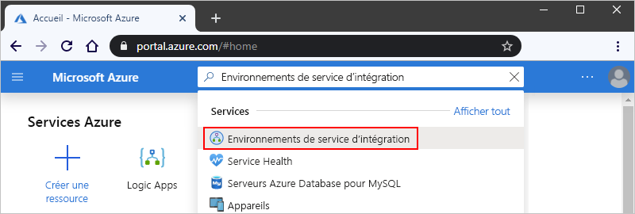
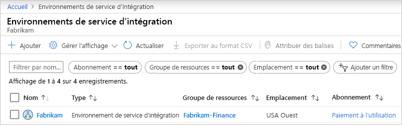
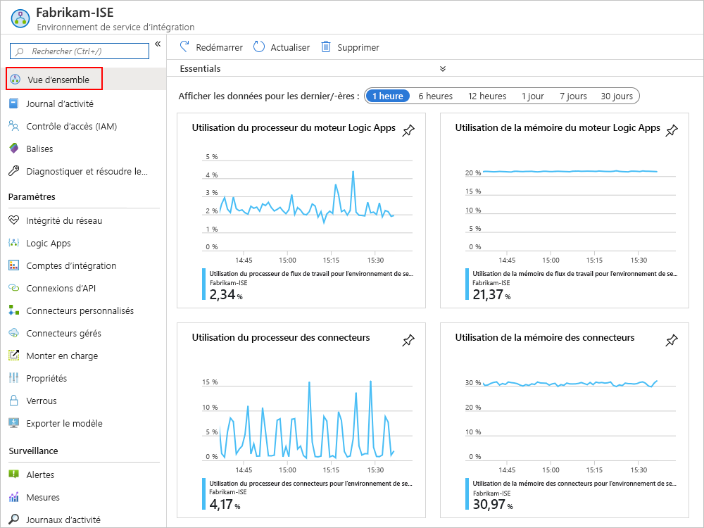
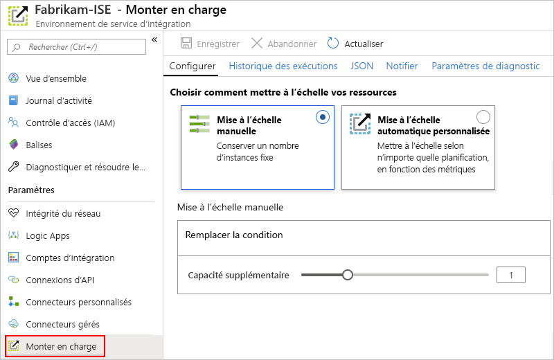
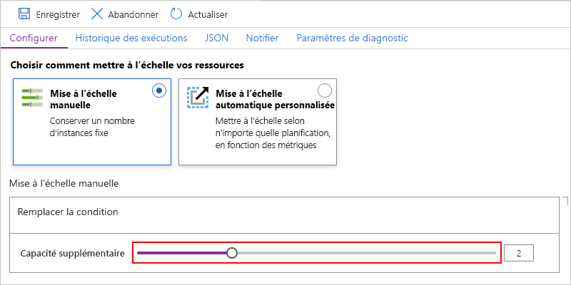
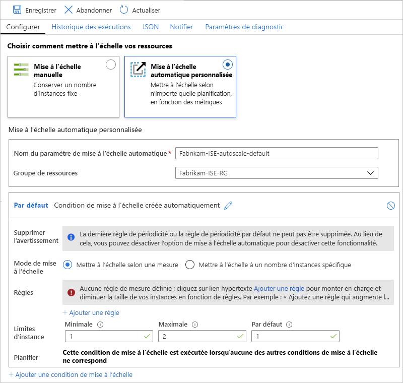

# Gérez votre environnement de service d’intégration dans Azure Logic Apps

Cet article explique comment effectuer des tâches de gestion pour votre [environnement de service d’intégration (ISE)](../logic-apps/connect-virtual-network-vnet-isolated-environment-overview.md), par exemple :

* gérer les ressources telles que les applications logiques, les connexions, les comptes d’intégration et les connecteurs dans votre ISE.
* Vérifier l’intégrité du réseau de votre ISE.
* Pour augmenter la capacité, redémarrer votre ISE, ou supprimer votre ISE, suivez les étapes de cette rubrique. Pour ajouter ces artefacts à votre environnement ISE, consultez [Ajouter des artefacts à votre environnement de service d’intégration](../logic-apps/add-artifacts-integration-service-environment-ise.md).

## Voir votre environnement ISE

1. Connectez-vous au [portail Azure](https://portal.azure.com).

1. Dans la zone de recherche du portail, entrez « environnements de service d’intégration », puis sélectionnez **Environnements de service d’intégration**.

   

1. Dans la liste des résultats, sélectionnez votre environnement de service d’intégration.

   

1. Passez aux sections suivantes pour rechercher des applications logiques, des connexions, des connecteurs ou des comptes d’intégration dans votre environnement ISE.

## Vérifier l’intégrité du réseau

Dans le menu de votre environnement ISE, sous **Paramètres**, sélectionnez **Intégrité du réseau**. Ce volet présente l’état d’intégrité de vos sous-réseaux et les dépendances sortantes par rapport à d’autres services.

## Gérer les applications logiques

Vous pouvez voir et gérer les applications logiques qui se trouvent dans votre environnement ISE.

1. Dans le menu de votre environnement ISE, sous **Paramètres**, sélectionnez **Applications logiques**.

   

1. Pour supprimer les applications logiques dont vous n’avez plus besoin dans votre environnement ISE, sélectionnez-les, puis sélectionnez **Supprimer**. Pour confirmer la suppression, sélectionnez **Oui**.

> [!NOTE]
> Si vous supprimez et recréez une application logique enfant, vous devez réenregistrer l’application logique parente. L’application enfant recréée aura des métadonnées différentes.
> Si vous ne réenregistrez pas l’application logique parente après avoir recréé son enfant, vos appels à l’application logique enfant échouent et une erreur de type « non autorisé » s’affiche. Ce comportement s’applique aux applications logiques parent-enfant, par exemple celles qui utilisent des artefacts dans les comptes d’intégration ou qui appellent des fonctions Azure.

## Gérer les connexions d’API

Vous pouvez afficher et gérer les connexions qui ont été créées par les applications logiques qui s’exécutent dans votre environnement ISE.

1. Dans le menu de votre environnement ISE, sous **Paramètres**, sélectionnez **Connexions d’API**.

   

1. Pour supprimer les connexions dont vous n’avez plus besoin dans votre environnement ISE, sélectionnez-les, puis sélectionnez **Supprimer**. Pour confirmer la suppression, sélectionnez **Oui**.

## Gérer les connecteurs ISE

Vous pouvez voir et gérer les connecteurs d’API qui sont déployés dans votre environnement ISE.

1. Dans le menu de votre environnement ISE, sous **Paramètres**, sélectionnez **Connecteurs managés**.

   

1. Pour supprimer les connecteurs que vous ne souhaitez pas rendre disponibles dans votre environnement ISE, sélectionnez-les, puis sélectionnez **Supprimer**. Pour confirmer la suppression, sélectionnez **Oui**.

## Gérer les connecteurs personnalisés

Vous pouvez voir et gérer les connecteurs personnalisés que vous avez déployés dans votre environnement ISE.

1. Dans le menu de votre environnement ISE, sous **Paramètres**, sélectionnez **Connecteurs personnalisés**.

   

1. Pour supprimer les connecteurs personnalisés dont vous n’avez plus besoin dans votre environnement ISE, sélectionnez-les, puis sélectionnez **Supprimer**. Pour confirmer la suppression, sélectionnez **Oui**.

## Gérer les comptes d’intégration

1. Dans le menu de votre environnement ISE, sous **Paramètres**, sélectionnez **Comptes d’intégration**.

   

1. Pour supprimer des comptes d’intégration de votre environnement ISE quand vous n’en avez plus besoin, sélectionnez-les, puis sélectionnez **Supprimer**.

## Ajouter de la capacité à l’ISE

L’unité de base d’ISE Premium dispose d’une capacité fixe ; si vous avez besoin de davantage de débit, vous pouvez ajouter des unités d’échelle, pendant la création ou après. La référence SKU Développeur n’inclut pas la capacité à ajouter des unités d’échelle.

1. Dans le [portail Azure](https://portal.azure.com), accédez à votre ISE.

1. Pour consulter les mesures de performances et d’utilisation pour votre environnement de service d’intégration (ISE), sélectionnez **Vue d’ensemble** dans le menu de votre ISE.

   

1. Sous **Paramètres**, sélectionnez **Scale-out**. Dans le volet **configurer**, opérez une sélection parmi les options suivantes :

   * [**Mise à l’échelle manuelle**](#manual-scale) : Mettez à l’échelle en fonction du nombre d’unités de traitement que vous voulez utiliser.
   * [**Mise à l’échelle automatique personnalisée**](#custom-autoscale) : Mettez à l’échelle en fonction des métriques de performances en opérant une sélection parmi différents critères et en spécifiant des conditions de seuil pour remplir ceux-ci.

   

### Mise à l’échelle manuelle

1. Après avoir sélectionné **Mise à l’échelle manuelle**, pour **Capacité supplémentaire**, sélectionnez le nombre d’unités d’échelle que vous souhaitez utiliser.

   

1. Quand vous avez terminé, sélectionnez **Enregistrer**.

### Mise à l’échelle automatique personnalisée

1. Après avoir sélectionné **Mise à l’échelle automatique personnalisée**, pour **Nom du paramètre de mise à l’échelle automatique**, entrez un nom pour votre paramètre et, le cas échéant, sélectionnez le groupe de ressources Azure auquel le paramètre appartient.

   

1. Pour la condition **Par défaut**, sélectionnez soit **Mettre à l’échelle selon une métrique** soit **Mettre à l’échelle d’un nombre d’instances spécifique**.

   * Si vous choisissez la mise à l’échelle basée sur les instances, entrez un nombre d’unités de traitement, soit une valeur comprise entre 0 et 10.

   * Si vous choisissez la méthode basée sur les mesures, procédez comme suit :

     1. Dans la section **Règles**, sélectionnez **+Ajouter une règle**.

     1. Dans le volet **Règle de mise à l’échelle**, configurez vos critères et l’action à effectuer lorsque la règle se déclenche.

     1. Pour **Limites d’instance**, spécifiez les valeurs suivantes :

        * **Minimale** : Nombre minimal d’unités de traitement à utiliser
        * **Maximum** : Nombre maximal d’unités de traitement à utiliser
        * **Par défaut** : Si des problèmes surviennent lors de la lecture des métriques de ressources et que la capacité actuelle est inférieure à la capacité par défaut, la mise à l’échelle automatique augmente le nombre par défaut d’unités de traitement. En revanche, si la capacité actuelle dépasse la capacité par défaut, la mise à l’échelle automatique n’effectue pas de scale-in.

1. Pour ajouter une autre condition, sélectionnez **Ajouter une condition de mise à l’échelle**.

1. Lorsque vous avez terminé de configurer vos paramètres de mise à l’échelle, enregistrez vos modifications.

## Redémarrer l’ISE

Si vous changez votre serveur DNS ou modifiez ses paramètres, vous devez redémarrer votre ISE afin qu’il prenne en compte ces modifications. Le redémarrage d’un ISE de référence SKU Premium ne provoque pas de temps d’arrêt en raison de la redondance et des composants qui redémarrent un par un pendant le recyclage. En revanche, un ISE de référence SKU Développeur connaît un temps d’arrêt, car il n’existe aucune redondance. Pour plus d’informations, consultez [Références SKU d’ISE](../logic-apps/connect-virtual-network-vnet-isolated-environment-overview.md#ise-level).

1. Dans le [portail Azure](https://portal.azure.com), accédez à votre ISE.

1. Dans le menu ISE, sélectionnez **Vue d’ensemble**. Dans la barre d’outils Vue d’ensemble, sélectionnez **Redémarrer**.

   

## Supprimer un environnement ISE

Avant de supprimer un environnement ISE dont vous n’avez plus besoin ou un groupe de ressources Azure qui contient un environnement ISE, vérifiez que vous n’avez pas de stratégies ni de verrous sur le groupe de ressources Azure qui contient ces ressources ou sur votre réseau virtuel Azure, car ces éléments peuvent bloquer la suppression.

Après avoir supprimé votre environnement ISE, vous devrez peut-être attendre jusqu’à 9 heures avant de tenter de supprimer votre réseau virtuel Azure ou vos sous-réseaux.

## Étapes suivantes

* [Ajouter des ressources à des environnements de service d'intégration](../logic-apps/add-artifacts-integration-service-environment-ise.md)