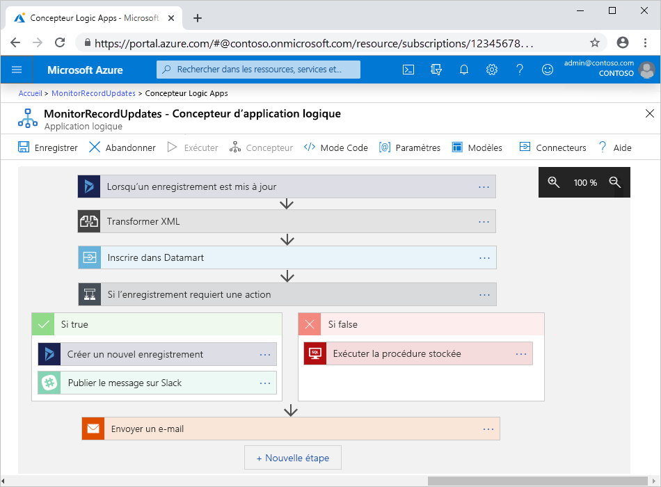

# Qu’est-ce qu’Azure Logic Apps

[Logic Apps](https://azure.microsoft.com/services/logic-apps) est une plateforme cloud qui vous permet de créer et d’exécuter des [workflows](#logic-app-concepts) automatisés pour intégrer des applications, des données, des services et des systèmes. Avec cette plateforme, vous pouvez créer plus facilement et rapidement des solutions d’intégration hautement scalables pour les scénarios d’entreprise et B2B (Business to business). En tant que membre d’[Azure Integration Services](https://azure.microsoft.com/product-categories/integration/), Logic Apps vous offre un moyen plus simple de connecter des systèmes existants, modernes et de pointe dans le cloud, localement et dans des environnements hybrides.

Cette liste décrit simplement quelques exemples de tâches, de processus métier et de charges de travail que vous pouvez automatiser avec le service Logic Apps :

* Planifier et envoyer des notifications par e-mail avec Office 365 quand un événement spécifique se produit, tel que le chargement d’un nouveau fichier.
* Router et traiter les commandes client sur l’ensemble des systèmes locaux et des services cloud.
* Déplacer des fichiers chargés depuis un serveur SFTP ou FTP vers Stockage Azure.
* Superviser des tweets, analyser les sentiments et créer des alertes ou des tâches pour des éléments à passer en revue.

> [!VIDEO https://channel9.msdn.com/Blogs/Azure/Introducing-Azure-Logic-Apps/player]

Pour accéder en toute sécurité aux opérations et les exécuter en temps réel sur différentes sources de données, faites votre choix dans une [galerie en constante évolution](/connectors/connector-reference/connector-reference-logicapps-connectors) de [connecteurs gérés par Microsoft](#logic-app-concepts), par exemple :

* Des services Azure tels que le Stockage Blob et Service Bus
* Des services Office tels qu’Outlook, Excel et SharePoint
* Des serveurs de base de données tels que SQL et Oracle
* Des systèmes d’entreprise tels que SAP et IBM MQ
* Des partages de fichiers tels que FTP et SFTP

Pour communiquer avec un point de terminaison de service quelconque, exécuter votre propre code, organiser votre workflow ou manipuler des données, vous pouvez utiliser des [déclencheurs et des actions intégrés](#logic-app-concepts) qui s’exécutent en mode natif dans le service Logic Apps. Par exemple, les déclencheurs intégrés incluent Request, HTTP et Recurrence. Les actions intégrées incluent Condition, For each, Exécuter du code JavaScript et des opérations qui appellent des fonctions Azure, des applications web ou des applications API hébergées dans Azure, ainsi que d’autres workflows Logic Apps.

Pour les scénarios d’intégration B2B, Logic Apps intègre les fonctionnalités de [BizTalk Server](/biztalk/core/introducing-biztalk-server). Vous pouvez créer un [compte d’intégration](logic-apps-enterprise-integration-create-integration-account.md) dans lequel vous définissez des partenaires commerciaux, des contrats, des schémas, des mappages et d’autres artefacts B2B. Quand vous liez ce compte à une application logique, vous pouvez créer des workflows qui fonctionnent avec ces artefacts et échangent des messages à l’aide de protocoles tels qu’AS2, EDIFACT, X12 et RosettaNet.

Pour plus d’informations sur la façon dont les workflows peuvent accéder aux applications, aux données, aux services et aux systèmes et les utiliser, consultez la documentation suivante :

* [Connecteurs pour Azure Logic Apps](../connectors/apis-list.md)
* [Connecteurs managés pour Azure Logic Apps](../connectors/built-in.md)
* [Déclencheurs et actions intégrés pour Azure Logic Apps](../connectors/managed.md)
* [Solutions d’intégration d’entreprise B2B avec Azure Logic Apps](logic-apps-enterprise-integration-overview.md)

## Termes clés

* **Workflow** : série d’étapes définissant une tâche ou un processus, commençant par un déclencheur individuel, suivi d’une ou de plusieurs actions.

* **Déclencheur** : première étape au début de chaque workflow, qui spécifie la condition à respecter avant d’exécuter les actions figurant dans le workflow. Par exemple, un événement déclencheur peut être de recevoir un e-mail dans votre boîte de réception ou de détecter un nouveau fichier dans un compte de stockage.

* **Action** : chaque étape qui suit le déclencheur et exécute une opération dans un workflow.

* **Connecteur managé** : API REST gérée par Microsoft qui fournit l’accès à une application, des données, un service ou un système spécifiques. Avant de pouvoir les utiliser, la plupart des connecteurs managés vous demandent d’abord de créer une connexion à partir de votre workflow et d’authentifier votre identité.

  Par exemple, vous pouvez démarrer un workflow à l’aide d’un déclencheur ou inclure une action qui fonctionne avec le Stockage Blob Azure, Office 365, Salesforce ou les serveurs SFTP. Pour plus d’informations, passez en revue [Connecteurs managés pour Azure Logic Apps](../connectors/managed.md).

* **Déclencheur ou action intégré** : opération Logic apps exécutée en mode natif qui fournit un moyen de contrôler la planification ou la structure de votre workflow, d’exécuter votre propre code, de gérer ou de manipuler des données ou d’effectuer d’autres tâches dans votre workflow. La plupart des opérations intégrées ne sont associées à aucun service ni système. Beaucoup ne vous obligent pas non plus à créer d’abord une connexion à partir de votre workflow ni à authentifier votre identité. Des opérations intégrées sont également disponibles pour quelques services, systèmes et protocoles, tels qu’Azure Functions, Gestion des API Azure, Azure App Service, etc.

  Par exemple, vous pouvez démarrer presque n’importe quel workflow selon une planification en utilisant le déclencheur Recurrence. Vous pouvez aussi faire en sorte que votre workflow attende jusqu’à ce qu’il soit appelé quand vous utilisez le déclencheur Request. Pour plus d’informations, consultez [Déclencheurs et actions intégrés pour Azure Logic Apps](../connectors/built-in.md).

* **Application logique** : ressource Azure à créer pour générer un workflow. En fonction des besoins de votre scénario et des exigences de la solution, vous pouvez créer des applications logiques qui s’exécutent dans l’environnement de service Logic Apps multilocataire ou monolocataire ou qui s’exécutent dans un environnement de service d’intégration. Pour plus d’informations, consultez [Environnements hôtes pour Logic Apps](#host-environments).

## Comment fonctionnent les applications logiques

Dans une application logique, chaque workflow démarre avec un [déclencheur](#logic-app-concepts) individuel. Un déclencheur se déclenche quand une condition est satisfaite, par exemple quand un événement spécifique se produit ou quand les données répondent à des critères spécifiques. De nombreux déclencheurs incluent des [fonctionnalités de planification](../logic-apps/concepts-schedule-automated-recurring-tasks-workflows.md) qui contrôlent la fréquence d’exécution de votre workflow. Après le déclencheur, une ou plusieurs [actions](#logic-app-concepts) exécutent des opérations. Par exemple, elles traitent, gèrent ou convertissent des données qui transitent par le workflow ou qui font passer le workflow à l’étape suivante.

Par exemple, le workflow suivant commence avec un déclencheur Dynamics qui a une condition intégrée nommée **Lorsqu’un enregistrement est mis à jour**. Les actions incluent la transformation de données XML, l’appel d’une application web de mise à jour des données, l’évaluation d’une condition qui contrôle les actions à entreprendre et l’envoi d’un e-mail de notification avec les résultats. Lorsque le déclencheur détecte un événement qui répond à la condition, le déclencheur se déclenche et les actions figurant dans le workflow commencent à s’exécuter. Chaque fois que le déclencheur se déclenche, le service Logic Apps crée une instance de workflow qui exécute ces actions.

Vous pouvez créer visuellement des workflows avec le concepteur d’applications logiques dans le portail Azure, dans Visual Studio Code ou dans Visual Studio. Chaque workflow a également une définition sous-jacente qui est décrite à l’aide de JSON (JavaScript Object Notation). Si vous préférez, vous pouvez modifier les workflows en changeant cette définition JSON. Pour certaines tâches de création et de gestion, Logic Apps fournit une prise en charge des commandes Azure PowerShell et Azure CLI. Pour un déploiement automatisé, Logic Apps prend en charge les modèles Azure Resource Manager.

## Environnements hôtes

En fonction de votre scénario et des exigences de votre solution, vous pouvez créer des applications logiques qui diffèrent selon l’environnement de service Logic Apps où elles s’exécutent et la façon dont les workflows utilisent les ressources. Le tableau suivant récapitule brièvement ces différences.

| Environnement | [Modèle de tarification](logic-apps-pricing.md) | Description |
|-------------|----------------------------------------|-------------|
| Azure Logic Apps (multilocataire) | Consommation | Une application logique ne peut avoir qu’un seul workflow. 

Les workflows de différentes applications logiques se trouvant dans *plusieurs locataires* partagent le même traitement (calcul), le même stockage, le même réseau, et ainsi de suite. |
| Azure Logic Apps ([monolocataire (préversion)](logic-apps-overview-preview.md)) | [Préversion](logic-apps-overview-preview.md#pricing-model) | Une application logique peut avoir plusieurs workflows. 

Les workflows de la *même application logique dans un seul locataire* partagent le même traitement (calcul), le même stockage, le même réseau, et ainsi de suite. |
| [Environnement de service d’intégration (ISE)](connect-virtual-network-vnet-isolated-environment-overview.md) | Fixe | Une application logique ne peut avoir qu’un seul workflow. 

Les workflows de différentes applications logiques qui se trouvent *dans le même environnement* partagent le même traitement (calcul), le même stockage, le même réseau, et ainsi de suite. |
||||

Les applications logiques hébergées dans des environnements de service Logic Apps ont également des limites différentes. Pour plus d’informations, consultez [Limites dans Logic Apps](logic-apps-limits-and-config.md) et [Limites dans Logic Apps (préversion)](logic-apps-overview-preview.md#limits).

## Pourquoi utiliser Logic Apps

La plateforme d’intégration Logic Apps fournit des opérations intégrées et des connecteurs d’API prédéfinis gérés par Microsoft qui vous permettent de connecter et d’intégrer des applications, des données, des services et des systèmes plus facilement et rapidement. Vous pouvez vous concentrer sur la conception et l’implémentation de la logique métier et des fonctionnalités de votre solution, et non sur la manière d’accéder à vos ressources.

En règle générale, vous n’avez pas à écrire de code. Toutefois, si vous avez besoin d’écrire du code, vous pouvez créer des extraits de code avec [Azure Functions](../azure-functions/functions-overview.md) et exécuter ce code à partir de votre workflow. Vous pouvez également créer des extraits de code qui s’exécutent dans votre workflow en utilisant l’[action **Code inline**](logic-apps-add-run-inline-code.md). Si votre workflow doit interagir avec des événements de services Azure, des applications personnalisées ou d’autres solutions, vous pouvez superviser, router et publier les événements avec [Azure Event Grid](../event-grid/overview.md).

Logic Apps est entièrement géré par Microsoft Azure, vous évitant d’avoir à vous soucier de l’hébergement, de la mise à l’échelle, de la gestion, de la supervision et du maintien des solutions créées avec ces services. Quand vous utilisez ces fonctionnalités pour créer des [solutions et des applications « serverless »](../logic-apps/logic-apps-serverless-overview.md), vous pouvez juste vous concentrer sur la logique métier et les fonctionnalités. Ces services sont automatiquement redimensionnés pour répondre à vos besoins, rendre les intégrations plus rapides et vous aider à créer des applications cloud fiables en utilisant peu ou pas de code.

Pour savoir comment d’autres sociétés ont amélioré leur flexibilité et la concentration sur leurs activités principales grâce à la combinaison de Logic Apps avec d’autres services Azure et des produits Microsoft, lisez ces [témoignages](https://aka.ms/logic-apps-customer-stories).

Les sections qui suivent fournissent des informations supplémentaires sur les fonctionnalités et les avantages offerts par Logic Apps :

#### Créer et modifier visuellement des workflows avec des outils faciles à utiliser

Gagnez du temps et simplifiez les processus complexes avec les outils de conception visuelle de Logic Apps. Créez vos workflows du début à la fin en utilisant le Concepteur d’applications logiques dans le portail Azure, dans Visual Studio Code ou dans Visual Studio. Démarrez simplement votre workflow à l’aide d’un déclencheur et ajoutez des actions de la [galerie des connecteurs](/connectors/connector-reference/connector-reference-logicapps-connectors).

Si vous créez une application logique multilocataire, démarrez plus rapidement en [créant un workflow à partir de la galerie de modèles](../logic-apps/logic-apps-create-logic-apps-from-templates.md). Ces modèles sont disponibles pour les modèles de workflow courants, qui vont de la connectivité simple pour les applications SaaS (Software as a service) aux solutions B2B avancées en passant par des modèles conçus pour s’amuser.

#### Connecter différents systèmes dans différents environnements

Certains modèles et processus sont faciles à décrire, mais difficiles à implémenter dans le code. La plateforme Logic Apps vous aide à connecter de façon fluide des systèmes disparates dans des environnements cloud, locaux et hybrides. Par exemple, vous pouvez connecter une solution marketing cloud à un système de facturation local, ou centraliser la messagerie entre les API et les systèmes avec Azure Service Bus. Logic Apps offre un moyen rapide, fiable et cohérent de fournir des solutions réutilisables et reconfigurables pour ces scénarios.

#### Écrire une seule fois pour réutiliser souvent

Créez vos applications logiques en tant que modèles Azure Resource Manager pour pouvoir [configurer et automatiser les déploiements](../logic-apps/logic-apps-azure-resource-manager-templates-overview.md) dans plusieurs environnements et régions.

#### Prise en charge de premier ordre de l’intégration en entreprise et des scénarios B2B

Les entreprises et les organisations communiquent électroniquement entre elles avec les protocoles et des formats de message standard mais différents, tels qu’EDIFACT, AS2, X12 et RosettaNet. En utilisant les [fonctionnalités d’intégration d’entreprise](../logic-apps/logic-apps-enterprise-integration-overview.md) prises en charge par Logic Apps, vous pouvez créer des workflows qui transforment des formats de message utilisés par des partenaires en formats que les systèmes de votre organisation peuvent interpréter et traiter. Logic Apps gère ces échanges en douceur et en sécurité avec le chiffrement et les signatures numériques.

Vous pouvez commencer par vos systèmes et services actuels, puis augmenter de façon incrémentielle à votre propre rythme. Quand vous êtes prêt, la plateforme Logic Apps vous aide à mettre en œuvre et à monter en puissance vers des scénarios d’intégration plus matures, grâce à ces fonctionnalités et bien plus encore :

* Intégrez et exploitez [Microsoft BizTalk Server](/biztalk/core/introducing-biztalk-server), [Azure Service Bus](../service-bus-messaging/service-bus-messaging-overview.md), [Azure Functions](../azure-functions/functions-overview.md), la [Gestion des API Azure](../api-management/api-management-key-concepts.md), et bien plus encore.
* Échangez des messages avec les protocoles [EDIFACT](../logic-apps/logic-apps-enterprise-integration-edifact.md), [AS2](../logic-apps/logic-apps-enterprise-integration-as2.md), [X12](../logic-apps/logic-apps-enterprise-integration-x12.md) et [RosettaNet](logic-apps-enterprise-integration-rosettanet.md).
* Traitez les [messages XML](../logic-apps/logic-apps-enterprise-integration-xml.md) et les [fichiers plats](../logic-apps/logic-apps-enterprise-integration-flatfile.md).
* Créez un [compte d’intégration](./logic-apps-enterprise-integration-create-integration-account.md) pour stocker et gérer les artefacts B2B, tels que les [partenaires](../logic-apps/logic-apps-enterprise-integration-partners.md), les [contrats](../logic-apps/logic-apps-enterprise-integration-agreements.md), les [mappages de transformation](../logic-apps/logic-apps-enterprise-integration-maps.md), les [schémas de validation](../logic-apps/logic-apps-enterprise-integration-schemas.md), etc.

Par exemple, si vous utilisez Microsoft BizTalk Server, vos workflows peuvent communiquer avec votre instance BizTalk Server en utilisant le [connecteur BizTalk Server](../connectors/managed.md#on-premises-connectors). Vous pouvez ensuite exécuter ou étendre des opérations de type BizTalk dans vos workflows en utilisant des [connecteurs de compte d’intégration](../connectors/managed.md#integration-account-connectors). Dans l’autre sens, BizTalk Server peut communiquer avec vos workflows en utilisant [Microsoft BizTalk Server Adapter pour Logic Apps](https://www.microsoft.com/download/details.aspx?id=54287). Découvrez comment [configurer et utiliser BizTalk Server Adapter](/biztalk/core/logic-app-adapter) dans votre instance BizTalk Server.

#### Extensibilité intégrée

Si aucun connecteur approprié n’est disponible pour exécuter le code que vous souhaitez, vous pouvez créer et appeler vos propres extraits de code à partir de votre workflow en utilisant [Azure Functions](../azure-functions/functions-overview.md). Vous pouvez aussi créer vos propres [API](../logic-apps/logic-apps-create-api-app.md) et [connecteurs personnalisés](../logic-apps/custom-connector-overview.md), que vous pouvez appeler à partir de vos workflows.

#### Accéder aux ressources situées dans les réseaux virtuels Azure

Les workflows d’application logique peuvent accéder à des ressources sécurisées, par exemple des machines virtuelles et d’autres systèmes ou services, dans un [réseau virtuel Azure](../virtual-network/virtual-networks-overview.md) quand vous créez un [*environnement ISE* (environnement de service d’intégration)](../logic-apps/connect-virtual-network-vnet-isolated-environment-overview.md). Un environnement ISE est une instance dédiée du service Logic Apps qui utilise des ressources dédiées et s’exécute séparément du service Logic Apps multilocataire mondial.

L’exécution d’applications logiques dans votre propre instance dédiée aide à réduire l’impact que d’autres locataires Azure peuvent avoir sur le niveau de performance des applications. Cet impact est également appelé [effet « voisins bruyants »](https://en.wikipedia.org/wiki/Cloud_computing_issues#Performance_interference_and_noisy_neighbors). Un ISE offre également les avantages suivants :

* Vous avez vos propres adresses IP statiques, qui sont distinctes des adresses IP statiques partagées par les applications logiques dans le service multilocataire. Vous pouvez également configurer une adresse IP sortante publique, statique et prévisible pour communiquer avec les systèmes de destination. De cette façon, vous n’avez pas besoin de configurer d’ouvertures de pare-feu supplémentaires sur ces systèmes de destination pour chaque environnement ISE.

* Des limites accrues quant à la durée d’exécution, la conservation du stockage, le débit, le délai d’attente des requêtes et réponses HTTP, la taille des messages et les requêtes de connecteur personnalisé. Pour plus d’informations, consultez [Limites et configuration pour Azure Logic Apps](../logic-apps/logic-apps-limits-and-config.md).

Quand vous créez un ISE, Azure l’*injecte* ou le déploie sur votre réseau virtuel Azure. Vous pouvez ensuite utiliser cet ISE comme emplacement pour les applications logiques et les comptes d’intégration qui ont besoin d’un accès. Pour plus d’informations sur la création d’un environnement ISE, consultez [Se connecter à des réseaux virtuels Azure à partir d’Azure Logic Apps](../logic-apps/connect-virtual-network-vnet-isolated-environment.md).

#### Options de tarification

Chaque type d’application logique, qui diffère par ses fonctionnalités et l’emplacement où elle s’exécute (application multilocataire, application monolocataire ou application dans un environnement de service d’intégration), a un [modèle de tarifs](../logic-apps/logic-apps-pricing.md) spécifique. Par exemple, les applications logiques multilocataires utilisent des tarifs basés sur la consommation, tandis que les applications logiques dans un environnement de service d’intégration utilisent des tarifs fixes. Découvrez-en plus sur [les tarifs et les mesures](../logic-apps/logic-apps-pricing.md) pour Logic Apps.

## En quoi Logic Apps diffère de Functions, WebJobs et Power Automate ?

Tous ces services vous aident à connecter et à réunir des systèmes disparates. Chaque service ayant des avantages, combiner leurs fonctionnalités est la meilleure façon de créer rapidement un système d’intégration évolutif et complet. Pour plus d’informations, consultez [Choisir entre Logic Apps, Functions, WebJobs et Power Automate](../azure-functions/functions-compare-logic-apps-ms-flow-webjobs.md).

## Bien démarrer

Avant de pouvoir démarrer avec Azure Logic Apps, vous avez besoin d’un abonnement Azure. Si vous n’avez pas encore d’abonnement, vous pouvez [vous inscrire pour obtenir un compte Azure gratuitement](https://azure.microsoft.com/free/). Sinon, essayez ce [guide de démarrage rapide pour créer votre première application logique](../logic-apps/quickstart-create-first-logic-app-workflow.md), qui supervise le nouveau contenu sur un site web via un flux RSS et envoie un e-mail quand un nouveau contenu apparaît.

## Autres ressources

Découvrez-en plus sur la plateforme Logic Apps avec ces vidéos d’introduction :

> [!VIDEO https://channel9.msdn.com/Shows/Azure-Friday/Go-serverless-Enterprise-integration-with-Azure-Logic-Apps/player]
>
> [!VIDEO https://channel9.msdn.com/Shows/Azure-Friday/Connect-and-extend-your-mainframe-to-the-cloud-with-Logic-Apps/player]

## Étapes suivantes

* [Démarrage rapide : Créer votre premier workflow d’application logique](../logic-apps/quickstart-create-first-logic-app-workflow.md)
* Découvrir [les solutions serverless avec Azure](../logic-apps/logic-apps-serverless-overview.md)
* Découvrir [l’intégration B2B avec Enterprise Integration Pack](../logic-apps/logic-apps-enterprise-integration-overview.md)
