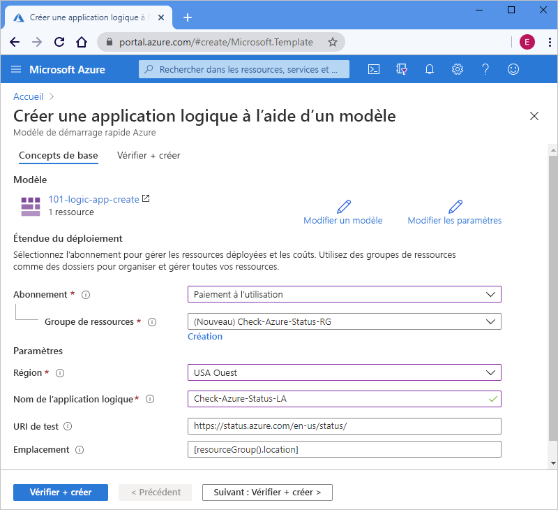

# <a name="quickstart-create-and-deploy-a-logic-app-workflow-by-using-an-arm-template"></a>Démarrage rapide : Créer et déployer un workflow d’application logique à l’aide d’un modèle Resource Manager

[Azure Logic Apps](../logic-apps/logic-apps-overview.md) est un service cloud qui vous permet de créer et d’exécuter des workflows automatisés qui intègrent des données, des applications, des services cloud et des systèmes locaux en choisissant parmi [des centaines de connecteurs](/connectors/connector-reference/connector-reference-logicapps-connectors). Ce guide de démarrage rapide se concentre sur le processus de déploiement d’un modèle Resource Manager (Azure Resource Manager) pour créer une application logique de base qui vérifie l’état d’Azure toutes les heures. 

[!INCLUDE [About Azure Resource Manager](../../includes/resource-manager-quickstart-introduction.md)]

Si votre environnement remplit les prérequis et que vous êtes déjà familiarisé avec l’utilisation des modèles ARM, sélectionnez le bouton **Déployer sur Azure**. Le modèle s’ouvre dans le portail Azure.

[](https://portal.azure.com/#create/Microsoft.Template/uri/https%3a%2f%2fraw.githubusercontent.com%2fAzure%2fazure-quickstart-templates%2fmaster%2f101-logic-app-create%2fazuredeploy.json)

## <a name="prerequisites"></a>Prérequis

Si vous n’avez pas d’abonnement Azure, créez un [compte Azure gratuit](https://azure.microsoft.com/free/?WT.mc_id=A261C142F) avant de commencer.

## <a name="review-the-template"></a>Vérifier le modèle

Ce guide de démarrage rapide utilise le modèle [**Créer une application logique**](https://azure.microsoft.com/resources/templates/101-logic-app-create/), que vous trouverez dans la [galerie des modèles de démarrage rapide Azure](https://azure.microsoft.com/resources/templates), trop longue pour être présentée ici. Passez plutôt en revue le [« fichier azuredeploy.json »](https://github.com/Azure/azure-quickstart-templates/blob/master/101-logic-app-create/azuredeploy.json) du modèle de démarrage rapide dans la galerie des modèles.

Ce modèle de démarrage rapide crée un workflow d’application logique qui utilise le déclencheur de périodicité, configuré pour s’exécuter toutes les heures, ainsi qu’une [action *intégrée*](../connectors/built-in.md) HTTP, qui appelle une URL qui retourne l’état d’Azure. Une action intégrée est native dans la plateforme Azure Logic Apps.

Ce modèle crée la ressource Azure suivante :

* [**Microsoft.Logic/workflows**](/azure/templates/microsoft.logic/workflows), qui crée le workflow d’une application logique.

Pour trouver d’autres modèles de démarrage rapide pour Azure Logic Apps, consultez les modèles [Microsoft.Logic](https://azure.microsoft.com/resources/templates/?resourceType=Microsoft.Logic) dans la galerie.

<a name="deploy-template"></a>

## <a name="deploy-the-template"></a>Déployer le modèle

Suivez l’option que vous voulez utiliser pour déployer le modèle de démarrage rapide :

| Option | Description |
|--------|-------------|
| [Azure portal](../logic-apps/quickstart-create-deploy-azure-resource-manager-template.md?tabs=azure-portal#deploy-template) | Si votre environnement Azure satisfait aux prérequis et que vous savez utiliser des modèles Resource Manager, ces étapes vous permettent de vous connecter directement à Azure et d’ouvrir le modèle de démarrage rapide dans le portail Azure. Pour plus d’informations, consultez [Déployer des ressources à l’aide de modèles Resource Manager et du portail Azure](../azure-resource-manager/templates/deploy-portal.md). |
| [Azure CLI](../logic-apps/quickstart-create-deploy-azure-resource-manager-template.md?tabs=azure-cli#deploy-template) | L’interface de ligne de commande Azure (Azure CLI) est un ensemble de commandes utilisées pour créer et gérer des ressources Azure. Pour exécuter ces commandes, vous avez besoin d’Azure CLI version 2.6 ou ultérieure. Pour vérifier votre version de CLI, tapez `az --version`. Pour plus d’informations, consultez les rubriques suivantes : <p><p>- [Qu’est-ce qu’Azure CLI ?](/cli/azure/what-is-azure-cli) <br>- [Bien démarrer avec Azure CLI](/cli/azure/get-started-with-azure-cli) |
| [Azure PowerShell](../logic-apps/quickstart-create-deploy-azure-resource-manager-template.md?tabs=azure-powershell#deploy-template) | Azure PowerShell fournit un ensemble de cmdlets qui utilisent le modèle Azure Resource Manager pour gérer vos ressources Azure. Pour plus d’informations, consultez les rubriques suivantes : <p><p>- [Vue d’ensemble d’Azure PowerShell](/powershell/azure/azurerm/overview) <br>- [Présentation du module Azure PowerShell Az](/powershell/azure/new-azureps-module-az) <br>- [Bien démarrer avec Azure PowerShell](/powershell/azure/get-started-azureps) |
| [API REST Gestion des ressources Azure](../logic-apps/quickstart-create-deploy-azure-resource-manager-template.md?tabs=rest-api#deploy-template) | Azure fournit des API REST (Representational State Transfer) qui sont des points de terminaison de service prenant en charge des opérations HTTP (méthodes) que vous utilisez pour créer, récupérer, mettre à jour ou supprimer l’accès à des ressources de service. Pour plus d’informations, consultez [Bien démarrer avec l’API REST Azure](/rest/api/azure/). |
|||

<a name="deploy-azure-portal"></a>

#### <a name="portal"></a>[Portail](#tab/azure-portal)

1. Sélectionnez l’image suivante pour vous connecter avec votre compte Azure et ouvrir le modèle de démarrage rapide dans le portail Azure :

   [](https://portal.azure.com/#create/Microsoft.Template/uri/https%3a%2f%2fraw.githubusercontent.com%2fAzure%2fazure-quickstart-templates%2fmaster%2f101-logic-app-create%2fazuredeploy.json)

1. Dans le portail, dans la page **Créer une application logique à l’aide d’un modèle**, entrez ou sélectionnez ces valeurs :

   | Propriété | Valeur | Description |
   |----------|-------|-------------|
   | **Abonnement** | <*Azure-subscription-name*> | Nom de l’abonnement Azure à utiliser. |
   | **Groupe de ressources** | <*nom-groupe-de-ressources-Azure*> | Nom d’un groupe de ressources Azure nouveau ou existant. Cet exemple utilise `Check-Azure-Status-RG`. |
   | **Région** | <*Azure-region*> | Région du centre de données Azure qui va utiliser votre application logique. Cet exemple utilise `West US`. |
   | **Nom de l’application logique** | <*logic-app-name*> | Nom à utiliser pour votre application logique. Cet exemple utilise `Check-Azure-Status-LA`. |
   | **URI de test** | <*test-URI*> | URI du service à appeler selon une planification spécifique. Cet exemple utilise `https://status.azure.com/en-us/status/`, qui correspond à la page d’état d’Azure. |
   | **Lieu** |  <*Azure-region-for-all-resources*> | Région Azure à utiliser pour toutes les ressources, si elle est différente de la valeur par défaut. Cet exemple utilise la valeur par défaut, `[resourceGroup().location]`, qui correspond à l’emplacement du groupe de ressources. |
   ||||

   Voici à quoi ressemble la page avec les valeurs utilisées dans cet exemple :

   

1. Quand vous avez terminé, sélectionnez **Vérifier + créer**.

1. Poursuivez avec les étapes décrites dans [Vérifier les ressources déployées](#review-deployed-resources).

#### <a name="cli"></a>[INTERFACE DE LIGNE DE COMMANDE](#tab/azure-cli)

```azurecli-interactive
read -p "Enter a project name name to use for generating resource names:" projectName &&
read -p "Enter the location, such as 'westus':" location &&
templateUri="https://raw.githubusercontent.com/Azure/azure-quickstart-templates/master/101-logic-app-create/azuredeploy.json" &&
resourceGroupName="${projectName}rg" &&
az group create --name $resourceGroupName --location "$location" &&
az deployment group create --resource-group $resourceGroupName --template-uri  $templateUri &&
echo "Press [ENTER] to continue ..." &&
read
```

Pour plus d’informations, consultez les rubriques suivantes :

* [Azure CLI : az deployment group](/cli/azure/deployment/group)
* [Déployer des ressources à l’aide de modèles Resource Manager et d’Azure CLI](../azure-resource-manager/templates/deploy-cli.md)

#### <a name="powershell"></a>[PowerShell](#tab/azure-powershell)

```azurepowershell-interactive
$projectName = Read-Host -Prompt "Enter a project name to use for generating resource names"
$location = Read-Host -Prompt "Enter the location, such as 'westus'"
$templateUri = "https://raw.githubusercontent.com/Azure/azure-quickstart-templates/master/101-logic-app-create/azuredeploy.json"

$resourceGroupName = "${projectName}rg"

New-AzResourceGroup -Name $resourceGroupName -Location "$location"
New-AzResourceGroupDeployment -ResourceGroupName $resourceGroupName -TemplateUri $templateUri

Read-Host -Prompt "Press [ENTER] to continue ..."
```

Pour plus d’informations, consultez les rubriques suivantes :

* [Azure PowerShell : New-AzResourceGroup](/powershell/module/az.resources/new-azresourcegroup)
* [Azure PowerShell : New-AzResourceGroupDeployment](/powershell/module/az.resources/new-azresourcegroupdeployment)
* [Déployer des ressources à l’aide de modèles Resource Manager et d’Azure PowerShell](../azure-resource-manager/templates/deploy-powershell.md)

#### <a name="rest-api"></a>[REST API](#tab/rest-api)

1. Si vous ne voulez pas utiliser un groupe de ressources Azure existant, créez-en un nouveau en suivant cette syntaxe pour la demande que vous envoyez à l’API REST Gestion des ressources :

   ```http
   PUT https://management.azure.com/subscriptions/{subscriptionId}/resourcegroups/{resourceGroupName}?api-version=2019-10-01
   ```

   | Valeur | Description |
   |-------|-------------|
   | `subscriptionId`| GUID de l’abonnement Azure à utiliser. |
   | `resourceGroupName` | Nom du groupe de ressources Azure à créer. Cet exemple utilise `Check-Azure-Status-RG`. |
   |||

   Par exemple :

   ```http
   PUT https://management.azure.com/subscriptions/xxxxXXXXxxxxXXXXX/resourcegroups/Check-Azure-Status-RG?api-version=2019-10-01
   ```

   Pour plus d’informations, consultez les rubriques suivantes :

   * [Informations de référence sur l’API REST Azure : guide pratique pour appeler des API REST Azure](/rest/api/azure/)
   * [API REST Gestion des ressources : Groupes de ressources : Créer ou mettre à jour](/rest/api/resources/resourcegroups/createorupdate).

1. Pour déployer le modèle de démarrage rapide sur votre groupe de ressources, suivez cette syntaxe pour la demande que vous envoyez à l’API REST Gestion des ressources :

   ```http
   PUT https://management.azure.com/subscriptions/{subscriptionId}/resourcegroups/{resourceGroupName}/providers/Microsoft.Resources/deployments/{deploymentName}?api-version=2019-10-01
   ```

   | Valeur | Description |
   |-------|-------------|
   | `subscriptionId`| GUID de l’abonnement Azure à utiliser. |
   | `resourceGroupName` | Nom du groupe de ressources Azure à utiliser. Cet exemple utilise `Check-Azure-Status-RG`. |
   | `deploymentName` | Nom à utiliser pour votre déploiement. Cet exemple utilise `Check-Azure-Status-LA`. |
   |||

   Par exemple :

   ```http
   PUT https://management.azure.com/subscriptions/xxxxXXXXxxxxXXXXX/resourcegroups/Check-Azure-Status-RG/providers/Microsoft.Resources/deployments/Check-Azure-Status-LA?api-version=2019-10-01
   ```

   Pour plus d’informations, consultez [API REST Gestion des ressources : Déploiements : Créer ou mettre à jour](/rest/api/resources/deployments/createorupdate).

1. Pour fournir les valeurs à utiliser pour le déploiement, comme la région Azure et les liens vers le modèle de démarrage rapide et le [fichier de paramètres](../azure-resource-manager/templates/template-parameters.md), qui contient les valeurs que le modèle de démarrage rapide va utiliser lors du déploiement, suivez cette syntaxe pour le corps de la demande que vous envoyez à l’API REST Gestion des ressources :

   ```json
   {
      "location": "{Azure-region}",
      "properties": {
         "templateLink": {
            "uri": "{quickstart-template-URL}",
            "contentVersion": "1.0.0.0"
         },
         "parametersLink": {
            "uri": "{quickstart-template-parameter-file-URL}",
            "contentVersion": "1.0.0.0"
         },
         "mode": "Incremental"
      }
   }
   ```

   | Propriété | Valeur | Description |
   |----------|-------|-------------|
   | `location`| <*Azure-region*> | Région Azure à utiliser pour le déploiement. Cet exemple utilise `West US`. |
   | `templateLink` : `uri` | <*quickstart-template-URL*> | Emplacement de l’URL du modèle de démarrage rapide à utiliser pour le déploiement : <p><p>`https://raw.githubusercontent.com/Azure/azure-quickstart-templates/master/101-logic-app-create/azuredeploy.json`. |
   | `parametersLink` : `uri` | <*quickstart-template-parameter-file-URL*> | Emplacement de l’URL du fichier de paramètres du modèle de démarrage rapide à utiliser pour le déploiement : <p><p>`https://raw.githubusercontent.com/Azure/azure-quickstart-templates/master/101-logic-app-create/azuredeploy.parameters.json` <p><p>Pour plus d’informations sur le fichier de paramètres Resource Manager, consultez ces rubriques : <p><p>- [Créer un fichier de paramètres Resource Manager](../azure-resource-manager/templates/parameter-files.md) <br>- [Tutoriel : Utiliser les fichiers de paramètres pour déployer votre modèle Resource Manager](../azure-resource-manager/templates/template-tutorial-use-parameter-file.md) |
   | `mode` | <*deployment-mode*> | Exécutez une mise à jour incrémentielle ou complète. Cet exemple utilise `Incremental`, qui est la valeur par défaut. Pour plus d’informations, consultez [Modes de déploiement Azure Resource Manager](../azure-resource-manager/templates/deployment-modes.md). |
   |||

   Par exemple :

   ```json
   {
      "location": "West US",
      "properties": {
         "templateLink": {
            "uri": "https://raw.githubusercontent.com/Azure/azure-quickstart-templates/master/101-logic-app-create/azuredeploy.json",
            "contentVersion": "1.0.0.0"
         },
         "parametersLink": {
            "uri": "https://raw.githubusercontent.com/Azure/azure-quickstart-templates/master/101-logic-app-create/azuredeploy.parameters.json",
            "contentVersion": "1.0.0.0"
         },
         "mode": "Incremental"
      }
   }
   ```

Pour plus d’informations, consultez les rubriques suivantes :

* [API REST Gestion des ressources](/rest/api/resources/)
* [Déployer des ressources avec des modèles Resource Manager et l’API REST Resource Manager](../azure-resource-manager/templates/deploy-rest.md)

---

<a name="review-deployed-resources"></a>

## <a name="review-deployed-resources"></a>Vérifier les ressources déployées

Pour afficher l’application logique, vous pouvez utiliser le portail Azure, exécuter un script que vous créez avec Azure CLI ou Azure PowerShell, ou encore utiliser l’API REST Application logique.

### <a name="portal"></a>[Portail](#tab/azure-portal)

1. Dans la zone de recherche du portail Azure, entrez le nom de votre application logique, à savoir `Check-Azure-Status-LA` dans cet exemple. Dans la liste des résultats, sélectionnez votre application logique.

1. Dans le portail Azure, recherchez et sélectionnez votre application logique, à savoir `Check-Azure-Status-RG` dans cet exemple.

1. Quand le concepteur d’application logique s’ouvre, passez en revue l’application logique créée par le modèle de démarrage rapide.

1. Pour tester l’application logique, sélectionnez **Exécuter** dans la barre d’outils du concepteur.

### <a name="cli"></a>[INTERFACE DE LIGNE DE COMMANDE](#tab/azure-cli)

```azurecli-interactive
echo "Enter your logic app name:" &&
read logicAppName &&
az logic workflow show --name $logicAppName &&
echo "Press [ENTER] to continue ..."
```

Pour plus d’informations, consultez [Azure CLI : az logic workflow show](/cli/azure/ext/logic/logic/workflow#ext-logic-az-logic-workflow-show).

### <a name="powershell"></a>[PowerShell](#tab/azure-powershell)

```azurepowershell-interactive
$logicAppName = Read-Host -Prompt "Enter your logic app name"
Get-AzLogicApp -Name $logicAppName
Write-Host "Press [ENTER] to continue..."
```

Pour plus d’informations, consultez [Azure PowerShell : Get-AzLogicApp](/powershell/module/az.logicapp/get-azlogicapp).

### <a name="rest-api"></a>[REST API](#tab/rest-api)

```http
GET https://management.azure.com/subscriptions/{subscriptionId}/resourceGroups/{resourceGroupName}/providers/Microsoft.Logic/workflows/{workflowName}?api-version=2016-06-01
```

| Valeur | Description |
|-------|-------------|
| `subscriptionId`| GUID de l’abonnement Azure sur lequel vous avez déployé le modèle de démarrage rapide. |
| `resourceGroupName` | Nom du groupe de ressources Azure sur lequel vous avez déployé le modèle de démarrage rapide. Cet exemple utilise `Check-Azure-Status-RG`. |
| `workflowName` | Nom de l’application logique que vous avez déployée. Cet exemple utilise `Check-Azure-Status-LA`. |
|||

Par exemple :

```http
GET https://management.azure.com/subscriptions/xxxxXXXXxxxxXXXXX/resourceGroups/Check-Azure-Status-RG/providers/Microsoft.Logic/workflows/Check-Azure-Status-LA?api-version=2016-06-01
```

Pour plus d’informations, consultez [API REST Logic Apps : Workflows : Obtenir](/rest/api/logic/workflows/get).

---

## <a name="clean-up-resources"></a>Nettoyer les ressources

Si vous prévoyez d’utiliser d’autres guides de démarrage rapide et tutoriels, vous pouvez conserver ces ressources. Quand vous n’avez plus besoin de l’application logique, supprimez le groupe de ressources à l’aide du portail Azure, d’Azure CLI, d’Azure PowerShell ou de l’API REST Gestion des ressources.

### <a name="portal"></a>[Portail](#tab/azure-portal)

1. Dans le portail Azure, recherchez et sélectionnez le groupe de ressources à supprimer, à savoir `Check-Azure-Status-RG` dans cet exemple.

1. Dans le menu du groupe de ressources, sélectionnez **Vue d’ensemble**, si cette option n’est pas déjà sélectionnée. Dans la page de présentation, sélectionnez **Supprimer le groupe de ressources**.

1. Pour confirmer, entrez le nom du groupe de ressources.

Pour plus d’informations, consultez [Supprimer le groupe de ressources](../azure-resource-manager/management/delete-resource-group.md?tabs=azure-portal#delete-resource-group).

### <a name="cli"></a>[INTERFACE DE LIGNE DE COMMANDE](#tab/azure-cli)

```azurecli-interactive
echo "Enter your resource group name:" &&
read resourceGroupName &&
az group delete --name $resourceGroupName &&
echo "Press [ENTER] to continue ..."
```

Pour plus d’informations, consultez [Azure CLI : az group delete](/cli/azure/group#az_group_delete).

### <a name="powershell"></a>[PowerShell](#tab/azure-powershell)

```azurepowershell-interactive
$resourceGroupName = Read-Host -Prompt "Enter the resource group name"
Remove-AzResourceGroup -Name $resourceGroupName
Write-Host "Press [ENTER] to continue..."
```

Pour plus d’informations, consultez [Azure PowerShell : Remove-AzResourceGroup](/powershell/module/azurerm.resources/remove-azurermresourcegroup).

### <a name="rest-api"></a>[REST API](#tab/rest-api)

```http
DELETE https://management.azure.com/subscriptions/{subscriptionId}/resourcegroups/{resourceGroupName}?api-version=2019-10-01
```

| Valeur | Description |
|-------|-------------|
| `subscriptionId`| GUID de l’abonnement Azure sur lequel vous avez déployé le modèle de démarrage rapide. |
| `resourceGroupName` | Nom du groupe de ressources Azure sur lequel vous avez déployé le modèle de démarrage rapide. Cet exemple utilise `Check-Azure-Status-RG`. |
|||

Par exemple :

```http
GET https://management.azure.com/subscriptions/xxxxXXXXxxxxXXXXX/resourceGroups/Check-Azure-Status-RG?api-version=2019-10-01
```

Pour plus d’informations, consultez [API REST Gestion des ressources : Groupes de ressources - Supprimer](/rest/api/resources/resourcegroups/delete).

---

## <a name="next-steps"></a>Étapes suivantes

> [!div class="nextstepaction"]
> [Tutoriel : Créer et déployer votre premier modèle Resource Manager](../azure-resource-manager/templates/template-tutorial-create-first-template.md)
