# Démarrage rapide - Créer un workflow d’intégration avec Azure Logic Apps multilocataire et le portail Azure

Ce guide de démarrage rapide montre comment créer un exemple de workflow automatisé qui intègre deux services, un flux RSS pour un site web et un compte de messagerie quand vous utilisez [Azure Logic Apps](logic-apps-overview.md) *multilocataire*. Bien que cet exemple soit basé sur le cloud, Azure Logic Apps prend en charge les workflows qui connectent des applications, des données, des services et des systèmes dans le cloud, localement et dans des environnements hybrides. Pour plus d’informations sur le modèle multilocataire par rapport au modèle monolocataire, consultez [Architecture monolocataire ou multilocataire et environnement de service d’intégration](single-tenant-overview-compare.md).

Dans cet exemple, vous créez un workflow qui utilise le connecteur RSS et le connecteur Office 365 Outlook. Le connecteur RSS dispose d’un déclencheur qui vérifie un flux RSS en fonction d’une planification. Le connecteur Office 365 Outlook comporte une action qui envoie un e-mail pour chaque nouvel élément. Les connecteurs de cet exemple sont uniquement deux des [centaines de connecteurs](/connectors/connector-reference/connector-reference-logicapps-connectors) que vous pouvez utiliser dans un workflow.

La capture d’écran ci-dessous montre l’exemple de workflow général :

À mesure que vous progresserez dans ce guide de démarrage rapide, vous découvrirez les étapes de base suivantes :

* Créez une ressource d’application logique qui s’exécute dans l’environnement de service Logic Apps multilocataire.
* Sélectionnez le modèle d’application logique vide.
* Ajoutez un déclencheur qui spécifie quand exécuter le workflow.
* Ajoutez une action qui exécute une tâche après l’activation du déclencheur.
* Exécutez votre workflow.

Pour créer et gérer une application logique à l’aide d’autres outils, passez en revue les autres guides de démarrage rapide Logic Apps suivants :

* [Créer et gérer des applications logiques dans Visual Studio Code](quickstart-create-logic-apps-visual-studio-code.md)
* [Créer et gérer des applications logiques dans Visual Studio](quickstart-create-logic-apps-with-visual-studio.md)
* [Créer et gérer des applications logiques à l’aide d’Azure CLI](quickstart-logic-apps-azure-cli.md)

## Prérequis

* Si vous n’avez pas d’abonnement Azure, [créez un compte Azure gratuit](https://azure.microsoft.com/free/?WT.mc_id=A261C142F) avant de commencer.

* Un compte de messagerie d’un service qui fonctionne avec Azure Logic Apps, comme Office 365 Outlook ou Outlook.com. Pour connaître les autres fournisseurs de messagerie pris en charge, consultez [Connecteurs pour Logic Apps](/connectors/connector-reference/connector-reference-logicapps-connectors).

  > [!NOTE]
  > Si vous voulez utiliser le [connecteur Gmail](/connectors/gmail/), seuls les comptes G Suite peuvent utiliser ce connecteur sans restriction dans Azure Logic Apps. Si vous avez un compte Gmail personnel, vous pouvez uniquement utiliser ce connecteur avec certains services approuvés par Google, sauf si vous [créez une application cliente Google pour les besoins d’authentification auprès de votre connecteur Gmail](/connectors/gmail/#authentication-and-bring-your-own-application). Pour plus d’informations, consultez [Stratégies de confidentialité et de sécurité des données pour les connecteurs Google dans Azure Logic Apps](../connectors/connectors-google-data-security-privacy-policy.md).

* Si vous avez un pare-feu qui limite le trafic vers des adresses IP spécifiques, configurez-le pour autoriser l’accès *à la fois* aux adresses IP [entrantes](logic-apps-limits-and-config.md#inbound) et [sortantes](logic-apps-limits-and-config.md#outbound) utilisées par le service Logic Apps dans la région Azure où se trouve votre application logique.

  Cet exemple utilise également les connecteurs RSS et Office 365 Outlook [gérés par Microsoft](../connectors/managed.md). Ces connecteurs exigent que vous configuriez votre pare-feu de façon à autoriser l’accès pour *toutes* les [adresses IP sortantes du connecteur managé](logic-apps-limits-and-config.md#outbound) dans la région Azure de l’application logique.

## Créer une ressource d’application logique

1. Connectez-vous au [portail Azure](https://portal.azure.com) avec votre compte Azure.

1. Dans la zone de recherche Azure, entrez `logic apps`, puis sélectionnez **Logic Apps**.

   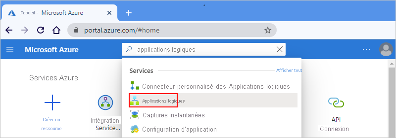

1. Dans la page **Logic Apps**, sélectionnez **Ajouter** > **Consommation**.

   Cette étape crée une ressource d’application logique qui s’exécute dans l’environnement de service Logic Apps multilocataire et utilise un [modèle tarifaire de la consommation](logic-apps-pricing.md).

   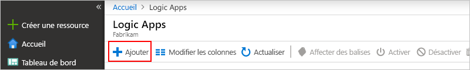

1. Dans le volet **Logic Apps**, entrez les détails de base et les paramètres de votre application logique. Créez un [groupe de ressources](../azure-resource-manager/management/overview.md#terminology) pour cet exemple d’application logique.

   | Propriété | Value | Description |
   |----------|-------|-------------|
   | **Abonnement** | <*Azure-subscription-name*> | Nom de votre abonnement Azure. |
   | **Groupe de ressources** | <*nom-groupe-de-ressources-Azure*> | Nom du [groupe de ressources Azure](../azure-resource-manager/management/overview.md#terminology), qui doit être unique entre les régions. Cet exemple utilise « My-First-LA-RG ». |
   | **Nom de l’application logique** | <*logic-app-name*> | Nom de votre application logique. Ce nom doit être unique d’une région à l’autre. Cet exemple utilise « My-First-Logic-App ». 

**Important** : Ce nom peut contenir uniquement des lettres, des chiffres, des traits d’union (`-`), des traits de soulignement (`_`), des parenthèses (`(`, `)`) et des points (`.`).  |
   | **Région** | <*Azure-region*> | Région du centre de données Azure où stocker les informations de votre application. Cet exemple utilise la région « USA Ouest ». |
   | **Associer à l’environnement de service d’intégration** | Désactivé | Sélectionnez cette option uniquement quand vous voulez déployer cette application logique dans un [environnement de service d’intégration](connect-virtual-network-vnet-isolated-environment-overview.md). Pour cet exemple, laissez cette option désactivée. |
   | **Activer l’analytique des journaux** | Désactivé | Sélectionnez cette option uniquement quand vous voulez activer la journalisation des diagnostics. Pour cet exemple, laissez cette option désactivée. |
   ||||

   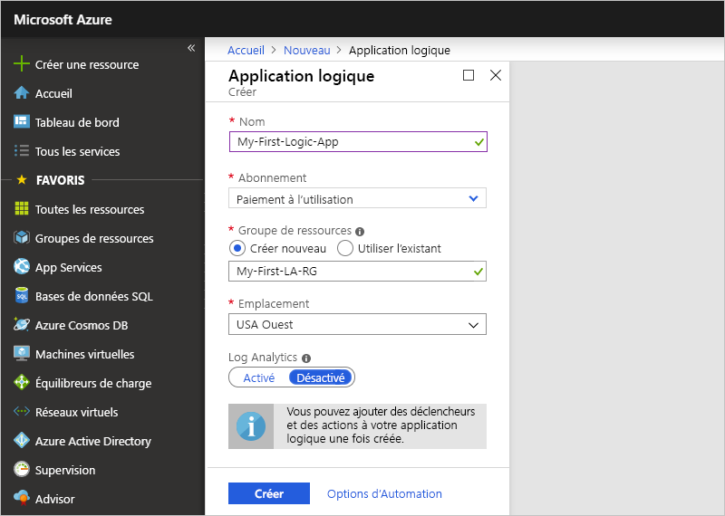

1. Quand vous êtes prêt, sélectionnez **Vérifier + créer**. Dans la page de validation, vérifiez les détails que vous avez fournis, puis sélectionnez **Créer**.

## Sélectionner le modèle vide

1. Une fois qu’Azure a déployé votre application, sélectionnez **Accéder à la ressource**. Ou bien, recherchez et sélectionnez votre application logique en tapant son nom dans la zone de recherche Azure.

   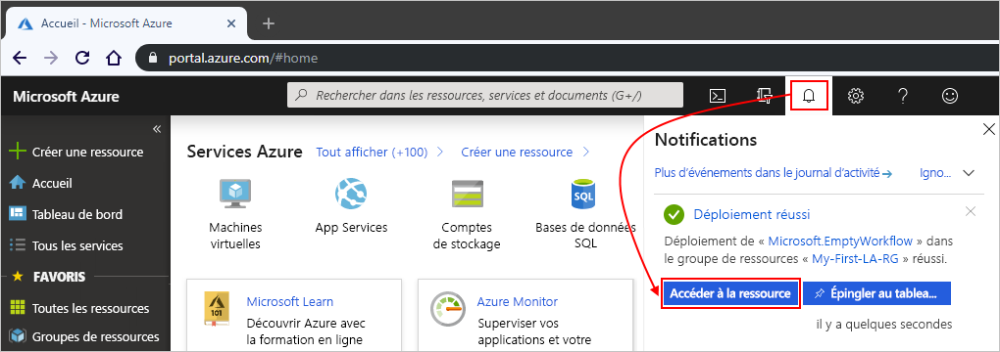

   Le Concepteur d’application logique s’ouvre et affiche une page contenant une vidéo de présentation et les déclencheurs couramment utilisés.

1. Sous **Modèles**, sélectionnez **Application logique vide**.

   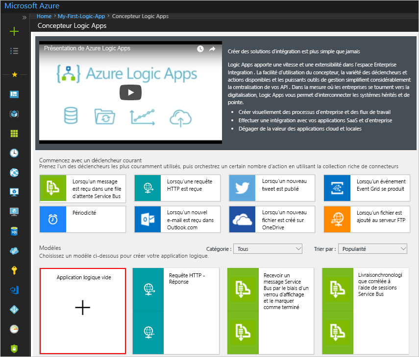

   Une fois le modèle sélectionné, le concepteur affiche une surface de workflow vide.

## Ajouter le déclencheur

Un workflow commence toujours par un seul [déclencheur](../logic-apps/logic-apps-overview.md#how-do-logic-apps-work), qui spécifie la condition à respecter avant d’exécuter des actions dans le workflow. Chaque fois que le déclencheur est activé, le service Logic Apps crée et exécute une instance de workflow. Si le déclencheur n’est pas activé, aucune instance n’est créée ou exécutée. Vous pouvez démarrer un workflow en effectuant un choix parmi de nombreux déclencheurs différents.

Cet exemple utilise un déclencheur RSS qui vérifie un flux RSS en fonction d’une planification. S’il existe un nouvel élément dans le flux, le déclencheur est activé et l’exécution d’une nouvelle instance de workflow commence. S’il existe plusieurs nouveaux éléments entre les vérifications, le déclencheur est activé pour chaque élément, et une nouvelle instance de workflow distincte s’exécute pour chaque élément.

1. Dans le **Concepteur Logic Apps**, sous la zone de recherche, sélectionnez **Tout**.

1. Pour rechercher le déclencheur RSS, dans la zone de recherche, entrez `rss`. Dans la liste **Déclencheurs**, sélectionnez le déclencheur RSS **Lors de la publication d’un élément de flux**.

   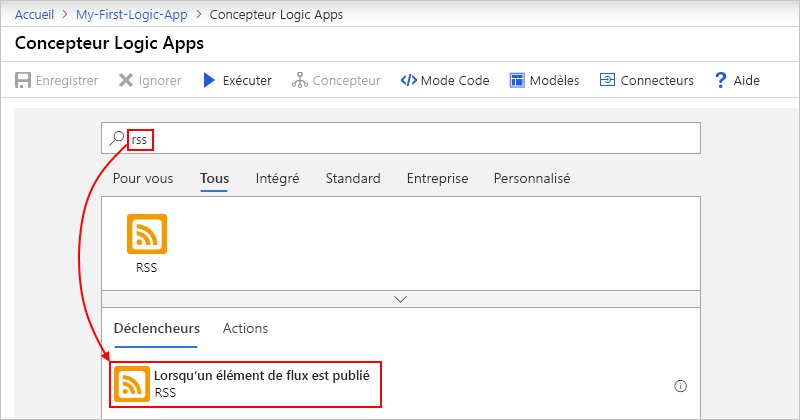

1. Indiquez les informations suivantes dans les détails du déclencheur :

   | Propriété | Obligatoire | Valeur | Description |
   |----------|----------|-------|-------------|
   | **URL du flux RSS** | Oui | <*URL-flux-RSS*> | URL du flux RSS à superviser. 

Cet exemple utilise le flux RSS du Wall Street Journal sur `https://feeds.a.dj.com/rss/RSSMarketsMain.xml`. Vous pouvez toutefois choisir tout autre flux RSS qui ne nécessite pas d’autorisation HTTP. Choisissez un flux RSS qui publie fréquemment, afin de pouvoir facilement tester votre workflow. |
   | **La propriété choisie sera utilisée pour déterminer** | Non | PublishDate | Propriété qui détermine quels sont les éléments nouveaux. |
   | **Intervalle** | Oui | 1 | Nombre d’intervalles d’attente entre les vérifications du flux. 

Cet exemple utilise `1` comme intervalle. |
   | **Fréquence** | Oui | Minute | Unité de fréquence à utiliser pour chaque intervalle. 

Cet exemple utilise `Minute` comme fréquence. |
   |||||

   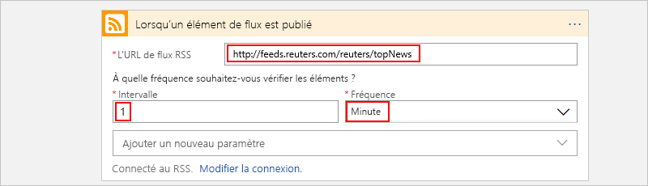

1. Pour le moment, réduisez les détails du déclencheur en cliquant à l’intérieur de sa barre de titre.

   

1. Quand vous avez terminé, enregistrez votre application logique, qui est instantanément mise en ligne dans le portail Azure. Dans la barre d’outils du Concepteur, sélectionnez **Enregistrer**.

   Le déclencheur ne fait rien d’autre que vérifier le flux RSS. Par conséquent, vous devez ajouter une action qui définit ce qui se produit quand le déclencheur est activé.

## Ajouter une action

À la suite d’un déclencheur, une [action](../logic-apps/logic-apps-overview.md#logic-app-concepts) est une étape ultérieure qui exécute une opération dans le workflow. Toute action, qui peut être le déclencheur ou une autre action, peut utiliser les sorties de l’étape précédente. Vous pouvez faire un choix parmi de nombreuses actions différentes, ajouter plusieurs actions jusqu’à la [limite par workflow](logic-apps-limits-and-config.md#definition-limits), et même créer des chemins d’action différents.

Cet exemple utilise une action Office 365 Outlook qui envoie un e-mail chaque fois que le déclencheur est activé pour un nouvel élément de flux RSS. S’il existe plusieurs nouveaux éléments entre les vérifications, vous recevez plusieurs e-mails.

1. Sous le déclencheur **Lors de la publication d’un élément de flux**, sélectionnez **Nouvelle étape**.

   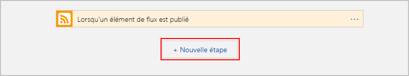

1. Sous **Choisissez une opération** et la zone de recherche, sélectionnez **Tout**.

1. Dans la zone de recherche, entrez `send an email` afin de pouvoir rechercher les connecteurs qui proposent cette action. Pour filtrer la liste d’**Actions** pour un service ou une application spécifique, commencez par sélectionner ce service ou cette application.

   Par exemple, si vous utilisez un compte professionnel ou scolaire Microsoft et que vous voulez utiliser Office 365 Outlook, sélectionnez **Office 365 Outlook**. Ou, si vous avez un compte Microsoft personnel, sélectionnez **Outlook.com**. Cet exemple se poursuit avec Office 365 Outlook.

   > [!NOTE]
   > Si vous utilisez un autre service de messagerie pris en charge dans votre workflow, l’interface utilisateur peut paraître légèrement différente. Les concepts de base pour la connexion à un autre service de messagerie restent néanmoins les mêmes.

   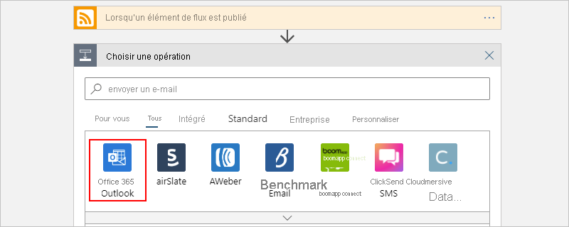

   Vous pouvez désormais rechercher et sélectionner plus facilement l’action souhaitée, par exemple **Envoyer un e-mail** :

   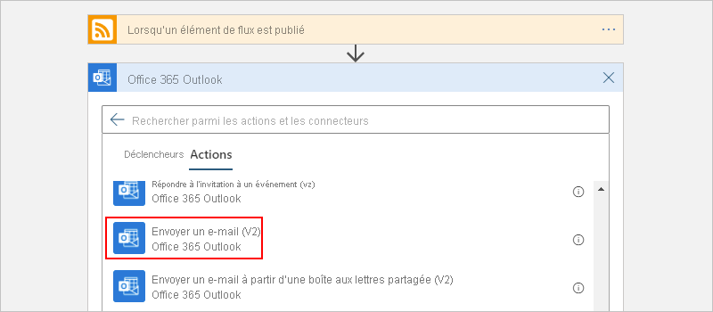

1. Si le service de messagerie que vous avez sélectionné vous invite à vous connecter et à authentifier votre identité, faites-le maintenant.

   Pour certains connecteurs, vous devez d’abord créer une connexion et authentifier votre identité avant de pouvoir continuer.

   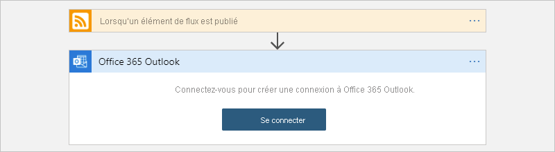

   > [!NOTE]
   > Cet exemple montre l’authentification manuelle pour la connexion à Office 365 Outlook. Toutefois, d’autres services peuvent prendre en charge ou utiliser des types d’authentification différents. Selon votre scénario, vous pouvez gérer l’authentification de la connexion de différentes façons.
   > 
   > Par exemple, si vous utilisez des modèles Azure Resource Manager pour le déploiement, vous pouvez renforcer la sécurité des entrées qui changent souvent en paramétrant des valeurs comme les détails de la connexion. Pour plus d’informations, consultez les rubriques suivantes :
   >
   > * [Paramètres du modèle pour le déploiement](../logic-apps/logic-apps-azure-resource-manager-templates-overview.md#template-parameters)
   > * [Autoriser des connexions OAuth](../logic-apps/logic-apps-deploy-azure-resource-manager-templates.md#authorize-oauth-connections)
   > * [Authentifier l’accès avec des identités managées](../logic-apps/create-managed-service-identity.md)
   > * [Authentifier les connexions pour le déploiement d’applications logiques](../logic-apps/logic-apps-azure-resource-manager-templates-overview.md#authenticate-connections)

1. Dans l’action **Envoyer un courrier électronique**, spécifiez les informations à inclure dans l’e-mail.

   1. Dans la zone **À**, entrez l’adresse e-mail du destinataire. Pour cet exemple, utilisez votre propre adresse e-mail.

      > [!NOTE]
      > La liste **Ajouter du contenu dynamique** s’affiche quand vous cliquez dans la zone **À** ainsi que dans d’autres zones pour certains types d’entrée. Cette liste affiche toutes les sorties des étapes précédentes qui peuvent être sélectionnées comme entrées pour l’action actuelle. Vous pouvez ignorer cette liste pour l’instant. L’étape suivante utilise la liste de contenu dynamique.

   1. Dans la zone **Objet**, entrez l’objet de l’e-mail. Pour cet exemple, entrez le texte suivant avec un espace vide à la fin : `New RSS item: `

      

   1. Dans la liste **Ajouter du contenu dynamique**, sous **Lors de la publication d’un élément de flux**, sélectionnez **Titre du flux**.

      Le titre du flux est une sortie de déclencheur qui fait référence au titre de l’élément RSS. Votre e-mail utilise cette sortie pour afficher le titre de l’élément RSS.

      

      > [!TIP]
      > Si la liste de contenu dynamique n’affiche aucune sortie retournée par le déclencheur **Lors de la publication d’un élément de flux**, en regard de l’en-tête de l’action, sélectionnez **Afficher plus**.
      > 
      > 

      Lorsque vous avez terminé, l’objet de l’e-mail ressemble à l’exemple suivant :

      

      > [!NOTE]
      > Si une boucle **For each** apparaît sur le concepteur, vous avez sélectionné une sortie qui fait référence à un tableau, comme la propriété **categories-Item**. Pour ce type de sortie, le concepteur ajoute automatiquement la boucle **For each** autour de l’action qui référence la sortie. De cette façon, votre workflow effectue la même action sur chaque élément du tableau. 
      >
      > Pour supprimer la boucle, sur la barre de titre de la boucle, sélectionnez les points de suspension ( **...** ), puis sélectionnez **Supprimer**.

   1. Dans la zone **Corps**, entrez le contenu du corps de l’e-mail.
   
      Pour cet exemple, le corps comprend les propriétés suivantes, précédées d’un texte descriptif pour chaque propriété. Pour ajouter des lignes vides dans une zone d’édition, appuyez sur Maj + Entrée.

      | Texte descriptif | Propriété | Description |
      |------------------|----------|-------------|
      | `Title:` | **Titre du flux** | Titre de l’élément. |
      | `Date published:` | **Flux publié le** | Date et heure de publication de l’élément. |
      | `Link:` | **Lien du flux principal** | URL de l’élément. |
      ||||

      

1. Enregistrez votre application logique. Dans la barre d’outils du Concepteur, sélectionnez **Enregistrer**.

## Exécuter votre workflow

Pour vérifier que le workflow s’exécute correctement, vous pouvez attendre que le déclencheur vérifie le flux RSS en fonction de la planification définie. Vous pouvez aussi exécuter manuellement le workflow en sélectionnant **Exécuter** dans la barre d’outils du Concepteur Logic Apps, comme illustré dans la capture d’écran suivante. 

Si le flux RSS a de nouveaux éléments, votre workflow envoie un e-mail pour chaque nouvel élément. Dans le cas contraire, votre workflow attend l’intervalle suivant pour revérifier le flux RSS. 

La capture d’écran suivante montre un exemple d’e-mail envoyé par l’exemple de workflow. L’e-mail contient les détails de chaque sortie de déclencheur que vous avez sélectionnée, ainsi que le texte descriptif que vous avez inclus pour chaque élément.

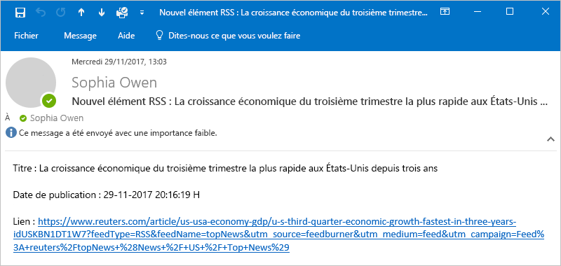

## Résoudre les problèmes

Si vous ne recevez pas d’e-mails du workflow comme prévu :

* Vérifiez si le message n’a pas été incorrectement filtré et placé dans votre dossier de courrier indésirable ou de spam.
* Assurez-vous que le flux RSS que vous utilisez a publié des éléments depuis la dernière vérification planifiée ou manuelle.

## Nettoyer les ressources

Quand vous avez terminé ce guide de démarrage rapide, nettoyez l’exemple d’application logique et toutes les ressources associées en supprimant le groupe de ressources que vous avez créé pour cet exemple.

1. Dans la zone de recherche Azure, entrez `resource groups`, puis sélectionnez **Groupes de ressources**.

   

1. Recherchez et sélectionnez le groupe de ressources de votre application logique. Dans le volet **Vue d’ensemble**, sélectionnez **Supprimer un groupe de ressources**.

   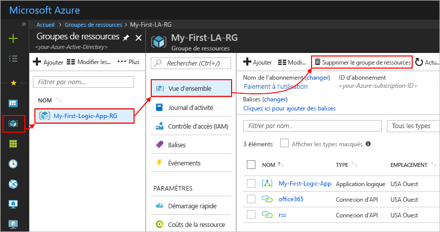

1. Dans le volet de confirmation, entrez le nom du groupe de ressources, puis sélectionnez **Supprimer**.

   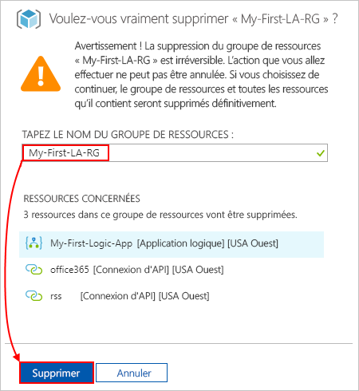

## Étapes suivantes

Dans ce guide de démarrage rapide, vous avez créé votre premier workflow d’application logique dans le portail Azure afin de vérifier un flux RSS et envoyer un e-mail pour chaque nouvel élément. Pour en savoir plus sur les workflows planifiés avancés, consultez le tutoriel suivant :

> [!div class="nextstepaction"]
> [Contrôler le trafic à l’aide d’une application logique planifiée](../logic-apps/tutorial-build-schedule-recurring-logic-app-workflow.md)
