# <a name="quickstart-create-and-manage-logic-app-workflow-definitions-by-using-visual-studio-code"></a>Démarrage rapide : Créer et gérer des définitions de workflow d’applications logiques avec Visual Studio Code

Avec [Azure Logic Apps](../logic-apps/logic-apps-overview.md) et Visual Studio Code, vous pouvez créer et gérer des applications logiques qui vous permettent d’automatiser tâches, workflows et processus liés à l’intégration d’applications, de données, de systèmes et de services dans les entreprises et les organisations. Ce guide de démarrage rapide montre comment vous pouvez créer et modifier les définitions de workflow sous-jacentes, qui utilisent JavaScript Object Notation (JSON), pour des applications logiques via une expérience basée sur le code. Vous pouvez également travailler sur les applications logiques existantes qui sont déjà déployées dans Azure.

Même si vous pouvez effectuer ces tâches dans le [portail Azure](https://portal.azure.com) et dans Visual Studio, vous démarrez plus rapidement dans Visual Studio Code lorsque vous êtes familier avec les définitions d’application logique et choisissez de travailler directement avec du code. Par exemple, vous pouvez désactiver, activer, supprimer et actualiser des applications logiques déjà créées. En outre, vous pouvez travailler sur des applications logiques et des comptes d’intégration à partir de n’importe quelle plateforme de développement où Visual Studio Code s’exécute, comme Linux, Windows et Mac.

Pour les besoins de cet article, vous pouvez créer la même application logique à partir de ce [guide de démarrage rapide](../logic-apps/quickstart-create-first-logic-app-workflow.md), qui est axé sur les concepts de base. Dans Visual Studio Code, l’application logique ressemble à cet exemple :


Avant de commencer, vérifiez que vous disposez des éléments ci-après :

* Si vous n’avez pas de compte ni d’abonnement Azure, [inscrivez-vous pour bénéficier d’un compte Azure gratuit](https://azure.microsoft.com/free/).

* Connaissances de base sur les [définitions de workflow d’applications logiques](../logic-apps/logic-apps-workflow-definition-language.md) et leur structure, comme décrit avec JSON

  Si vous débutez avec Logic Apps, suivez ce [guide de démarrage rapide](../logic-apps/quickstart-create-first-logic-app-workflow.md), qui vous permet de créer votre première application logique dans le portail Azure et qui est axé sur les concepts de base.

* Accès au web pour la connexion à Azure et à votre abonnement Azure

* Téléchargez et installez ces outils, si vous ne les avez pas déjà :

  * [Version de Visual Studio Code 1.25.1 ou version ultérieure](https://code.visualstudio.com/), qui est gratuite

  * Extension Visual Studio Code pour Azure Logic Apps

    Vous pouvez télécharger et installer cette extension à partir de [Visual Studio Marketplace](https://marketplace.visualstudio.com/items?itemName=ms-azuretools.vscode-logicapps) ou directement depuis Visual Studio Code. Assurez-vous de recharger Visual Studio Code après l’installation.

    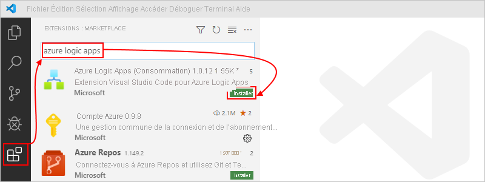

    Pour savoir si l’installation de l’extension s’est correctement déroulée, sélectionnez l’icône Azure dans la barre d’outils de Visual Studio Code.

    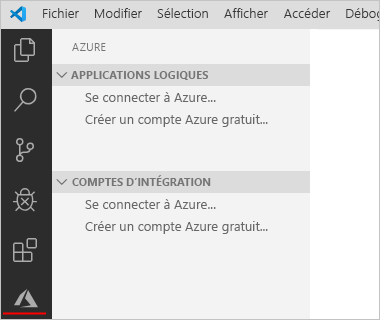

    Pour plus d’informations, consultez la [Place de marché des extensions](https://code.visualstudio.com/docs/editor/extension-gallery). Pour contribuer à la version open source de cette extension, accédez à l’[extension Azure Logic Apps pour Visual Studio Code sur GitHub](https://github.com/Microsoft/vscode-azurelogicapps).

<a name="access-azure"></a>

## <a name="access-azure-from-visual-studio"></a>Accéder à Azure à partir de Visual Studio

1. Ouvrez Visual Studio Code. Dans la barre d’outils de Visual Studio Code, sélectionnez l’icône Azure.

   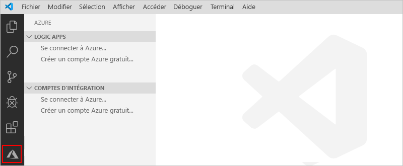

1. Dans la fenêtre Azure, sous **Logic Apps** , sélectionnez **Connexion à Azure** . Quand la page de connexion Microsoft vous y invite, connectez-vous avec votre compte Azure.

   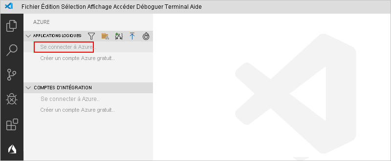

   1. Si la connexion prend plus de temps que d’habitude, Visual Studio Code vous invite à vous connecter via un site web d’authentification Microsoft en vous fournissant un code d’appareil. Pour vous connecter avec le code, sélectionnez **Utiliser le code d’appareil** .

      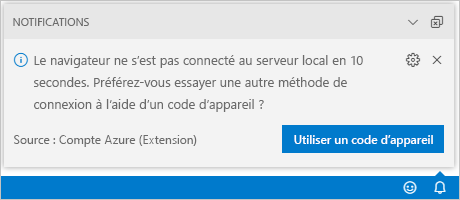

   1. Pour copier le code, sélectionnez **Copier et ouvrir** .

      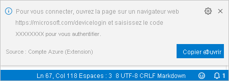

   1. Pour ouvrir une nouvelle fenêtre de navigateur et accéder au site web d’authentification, sélectionnez **Ouvrir le lien** .

      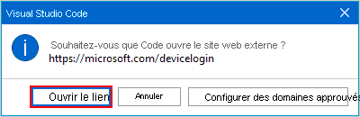

   1. Dans la page **Connectez-vous à votre compte** , entrez votre code d’authentification, puis sélectionnez **Suivant** .

      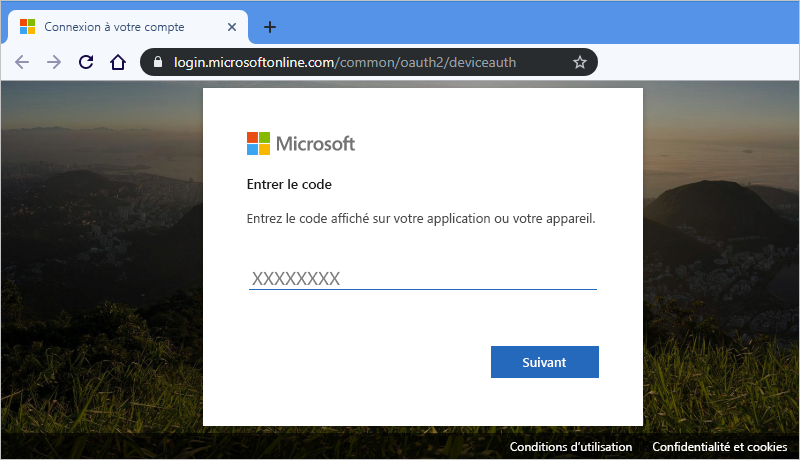

1. Sélectionnez votre compte Azure. Lorsque vous êtes connecté, vous pouvez fermer le navigateur et revenir à Visual Studio Code.

   Dans le volet Azure, les sections **Logic Apps** et **Comptes d’intégration** affichent maintenant les abonnements Azure associés à votre compte. Cependant, si vous ne voyez pas les abonnements attendus ou si les sections affichent un trop grand nombre d’abonnements, effectuez ces étapes :

   1. Déplacez votre pointeur sur le libellé **Logic Apps** . Quand la barre d’outils apparaît, sélectionnez **Sélectionner des abonnements** (icône de filtre).

      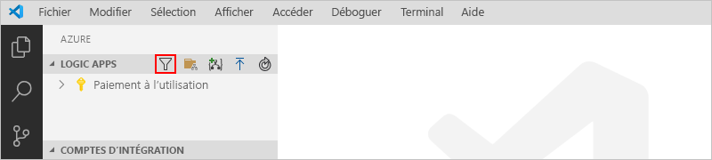

   1. Dans la liste qui apparaît, sélectionnez les abonnements que vous souhaitez afficher.

1. Sous **Logic Apps** , sélectionnez l’abonnement souhaité. Le nœud de l’abonnement se développe et montre toutes les applications logiques qui existent dans cet abonnement.

   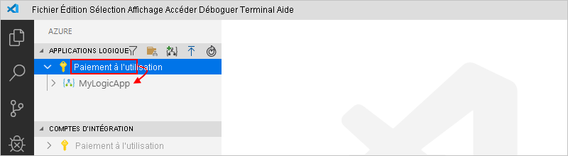

   > [!TIP]
   > Sous **Comptes d’intégration** , le fait de sélectionner votre abonnement montre tous les comptes d’intégration qui y existent.

<a name="create-logic-app"></a>

## <a name="create-new-logic-app"></a>Créer une application logique

1. Si vous n’êtes pas encore connecté à votre compte et à votre abonnement Azure depuis Visual Studio Code, suivez les [étapes précédentes pour vous y connecter maintenant](#access-azure).

1. Dans Visual Studio Code, sous **Logic Apps** , ouvrez le menu contextuel de votre abonnement, puis sélectionnez **Créer une application logique** .

   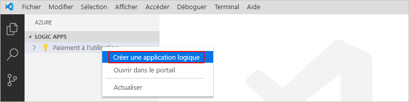

   Une liste apparaît et montre tous les groupes de ressources de votre abonnement.

1. Dans la liste des groupes de ressources, sélectionnez **Créer un groupe de ressources** ou un groupe de ressources existant. Pour cet exemple, créez un groupe de ressources.

   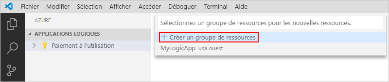

1. Spécifiez un nom pour votre groupe de ressources Azure, puis appuyez sur Entrée.

   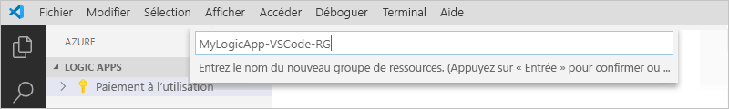

1. Sélectionnez la région Azure où vous voulez enregistrer les métadonnées de votre application logique.

   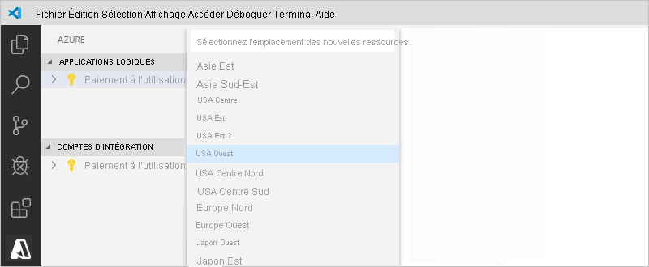

1. Spécifiez un nom pour votre application logique, puis appuyez sur Entrée.

   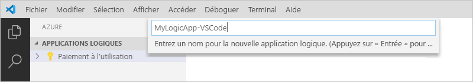

   Dans la fenêtre Azure, sous votre abonnement Azure, votre nouvelle application logique vide apparaît. Visual Studio Code ouvre également un fichier JSON (.logicapp.json), qui comprend un squelette de définition de workflow pour votre application logique. Vous pouvez maintenant commencer à créer manuellement la définition du workflow de votre application logique dans ce fichier JSON. Pour obtenir des informations techniques de référence sur la structure et la syntaxe de la définition d’un workflow, consultez le [Schéma du langage de définition du flux de travail pour Azure Logic Apps](../logic-apps/logic-apps-workflow-definition-language.md).

   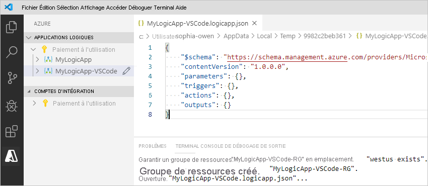

   Par exemple, voici un exemple de définition du workflow d’une application logique, qui commence par un déclencheur RSS et une action Outlook Office 365. En règle générale, les éléments JSON sont affichés par ordre alphabétique dans chaque section. Toutefois, cet exemple montre ces éléments à peu près dans l’ordre dans lequel les étapes de l’application logique apparaissent dans le concepteur.

   > [!IMPORTANT]
   > Si vous souhaitez réutiliser cet exemple de définition d’application logique, vous avez besoin d’un compte professionnel, par exemple @fabrikam.com. Veillez à remplacer l’adresse e-mail fictive par votre propre adresse e-mail. Pour utiliser un autre connecteur de messagerie, comme Outlook.com ou Gmail, remplacez l’action `Send_an_email_action` par une action similaire disponible dans [un connecteur de messagerie pris en charge par Azure Logic Apps](../connectors/apis-list.md).
   >
   > Si vous souhaitez utiliser le connecteur Gmail, seuls les comptes professionnels G-Suite peuvent utiliser ce connecteur sans restriction dans les applications logiques. 
   > Si vous disposez d’un compte de consommateur Gmail, vous pouvez utiliser ce connecteur uniquement avec certains services approuvés par Google, ou vous pouvez [créer une application cliente Google pour servir lors de l’authentification avec votre connecteur Gmail](/connectors/gmail/#authentication-and-bring-your-own-application). 
   > Pour plus d’informations, consultez [Stratégies de confidentialité et de sécurité des données pour les connecteurs Google dans Azure Logic Apps](../connectors/connectors-google-data-security-privacy-policy.md).

   ```json
   {
      "$schema": "https://schema.management.azure.com/providers/Microsoft.Logic/schemas/2016-06-01/workflowdefinition.json#",
      "contentVersion": "1.0.0.0",
      "parameters": {
         "$connections": {
            "defaultValue": {},
            "type": "Object"
         }
      },
      "triggers": {
         "When_a_feed_item_is_published": {
            "recurrence": {
               "frequency": "Minute",
               "interval": 1
            },
            "splitOn": "@triggerBody()?['value']",
            "type": "ApiConnection",
            "inputs": {
               "host": {
                  "connection": {
                     "name": "@parameters('$connections')['rss']['connectionId']"
                  }
               },
               "method": "get",
               "path": "/OnNewFeed",
               "queries": {
                  "feedUrl": "http://feeds.reuters.com/reuters/topNews"
               }
            }
         }
      },
      "actions": {
         "Send_an_email_(V2)": {
            "runAfter": {},
            "type": "ApiConnection",
            "inputs": {
               "body": {
                  "Body": "<p>Title: @{triggerBody()?['title']}<br>\n<br>\nDate published: @{triggerBody()?['updatedOn']}<br>\n<br>\nLink: @{triggerBody()?['primaryLink']}</p>",
                  "Subject": "RSS item: @{triggerBody()?['title']}",
                  "To": "sophia-owen@fabrikam.com"
               },
               "host": {
                  "connection": {
                     "name": "@parameters('$connections')['office365']['connectionId']"
                  }
               },
               "method": "post",
               "path": "/v2/Mail"
            }
         }
      },
      "outputs": {}
   }
   ```

1. Quand vous avez terminé, enregistrez la définition du workflow de votre application logique. (Menu Fichier > Enregistrer, ou appuyez sur Ctrl+S)

1. Quand vous êtes invité à charger votre application logique dans votre abonnement Azure, sélectionnez **Charger** .

   Cette étape publie votre application logique sur le [portail Azure](https://portal.azure.com), ce qui rend votre logique opérationnelle dans Azure.

   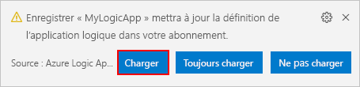

## <a name="view-logic-app-in-designer"></a>Visualiser l’application logique dans le concepteur

Dans Visual Studio Code, vous pouvez ouvrir votre application logique dans une vue de conception en lecture seule. Bien que vous ne puissiez pas modifier votre application logique dans le concepteur, vous pouvez vérifier visuellement le workflow de votre application logique avec la vue du concepteur.

Dans la fenêtre Azure, sous **Logic Apps** , ouvrez le menu contextuel de votre application logique, puis sélectionnez **Ouvrir dans le concepteur** .

Le concepteur en lecture seule s’ouvre dans une fenêtre distincte et montre le workflow de votre application logique, par exemple :

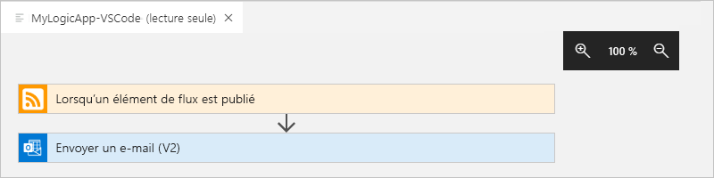

## <a name="view-in-azure-portal"></a>Affichage dans le portail Azure

Pour passer en revue votre application logique dans le portail Azure, effectuez ces étapes :

1. Connectez-vous au [portail Azure](https://portal.azure.com) en utilisant le même compte et le même abonnement Azure que ceux associés à votre application logique.

1. Dans la zone de recherche du portail Azure, entrez le nom de votre application logique. Dans la liste des résultats, sélectionnez votre application logique.

   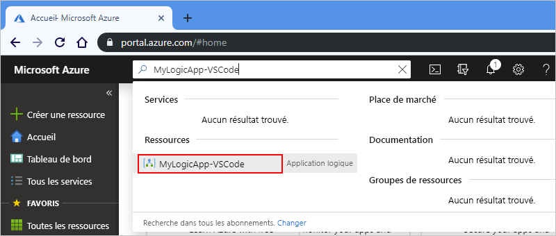

<a name="disable-enable-logic-app"></a>

## <a name="disable-or-enable-logic-app"></a>Activer ou désactiver une application logique

Dans Visual Studio Code, si vous modifiez une application logique publiée et que vous enregistrez vos modifications, vous *remplacez* votre application déjà déployée. Pour éviter de rendre non opérationnelle votre application logique en production et réduire les perturbations, désactivez d’abord votre application logique. Vous pouvez ensuite réactiver votre application logique une fois que vous avez vérifié que votre application logique fonctionne toujours.

1. Si vous n’êtes pas encore connecté à votre compte et à votre abonnement Azure depuis Visual Studio Code, suivez les [étapes précédentes pour vous y connecter maintenant](#access-azure).

1. Dans la fenêtre Azure, sous **Logic Apps** , développez votre abonnement Azure pour voir toutes les applications logiques de cet abonnement.

   1. Pour désactiver l’application logique souhaitée, ouvrez le menu de l’application logique, puis sélectionnez **Désactiver** .

      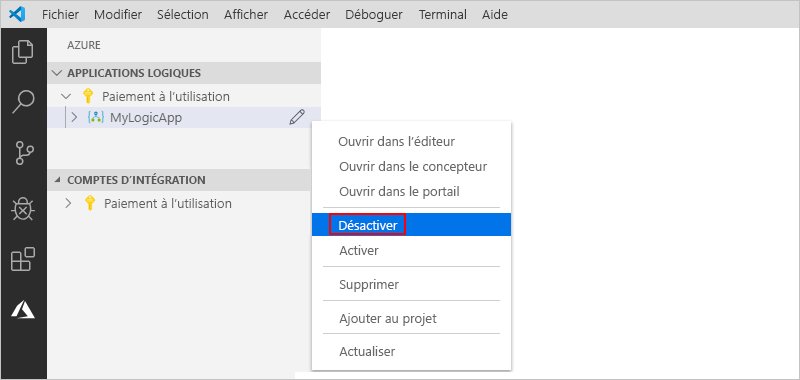

   1. Quand vous êtes prêt à réactiver votre application logique, ouvrez le menu de l’application logique, puis sélectionnez **Activer** .

      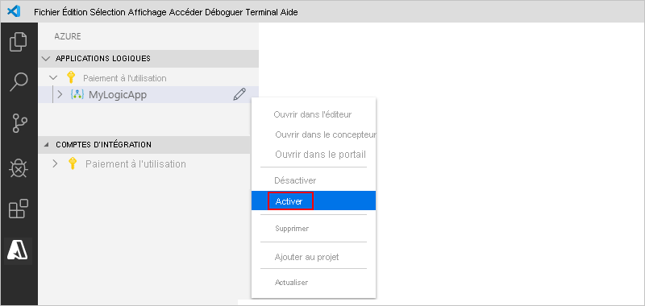

<a name="edit-logic-app"></a>

## <a name="edit-deployed-logic-app"></a>Modifier l’application logique déployée

Dans Visual Studio Code, vous pouvez ouvrir et modifier la définition du workflow pour une application logique déjà déployée dans Azure.

> [!IMPORTANT] 
> Avant de modifier une application logique qui est activement exécutée en production, évitez le risque de rendre cette application logique non opérationnelle et limitez les interruptions possibles en [désactivant d’abord votre application logique](#disable-enable-logic-app).

1. Si vous n’êtes pas encore connecté à votre compte et à votre abonnement Azure depuis Visual Studio Code, suivez les [étapes précédentes pour vous y connecter maintenant](#access-azure).

1. Dans la fenêtre Azure, sous **Logic Apps** , développez votre abonnement Azure et sélectionnez l’application logique que vous souhaitez.

1. Ouvrez le menu de votre application logique, puis sélectionnez **Ouvrir dans l’éditeur** . Ou, à côté du nom de l’application logique, sélectionnez l’icône de modification.

   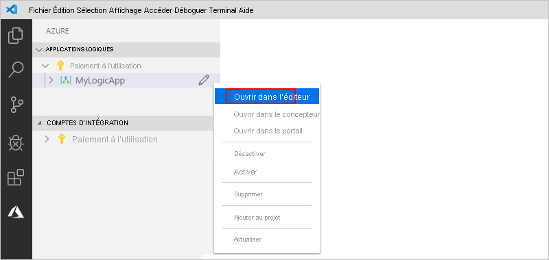

   Visual Studio Code ouvre le fichier .logicapp.json dans votre dossier temporaire local pour vous permettre de visualiser la définition du workflow de votre application logique.

   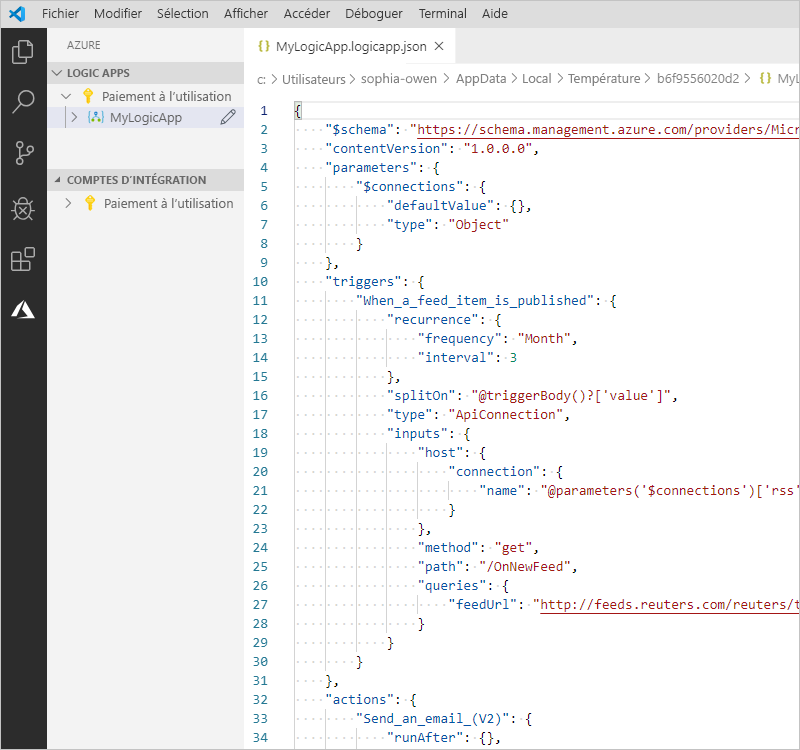

1. Apportez vos modifications à la définition du workflow de votre application logique.

1. Lorsque vous avez terminé, enregistrez les modifications. (Menu Fichier > Enregistrer, ou appuyez sur Ctrl+S)

1. Quand vous êtes invité à charger vos modifications et à *remplacer* votre application logique existante dans le portail Azure, sélectionnez **Charger** .

   Cette étape publie vos mises à jour sur votre application logique dans le [portail Azure](https://portal.azure.com).

   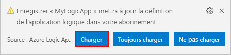

## <a name="view-or-promote-other-versions"></a>Afficher ou promouvoir d’autres versions

Dans Visual Studio Code, vous pouvez ouvrir et passer en revue les versions antérieures de votre application logique. Vous pouvez également promouvoir une version antérieure en version active.

> [!IMPORTANT] 
> Avant de changer une application logique qui est activement exécutée en production, évitez le risque de rendre cette application logique non opérationnelle et limitez les interruptions possibles en [désactivant d’abord votre application logique](#disable-enable-logic-app).

1. Dans la fenêtre Azure, sous **Logic Apps** , développez votre abonnement Azure pour voir toutes les applications logiques de cet abonnement.

1. Sous votre abonnement, développez votre application logique, puis développez **Versions** .

   La liste **Versions** montre les versions antérieures de votre application logique, s’il en existe.

   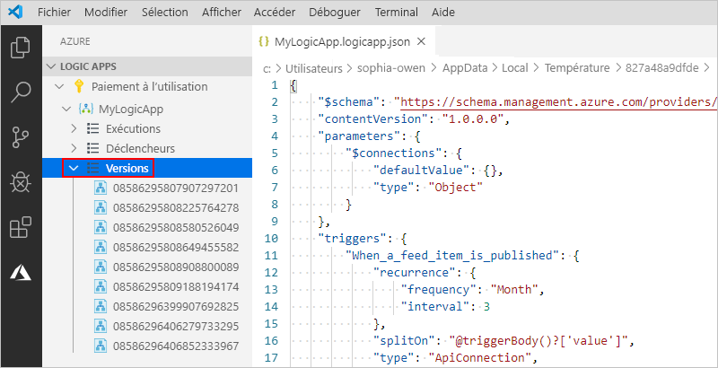

1. Pour visualiser une version antérieure, choisissez une des actions suivantes :

   * Pour voir la définition JSON, sous **Versions** , sélectionnez le numéro de version de cette définition. Ouvrez le menu contextuel de cette version, puis sélectionnez **Ouvrir dans l’éditeur** .

     Un nouveau fichier s’ouvre sur votre ordinateur local et montre la définition JSON de cette version.

   * Pour visualiser la version dans la vue du concepteur en lecture seule, ouvrez le menu contextuel de cette version, puis sélectionnez **Ouvrir dans le concepteur** .

1. Pour promouvoir une version antérieure en version active, effectuez les étapes suivantes :

   1. Sous **Versions** , ouvrez le menu contextuel de la version antérieure, puis sélectionnez **Promouvoir** .

      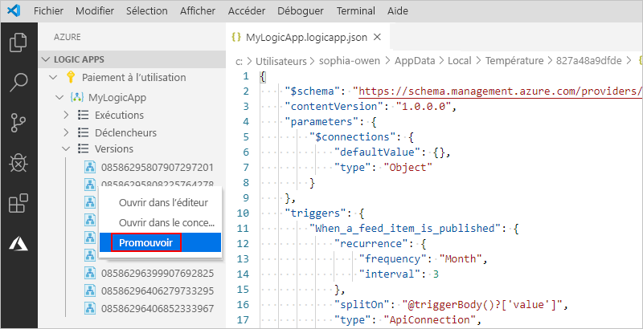

   1. Pour continuer après l’invite de confirmation de Visual Studio Code, sélectionnez **Oui** .

      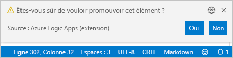

      Visual Studio Code promeut la version sélectionnée en version active et affecte un nouveau numéro à la version promue. La version active précédente apparaît maintenant sous la version promue.

## <a name="next-steps"></a>Étapes suivantes

> [!div class="nextstepaction"]
> [Créer des applications logiques avec ou sans état dans Visual Studio Code (préversion)](../logic-apps/create-stateful-stateless-workflows-visual-studio-code.md)
