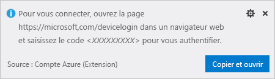
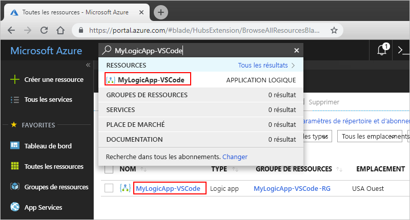

# <a name="quickstart-create-and-manage-logic-app-definitions-by-using-visual-studio-code"></a>Démarrage rapide : Créer et gérer des définitions d’applications logiques à l’aide de Visual Studio Code

Avec [Azure Logic Apps](../logic-apps/logic-apps-overview.md) et Visual Studio Code, vous pouvez créer et gérer des applications logiques qui vous permettent d’automatiser tâches, workflows et processus liés à l’intégration d’applications, de données, de systèmes et de services dans les entreprises et les organisations. Ce démarrage rapide montre comment vous pouvez créer et modifier des définitions de workflows d’application logique en travaillant avec le schéma de définition de workflow dans JavaScript Objet Notation (JSON) via une expérience basée sur le code. Vous pouvez également travailler sur les applications logiques existantes qui sont déjà déployées dans Azure.

Même si vous pouvez effectuer ces tâches dans le [portail Azure](https://portal.azure.com) et dans Visual Studio, vous démarrez plus rapidement dans Visual Studio Code lorsque vous êtes familier avec les définitions d’application logique et choisissez de travailler directement avec du code. Par exemple, vous pouvez désactiver, activer, supprimer et actualiser des applications logiques déjà créées. En outre, vous pouvez travailler sur des applications logiques et des comptes d’intégration à partir de n’importe quelle plateforme de développement où Visual Studio Code s’exécute, comme Linux, Windows et Mac.

Pour les besoins de cet article, vous pouvez créer la même application logique à partir de ce [guide de démarrage rapide](../logic-apps/quickstart-create-first-logic-app-workflow.md), qui est axé sur les concepts de base. Dans Visual Studio Code, l’application logique ressemble à cet exemple :


Avant de commencer, vérifiez que vous disposez des éléments suivants :

* Si vous n’avez pas d’abonnement Azure, [inscrivez-vous pour bénéficier d’un compte Azure gratuit](https://azure.microsoft.com/free/).

* Connaissances de base sur les [définitions de workflow d’application logique](../logic-apps/logic-apps-workflow-definition-language.md) et leur structure, qui utilisent JavaScript Object Notation (JSON)

  Si vous débutez avec Logic Apps, suivez ce [guide de démarrage rapide](../logic-apps/quickstart-create-first-logic-app-workflow.md), qui vous permet de créer votre première application logique dans le portail Azure et qui est axé sur les concepts de base.

* Accès au web pour la connexion à Azure et à votre abonnement Azure

* Téléchargez et installez ces outils, si vous ne les avez pas déjà :

  * [Version de Visual Studio Code 1.25.1 ou version ultérieure](https://code.visualstudio.com/), qui est gratuite

  * Extension Visual Studio Code pour Azure Logic Apps

    Vous pouvez télécharger et installer cette extension à partir de [Visual Studio Marketplace](https://marketplace.visualstudio.com/items?itemName=ms-azuretools.vscode-logicapps) ou directement depuis Visual Studio Code. Assurez-vous de recharger Visual Studio Code après l’installation.

    

    Pour savoir si l’installation de l’extension s’est correctement déroulée, sélectionnez l’icône Azure dans la barre d’outils de Visual Studio Code.

    

    Pour plus d’informations, consultez la [Place de marché des extensions](https://code.visualstudio.com/docs/editor/extension-gallery). Pour contribuer à la version open source de cette extension, accédez à l’[extension Azure Logic Apps pour Visual Studio Code sur GitHub](https://github.com/Microsoft/vscode-azurelogicapps).

<a name="sign-in-azure"></a>

## <a name="sign-in-to-azure"></a>Connexion à Azure

1. Ouvrez Visual Studio Code. Dans la barre d’outils de Visual Studio Code, sélectionnez l’icône Azure.

   

1. Dans la fenêtre Azure, sous **Logic Apps**, sélectionnez **Connexion à Azure**.

   

   Vous êtes à présent invité à vous connecter en utilisant le code d’authentification fourni.

1. Copiez le code d’authentification, puis sélectionnez **Copier et ouvrir** pour ouvrir une nouvelle fenêtre de navigateur.

   

1. Indiquez votre code d’authentification. Lorsque vous y êtes invité, sélectionnez **Continuer**.

   

1. Sélectionnez votre compte Azure. Lorsque vous êtes connecté, vous pouvez fermer le navigateur et revenir à Visual Studio Code.

   Dans la fenêtre Azure, les volets Logic Apps et Comptes d’intégration affichent désormais les abonnements Azure dans votre compte.

   

   Si vous ne voyez pas les abonnements souhaités, à côté de l’étiquette **Logic Apps**, sélectionnez l’icône de filtre **Sélectionner des abonnements**. Recherchez et sélectionnez les abonnements que vous souhaitez.

1. Pour voir toutes les applications logiques ou comptes d’intégration existants dans votre abonnement Azure, développez votre abonnement.

   

<a name="create-logic-app"></a>

## <a name="create-logic-app"></a>Créer une application logique

1. Si vous n’êtes pas connecté à votre abonnement Azure depuis Visual Studio Code, suivez les étapes décrites dans cet article pour [vous connecter maintenant](#sign-in-azure).

1. Dans le menu contextuel de votre abonnement, sélectionnez **Créer**.

   

1. Dans la liste qui affiche les groupes de ressources Azure dans votre abonnement, sélectionnez un groupe de ressources existant ou **Créer un groupe de ressources**.

   Cet exemple crée un groupe de ressources :

   

1. Précisez un nom pour votre groupe de ressources Azure, puis appuyez sur Entrée.

   

1. Sélectionnez l’emplacement du centre de données où enregistrer les métadonnées de votre application logique.

   

1. Indiquez un nom pour votre application logique et appuyez sur Entrée.

   

   Votre nouvelle application logique apparaît désormais dans la fenêtre Azure, sous votre abonnement Azure. Vous pouvez à présent créer la définition du workflow de votre application logique.

1. Dans le menu contextuel de l’application logique, sélectionnez **Ouvrir dans l’éditeur**.

   

   Visual Studio Code ouvre un modèle de définition de workflow d’application logique (fichier .logicapp.json) afin que vous puissiez commencer à créer le workflow de votre application logique.

   

1. Dans le fichier modèle de définition de workflow pour application logique, démarrez la création de la définition du workflow de votre application logique.
Pour toute référence technique, reportez-vous à l’article [Schéma du langage de définition de workflow pour Azure Logic Apps](../logic-apps/logic-apps-workflow-definition-language.md).

   Voici un exemple de définition logique. En règle générale, les éléments JSON sont affichés par ordre alphabétique dans chaque section. Toutefois, cet exemple montre ces éléments à peu près dans l’ordre dans lequel les étapes de l’application logique apparaissent dans le concepteur.

   ```json
   {
      "$schema": "https://schema.management.azure.com/providers/Microsoft.Logic/schemas/2016-06-01/workflowdefinition.json#",
      "contentVersion": "1.0.0.0",
      "parameters": {
         "$connections": {
            "defaultValue": {},
            "type": "Object"
         }
      },
      "triggers": {
         "When_a_feed_item_is_published": {
            "recurrence": {
               "frequency": "Minute",
               "interval": 1
            },
            "splitOn": "@triggerBody()?['value']",
            "type": "ApiConnection",
            "inputs": {
               "host": {
                  "connection": {
                     "name": "@parameters('$connections')['rss']['connectionId']"
                  }
               },
               "method": "get",
               "path": "/OnNewFeed",
               "queries": {
                  "feedUrl": "http://feeds.reuters.com/reuters/topNews"
               }
            }
         }
      },
      "actions": {
         "Send_an_email": {
            "runAfter": {},
            "type": "ApiConnection",
            "inputs": {
               "body": {
                  "Body": "Title: @{triggerBody()?['title']}\n\nDate published: @{triggerBody()?['publishDate']}\n\nLink: @{triggerBody()?['primaryLink']}",
                  "Subject": "New RSS item: @{triggerBody()?['title']}",
                  "To": "Sophie.Owen@contoso.com"
               },
               "host": {
                  "connection": {
                     "name": "@parameters('$connections')['outlook']['connectionId']"
                  }
               },
               "method": "post",
               "path": "/Mail"
            }
         }
      },
      "outputs": {}
   }
   ```

1. Lorsque vous avez terminé, enregistrez votre fichier de définition de l’application logique. Lorsque Visual Studio Code vous invite à confirmer le chargement de votre définition d’application logique dans votre abonnement Azure, sélectionnez **Charger**.

   

   Après sa publication par Visual Studio Code dans Azure, vous retrouvez désormais votre application logique en ligne et opérationnelle dans le portail Azure.

   

<a name="edit-logic-app"></a>

## <a name="edit-logic-app"></a>Modifier l’application logique

Pour apporter des modifications à une application logique qui est publiée dans Azure, vous pouvez ouvrir la définition de cette application logique à l’aide de Visual Studio Code.

1. Si vous n’êtes pas connecté à votre abonnement Azure depuis Visual Studio Code, suivez les étapes décrites dans cet article pour [vous connecter maintenant](#sign-in-azure).

1. Dans la fenêtre Azure, sous **Logic Apps**, développez votre abonnement Azure et sélectionnez l’application logique que vous souhaitez.

1. Dans le menu de l’application logique, sélectionnez **Ouvrir dans l’éditeur**. Ou, à côté du nom de l’application logique, sélectionnez l’icône de modification.

   

   Visual Studio Code ouvre le fichier .logicapp.json de la définition du workflow de votre application logique.

   

1. Apportez des modifications à la définition de votre application logique.

1. Lorsque vous avez terminé, enregistrez les modifications.

1. Lorsque Visual Studio Code vous invite à mettre à jour la définition de l’application logique dans votre abonnement Azure, sélectionnez **Charger**.

   

## <a name="next-steps"></a>Étapes suivantes

> [!div class="nextstepaction"]
> * [Créer des applications logiques avec Visual Studio](../logic-apps/quickstart-create-logic-apps-with-visual-studio.md)