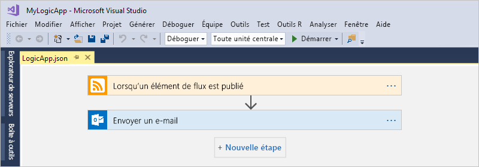
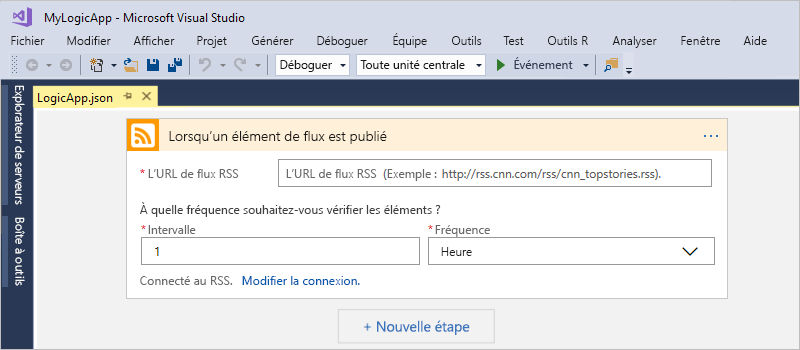
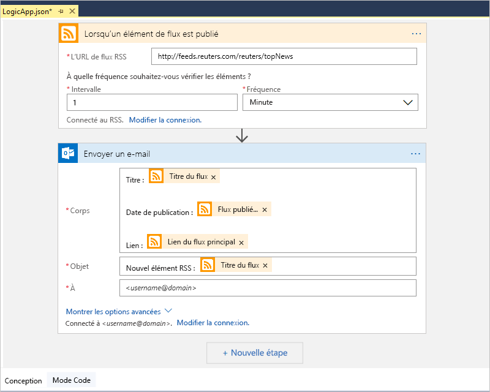

# Démarrage rapide : Créer des tâches, des processus et des workflows automatisés avec Azure Logic Apps - Visual Studio

Avec [Azure Logic Apps](../logic-apps/logic-apps-overview.md) et Visual Studio, vous pouvez créer des workflows pour automatiser des tâches et des processus qui intègrent des applications, des données, des systèmes et des services dans les entreprises et organisations. Ce guide de démarrage rapide montre comment vous pouvez concevoir et générer ces workflows en créant des applications logiques dans Visual Studio et en déployant ces applications sur Azure dans le cloud. Bien que vous puissiez effectuer ces tâches dans le portail Azure, Visual Studio vous permet d’ajouter vos applications logiques pour le contrôle de code source, la publication de différentes versions et la création de modèles Azure Resource Manager pour divers environnements de déploiement.

Si vous êtes débutant avec Azure Logic Apps et si vous souhaitez seulement connaître les concepts de base, essayez plutôt le [démarrage rapide pour créer une application logique dans le portail Azure](../logic-apps/quickstart-create-first-logic-app-workflow.md). Le Concepteur d’application logique dans le portail Azure et dans Visual Studio fonctionne de façon similaire.

Ici, vous créez la même application logique que dans le démarrage rapide de portail Azure, mais avec Visual Studio. Cette application logique surveille les flux RSS d’un site web et envoie un e-mail chaque fois qu’un élément est publié sur le site. Lorsque vous avez terminé, votre application logique ressemble au workflow de niveau élevé suivant :

Avant de commencer, vérifiez que vous disposez des éléments ci-après pour suivre ce guide de démarrage rapide :

* Si vous n’avez pas d’abonnement Azure, <a href="https://azure.microsoft.com/free/" target="_blank">inscrivez-vous pour bénéficier d’un compte Azure gratuit</a>.

* Téléchargez et installez ces outils, si vous ne les avez pas déjà :

  * <a href="https://aka.ms/download-visual-studio" target="_blank">Visual Studio 2019, 2017 ou 2015 - édition Community ou supérieure</a>. 
  Ce démarrage rapide utilise Visual Studio Community 2017, qui est gratuit.

    > [!IMPORTANT]
    > Quand vous installez Visual Studio 2019 ou 2017, veillez à sélectionner la charge de travail **Développement Azure**.
    > Pour Visual Studio 2019, Cloud Explorer peut ouvrir le Concepteur d’application logique dans le portail Azure, mais ne peut pas encore ouvrir le Concepteur d’application logique intégré.

  * <a href="https://azure.microsoft.com/downloads/" target="_blank">Kit de développement logiciel (SDK) Microsoft Azure pour .NET (version 2.9.1 ou ultérieure)</a>. En savoir plus sur <a href="https://docs.microsoft.com/dotnet/azure/dotnet-tools?view=azure-dotnet">Azure SDK pour .NET</a>.

  * <a href="https://github.com/Azure/azure-powershell#installation" target="_blank">Azure PowerShell</a>

  * Outils Azure Logic Apps pour la version Visual Studio souhaitée :

    * <a href="https://aka.ms/download-azure-logic-apps-tools-visual-studio-2019" target="_blank">Visual Studio 2019</a>
    
    * <a href="https://aka.ms/download-azure-logic-apps-tools-visual-studio-2017" target="_blank">Visual Studio 2017</a>
    
    * <a href="https://aka.ms/download-azure-logic-apps-tools-visual-studio-2015" target="_blank">Visual Studio 2015</a>
  
    Vous pouvez télécharger et installer les outils Azure Logic Apps directement à partir de Visual Studio Marketplace ou en apprendre davantage sur <a href="https://docs.microsoft.com/visualstudio/ide/finding-and-using-visual-studio-extensions" target="_blank">l’installation de cette extension dans Visual Studio</a>. 
    Veillez à redémarrer Visual Studio après l’installation.

* Accès au web lors de l’utilisation du Concepteur d’application logique intégré

  Le Concepteur requiert une connexion Internet pour créer des ressources dans Azure et pour lire les propriétés et les données à partir de connecteurs dans votre application logique. 
  Par exemple, si vous utilisez le connecteur Dynamics CRM Online, le Concepteur recherche les propriétés par défaut et personnalisées disponibles dans votre instance CRM.

* Un compte de messagerie pris en charge par Logic Apps, par exemple Office 365 Outlook, Outlook.com ou Gmail. Pour les autres fournisseurs, <a href="https://docs.microsoft.com/connectors/" target="_blank">passez en revue la liste des connecteurs ici</a>. Cette application logique utilise Office 365 Outlook. Si vous utilisez un autre fournisseur, les étapes générales sont identiques, mais votre interface utilisateur peut être légèrement différente.

## Créer un projet de groupe de ressources Azure

Pour commencer, créez un [projet de groupe de ressources Azure](../azure-resource-manager/vs-azure-tools-resource-groups-deployment-projects-create-deploy.md). En savoir plus sur [les ressources et groupes de ressources Azure](../azure-resource-manager/resource-group-overview.md).

1. Démarrez Visual Studio et connectez-vous avec votre compte Azure.

1. Dans le menu **Fichier**, sélectionnez **Nouveau** > **Projet**. (Clavier : Ctrl+Maj+N)

   

1. Sous **Installé**, sélectionnez **Visual C#** ou **Visual Basic**. Sélectionnez **Cloud** > **Groupe de ressources Azure**. Nommez votre projet, par exemple :

   

   > [!NOTE]
   > Si la catégorie **Cloud** ou le projet **Groupe de ressources Azure** n’existe pas, vérifiez que vous avez installé le kit SDK Azure pour Visual Studio.

   Si vous utilisez Visual Studio 2019, effectuez ces étapes :

   1. Dans la boîte de dialogue **Créer un projet**, sélectionnez le modèle de projet **Groupe de ressources Azure** pour Visual C# ou Visual Basic, puis choisissez **Suivant**.

   1. Indiquez le nom du groupe de ressources Azure que vous souhaitez utiliser et les autres informations relatives au projet. Lorsque vous êtes prêt, choisissez **Créer**.

1. Dans la liste des modèles, sélectionnez le modèle **Application logique**.

   

   Une fois votre projet créé par Visual Studio, l’Explorateur de solutions s’ouvre et affiche votre solution.

   

   Dans votre solution, le fichier **LogicApp.json** ne stocke pas seulement la définition de votre application logique, mais est également un modèle Azure Resource Manager que vous pouvez configurer pour le déploiement.

## Créer une application logique vide

Après avoir créé votre projet de groupe de ressources Azure, créez et générez votre application logique à partir du modèle **Application logique vide**.

1. Dans l’Explorateur de solutions, ouvrez le menu contextuel pour le fichier **LogicApp.json**. 
   Sélectionnez **Ouvrir avec le Concepteur d’application logique**. (Clavier : Ctrl+L)

   

1. Dans **Abonnement**, sélectionnez l’abonnement Azure que vous voulez utiliser. 
   Pour **Groupe de ressources**, sélectionnez **Créer nouveau...**, afin de créer un groupe de ressources Azure.

   

   Visual Studio a besoin de votre abonnement Azure et d’un groupe de ressources pour créer et déployer des ressources associées à votre application logique et à vos connexions.

   | Paramètre | Exemple de valeur | Description |
   | ------- | ------------- | ----------- |
   | Liste de profils utilisateur | Contoso   jamalhartnett@contoso.com | Par défaut, le compte que vous avez utilisé pour vous connecter |
   | **Abonnement** | Pay-As-You-Go   (jamalhartnett@contoso.com) | Le nom de votre abonnement Azure et le compte associé |
   | **Groupe de ressources** | MyLogicApp-RG   (USA Ouest) | Le groupe de ressources Azure et l’emplacement de stockage et de déploiement des ressources pour votre application logique |
   | **Lieu** | MyLogicApp-RG2   (USA Ouest) | Un autre emplacement si vous ne souhaitez pas utiliser l’emplacement du groupe de ressources |
   ||||

1. Le Concepteur d’application logique s’ouvre et affiche une page contenant une vidéo de présentation et les déclencheurs couramment utilisés. 
   Faites défiler la vidéo et les déclencheurs. Sous **Modèles**, sélectionnez **Application logique vide**.

   

## Générer un workflow d’application logique

Ensuite, ajoutez un [déclencheur](../logic-apps/logic-apps-overview.md#logic-app-concepts) qui s’active lorsqu’un nouvel élément de flux RSS apparaît. Chaque application logique doit commencer avec un déclencheur, qui s’active quand des critères spécifiques sont remplis. Chaque fois que le déclencheur est activé, le moteur Logic Apps crée une instance d’application logique qui exécute votre workflow.

1. Dans le Concepteur d’application logique, entrez « rss » dans la zone de recherche. Sélectionner le déclencheur : **Quand un élément de flux est publié**

   

   Le déclencheur s’affiche désormais dans le Concepteur :

   

1. Pour terminer de générer l’application logique, suivez les étapes du workflow dans le [démarrage rapide du portail Azure](../logic-apps/quickstart-create-first-logic-app-workflow.md#add-rss-trigger), puis revenez à cet article.

   Une fois que vous avez terminé, votre application logique ressemble à cet exemple :

   

1. Pour enregistrer votre application logique, enregistrez votre solution Visual Studio. (Clavier : Ctrl+S)

Maintenant, avant de pouvoir tester votre application logique, déployez votre application dans Azure.

## Déployer l’application logique dans Azure

Avant de pouvoir exécuter votre application logique, déployez l’application à partir de Visual Studio dans Azure ; pour ce faire, seules quelques étapes doivent être effectuées.

1. Dans l’Explorateur de solutions, dans le menu contextuel de votre projet, sélectionnez **Déployer** > **Nouveau**. Si vous y êtes invité, connectez-vous à votre compte Azure.

   

1. Pour ce déploiement, gardez l’abonnement Azure, le groupe de ressources et les autres paramètres par défaut. Quand vous êtes prêt, choisissez **Déployer**.

   

1. Si le champ **Modifier les paramètres** s’affiche, indiquez le nom de la ressource pour l’application logique à utiliser au moment du déploiement, puis enregistrez vos paramètres, par exemple :

   

   Lorsque le déploiement commence, l’état du déploiement de votre application s’affiche dans la fenêtre **Sortie** de Visual Studio. 
   Si l’état n’apparaît pas, ouvrez la liste **Afficher la sortie à partir de** et sélectionnez votre groupe de ressources Azure.

   

   Si les connecteurs que vous avez sélectionnés nécessitent une intervention de votre part, une fenêtre PowerShell peut s’ouvrir en arrière-plan et vous demander de saisir les mots de passe ou les clés secrètes nécessaires. Le déploiement se poursuit dès que vous avez saisi ces informations.

   

   Une fois le déploiement terminé, votre application logique est en ligne dans le portail Azure et vérifie le flux RSS en fonction de la planification que vous avez spécifiée (chaque minute). 
   Si le flux RSS a de nouveaux éléments, votre application logique envoie un e-mail pour chaque nouvel élément. 
   Dans le cas contraire, votre application logique attend jusqu’à l’intervalle suivant avant de procéder à une nouvelle vérification.

   Par exemple, voici des e-mails classiques envoyés par cette application logique. 
   Si vous ne recevez aucun e-mail, vérifiez votre dossier Courrier indésirable.

   

   Techniquement, lorsque le déclencheur vérifie le flux RSS et trouve de nouveaux éléments, le déclencheur s’active et le moteur Logic Apps crée une instance de workflow d’application logique qui exécute les actions dans le workflow.
   Si le déclencheur ne trouve pas de nouveaux éléments, il ne s’active pas et « ignore » l’instanciation du workflow.

Félicitations, vous avez maintenant correctement généré et déployé votre application logique avec Visual Studio ! Pour gérer votre application logique et examiner son historique des exécutions, consultez [Manage logic apps with Visual Studio](../logic-apps/manage-logic-apps-with-visual-studio.md) (Gérer des applications logiques avec Visual Studio).

## Supprimer des ressources

Quand vous n’en avez plus besoin, supprimez le groupe de ressources qui contient votre application logique et les ressources associées.

1. Connectez-vous au <a href="https://portal.azure.com" target="_blank">portail Azure</a> avec le même compte que celui utilisé pour créer votre application logique.

1. Dans le menu Azure principal, choisissez **Groupes de ressources**.
Sélectionnez le groupe de ressources pour votre application logique, puis sélectionnez **Vue d’ensemble**.

1. Dans la page **Vue d’ensemble**, choisissez **Supprimer un groupe de ressources**. Confirmez le nom du groupe de ressources, puis choisissez **Supprimer**.

   

1. Supprimez la solution Visual Studio de votre ordinateur local.

## Obtenir de l’aide

* Si vous avez des questions, consultez le <a href="https://social.msdn.microsoft.com/Forums/en-US/home?forum=azurelogicapps" target="_blank">forum Azure Logic Apps</a>.
* Pour voter pour des idées de fonctionnalités ou pour en soumettre, visitez le <a href="https://aka.ms/logicapps-wish" target="_blank">site de commentaires des utilisateurs Logic Apps</a>.

## Étapes suivantes

Dans cet article, vous avez généré, déployé et exécuté votre application logique avec Visual Studio. Pour en savoir plus sur la gestion et l’exécution du déploiement avancé des applications logiques avec Visual Studio, consultez les articles suivants :

> [!div class="nextstepaction"]
> * [Gérer des applications logiques avec Visual Studio](../logic-apps/manage-logic-apps-with-visual-studio.md)
> * [Création d’un modèle de déploiement d’applications logiques avec Visual Studio](../logic-apps/logic-apps-create-deploy-template.md)
