# Démarrage rapide : Créer des tâches, des processus et des workflows automatisés avec Azure Logic Apps - Visual Studio

Avec [Azure Logic Apps](../logic-apps/logic-apps-overview.md) et Visual Studio, vous pouvez créer des workflows pour automatiser des tâches et des processus qui intègrent des applications, des données, des systèmes et des services dans les entreprises et organisations. Ce guide de démarrage rapide montre comment vous pouvez concevoir et générer ces workflows en créant des applications logiques dans Visual Studio et en déployant ces applications sur Azure. Bien que vous puissiez effectuer ces tâches dans le portail Azure, Visual Studio vous permet d’ajouter vos applications logiques pour le contrôle de code source, la publication de différentes versions et la création de modèles Azure Resource Manager pour divers environnements de déploiement.

Si vous êtes débutant avec Azure Logic Apps et si vous souhaitez seulement connaître les concepts de base, essayez le [guide de démarrage rapide pour créer une application logique dans le portail Azure](../logic-apps/quickstart-create-first-logic-app-workflow.md). Le Concepteur d’application logique fonctionne de façon similaire dans le portail Azure et dans Visual Studio.

Dans ce guide de démarrage rapide, vous créez la même application logique avec Visual Studio que dans le guide de démarrage rapide du portail Azure. Vous pouvez aussi apprendre à [créer un exemple d’application dans Visual Studio Code](quickstart-create-logic-apps-visual-studio-code.md), et à [créer et gérer des applications logiques à l’aide de l’interface de ligne de commande Azure (Azure CLI)](quickstart-logic-apps-azure-cli.md). Cette application logique supervise le flux RSS d’un site web et envoie un e-mail pour chaque nouvel élément publié dans ce flux. Votre application logique terminée ressemble au workflow général suivant :

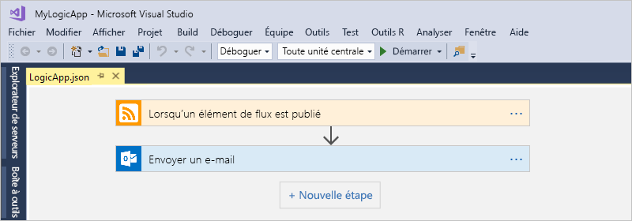

## Prérequis

* Un compte et un abonnement Azure. Si vous n’avez pas encore d’abonnement, vous pouvez [vous inscrire pour obtenir un compte Azure gratuitement](https://azure.microsoft.com/free/). Si vous avez un abonnement Azure Government, suivez ces étapes supplémentaires pour [configurer Visual Studio pour Azure Government Cloud](#azure-government).

* Téléchargez et installez ces outils, si vous ne les avez pas déjà :

  * [Visual Studio 2019, 2017 ou 2015 - édition Community ou supérieure](https://aka.ms/download-visual-studio). Ce guide de démarrage rapide utilise Visual Studio Community 2017.

    > [!IMPORTANT]
    > Quand vous installez Visual Studio 2019 ou 2017, veillez à sélectionner la charge de travail **Développement Azure**.

  * [Kit de développement logiciel (SDK) Microsoft Azure pour .NET (version 2.9.1 ou ultérieure)](https://azure.microsoft.com/downloads/). En savoir plus sur [Azure SDK pour .NET](/dotnet/azure/intro).

  * [Azure PowerShell](https://github.com/Azure/azure-powershell#installation)

  * Les derniers outils d’Azure Logic Apps pour l’extension Visual Studio correspondant à la version que vous souhaitez :

    * [Visual Studio 2019](https://aka.ms/download-azure-logic-apps-tools-visual-studio-2019)

    * [Visual Studio 2017](https://aka.ms/download-azure-logic-apps-tools-visual-studio-2017)

    * [Visual Studio 2015](https://aka.ms/download-azure-logic-apps-tools-visual-studio-2015)
  
    Vous pouvez télécharger et installer les outils Azure Logic Apps directement à partir de Visual Studio Marketplace ou en apprendre davantage sur [l’installation de cette extension dans Visual Studio](/visualstudio/ide/finding-and-using-visual-studio-extensions). Veillez à redémarrer Visual Studio après l’installation.

* Accès au web lors de l’utilisation du Concepteur d’application logique intégré

  Le Concepteur a besoin d’une connexion Internet pour créer des ressources dans Azure et pour lire des propriétés et données à partir de connecteurs dans votre application logique.

* Un compte de messagerie pris en charge par Logic Apps, par exemple Outlook pour Microsoft 365, Outlook.com ou Gmail. Pour les autres fournisseurs, consultez la [liste des connecteurs ici](/connectors/). Office 365 Outlook est utilisé dans cet exemple. Si vous utilisez un autre fournisseur, les étapes générales sont identiques, mais votre interface utilisateur peut être légèrement différente.

  > [!IMPORTANT]
  > Si vous souhaitez utiliser le connecteur Gmail, seuls les comptes professionnels G-Suite peuvent utiliser ce connecteur sans restriction dans Logic Apps. Si vous disposez d’un compte de consommateur Gmail, vous pouvez utiliser ce connecteur uniquement avec certains services approuvés par Google, ou vous pouvez [créer une application cliente Google pour servir lors de l’authentification avec votre connecteur Gmail](/connectors/gmail/#authentication-and-bring-your-own-application). Pour plus d’informations, consultez [Stratégies de confidentialité et de sécurité des données pour les connecteurs Google dans Azure Logic Apps](../connectors/connectors-google-data-security-privacy-policy.md).

* Si votre application logique doit communiquer via un pare-feu qui limite le trafic vers des adresses IP spécifiques, ce pare-feu doit autoriser l’accès *à la fois* aux adresses IP [entrantes](logic-apps-limits-and-config.md#inbound) et [sortantes](logic-apps-limits-and-config.md#outbound) utilisées par le service ou le runtime Logic Apps dans la région Azure où se trouve votre application logique. Si votre application logique utilise également des [connecteurs managés](../connectors/apis-list.md#managed-api-connectors), comme le connecteur Office 365 Outlook ou le connecteur SQL, ou qu’elle utilise des [connecteurs personnalisés](/connectors/custom-connectors/), le pare-feu doit également autoriser l’accès pour *toutes* les [adresses IP sortantes de connecteur managé](logic-apps-limits-and-config.md#outbound) dans la région Azure de votre application logique.

## Configurer Visual Studio pour Azure Government

### Visual Studio 2017

Vous pouvez utiliser l’[extension Visual Studio du sélecteur d’environnement Azure](https://devblogs.microsoft.com/azuregov/introducing-the-azure-environment-selector-visual-studio-extension/) que vous pouvez télécharger et installer à partir du [Visual Studio Marketplace](https://marketplace.visualstudio.com/items?itemName=SteveMichelotti.AzureEnvironmentSelector).

### Visual Studio 2019

Pour travailler avec des abonnements Azure Government dans Azure Logic Apps, vous devez [ajouter à Visual Studio un point de terminaison de découverte pour Azure Government Cloud](../azure-government/documentation-government-connect-vs.md). Toutefois, *avant de vous connecter à Visual Studio avec votre compte Azure Government*, vous devez renommer le fichier JSON généré après avoir ajouté le point de terminaison de découverte en procédant comme suit :

1. Fermez Visual Studio.

1. Recherchez le fichier JSON généré nommé `Azure U.S. Government-A3EC617673C6C70CC6B9472656832A26.Configuration` à cet emplacement :

   `%localappdata%\.IdentityService\AadConfigurations`
 
1. Renommez le fichier JSON en `AadProvider.Configuration.json`.

1. Démarrez Visual Studio.

1. Poursuivez avec les étapes pour vous connecter avec votre compte Azure Government.

Pour annuler cette configuration, supprimez le fichier JSON à l’emplacement suivant, puis redémarrez Visual Studio :

`%localappdata%\.IdentityService\AadConfigurations\AadProvider.Configuration.json`

## Créer un projet de groupe de ressources Azure

Pour commencer, créez un [projet de groupe de ressources Azure](../azure-resource-manager/templates/create-visual-studio-deployment-project.md). En savoir plus sur [les ressources et groupes de ressources Azure](../azure-resource-manager/management/overview.md).

1. Démarrez Visual Studio. Connectez-vous à votre compte Azure.

1. Dans le menu **Fichier**, sélectionnez **Nouveau** > **Projet**. (Clavier : Ctrl + Maj + N)

   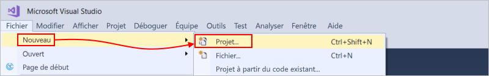

1. Sous **Installé**, sélectionnez **Visual C#** ou **Visual Basic**. Sélectionnez **Cloud** > **Groupe de ressources Azure**. Nommez votre projet, par exemple :

   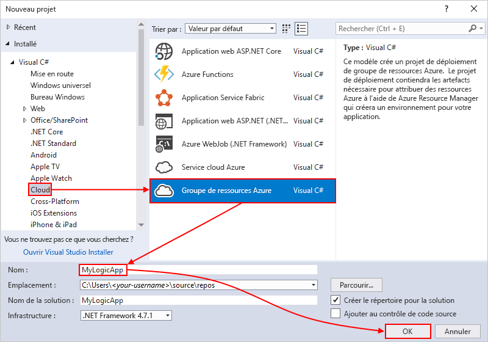

   > [!NOTE]
   > Les noms de groupes de ressources ne peuvent contenir que des lettres, des chiffres, des points (`.`), des traits de soulignement (`_`), des traits d’union (`-`) et des parenthèses (`(`, `)`), mais ne peuvent pas *se terminer* par des points (`.`).
   >
   > Si **Cloud** ou **Groupe de ressources Azure** n’apparaît pas, veillez à installer le kit SDK Azure pour Visual Studio.

   Si vous utilisez Visual Studio 2019, effectuez ces étapes :

   1. Dans la boîte de dialogue **Créer un projet**, sélectionnez le projet **Groupe de ressources Azure** pour Visual C# ou Visual Basic. Sélectionnez **Suivant**.

   1. Indiquez un nom pour le groupe de ressources Azure que vous souhaitez utiliser et les autres informations relatives au projet. Sélectionnez **Create** (Créer).

1. Dans la liste des modèles, sélectionnez le modèle **Application logique**. Sélectionnez **OK**.

   

   Une fois votre projet créé par Visual Studio, l’Explorateur de solutions s’ouvre et affiche votre solution. Dans votre solution, le fichier **LogicApp.json** ne stocke pas seulement la définition de votre application logique, mais est également un modèle Azure Resource Manager que vous pouvez utiliser pour le déploiement.

   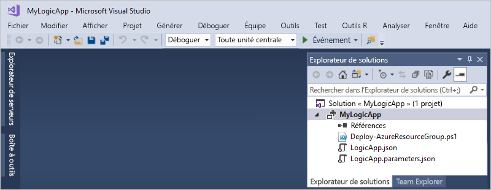

## Créer une application logique vide

Une fois votre projet de groupe de ressources Azure prêt, créez votre application logique avec le modèle **Application logique vide**.

1. Dans l’Explorateur de solutions, ouvrez le menu contextuel du fichier **LogicApp.json**. Sélectionnez **Ouvrir avec le Concepteur d’application logique**. (Clavier : Ctrl + L)

   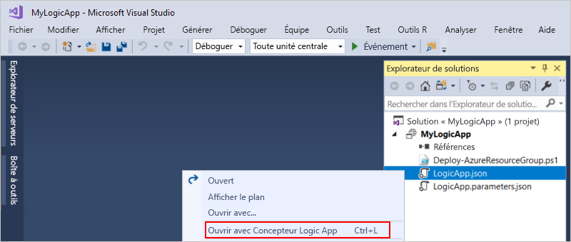

   > [!TIP]
   > Si vous ne voyez pas cette commande dans Visual Studio 2019, vérifiez que vous avez les dernières mises à jour pour Visual Studio.

   Visual Studio vous invite à indiquer votre abonnement Azure et un groupe de ressources Azure afin de créer et de déployer des ressources pour votre application logique et vos connexions.

1. Pour **Abonnement**, sélectionnez votre abonnement Azure. Pour **Groupe de ressources**, sélectionnez **Créer nouveau** pour créer un groupe de ressources Azure.

   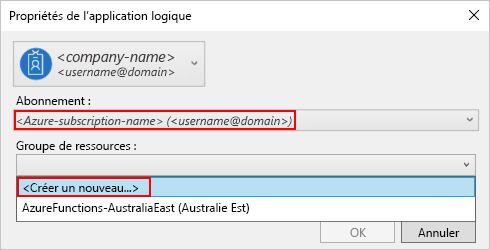

   | Paramètre | Valeur d'exemple | Description |
   | ------- | ------------- | ----------- |
   | Compte d’utilisateur | Fabrikam   sophia-owen@fabrikam.com | Le compte que vous avez utilisé quand vous vous êtes connecté à Visual Studio |
   | **Abonnement** | Pay-As-You-Go   (sophia-owen@fabrikam.com) | Le nom de votre abonnement Azure et le compte associé |
   | **Groupe de ressources** | MyLogicApp-RG   (USA Ouest) | Le groupe de ressources Azure et l’emplacement de stockage et de déploiement des ressources de votre application logique |
   | **Lieu** | **Identique au groupe de ressources** | Le type d’emplacement et l’emplacement spécifique pour le déploiement de votre application logique. Ce type d’emplacement est soit une région Azure, soit un [environnement de service d’intégration (ISE)](connect-virtual-network-vnet-isolated-environment.md) existant. 
Pour ce démarrage rapide, conservez le type d’emplacement **Région** et l’emplacement **Identique au groupe de ressources**. 
**Remarque** : Après avoir créé votre projet de groupe de ressources, vous pouvez [modifier le type d’emplacement et l’emplacement](manage-logic-apps-with-visual-studio.md#change-location), mais le choix d’un type d’emplacement différent affecte votre application logique de diverses manières. |
   ||||

1. Le Concepteur d’application logique ouvre une page qui affiche une vidéo de présentation et les déclencheurs couramment utilisés. Faites défiler la page vers le bas au-delà de la vidéo et des déclencheurs jusqu’à **Modèles**, puis sélectionnez **Application logique vide**.

   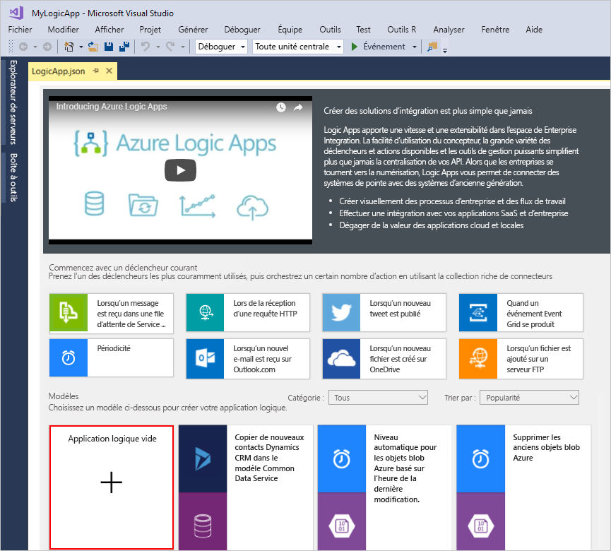

## Générer un workflow d’application logique

Ensuite, ajoutez un [déclencheur](../logic-apps/logic-apps-overview.md#logic-app-concepts) RSS qui s’active quand un nouvel élément de flux apparaît. Chaque application logique commence avec un déclencheur, qui s’active quand des critères spécifiques sont remplis. Chaque fois que le déclencheur est activé, le moteur Logic Apps crée une instance d’application logique qui exécute votre workflow.

1. Dans le Concepteur d’application logique, sous la zone de recherche, sélectionnez **Tout**. Dans la zone de recherche, entrez « rss ». Dans la liste des déclencheurs, sélectionnez ce déclencheur : **Quand un élément de flux est publié**

   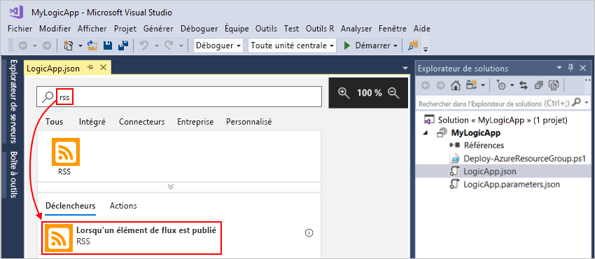

1. Une fois que le déclencheur apparaît dans le concepteur, terminez la génération de l’application logique en suivant les étapes du workflow dans le [guide de démarrage rapide du portail Azure](../logic-apps/quickstart-create-first-logic-app-workflow.md#add-rss-trigger), puis revenez à cet article. Une fois que vous avez terminé, votre application logique ressemble à cet exemple :

   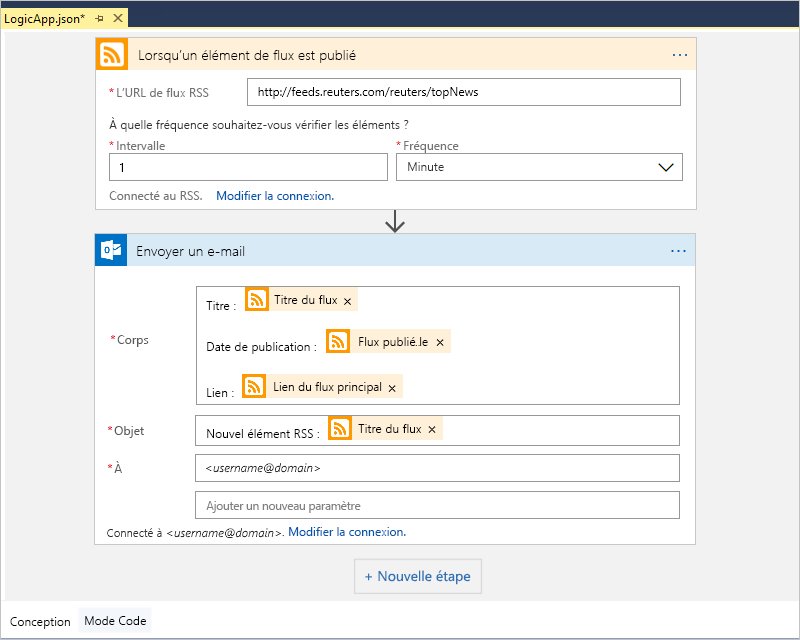

1. Enregistrez votre solution Visual Studio. (Clavier : Ctrl+S)

## Déployer l’application logique dans Azure

Avant de pouvoir exécuter et tester votre application logique, déployez-la dans Azure à partir de Visual Studio.

1. Dans l’Explorateur de solutions, dans le menu contextuel de votre projet, sélectionnez **Déployer** > **Nouveau**. Si vous y êtes invité, connectez-vous à votre compte Azure.

   

1. Pour ce déploiement, gardez l’abonnement Azure, le groupe de ressources et les autres paramètres par défaut. Sélectionnez **Déployer**.

   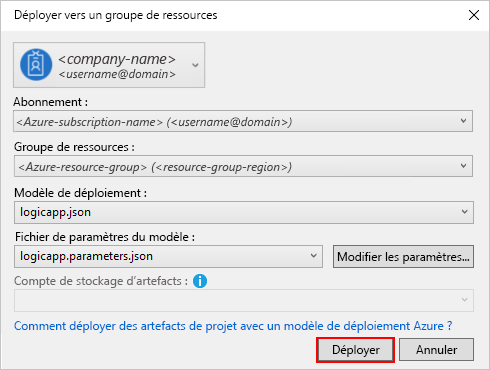

1. Si la boîte de dialogue **Modifier les paramètres** s’affiche, spécifiez un nom de ressource pour votre application logique. Enregistrez vos paramètres.

   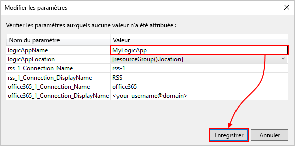

   Lorsque le déploiement commence, l’état du déploiement de votre application s’affiche dans la fenêtre **Sortie** de Visual Studio. Si l’état n’apparaît pas, ouvrez la liste **Afficher la sortie à partir de** et sélectionnez votre groupe de ressources Azure.

   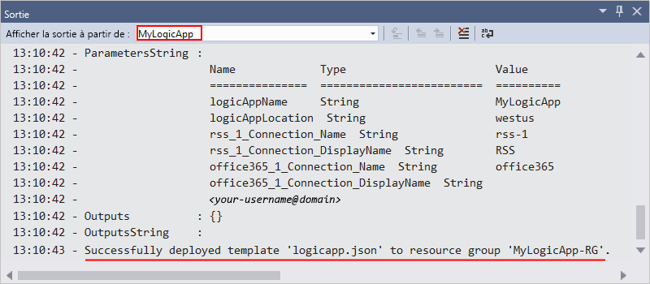

   Si vos connecteurs sélectionnés nécessitent une intervention de votre part, une fenêtre PowerShell s’ouvre en arrière-plan et vous demande de taper les mots de passe ou les clés secrètes éventuellement nécessaires. Le déploiement se poursuit dès que vous avez saisi ces informations.

   

   Une fois le déploiement terminé, votre application logique est en ligne dans le portail Azure et s’exécute en fonction de la planification que vous avez spécifiée (chaque minute). Si le déclencheur trouve de nouveaux éléments de flux, il s’active, créant une instance de workflow qui exécute les actions de votre application logique. Votre application logique envoie un e-mail pour chaque nouvel élément. Sinon, si le déclencheur ne trouve pas de nouveaux éléments, il ne s’active pas et « ignore » l’instanciation du workflow. Votre application logique attend jusqu’à l’intervalle suivant avant de procéder à une vérification.

   Voici des e-mails classiques envoyés par cette application logique. Si vous ne recevez aucun e-mail, vérifiez votre dossier Courrier indésirable.

   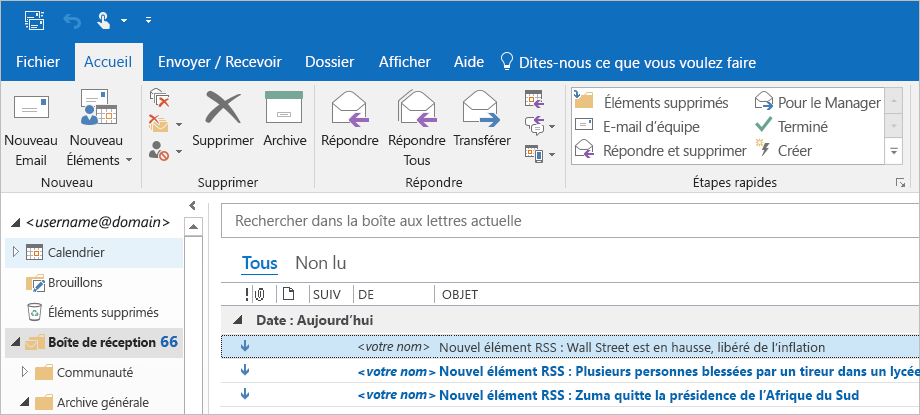

Félicitations, vous avez correctement généré et déployé votre application logique avec Visual Studio. Pour gérer votre application logique et examiner son historique des exécutions, consultez [Manage logic apps with Visual Studio](../logic-apps/manage-logic-apps-with-visual-studio.md) (Gérer des applications logiques avec Visual Studio).

## Ajouter une nouvelle application logique

Quand vous avez déjà un projet de groupe de ressources Azure, vous pouvez y ajouter une nouvelle application logique vide à partir de la fenêtre Structure JSON.

1. Dans l’Explorateur de solutions, ouvrez le fichier `<logic-app-name>.json`.

1. Dans le menu **Affichage**, sélectionnez **Autres fenêtres** > **Structure JSON**.

1. Pour ajouter une ressource au fichier de modèle, sélectionnez **Ajouter une ressource** en haut de la fenêtre Structure JSON. Ou bien, dans la fenêtre Structure JSON, ouvrez le menu contextuel **Ressources**, puis sélectionnez **Ajouter une nouvelle ressource**.

   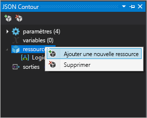

1. Dans la boîte de dialogue **Ajouter une ressource**, dans la zone de recherche, cherchez `logic app` et sélectionnez **Application logique**. Donnez un nom à votre application logique, puis sélectionnez **Ajouter**.

   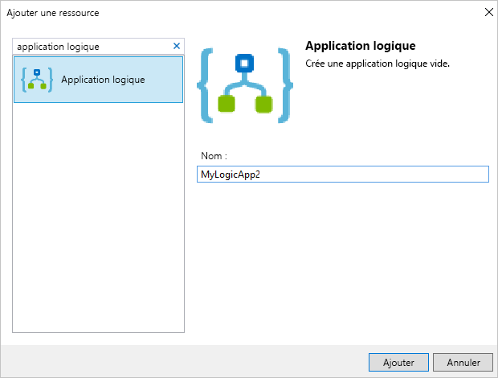

## Nettoyer les ressources

Quand vous n’avez plus besoin de votre application logique, supprimez le groupe de ressources qui contient celle-ci et les ressources associées.

1. Connectez-vous au [portail Azure](https://portal.azure.com) avec le même compte que celui utilisé pour créer votre application logique.

1. Dans le menu du portail Azure, sélectionnez **Groupes de ressources**, ou recherchez et sélectionnez **Groupes de ressources** dans n’importe quelle page. Sélectionnez le groupe de ressources de votre application logique.

1. Dans la page **Vue d’ensemble**, sélectionnez **Supprimer le groupe de ressources**. Confirmez le nom du groupe de ressources, puis sélectionnez **Supprimer**.

   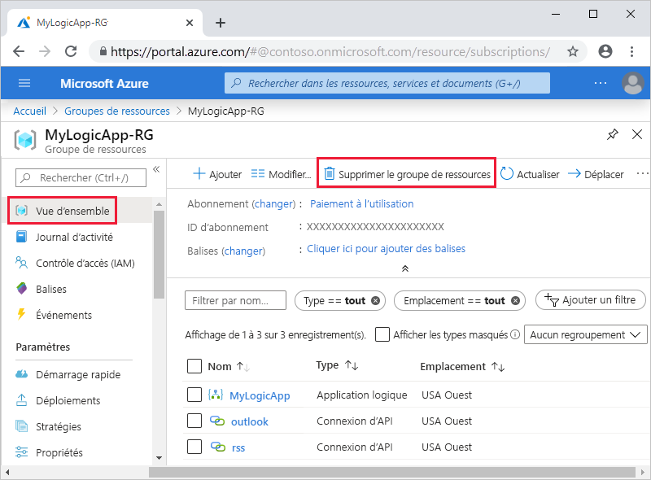

1. Supprimez la solution Visual Studio de votre ordinateur local.

## Étapes suivantes

Dans cet article, vous avez généré, déployé et exécuté votre application logique avec Visual Studio. Pour découvrir la gestion et l’exécution du déploiement avancé des applications logiques avec Visual Studio, consultez l’article suivant :

> [!div class="nextstepaction"]
> [Gérer des applications logiques avec Visual Studio](../logic-apps/manage-logic-apps-with-visual-studio.md)
