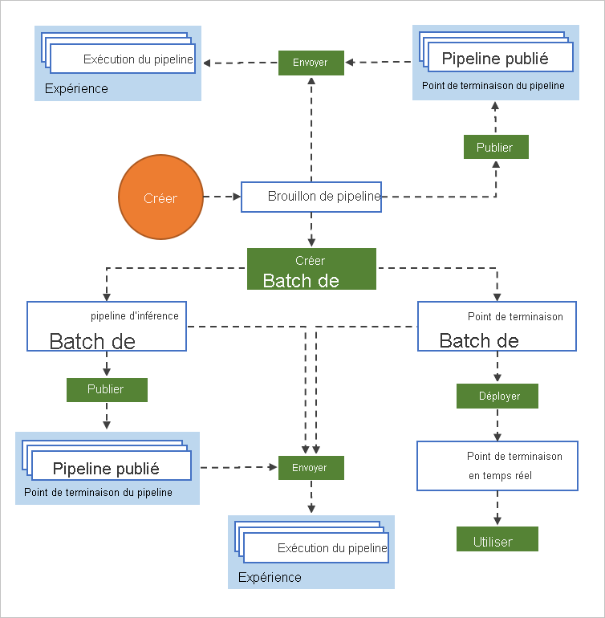

# Qu'est-ce que le concepteur Azure Machine Learning ? 

Le concepteur Azure Machine Learning vous permet de connecter visuellement les [jeux de données](#datasets) et les [modules](#module) sur un canevas interactif afin de créer des modèles Machine Learning. Pour plus d'informations sur la prise en main du concepteur, consultez [Tutoriel : Prédire le prix de voitures avec le concepteur](tutorial-designer-automobile-price-train-score.md)

Le concepteur utilise votre [espace de travail](concept-workspace.md) Azure Machine Learning pour organiser des ressources partagées telles que :

+ [Pipelines](#pipeline)
+ [Groupes de données](#datasets)
+ [Ressources de calcul](#compute)
+ [Modèles inscrits](concept-azure-machine-learning-architecture.md#models)
+ [Pipelines publiés](#publish)
+ [Points de terminaison en temps réel](#deploy)

## Formation et déploiement du modèle

Le concepteur vous donne un canevas visuel permettant de générer, tester et déployer des modèles Machine Learning. À l’aide du concepteur, vous pouvez :

+ Glisser-déplacer les [jeux de données](#datasets) et les [modules](#module) sur le canevas.
+ Connecter les modules pour former un [brouillon de pipeline](#pipeline-draft).
+ Envoyer une [exécution de pipeline](#pipeline-run) à l’aide des ressources de calcul de votre espace de travail Azure Machine Learning.
+ Convertir vos **pipelines de formation** en **pipelines d’inférence**.
+ [Publier](#publish) vos pipelines sur un **point de terminaison de pipeline** REST pour envoyer un nouveau pipeline qui s’exécute avec des paramètres et des jeux de données différents.
    + Publier un **pipeline de formation** pour réutiliser un pipeline unique afin d’effectuer l’apprentissage de plusieurs modèles tout en modifiant les paramètres et les jeux de données.
    + Publier un **pipeline d’inférence par lot** pour effectuer des prédictions sur de nouvelles données à l’aide d’un modèle préalablement formé.
+ [Déployer](#deploy) un **pipeline d’inférence en temps réel** vers un point de terminaison en temps réel pour effectuer des prédictions sur de nouvelles données en temps réel.

## Pipeline

Un [pipeline](concept-azure-machine-learning-architecture.md#ml-pipelines) se compose de jeux de données et de modules d’analyse qui sont connectés. Les pipelines ont de nombreuses utilisations : vous pouvez créer un pipeline qui effectue l’apprentissage d’un modèle unique ou un pipeline qui effectue l’apprentissage de plusieurs modèles. Il est possible de créer un pipeline qui effectue des prédictions en temps réel ou par lot, ou qui se contente de nettoyer les données. Les pipelines vous permettent de réutiliser votre travail et d’organiser vos projets.

### Brouillon de pipeline

Lorsque vous modifiez un pipeline dans le concepteur, votre progression est enregistrée en tant que **brouillon de pipeline**. Vous pouvez modifier un brouillon de pipeline à tout moment en ajoutant ou en supprimant des modules, en configurant des cibles de calcul, en créant des paramètres et ainsi de suite.

Un pipeline valide a les caractéristiques suivantes :

* Les jeux de données peuvent uniquement se connecter à des modules.
* Les modules peuvent uniquement se connecter à des jeux de données ou à d’autres modules.
* Tous les ports d’entrée des modules doivent comporter une connexion au flux de données.
* Tous les paramètres obligatoires de chaque module doivent être configurés.

Lorsque vous êtes prêt à exécuter votre brouillon de pipeline, vous soumettez une exécution de pipeline.

### Exécution du pipeline

Chaque fois que vous exécutez un pipeline, la configuration du pipeline et ses résultats sont stockés dans votre espace de travail sous la forme d’une **exécution de pipeline**. Vous pouvez revenir à n’importe quelle exécution de pipeline pour l’inspecter à des fins de résolution de problèmes ou d’audit. **Clonez** une exécution de pipeline pour créer un brouillon de pipeline que vous pouvez modifier.

Les exécutions de pipeline sont regroupées en [expériences](concept-azure-machine-learning-architecture.md#experiments) afin d’organiser l’historique des exécutions. Vous pouvez définir l’expérience pour chaque exécution de pipeline. 

## Groupes de données

Un jeu de données Machine Learning facilite l’accès aux données et l’utilisation de ces dernières. Plusieurs exemples de jeux de données sont inclus dans le concepteur à des fins de test. Vous pouvez [inscrire](how-to-create-register-datasets.md) plusieurs jeux de données en fonction de vos besoins.

## Module

Un module est un algorithme que vous appliquez à vos données. Le concepteur comporte plusieurs modules, allant de fonctions d’entrée des données à des processus d’entraînement, de scoring et de validation.

Un module peut comporter un ensemble de paramètres utilisables pour configurer les algorithmes internes du module. Quand vous sélectionnez un module dans le canevas, ses paramètres sont affichés dans le volet Propriétés à droite du canevas. Vous pouvez modifier les paramètres figurant dans ce volet pour affiner votre modèle. Vous pouvez définir les ressources de calcul pour des modules individuels dans le concepteur. 

:::image type="content" source="./media/concept-designer/properties.png" alt-text="Propriétés du module":::

Pour obtenir de l’aide sur la navigation dans la bibliothèque des algorithmes d’apprentissage automatique disponibles, consultez [Vue d’ensemble des informations de référence relatives aux algorithmes et aux modules](algorithm-module-reference/module-reference.md). Pour obtenir de l’aide sur le choix d’un algorithme, consultez [Aide-mémoire de l’algorithme Machine Learning](algorithm-cheat-sheet.md).

##  Ressources de calcul

Utilisez les ressources de calcul de votre espace de travail pour exécuter votre pipeline et héberger vos modèles déployés en tant que points de terminaison en temps réel ou points de terminaison de pipeline (pour l’inférence de lot). Les cibles de calcul prises en charge sont les suivantes :

| Cible de calcul | Entrainement | Déploiement |
| ---- |:----:|:----:|
| Capacité de calcul Azure Machine Learning | ✓ | |
| Instance de calcul Azure Machine Learning | ✓ | |
| Azure Kubernetes Service | | ✓ |

Les cibles de calcul sont associées à votre [espace de travail Azure Machine Learning](concept-workspace.md). Vous gérez vos cibles de calcul dans votre espace de travail dans le [studio Azure Machine Learning](https://ml.azure.com).

## Déployer

Pour effectuer une inférence en temps réel, vous devez déployer un pipeline en tant que **point de terminaison en temps réel**. Le point de terminaison en temps réel crée une interface entre une application externe et votre modèle de scoring. Un appel à un point de terminaison en temps réel renvoie les résultats de prédiction à l’application en temps réel. Pour générer un appel vers un point de terminaison en temps réel, vous transmettez la clé API créée au moment du déploiement du point de terminaison. Le point de terminaison s’appuie sur l’architecture populaire REST, souvent choisie pour les projets de programmation web.

Les points de terminaison en temps réel doivent être déployés sur un cluster Azure Kubernetes Service.

Pour savoir comment déployer votre modèle, consultez [Tutoriel : Déployez un modèle Machine Learning avec le concepteur](tutorial-designer-automobile-price-deploy.md).

## Publish

Vous pouvez également publier un pipeline sur un **point de terminaison de pipeline**. Semblable à un point de terminaison en temps réel, un point de terminaison de pipeline vous permet d’envoyer de nouvelles exécutions de pipeline à partir d’applications externes à l’aide d’appels REST. Toutefois, vous ne pouvez pas envoyer ni recevoir de données en temps réel à l’aide d’un point de terminaison de pipeline.

Les pipelines publiés sont flexibles ; ils peuvent être utilisés pour effectuer ou réeffectuer l’entraînement de modèles, [effectuer des inférences par lot](how-to-run-batch-predictions-designer.md), traiter de nouvelles données et bien plus encore. Vous pouvez publier plusieurs pipelines sur un point de terminaison de pipeline unique et spécifier la version de pipeline à exécuter.

Un pipeline publié s’exécute sur les ressources de calcul que vous définissez dans le brouillon de pipeline pour chaque module.

Le concepteur crée le même objet [PublishedPipeline](/python/api/azureml-pipeline-core/azureml.pipeline.core.graph.publishedpipeline?preserve-view=true&view=azure-ml-py) que le Kit de développement logiciel (SDK).

## Étapes suivantes

* Découvrez les principes fondamentaux de l’analytique prédictive et du Machine Learning à l’aide du [Tutoriel : Prédire le prix de voitures avec le concepteur](tutorial-designer-automobile-price-train-score.md)
* Découvrez comment modifier les [exemples de concepteur](samples-designer.md) pour les adapter à vos besoins.