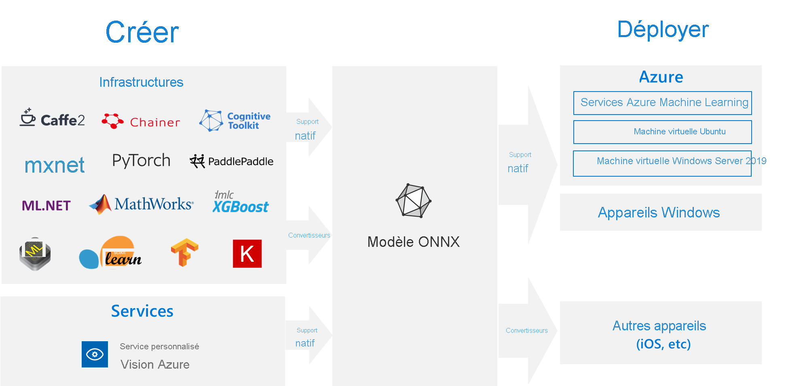

# <a name="onnx-and-azure-machine-learning-create-and-accelerate-ml-models"></a>ONNX et Azure Machine Learning : Créer et accélérer des modèles ML

Découvrez comment [Open Neural Network Exchange](https://onnx.ai) (ONNX) peut optimiser l’inférence de votre modèle Machine Learning. L’inférence, ou notation du modèle, est la phase où le modèle déployé est utilisé pour la prédiction, généralement sur des données de production. 

Il est difficile d’optimiser les modèles Machine Learning pour l’inférence (ou le scoring du modèle), car vous devez paramétrer le modèle et la bibliothèque d’inférence pour tirer le meilleur parti des fonctionnalités matérielles. Le problème devient extrêmement complexe lorsque vous souhaitez obtenir des performances optimales sur différents types de plateformes (cloud/edge, UC/GPU, etc.), étant donné que chaque plateforme a des caractéristiques et des fonctionnalités différentes. La complexité s’accroît si des modèles issus de diverses infrastructures doivent s’exécuter sur diverses plateformes. Il est très chronophage d’optimiser les différentes combinaisons d’infrastructures et de matériel. Il faut une solution de formation unique dans votre infrastructure par défaut et l’exécuter partout sur le cloud ou les appareils Edge. C’est là qu’entre en scène ONNX.

Microsoft et une communauté de partenaires ont créé ONNX : cette norme ouverte représente les modèles Machine Learning. Les modèles de [nombreuses infrastructures](https://onnx.ai/supported-tools) notamment TensorFlow, PyTorch, SciKit-Learn, Keras, Chainer, MXNet et MATLAB et SparkML peuvent être exportés ou convertis au format ONNX standard. Une fois que les modèles sont au format ONNX, ils peuvent s’exécuter sur une multitude de plateformes et d’appareils.

[ONNX Runtime](https://onnxruntime.ai) est un moteur d’inférence haute performance pour le déploiement de modèles ONNX en production. Il est optimisé pour le cloud et les appareils Edge, et il fonctionne sur Linux, Windows et Mac. Écrit dans C++ , il dispose également d’API C, Python, C# , Java et JavaScript (node. js) pour l’utilisation dans un large éventail d’environnements. Le Runtime ONNX prend en charge les modèles DNN ainsi que ML traditionnels et s’intègre avec les accélérateurs sur différents matériels, comme TensorRT sur les GPU NVidia, OpenVINO sur les processeurs Intel, DirectML sur Windows, et bien plus encore. Grâce à ONNX Runtime, vous pouvez tirer parti de vastes optimisations à l’échelle de la production, des tests et des améliorations en cours.

Runtime ONNX est utilisé dans les services Microsoft à grande échelle, tels que Bing, Office et Azure Cognitive Services. Les gains de performances dépendent d’un certain nombre de facteurs, mais ces services Microsoft ont enregistré __en moyenne des performances du processeur doublées__. En plus des services Azure Machine Learning, le runtime ONNX s’exécute également dans d’autres produits fonctionnant avec les charges de travail Machine Learning, notamment :
+ Windows : Le runtime est intégré à Windows dans le cadre du [Windows Machine Learning](/windows/ai/windows-ml/) et s’exécute sur des centaines de millions d’appareils. 
+ Famille de produits Azure SQL : Exécutez le scoring natif sur les données de [Azure SQL Edge](../azure-sql-edge/onnx-overview.md) et [Azure SQL Managed Instance](../azure-sql/managed-instance/machine-learning-services-overview.md).
+ ML.NET : [Exécutez les modèles ONNX dans ML.NET](/dotnet/machine-learning/tutorials/object-detection-onnx).


[](././media/concept-onnx/onnx.png#lightbox)

## <a name="get-onnx-models"></a>Obtenir des modèles ONNX

Vous pouvez obtenir des modèles ONNX de plusieurs façons :
+ Entraînez un nouveau modèle ONNX dans Azure Machine Learning (voir les exemples au bas de cet article) ou à l’aide de [fonctionnalités de Machine Learning automatisé](concept-automated-ml.md#automl--onnx)
+ Convertissez un modèle existant au format ONNX (voir les [tutoriels](https://github.com/onnx/tutorials)) 
+ Obtenir un modèle ONNX préentraîné à partir du [Zoo de modèles ONNX](https://github.com/onnx/models)
+ Générer un modèle ONNX personnalisé à partir du [service Vision personnalisée Azure](../cognitive-services/custom-vision-service/index.yml) 

De nombreux modèles, y compris la classification d’images, la détection d’objets et le traitement de texte, peuvent être représentés en tant que modèles ONNX. Si vous rencontrez un problème avec un modèle qui ne peut pas être converti correctement, veuillez remonter le problème dans le GitHub du convertisseur correspondant que vous avez utilisé. Vous pouvez continuer à utiliser le modèle de format existant jusqu’à ce que le problème soit résolu.

## <a name="deploy-onnx-models-in-azure"></a>Déployer des modèles ONNX dans Azure

Avec Azure Machine Learning, vous pouvez déployer, gérer et superviser vos modèles ONNX. En utilisant le [workflow de déploiement](concept-model-management-and-deployment.md) standard et ONNX Runtime, vous pouvez créer un point de terminaison REST hébergé dans le cloud. Pour essayer par vous-même, consultez l’exemple complet de notebooks Jupyter fourni à la fin de cet article. 

### <a name="install-and-use-onnx-runtime-with-python"></a>Installer et utiliser ONNX Runtime avec Python

Les packages Python pour ONNX Runtime sont disponibles sur [PyPi.org](https://pypi.org) ([UC](https://pypi.org/project/onnxruntime), [GPU](https://pypi.org/project/onnxruntime-gpu)). Veuillez lire la [configuration requise](https://github.com/Microsoft/onnxruntime#system-requirements) avant l’installation. 

 Pour installer ONNX Runtime pour Python, utilisez l’une des commandes suivantes : 
```python   
pip install onnxruntime       # CPU build
pip install onnxruntime-gpu   # GPU build
```

Pour appeler ONNX Runtime dans votre script Python, utilisez :    
```python
import onnxruntime
session = onnxruntime.InferenceSession("path to model")
```

La documentation qui accompagne le modèle indique généralement les entrées et sorties pour l’utilisation du modèle. Vous pouvez également utiliser un outil de visualisation tel que [Netron](https://github.com/lutzroeder/Netron) pour afficher le modèle. Le runtime ONNX vous permet également d’interroger les métadonnées, entrées et sorties du modèle :    
```python
session.get_modelmeta()
first_input_name = session.get_inputs()[0].name
first_output_name = session.get_outputs()[0].name
```

Pour déduire votre modèle, utilisez `run` et passez la liste des sorties à retourner (laissez vide si vous souhaitez toutes les retourner) et un mappage des valeurs d’entrée. Le résultat est une liste des sorties.  
```python
results = session.run(["output1", "output2"], {
                      "input1": indata1, "input2": indata2})
results = session.run([], {"input1": indata1, "input2": indata2})
```

Pour obtenir des informations de référence complètes sur l’API Python, consultez [les documents de référence sur ONNX Runtime](https://aka.ms/onnxruntime-python).    

## <a name="examples"></a>Exemples
Consultez [how-to-use-azureml/déploiement/onnx](https://github.com/Azure/MachineLearningNotebooks/blob/master/how-to-use-azureml/deployment/onnx) pour obtenir des exemples de notebooks Python qui créent et déploient des modèles ONNX.

[!INCLUDE [aml-clone-in-azure-notebook](../../includes/aml-clone-for-examples.md)]

Vous trouverez des exemples d’utilisation dans d’autres langages dans la page [GitHub relative au runtime ONNX](https://github.com/microsoft/onnxruntime/tree/master/samples).

## <a name="more-info"></a>En savoir plus

Apprenez-en davantage sur **ONNX** ou contribuez au projet :
+ [Site web du projet ONNX](https://onnx.ai)
+ [Code ONNX sur GitHub](https://github.com/onnx/onnx)

Apprenez-en davantage sur **ONNX Runtime** ou contribuez au projet :
+ [Site Web du projet ONNX Runtime](https://onnxruntime.ai)
+ [Dépôt GitHub d’ONNX Runtime](https://github.com/Microsoft/onnxruntime)