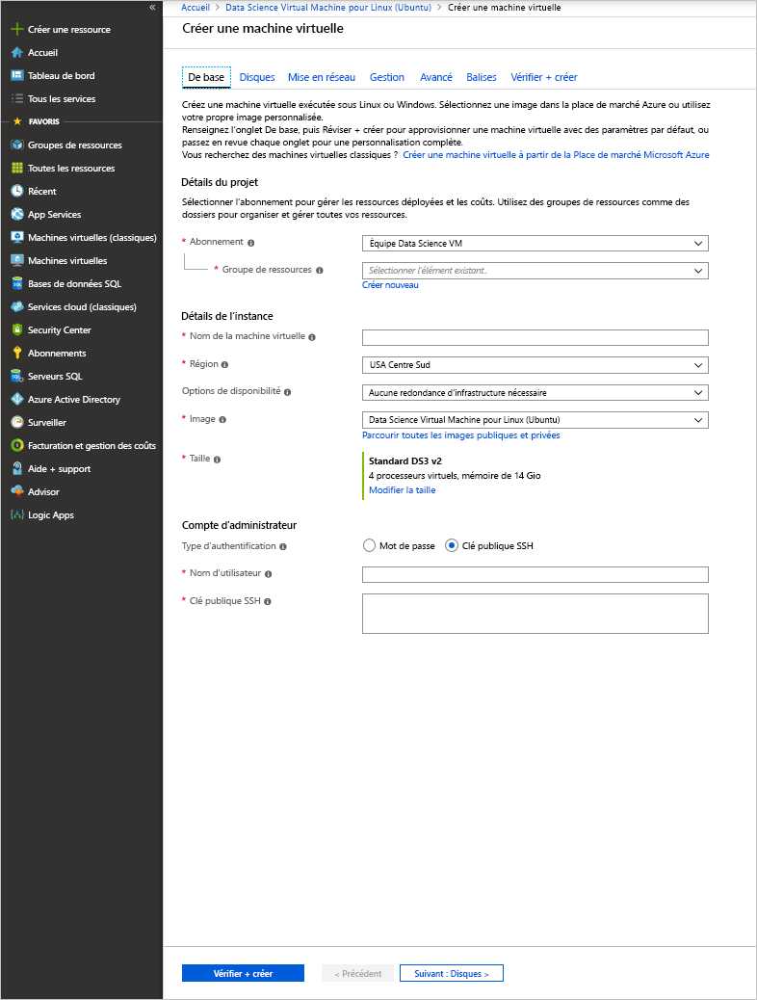

# <a name="quickstart-set-up-the-data-science-virtual-machine-for-linux-ubuntu"></a>Démarrage rapide : Configurer la machine virtuelle Science des données pour Linux (Ubuntu)

La machine virtuelle DSVM (Data Science Virtual Machine) pour Linux est une image de machine virtuelle Ubuntu qui permet de bien démarrer avec le Machine Learning, notamment l’apprentissage profond (Deep Learning), dans Azure. Outils d’apprentissage approfondi :

* [Caffe](https://caffe.berkeleyvision.org/) : framework d’apprentissage profond conçu pour la rapidité, l’expressivité et la modularité.
* [Caffe2](https://github.com/caffe2/caffe2) : version multiplateforme de Caffe.
* [Microsoft Cognitive Toolkit](https://github.com/Microsoft/CNTK) : kit de ressources logicielles d’apprentissage profond de Microsoft Research.
* [H2O](https://www.h2o.ai/) : plateforme Big Data open source et interface graphique utilisateur.
* [Keras](https://keras.io/) : API de réseau neuronal de haut niveau en Python pour TensorFlow, Microsoft Cognitive Toolkit et Theano.
* [MXNet](https://mxnet.io/) : bibliothèque d’apprentissage profond flexible et efficace avec de nombreuses liaisons de langage.
* [NVIDIA DIGITS](https://developer.nvidia.com/digits) : système graphique qui simplifie les tâches courantes d’apprentissage profond.
* [PyTorch](https://pytorch.org/) : bibliothèque Python générale avec prise en charge des réseaux dynamiques.
* [TensorFlow](https://www.tensorflow.org/) : bibliothèque open source de Google pour l’intelligence artificielle.
* [Theano](http://deeplearning.net/software/theano/) : bibliothèque Python permettant de définir, d’optimiser et d’évaluer efficacement les expressions mathématiques impliquant des tableaux multidimensionnels.
* [Torch](http://torch.ch/) : framework de calcul scientifique avec prise en charge étendue des algorithmes de Machine Learning.
* CUDA, cuDNN et le pilote NVIDIA.
* Nombreux exemples de notebooks Jupyter.

Toutes les bibliothèques sont les versions GPU, même si elles s’exécutent également sur le processeur.

La machine virtuelle pour la science des données pour Linux contient également des outils populaires pour la science des données et les activités de développement, notamment :

* Microsoft Machine Learning Server avec Microsoft R Open.
* Distribution Anaconda Python (versions 2.7 et 3.5), comprenant les bibliothèques courantes d’analytique données.
* JuliaPro : une distribution organisée du langage Julia avec des bibliothèques scientifiques et d’analytique données couramment utilisées.
* Instance Spark autonome et nœud Hadoop unique (HDFS, Yarn).
* JupyterHub : un serveur de notebooks Jupyter multi-utilisateur prenant en charge les noyaux R, Python, PySpark et Julia.
* Azure Storage Explorer.
* Azure CLI pour gérer les ressources Azure.
* Outils Machine Learning :
  * [Vowpal Wabbit](https://github.com/JohnLangford/vowpal_wabbit) : système de Machine Learning rapide prenant en charge des techniques comme l’apprentissage de type en ligne, hachage, allreduce, réductions, learning2search, actif et interactif.
  * [XGBoost](https://xgboost.readthedocs.org/en/latest/) : Un outil qui offre une implémentation rapide et précise des arborescences optimisées.
  * [Rattle](https://togaware.com/rattle/) : outil graphique qui permet de bien démarrer avec l’analytique données et du Machine Learning en R.
  * [LightGBM](https://github.com/Microsoft/LightGBM) : framework de boosting de gradient rapide, distribué et hautes performances.
* SDK Azure dans Java, Python, node.js, Ruby et PHP.
* Bibliothèques dans les langages R et Python à utiliser dans Azure Machine Learning et d’autres services Azure.
* Outils de développement et éditeurs (RStudio, PyCharm, IntelliJ, Emacs, vim).

La science des données consiste à itérer sur une séquence de tâches :

1. Recherche, chargement et traitement des données
1. Création et test des modèles
1. Déploiement des modèles à des fins d’utilisation dans des applications intelligentes

Les scientifiques de données utilisent différents outils pour effectuer ces tâches. Le fait de rechercher les versions adéquates des logiciels, puis de les télécharger, de les compiler et de les installer peut prendre un certain temps.

La machine virtuelle pour la science des données pour Linux est là pour vous soulager en grande partie de cette charge. Utilisez-la pour démarrer rapidement votre projet d’analyse. Elle vous permet de travailler sur des tâches basées sur différents langages, notamment R, Python, SQL, Java et C++. Le kit SDK Azure inclus dans la machine virtuelle vous permet de créer des applications à l’aide de divers services sous Linux disponibles sur la plateforme cloud Microsoft. En outre, vous avez accès à d’autres langages tels que Ruby, Perl, PHP et node.js, qui sont préinstallés.

Cette image DSVM ne génère pas de frais logiciels. Vous payez uniquement les frais d’utilisation matérielle Azure en fonction de la taille de la machine virtuelle approvisionnée. Pour plus d’informations sur les frais de calcul, consultez la [liste des machines virtuelles sur la Place de marché Azure](https://azure.microsoft.com/marketplace/partners/microsoft-ads/linux-data-science-vm/).

## <a name="other-versions-of-the-data-science-virtual-machine"></a>Autres versions de la machine virtuelle Data Science Virtual Machine

Une image [CentOS](linux-dsvm-intro.md) est également disponible avec la plupart des mêmes outils que l’image Ubuntu. Une image [Windows](provision-vm.md) est également disponible.

## <a name="prerequisites"></a>Prérequis

Avant de pouvoir créer une machine virtuelle pour la science des données pour Linux, vous devez disposer d’un abonnement Azure. Vous pouvez [obtenir un essai gratuit d’Azure](https://azure.microsoft.com/free/).

## <a name="create-your-data-science-virtual-machine-for-linux"></a>Créer une machine virtuelle pour la science des données pour Linux

Voici les étapes de création d’une instance de la machine virtuelle pour la science des données pour Linux :

1. Accédez à la liste des machines virtuelles présentes sur le [portail Azure](https://portal.azure.com/#create/microsoft-dsvm.linux-data-science-vm-ubuntulinuxdsvmubuntu). Si vous n’êtes pas connecté, vous pouvez être invité à vous connecter à votre compte Azure. 
1. Sélectionnez **Créer** pour afficher l’Assistant.
    
1. Entrez les informations suivantes pour configurer chaque étape de l’Assistant :

    1. **Paramètres de base**:
    
       * **Abonnement**: Si vous disposez de plusieurs abonnements, sélectionnez celui qui sera associé à la création et à la facturation de la machine. Vous devez disposer des privilèges de création de ressources pour cet abonnement.
       * **Groupe de ressources** : Vous pouvez en créer un nouveau ou utiliser un groupe existant.
       * **Nom de la machine virtuelle** : Entrez un nom pour le serveur de science des données que vous créez.
       * **Région** : Sélectionnez le centre de données qui convient le mieux. Généralement, il s’agit du centre de données qui héberge la plupart de vos données ou du centre de données le plus proche de votre emplacement physique, ce qui permet d’accélérer l’accès au réseau.
       * **Options de disponibilité** : Définissez cette option si vous souhaitez utiliser cette machine virtuelle dans des zones ou des groupes à haute disponibilité. Sinon, conservez la valeur par défaut.
       * **Image** : Conservez la valeur par défaut.
       * **Taille**: Sélectionnez le type de serveur qui répond à vos exigences fonctionnelles et à vos contraintes de coût. Sélectionnez une machine virtuelle de série NC ou ND pour des instances de machine virtuelle basées sur GPU. 
       * **Nom d’utilisateur** : Entrez le nom d’utilisateur de l’administrateur.
       * **Clé publique SSH** : Entrez la clé publique RSA sur une seule ligne (vous pouvez utiliser un mot de passe au lieu d’une clé SSH).
    
    1. **Disques** :
    
       * **Type de disque du système d’exploitation** : choisissez **SSD Premium** si vous préférez un disque SSD. Sinon, choisissez **HDD Standard**.
    
    1. Pour les autres paramètres, vous pouvez utiliser les valeurs par défaut. Si vous ne souhaitez pas utiliser les valeurs par défaut, survolez le lien d’informations pour obtenir de l’aide. Quand vous avez terminé, sélectionnez **Vérifier + créer**.
    
    1. Une fois la machine virtuelle validée, vérifiez que toutes les informations que vous avez saisies sont correctes. Un lien vous dirige vers les conditions d’utilisation. La machine virtuelle n’entraîne pas de frais autres que ceux liés au calcul de la taille de serveur que vous avez choisie dans le champ **Taille**. Pour démarrer le provisionnement, sélectionnez **Créer**.
    
    L’approvisionnement prend environ 5 minutes. Cet état est affiché dans le portail Azure.

## <a name="how-to-access-the-data-science-virtual-machine-for-linux"></a>Accès à une machine virtuelle pour la science des données pour Linux

Vous pouvez accéder à la machine DSVM Ubuntu à l’aide de trois méthodes :

- SSH pour les sessions Terminal Server
- X2Go pour les sessions graphiques
- JupyterHub et JupyterLab pour les blocs-notes Jupyter

Vous pouvez également attacher une DSVM à Azure Notebooks pour exécuter des notebooks Jupyter sur la machine virtuelle et contourner les limitations du niveau de service gratuit. Pour plus d’informations, consultez [Gérer et configurer des projets Azure Notebooks](../../notebooks/configure-manage-azure-notebooks-projects.md#compute-tier).

### <a name="ssh"></a>SSH

Une fois la machine virtuelle créée, vous pouvez vous y connecter avec SSH. Utilisez les informations d’identification de compte créées dans la section **Paramètres de base** de l’étape 3 de l’interface de l’interpréteur de commandes texte. Sur Windows, vous pouvez télécharger un outil client SSH tel que [PuTTY](https://www.putty.org). Si vous préférez un environnement de bureau graphique (X Window System), vous pouvez utiliser le transfert X11 sur PuTTY ou installer le client X2Go.

> [!NOTE]
> Lors de tests, le client X2Go a obtenu de meilleures performances que le transfert X11. Nous recommandons d’utiliser le client X2Go pour une interface de bureau graphique.

### <a name="x2go"></a>X2Go

La machine virtuelle Linux est déjà provisionnée avec le serveur X2Go et elle est prête à accepter des connexions clientes. Pour vous connecter au bureau graphique de la machine virtuelle Linux, effectuez les opérations suivantes sur votre client :

1. Téléchargez et installez le client X2Go pour votre plateforme cliente sur [X2Go](https://wiki.x2go.org/doku.php/doc:installation:x2goclient).
1. Exécutez le client X2Go et sélectionnez **New Session**(Nouvelle session). Une fenêtre de configuration avec plusieurs onglets s’ouvre. Entrez les paramètres de configuration suivants :
   * **Onglet Session**:
     * **Hôte** : Entrez le nom d’hôte ou l’adresse IP de votre machine virtuelle DSVM Linux.
     * **Connexion** : Entrez le nom d’utilisateur dans la machine virtuelle Linux.
     * **Port SSH** : conservez la valeur par défaut (22).
     * **Type de session** : remplacez la valeur par **XFCE**. La machine virtuelle Linux prend uniquement en charge l’environnement de bureau XFCE.
   * **Onglet Multimédia** : vous pouvez désactiver l’impression client et la prise en charge du son si vous n’en avez pas besoin.
   * **Dossiers partagés** : si vous voulez que des répertoires de vos ordinateurs clients soient montés sur la machine virtuelle Linux, ajoutez ceux que vous souhaitez partager avec la machine virtuelle sous cet onglet.

Une fois connecté à la machine virtuelle à l’aide du client SSH ou de l’environnement de bureau graphique XFCE par le biais du client X2Go, vous pouvez commencer à utiliser les outils installés et configurés sur la machine virtuelle. Sur XFCE, vous pouvez voir les icônes du bureau et les raccourcis du menu d’application de la plupart des outils.

### <a name="jupyterhub-and-jupyterlab"></a>JupyterHub et JupyterLab

La machine DSVM Ubuntu exécute [JupyterHub](https://github.com/jupyterhub/jupyterhub), qui est un serveur multi-utilisateur Jupyter. Pour vous connecter, accédez à https:\//adresse-ip-de-votre-machine-virtuelle:8000 sur votre ordinateur portable ou votre poste de travail. Pour vous connecter, entrez le nom d’utilisateur et le mot de passe que vous avez utilisés pour créer la machine virtuelle. De nombreux exemples de blocs-notes sont disponibles et peuvent être testés.

JupyterLab, nouvelle génération de blocs-notes Jupyter, et JupyterHub, sont également disponibles. Pour y accéder, connectez-vous à JupyterHub, puis accédez à l’URL https:\//adresse-ip-de-votre-machine-virtuelle:8000/user/votre-nom-d’utilisateur/lab. Vous pouvez définir JupyterLab en tant que serveur de notebooks par défaut en ajoutant la ligne suivante à `/etc/jupyterhub/jupyterhub_config.py` :

```python
c.Spawner.default_url = '/lab'
```

## <a name="tools-installed-on-the-data-science-virtual-machine-for-linux"></a>Outils installés sur la machine virtuelle pour la science des données pour Linux

### <a name="deep-learning-libraries"></a>Bibliothèques d’apprentissage profond

#### <a name="cntk"></a>CNTK (Computational Network Toolkit de Microsoft Research)

Microsoft Cognitive Toolkit est un kit de ressources d’apprentissage profond open source. Les liaisons Python sont disponibles dans les environnements Conda racine et py35. Il contient également un outil en ligne de commande (CNTK) qui se trouve déjà dans le chemin.

Des exemples de bloc-notes Python sont disponibles dans JupyterHub. Pour lancer un exemple de base à partir de la ligne de commande, exécutez les commandes suivantes dans l’interpréteur de commandes :

```bash
cd /home/[USERNAME]/notebooks/CNTK/HelloWorld-LogisticRegression
cntk configFile=lr_bs.cntk makeMode=false command=Train
```

Pour plus d’informations, consultez la section CNTK de [GitHub](https://github.com/Microsoft/CNTK) et du [wiki CNTK](https://github.com/Microsoft/CNTK/wiki).

#### <a name="caffe"></a>Caffe

Caffe est une infrastructure d’apprentissage approfondi de Berkeley Vision et Learning Center. Il est disponible dans /opt/caffe. Vous trouverez des exemples sous /opt/caffe/examples.

#### <a name="caffe2"></a>Caffe2

Caffe2 est un framework de formation approfondie de Facebook qui repose sur Caffe. Il est disponible en Python 2.7 dans l’environnement racine Conda. Pour l’activer, exécutez la commande suivante à partir de l’interpréteur de commandes :

```bash
source /anaconda/bin/activate root
```

Quelques exemples de bloc-notes sont disponibles dans JupyterHub.

#### <a name="h2o"></a>H2O

H2O est une plateforme d’analyse prédictive et d’apprentissage automatique rapide, en mémoire et distribuée. Un package Python est installé dans les environnements Anaconda racine et py35. Un package R est également installé. 

Pour ouvrir H2O à partir de la ligne de commande, exécutez `java -jar /dsvm/tools/h2o/current/h2o.jar`. Vous pouvez configurer différentes [options de ligne de commande](http://docs.h2o.ai/h2o/latest-stable/h2o-docs/starting-h2o.html#from-the-command-line). Pour commencer, vous pouvez accéder à l’interface utilisateur Flow Web, qui est accessible ici : http://localhost:54321. Des exemples de bloc-notes sont également disponibles dans JupyterHub.

#### <a name="keras"></a>Keras

Keras est une API de réseau neuronal de haut niveau Python. Elle peut s’exécuter sur TensorFlow, Microsoft Cognitive Toolkit ou Theano. Elle est disponible dans les environnements Python racine et py35.

#### <a name="mxnet"></a>MXNet

MXNet est une infrastructure d’apprentissage approfondi conçue pour offrir efficacité et flexibilité. Elle possède des liaisons R et Python incluses dans la machine virtuelle DSVM. Des exemples de bloc-notes sont inclus dans JupyterHub et un exemple de code est disponible dans /dsvm/samples/mxnet.

#### <a name="nvidia-digits"></a>NVIDIA DIGITS

NVIDIA propose un système d’entraînement des GPU de type Deep Learning appelé DIGITS, qui permet de simplifier les tâches courantes d’apprentissage profond. Ces tâches incluent la gestion des données, la conception et l’entraînement des réseaux neuronaux sur des systèmes GPU et la supervision des performances en temps réel avec une visualisation avancée.

DIGITS est disponible par le biais du service *digits*. Pour commencer, démarrez le service et accédez à http://localhost:5000.

DIGITS est également installé en tant que module Python dans l’environnement Conda racine.

#### <a name="tensorflow"></a>TensorFlow

TensorFlow est la bibliothèque d’apprentissage approfondi de Google. C’est une bibliothèque de logiciels open source destinée aux calculs numériques à l’aide de graphes de flux de données. TensorFlow est disponible dans l’environnement Python py35, et certains exemples de bloc-notes sont inclus dans JupyterHub.

#### <a name="theano"></a>Theano

Theano est une bibliothèque Python destinée à des calculs numériques efficaces. Elle est disponible dans les environnements Python racine et py35. 

#### <a name="torch"></a>Torch

Torch est une infrastructure informatique scientifique avec prise en charge étendue des algorithmes d’apprentissage automatique. Il est disponible dans /dsvm/tools/torch. La session interactive **th** et le gestionnaire de package LuaRocks sont disponibles sur la ligne de commande. Des exemples sont disponibles dans /dsvm/samples/torch.

PyTorch est également disponible dans l’environnement Anaconda racine. Des exemples sont disponibles dans /dsvm/samples/pytorch.

### <a name="microsoft-machine-learning-server"></a>Microsoft Machine Learning Server

R est le langage le plus répandu pour l’analyse des données et l’apprentissage automatique. Si vous souhaitez utiliser R pour votre analytique, la machine virtuelle comprend Microsoft Machine Learning Server avec Microsoft R Open et Math Kernel Library. Math Kernel Library optimise les opérations mathématiques courantes dans des algorithmes d’analytique. Microsoft R Open est entièrement compatible avec CRAN-R et les bibliothèques R publiées dans CRAN peuvent être installées sur Microsoft R Open. 

Machine Learning Server assure la mise à l’échelle et l’opérationnalisation des modèles R dans les services web. Vous pouvez modifier vos programmes R dans l’un des éditeurs par défaut, comme RStudio, vi ou Emacs. Si vous préférez utiliser l’éditeur Emacs, celui-ci a été préinstallé. Le package Emacs ESS (Emacs Speaks Statistics) simplifie l’utilisation des fichiers R dans l’éditeur Emacs.

Pour ouvrir la console R, entrez **R** dans l’interpréteur de commandes. Cette commande vous permet d’accéder à un environnement interactif. Pour développer votre programme R, vous utilisez généralement un éditeur comme Emacs ou vi, puis exécutez les scripts dans R. Avec RStudio, vous disposez d’un environnement de développement graphique intégré et complet pour développer votre programme R.

Il existe également un script R qui permet d’installer les [packages Top 20 R](https://www.kdnuggets.com/2015/06/top-20-r-packages.html) si vous le souhaitez. Une fois dans l’interface interactive R, vous pouvez exécuter ce script. Comme mentionné précédemment, vous pouvez ouvrir cette interface en entrant **R** dans l’interpréteur de commandes.  

### <a name="python"></a>Python

Anaconda Python est installé avec les environnements Python 2.7 et 3.5. L’environnement 2.7 est appelé _root_, et l’environnement 3.5 est appelé _py35_. Cette distribution contient le langage Python de base avec environ 300 packages de mathématiques, d’ingénierie et d’analyse de données figurant parmi les plus populaires.

L’environnement py35 est l’environnement par défaut. Pour activer l’environnement root (2.7), exécutez la commande suivante :

```bash
source activate root
```

Pour réactiver l’environnement racine py35, exécutez la commande suivante :

```bash
source activate py35
```

Pour appeler la session interactive Python, entrez **python** dans l’interpréteur de commandes. 

Utilisez Conda ou pip pour installer des bibliothèques Python supplémentaires. Pour pip, activez d’abord l’environnement approprié si vous ne voulez pas utiliser l’environnement par défaut :

```bash
source activate root
pip install <package>
```

Vous pouvez également spécifier le chemin complet de pip :

```bash
/anaconda/bin/pip install <package>
```

Pour Conda, vous devez toujours spécifier le nom de l’environnement (py35 ou root) :

```bash
conda install <package> -n py35
```

Si vous travaillez sur une interface graphique ou si le transfert X11 est configuré, vous pouvez entrer **pycharm** pour ouvrir l’IDE Python PyCharm. Vous pouvez utiliser les éditeurs de texte par défaut. En outre, vous pouvez utiliser Spyder, un IDE Python fourni avec les distributions Anaconda Python. Spyder requiert un bureau graphique ou le transfert X11. L’environnement de bureau graphique fournit un raccourci vers Spyder.

### <a name="jupyter-notebook"></a>Jupyter Notebook

La distribution Anaconda est également fournie avec un serveur Jupyter Notebook, un environnement conçu pour le partage de code et d’analyses. Le serveur Jupyter Notebook est accessible via JupyterHub. Vous vous connectez en utilisant votre nom d’utilisateur Linux local et votre mot de passe.

Le serveur Jupyter Notebook a été préconfiguré avec Python 2, Python 3 et les noyaux R. Utilisez l’icône de bureau **Jupyter Notebook** pour ouvrir le navigateur et accéder au serveur de notebooks. Si vous vous trouvez sur la machine virtuelle par le biais du client SSH ou X2Go, vous pouvez également accéder au serveur Jupyter Notebook à l’adresse suivante : [https://localhost:8000/](https://localhost:8000/).

> [!NOTE]
> Si vous recevez des avertissements relatifs au certificat, vous pouvez les ignorer.

Vous pouvez accéder au serveur Jupyter Notebook à partir de n’importe quel hôte. Entrez **https://\<nom DNS ou adresse IP de la machine virtuelle\>:8000/** .

> [!NOTE]
> Le port 8000 est ouvert par défaut dans le pare-feu lorsque la machine virtuelle est configurée. 

Nous avons inclus deux exemples de notebooks : l’un en Python et l’autre en R. Une fois que vous vous serez authentifié auprès du serveur Jupyter Notebook avec votre nom d’utilisateur Linux local et votre mot de passe, vous verrez le lien vers les exemples dans la page d’accueil du notebook. Vous pouvez créer un notebook en sélectionnant **Nouveau**, puis en sélectionnant le noyau avec le langage approprié. Si vous ne voyez pas le bouton **Nouveau**, sélectionnez l’icône **Jupyter** en haut à gauche pour accéder à la page d’accueil du serveur de notebook.

### <a name="apache-spark-standalone"></a>Instance autonome d’Apache Spark

Une instance autonome d’Apache Spark est préinstallée sur la machine DSVM Linux pour vous aider à développer des applications Spark localement avant de procéder aux tests et aux déploiements sur des clusters de grande taille. 

Vous pouvez exécuter des programmes PySpark via le noyau Jupyter. Lorsque vous ouvrez Jupyter, sélectionnez le bouton **Nouveau** pour afficher la liste des noyaux disponibles. **Spark – Python** est le noyau PySpark qui vous permet de créer des applications Spark à l’aide du langage Python. Vous pouvez également utiliser un IDE Python comme PyCharm ou Spyder pour créer votre programme Spark. 

Dans cette instance autonome, la pile Spark s’exécute dans le programme client appelant. Il est ainsi plus rapide et plus facile de résoudre les problèmes que dans le cadre d’un développement sur un cluster Spark.

Jupyter fournit un exemple de notebook PySpark. Il se trouve dans le répertoire SparkML, sous le répertoire de base de Jupyter ($HOME/notebooks/SparkML/pySpark). 

Si vous programmez en R pour Spark, vous pouvez utiliser Microsoft Machine Learning Server, SparkR ou sparklyr. 

Avant toute exécution dans un contexte Spark dans Microsoft Machine Learning Server, vous devez effectuer une opération de configuration unique pour activer une instance Yarn et HDFS Hadoop à nœud unique locale. Par défaut, les services Hadoop sont installés mais désactivés sur la DSVM. Pour les activer, vous devez exécuter les commandes suivantes en tant que racine la première fois :

```bash
echo -e 'y\n' | ssh-keygen -t rsa -P '' -f ~hadoop/.ssh/id_rsa
cat ~hadoop/.ssh/id_rsa.pub >> ~hadoop/.ssh/authorized_keys
chmod 0600 ~hadoop/.ssh/authorized_keys
chown hadoop:hadoop ~hadoop/.ssh/id_rsa
chown hadoop:hadoop ~hadoop/.ssh/id_rsa.pub
chown hadoop:hadoop ~hadoop/.ssh/authorized_keys
systemctl start hadoop-namenode hadoop-datanode hadoop-yarn
```

Vous pouvez arrêter les services liés à Hadoop lorsque vous n’en avez pas besoin en exécutant ```systemctl stop hadoop-namenode hadoop-datanode hadoop-yarn```.

Le répertoire/dsvm/samples/MRS fournit un exemple qui montre comment développer et tester Microsoft Machine Learning Server dans un contexte Spark distant (l’instance Spark autonome sur la machine DSVM).

### <a name="ides-and-editors"></a>IDE et éditeurs

Vous avez le choix entre plusieurs éditeurs de code, notamment vi/Vim, Emacs, PyCharm, RStudio et IntelliJ. 

PyCharm, RStudio et IntelliJ sont des éditeurs graphiques. Pour les utiliser, vous devez être connecté à un environnement de bureau graphique. Utilisez les raccourcis du menu de l’application et du bureau pour les ouvrir.

Vim et Emacs sont des éditeurs de texte. Sur Emacs, le package du module complémentaire ESS facilite l’utilisation du langage R dans l’éditeur Emacs. Pour plus d’informations, consultez le [site web d’ESS](https://ess.r-project.org/).

LaTeX est installé via le package texlive, en même temps qu’un package de module complémentaire Emacs appelé [AUCTeX](https://www.gnu.org/software/auctex/manual/auctex/auctex.html). Ce package simplifie la création de vos documents LaTeX dans Emacs.  

### <a name="databases"></a>Bases de données

#### <a name="graphical-sql-client"></a>Client SQL graphique

Le client SQL graphique SQuirrel SQL peut se connecter à différentes bases de données (comme Microsoft SQL Server et MySQL) et exécuter des requêtes SQL. Vous pouvez exécuter SQuirrel SQL dans une session d’environnement de bureau graphique (dans un client X2Go, par exemple) à l’aide d’une icône de bureau. Vous pouvez également exécuter le client à l’aide de la commande suivante dans l’interpréteur de commandes :

```bash
/usr/local/squirrel-sql-3.7/squirrel-sql.sh
```

Avant la première utilisation, configurez vos pilotes et alias de bases de données. Les pilotes JDBC se trouvent sous /usr/share/Java/jdbcdrivers.

Pour plus d’informations, consultez [SQuirrel SQL](http://squirrel-sql.sourceforge.net/index.php?page=screenshots).

#### <a name="command-line-tools-for-accessing-microsoft-sql-server"></a>Outils en ligne de commande pour l’accès à Microsoft SQL Server

Le package de pilotes ODBC pour SQL Server est également fourni avec deux outils en ligne de commande :

- **bcp** : cet outil copie les données en bloc entre une instance de Microsoft SQL Server et un fichier de données dans un format spécifié par l’utilisateur. Vous pouvez utiliser l’utilitaire bcp pour importer un grand nombre de nouvelles lignes dans des tables SQL Server, ou pour exporter des données hors des tables sous forme de fichiers de données. Pour importer des données dans une table, vous devez utiliser un fichier de format créé pour cette table. Sinon, vous devez comprendre la structure de la table et les types de données qui sont valides pour ses colonnes.

  Pour plus d’informations, consultez [Connexion avec bcp](https://msdn.microsoft.com/library/hh568446.aspx).

- **sqlcmd** : Vous pouvez entrer des instructions Transact-SQL à l’aide de l’outil sqlcmd. Vous pouvez également entrer des procédures système et des fichiers de script à l’invite de commandes. Cet outil utilise ODBC pour exécuter des lots Transact-SQL.

  Pour plus d’informations, consultez [Connexion avec sqlcmd](https://msdn.microsoft.com/library/hh568447.aspx).

  > [!NOTE]
  > L’outil présente de légères différences entre les plateformes Linux et Windows. Consultez la documentation pur plus d'informations.

#### <a name="database-access-libraries"></a>Bibliothèques pour l’accès aux bases de données

Les bibliothèques permettant d’accéder aux bases de données sont disponibles en R et en Python :

* Pour R, le package RODBC ou dplyr permet d’interroger ou d’exécuter des instructions SQL sur le serveur de bases de données.
* Pour Python, la bibliothèque pyodbc fournit l’accès aux bases de données avec ODBC en tant que couche sous-jacente.  

### <a name="azure-tools"></a>Outils Azure

Les outils Azure suivants sont installés sur la machine virtuelle :

* **Azure CLI** : vous pouvez utiliser l’interface de ligne de commande Azure pour créer et gérer des ressources Azure par le biais de commandes dans un interpréteur. Pour ouvrir les outils Azure, entrez **azure help**. Pour plus d’informations, consultez la [page de documentation relative à l’interface CLI Azure](https://docs.microsoft.com/cli/azure/get-started-with-az-cli2).
* **Explorateur Stockage Azure** : il s’agit d’un outil graphique permettant de parcourir les objets stockés dans votre compte de stockage Azure, et de charger et télécharger des données dans des objets blob Azure. Vous pouvez accéder à l’Explorateur de stockage à partir de l’icône de raccourci sur le bureau. Vous pouvez également l’ouvrir à partir d’une invite de commandes en entrant **StorageExplorer**. Vous devez être connecté à partir d’un client X2Go ou avoir configuré le transfert X11.
* **Bibliothèques Azure** : voici quelques-unes des bibliothèques préinstallées.
  
  * **Python** : les bibliothèques Azure Python sont *azure*, *azureml*, *pydocumentdb* et *pyodbc*. Avec les trois premières bibliothèques, vous pouvez accéder aux services de stockage Azure, à Azure Machine Learning et à Azure Cosmos DB (base de données NoSQL sur Azure). La quatrième bibliothèque, pyodbc (avec le pilote Microsoft ODBC pour SQL Server), permet l’accès à SQL Server, Azure SQL Database et Azure SQL Data Warehouse à partir de Python à l’aide d’une interface ODBC. Entrez **pip list** pour voir la liste de toutes les bibliothèques. Veillez à exécuter cette commande dans les environnements Python 2.7 et 3.5.
  * **R** : les bibliothèques Azure R sont AzureML et RODBC.
  * **Java** : la liste des bibliothèques Java Azure est disponible dans le répertoire /dsvm/sdk/AzureSDKJava de la machine virtuelle. Les bibliothèques principales sont les API de gestion et de stockage Azure, Azure Cosmos DB et les pilotes JDBC pour SQL Server.  

Vous pouvez accéder au [portail Azure](https://portal.azure.com) à partir du navigateur Firefox préinstallé. Sur le Portail Azure, vous pouvez créer, gérer et surveiller les ressources Azure.

### <a name="azure-machine-learning"></a>Azure Machine Learning

Azure Machine Learning est un service cloud entièrement géré permettant de créer, déployer et partager facilement des solutions d’analyse prédictive. Créez vos expériences et modèles dans Azure Machine Learning Studio. Vous pouvez y accéder à partir d’un navigateur web sur la machine virtuelle DSVM en vous rendant sur [Microsoft Azure Machine Learning](https://studio.azureml.net).

Une fois connecté à Azure Machine Learning Studio, vous pouvez utiliser un canevas d’expérimentation permettant de créer un flux logique pour les algorithmes de Machine Learning. Vous avez également accès à un notebook Jupyter hébergé dans Azure Machine Learning, et vous pouvez utiliser les expérimentations très facilement dans Machine Learning Studio. 

Exploitez les modèles de Machine Learning que vous avez générés en les encapsulant dans une interface de service web. La mise en place des modèles Machine Learning permet aux clients écrits dans n’importe quel langage d’appeler des prévisions à partir de ces modèles. Pour plus d’informations, voir la [documentation Machine Learning](https://azure.microsoft.com/documentation/services/machine-learning/).

Vous pouvez également générer vos modèles en R ou Python sur la machine virtuelle, puis les déployer en production sur Azure Machine Learning. Nous avons des bibliothèques installées dans R (**AzureML**) et Python (**azureml**) pour activer cette fonctionnalité.

Pour plus d’informations sur le déploiement de modèles en R et en Python dans Azure Machine Learning, consultez [Dix choses que vous pouvez effectuer sur une machine DSVM (Data Science Virtual Machine)](vm-do-ten-things.md).

> [!NOTE]
> Ces instructions ont été écrites pour la version Windows de la machine virtuelle DSVM. Mais les informations fournies concernant le déploiement des modèles vers Azure Machine Learning s’appliquent à la machine virtuelle Linux.

### <a name="machine-learning-tools"></a>Outils de Machine Learning

La machine virtuelle est fournie avec des outils et des algorithmes de Machine Learning qui ont été précompilés et installés localement. Il s’agit des actions suivantes :

* **Vowpal Wabbit** : algorithme d’apprentissage en ligne rapide.
* **xgboost** : outil qui fournit des algorithmes d’arborescence optimisés.
* **Rattle** : outil graphique R destiné à faciliter l’exploration et la modélisation des données.
* **Python** : Anaconda Python est fourni avec des algorithmes de machine learning et des bibliothèques comme Scikit-learn. Vous pouvez installer d’autres bibliothèques à l’aide de la commande `pip install` .
* **LightGBM** : infrastructure de boosting de gradient rapide, distribuée et à hautes performances, basée sur des algorithmes d’arbre de décision.
* **R** : bibliothèque étendue de fonctions de Machine Learning disponibles pour le langage R. Parmi les bibliothèques préinstallées figurent lm, glm, randomForest et rpart. Vous pouvez installer d’autres bibliothèques à l’aide de cette commande :
  
        install.packages(<lib name>)

Voici quelques informations supplémentaires sur les trois premiers outils de Machine Learning de la liste.

#### <a name="vowpal-wabbit"></a>Vowpal Wabbit

Vowpal Wabbit est un système de Machine Learning utilisant des techniques (apprentissage en ligne, hachage, allreduce, réductions, learning2search, actif et interactif).

Pour exécuter l’outil sur un exemple très simple, utilisez les commandes suivantes :

```bash
cp -r /dsvm/tools/VowpalWabbit/demo vwdemo
cd vwdemo
vw house_dataset
```

Ce répertoire inclut d’autres démonstrations plus conséquentes. Pour plus d’informations sur Vowpal Wabbit, consultez [cette section de GitHub](https://github.com/JohnLangford/vowpal_wabbit) et le [wiki Vowpal Wabbit](https://github.com/JohnLangford/vowpal_wabbit/wiki).

#### <a name="xgboost"></a>XGBoost

La bibliothèque xgboost a été conçue et optimisée pour les algorithmes (d’arborescence) optimisés. Son objectif est de repousser les limites de calcul des machines de manière à fournir une optimisation des arborescences à grande échelle qui soit évolutive, portable et précise.

Elle est fournie sous forme de ligne de commande et de bibliothèque R. Pour utiliser cette bibliothèque en R, vous pouvez démarrer la session R interactive (en entrant **R** dans l’interpréteur de commandes) et charger la bibliothèque.

Voici un exemple simple que vous pouvez exécuter dans une invite R :

```R
library(xgboost)

data(agaricus.train, package='xgboost')
data(agaricus.test, package='xgboost')
train <- agaricus.train
test <- agaricus.test
bst <- xgboost(data = train$data, label = train$label, max.depth = 2,
                eta = 1, nthread = 2, nround = 2, objective = "binary:logistic")
pred <- predict(bst, test$data)
```

Pour exécuter la ligne de commande xgboost, voici les commandes à exécuter dans l’interpréteur de commandes :

```bash
cp -r /dsvm/tools/xgboost/demo/binary_classification/ xgboostdemo
cd xgboostdemo
xgboost mushroom.conf
```

Un fichier .model est écrit dans le répertoire spécifié. Vous trouverez des informations sur cet exemple de démonstration sur [GitHub](https://github.com/dmlc/xgboost/tree/master/demo/binary_classification).

Pour plus d’informations sur xgboost, consultez la [documentation xgboost](https://xgboost.readthedocs.org/en/latest/) et son [dépôt GitHub](https://github.com/dmlc/xgboost).

#### <a name="rattle"></a>Rattle

Rattle (**R** **A**nalytical **T**ool **T**o **L**earn **E**asily, « outil analytique pour apprendre facilement ») utilise la modélisation et l’exploration des données via une interface graphique utilisateur. Cet outil présente des statistiques et une synthèse visuelle des données, transforme les données qui peuvent être facilement modélisées, génère des modèles supervisés ou non à partir des données, présente les performances des modèles graphiquement et note les nouveaux jeux de données. Il génère également du code R qui réplique les opérations dans l’interface utilisateur qui peut être exécuté directement dans R ou utilisé comme point de départ pour une analyse plus approfondie.

Pour exécuter Rattle, vous devez ouvrir une session de connexion à un bureau graphique. Dans le terminal, entrez **R** pour ouvrir l’environnement R. À l’invite R, entrez les commandes suivantes :

```R
library(rattle)
rattle()
```

À présent, une interface graphique s’ouvre avec un jeu d’onglets. Effectuez les étapes de démarrage rapide suivantes dans Rattle pour utiliser un exemple de jeu de données météorologiques et créer un modèle. Dans certaines étapes, vous êtes invité à installer et charger automatiquement tous les packages R nécessaires qui ne sont pas déjà installés sur le système.

> [!NOTE]
> Si vous ne disposez pas d’un accès pour installer le package dans le répertoire système (valeur par défaut), la fenêtre de console R peut afficher une invite vous demandant d’installer les packages dans votre bibliothèque personnelle. Répondez **o** si vous voyez ces invites.

1. Sélectionnez **Exécuter**.
1. La boîte de dialogue qui s’affiche vous demande si vous souhaitez utiliser l’exemple de jeu de données météorologiques. Sélectionnez **Yes** (Oui) pour charger l’exemple.
1. Sélectionner l’onglet **Model** (Modèle).
1. Sélectionnez **Execute** (Exécuter) pour créer un arbre de décision.
1. Sélectionnez **Draw** (Dessiner) pour afficher l’arbre de décision.
1. Sélectionnez l’option **Forest** (Forêt), puis sélectionnez **Execute** (Exécuter) pour créer une forêt aléatoire.
1. Sélectionnez l’onglet **Evaluate** (Évaluer).
1. Sélectionnez l’option **Risk** (Risque), puis sélectionnez **Execute** pour afficher deux tracés de performances **Risk (Cumulative)** (Risque - Cumulatif).
1. Sélectionnez l’onglet **Log** (Journal) pour afficher le code R généré pour les opérations précédentes
   (en raison d’un bogue dans la version actuelle de Rattle, vous devez insérer un caractère **#** devant **Export this log** dans le texte du journal).
1. Sélectionnez le bouton **Export** (Exporter) pour enregistrer le fichier de script R nommé *weather_script.R* dans le dossier de base.

Vous pouvez quitter Rattle et R, et modifier le script R généré. Vous pouvez aussi utiliser le script tel quel, puis l’exécuter à tout moment pour répéter tout ce qui a été fait dans l’interface utilisateur Rattle. Pour les débutants en langage R notamment, c’est un moyen facile d’effectuer rapidement des analyses et du Machine Learning dans une interface graphique simple, tout en générant automatiquement du code R pour le modifier ou en tirer des enseignements.

## <a name="next-steps"></a>Étapes suivantes

Voici comment poursuivre votre formation et votre exploration :

* La procédure [Science des données sur la machine virtuelle pour la science des données pour Linux](linux-dsvm-walkthrough.md) vous montre comment effectuer plusieurs tâches courantes relatives à la science des données avec la machine virtuelle DSVM Linux provisionnée ici. 
* Explorez les différents outils de science des données sur la machine virtuelle DSVM en testant les outils décrits dans cet article. Vous pouvez également exécuter `dsvm-more-info` dans l’interpréteur de commandes sur la machine virtuelle pour accéder à une présentation de base et à des liens vers des informations supplémentaires concernant les outils installés sur la machine virtuelle.  
* Découvrez comment créer des solutions analytiques de bout en bout systématiquement à l’aide du [processus TDSP (Team Data Science Process)](https://aka.ms/tdsp).
* Pour des exemples d’apprentissage automatique et d’analyse de données utilisant les services d’intelligence artificielle d’Azure, visitez [Azure AI Gallery](https://gallery.azure.ai/).
