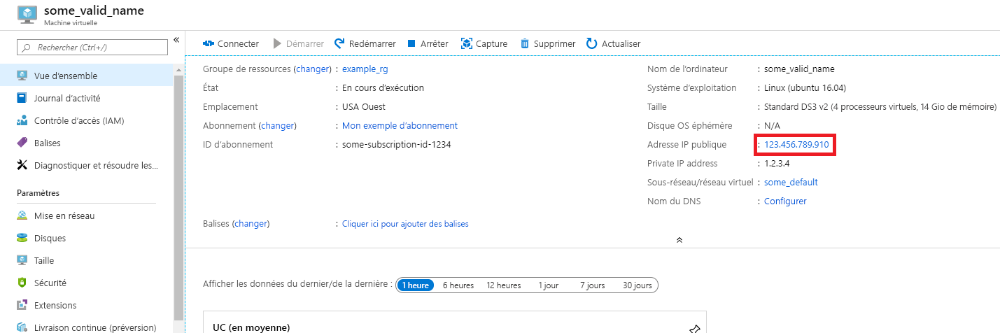
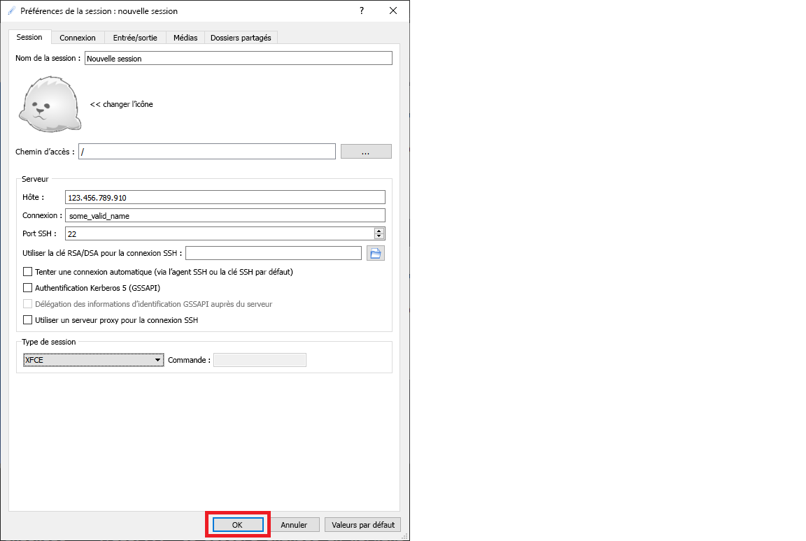

# <a name="quickstart-set-up-the-data-science-virtual-machine-for-linux-ubuntu"></a>Démarrage rapide : Configurer la machine virtuelle Science des données pour Linux (Ubuntu)

Devenez opérationnel avec la machine virtuelle Data Science Virtual Machine Ubuntu 18.04.

## <a name="prerequisites"></a>Prérequis

Pour créer une machine virtuelle Data Science Virtual Machine Ubuntu 18.04, vous devez disposer d’un abonnement Azure. [Essayez Azure gratuitement](https://azure.com/free).
Notez que les comptes gratuits Azure ne prennent pas en charge les références SKU de machines virtuelles où le GPU est activé.

## <a name="create-your-data-science-virtual-machine-for-linux"></a>Créer une machine virtuelle pour la science des données pour Linux

Voici les étapes de création d’une instance de DSVM Ubuntu 18.04 :

1. Accédez au [portail Azure](https://portal.azure.com). Si vous n’êtes pas encore connecté, vous pouvez être invité à vous connecter à votre compte Azure.
1. Recherchez la liste des machines virtuelles en tapant « data science virtual machine », puis en sélectionnant « Data Science Virtual Machine- Ubuntu 18.04 Preview ».

1. Dans la fenêtre suivante, sélectionnez **Créer**.

1. Vous devez être redirigé vers le panneau « Créer une machine virtuelle ».
   
1. Entrez les informations suivantes pour configurer chaque étape de l’Assistant :

    1. **Paramètres de base**:
    
       * **Abonnement**: Si vous disposez de plusieurs abonnements, sélectionnez celui qui sera associé à la création et à la facturation de la machine. Vous devez disposer des privilèges de création de ressources pour cet abonnement.
       * **Groupe de ressources** : Créez un groupe ou sélectionnez-en un.
       * **Nom de la machine virtuelle** : Entrez le nom de la machine virtuelle. Voici comment il s’affichera dans votre portail Azure.
       * **Région** : Sélectionnez le centre de données qui convient le mieux. Pour un accès réseau plus rapide, il s’agit du centre de données qui héberge la plupart de vos données ou du centre de données le plus proche de votre emplacement physique. Apprenez-en davantage sur les [régions Azure](https://azure.microsoft.com/global-infrastructure/regions/).
       * **Image** : Conservez la valeur par défaut.
       * **Size** : Cette valeur doit être renseignée automatiquement avec une taille appropriée pour les charges de travail générales. Découvrez-en plus sur les [tailles des machines virtuelles Linux dans Azure](../../virtual-machines/linux/sizes.md).
       * **Type d'authentification** : Pour une configuration plus rapide, sélectionnez « Mot de passe ». 
         
         > [!NOTE]
         > Si vous envisagez d’utiliser JupyterHub, veillez à sélectionner « Mot de passe », car JupyterHub n’est *pas* configuré pour utiliser des clés publiques SSH.

       * **Nom d’utilisateur** : Entrez le nom d’utilisateur de l’administrateur. Il s’agit du nom d’utilisateur que vous utiliserez pour vous connecter à votre machine virtuelle. Il ne doit pas nécessairement être identique à votre nom d’utilisateur Azure. N’utilisez *pas*  de lettres majuscules.
         
         > [!NOTE]
         > Si vous utilisez des lettres majuscules dans votre nom d’utilisateur, JupyterHub ne fonctionnera pas et vous rencontrerez une erreur 500 interne au serveur.

       * **Mot de passe** : Entrez le mot de passe que vous utiliserez pour vous connecter à votre machine virtuelle.    
    
   1. Sélectionnez **Revoir + créer**.
   1. **Vérifier+créer**
      * Vérifiez que toutes les informations que vous avez saisies sont correctes. 
      * Sélectionnez **Create** (Créer).
    
    L’approvisionnement prend environ 5 minutes. Cet état est affiché dans le portail Azure.

## <a name="how-to-access-the-ubuntu-data-science-virtual-machine"></a>Comment accéder à la machine virtuelle Data Science Virtual Machine Ubuntu

Vous pouvez accéder à la machine DSVM Ubuntu de l’une des trois manières suivantes :

  * SSH pour les sessions Terminal Server
  * X2Go pour les sessions graphiques
  * JupyterHub et JupyterLab pour les blocs-notes Jupyter

Vous pouvez également attacher une DSVM à Azure Notebooks pour exécuter des notebooks Jupyter sur la machine virtuelle et contourner les limitations du niveau de service gratuit. Pour plus d’informations, consultez [Gérer et configurer des projets Azure Notebooks](../../notebooks/configure-manage-azure-notebooks-projects.md#compute-tier).

### <a name="ssh"></a>SSH

Une fois la machine virtuelle créée, si elle a été configurée avec un accès SSH, vous pouvez vous y connecter à l’aide de SSH. Utilisez les informations d’identification de compte créées dans la section **Paramètres de base** de l’étape 3 de l’interface de l’interpréteur de commandes texte. Sur Windows, vous pouvez télécharger un outil client SSH tel que [PuTTY](https://www.putty.org). Si vous préférez un environnement de bureau graphique (X Windows System), vous pouvez utiliser le transfert X11 sur PuTTY.

> [!NOTE]
> Lors de tests, le client X2Go a obtenu de meilleures performances que le transfert X11. Nous recommandons d’utiliser le client X2Go pour une interface de bureau graphique.

### <a name="x2go"></a>X2Go

La machine virtuelle Linux est déjà provisionnée avec le serveur X2Go et elle est prête à accepter des connexions clientes. Pour vous connecter au bureau graphique de la machine virtuelle Linux, effectuez les opérations suivantes sur votre client :

1. Téléchargez et installez le client X2Go pour votre plateforme cliente sur [X2Go](https://wiki.x2go.org/doku.php/doc:installation:x2goclient).
1. Notez l’adresse IP publique de la machine virtuelle, que vous pouvez trouver dans le portail Azure en ouvrant la machine virtuelle que vous venez de créer.

   

1. Exécutez le client X2Go. Si la fenêtre « Nouvelle session » ne s’affiche pas automatiquement, accédez à Session -> Nouvelle session.

1. Dans la fenêtre de configuration obtenue, entrez les paramètres de configuration suivants :
   * **Onglet Session**:
     * **Hôte** : Entrez l’adresse IP de votre machine virtuelle, que vous avez notée précédemment.
     * **Connexion** : Entrez le nom d’utilisateur dans la machine virtuelle Linux.
     * **Port SSH** : conservez la valeur par défaut (22).
     * **Type de session** : remplacez la valeur par **XFCE**. La machine virtuelle Linux prend uniquement en charge l’environnement de bureau XFCE.
   * **Onglet Multimédia** : vous pouvez désactiver l’impression client et la prise en charge du son si vous n’en avez pas besoin.
   * **Dossiers partagés** : si vous voulez que des répertoires de vos ordinateurs clients soient montés sur la machine virtuelle Linux, ajoutez ceux que vous souhaitez partager avec la machine virtuelle sous cet onglet.

   
1. Sélectionnez **OK**.
1. Cliquez sur la zone dans le volet droit de la fenêtre X2Go afin d’afficher l’écran de connexion de votre machine virtuelle.
1. Entrez le mot de passe de votre machine virtuelle.
1. Sélectionnez **OK**.
1. Vous devrez peut-être accorder à X2Go l’autorisation de contourner votre pare-feu pour terminer la connexion.
1. Vous devez maintenant voir l’interface graphique de votre machine DSVM Ubuntu. 


### <a name="jupyterhub-and-jupyterlab"></a>JupyterHub et JupyterLab

La machine DSVM Ubuntu exécute [JupyterHub](https://github.com/jupyterhub/jupyterhub), qui est un serveur multi-utilisateur Jupyter. Pour vous connecter, effectuez les étapes suivantes :

   1. Notez l’adresse IP publique de votre machine virtuelle, en recherchant et en sélectionnant cette dernière dans le portail Azure.
      

   1. À partir de votre machine locale, ouvrez un navigateur web et accédez à https:\//IP_de_votre_machine_virtuelle:8000, en remplaçant « IP_de_votre_machine_virtuelle » par l’adresse IP que vous avez notée précédemment.
   1. Pour vous connecter, entrez le nom d’utilisateur et le mot de passe que vous avez utilisés pour créer la machine virtuelle. 

      

   1. Parcourez les nombreux exemples de notebooks disponibles.

JupyterLab, nouvelle génération de blocs-notes Jupyter, et JupyterHub, sont également disponibles. Pour y accéder, connectez-vous à JupyterHub, puis accédez à l’URL https:\//IP_de_votre_machine_virtuelle:8000/user/votre_nom_utilisateur/lab, en remplaçant « votre_nom_utilisateur » par le nom d’utilisateur que vous avez choisi lors de la configuration de la machine virtuelle.

Vous pouvez définir JupyterLab en tant que serveur de notebooks par défaut en ajoutant la ligne suivante à `/etc/jupyterhub/jupyterhub_config.py` :

```python
c.Spawner.default_url = '/lab'
```

## <a name="next-steps"></a>Étapes suivantes

Voici comment poursuivre votre formation et votre exploration :

* La procédure [Science des données sur la machine virtuelle pour la science des données pour Linux](linux-dsvm-walkthrough.md) vous montre comment effectuer plusieurs tâches courantes relatives à la science des données avec la machine virtuelle DSVM Linux provisionnée ici. 
* Explorez les différents outils de science des données sur la machine virtuelle DSVM en testant les outils décrits dans cet article. Vous pouvez également exécuter `dsvm-more-info` dans l’interpréteur de commandes sur la machine virtuelle pour accéder à une présentation de base et à des liens vers des informations supplémentaires concernant les outils installés sur la machine virtuelle.  
* Découvrez comment créer des solutions analytiques de bout en bout systématiquement à l’aide du [processus TDSP (Team Data Science Process)](https://aka.ms/tdsp).
* Pour des exemples d’apprentissage automatique et d’analyse de données utilisant les services d’intelligence artificielle d’Azure, visitez [Azure AI Gallery](https://gallery.azure.ai/).
* Consultez la [documentation de référence](./reference-ubuntu-vm.md) appropriée pour cette machine virtuelle.
