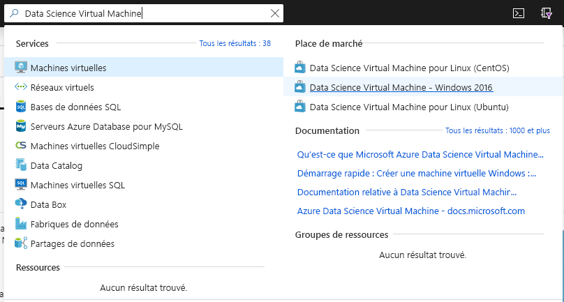
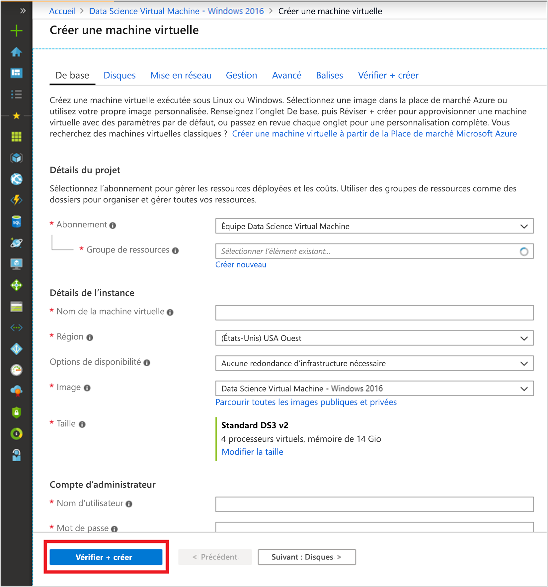

# Démarrage rapide : Configurer Data Science Virtual Machine pour Windows

Devenir opérationnel avec une machine virtuelle Windows Data Science Virtual Machine.

## Configuration requise

Pour créer une machine virtuelle Windows Data Science Virtual Machine, vous devez disposer d’un abonnement Azure. [Essayez Azure gratuitement](https://azure.com/free).
Notez que les comptes gratuits Azure ne prennent pas en charge les références SKU de machines virtuelles où le GPU est activé.

## Créer votre DSVM

Pour créer une instance de DSVM

1. Accédez au [portail Azure](https://portal.azure.com). Si vous n’êtes pas encore connecté, vous pouvez être invité à vous connecter à votre compte Azure.
1. Recherchez la liste des machines virtuelles en tapant « data science virtual machine », puis en sélectionnant « Data Science Virtual Machine - Windows 2016 ».

    

1. Sélectionnez le bouton **Créer** en bas.

    

1. Vous devez être redirigé vers le panneau « Créer une machine virtuelle ».
   

1. Remplissez l’onglet **Informations de base** :
      * **Abonnement**: Si vous disposez de plusieurs abonnements, sélectionnez celui qui sera associé à la création et à la facturation de la machine. Vous devez disposer des privilèges de création de ressources pour cet abonnement.
      * **Groupe de ressources** : Créez un groupe ou sélectionnez-en un.
      * **Nom de la machine virtuelle** : Entrez le nom de la machine virtuelle. Voici comment il s’affichera dans votre portail Azure.
      * **Emplacement** : Sélectionnez le centre de données qui convient le mieux. Pour un accès réseau plus rapide, il s’agit du centre de données qui héberge la plupart de vos données ou du centre de données le plus proche de votre emplacement physique. Apprenez-en davantage sur les [régions Azure](https://azure.microsoft.com/global-infrastructure/regions/).
      * **Image** : Conservez la valeur par défaut.
      * **Taille**: Cette valeur doit être renseignée automatiquement avec une taille appropriée pour les charges de travail générales. Découvrez-en plus sur les [tailles des machines virtuelles Windows dans Azure](../../virtual-machines/windows/sizes.md).
      * **Nom d’utilisateur** : Entrez le nom d’utilisateur de l’administrateur. Il s’agit du nom d’utilisateur que vous utiliserez pour vous connecter à votre machine virtuelle. Il ne doit pas nécessairement être identique à votre nom d’utilisateur Azure.
      * **Mot de passe** : Entrez le mot de passe que vous utiliserez pour vous connecter à votre machine virtuelle.    
1. Sélectionnez **Revoir + créer**.
1. **Vérifier+créer**
   * Vérifiez que toutes les informations que vous avez saisies sont correctes. 
   * Sélectionnez **Create** (Créer).

> [!NOTE]
> * Vous ne payez pas de frais de licence pour le logiciel qui est préchargé sur la machine virtuelle. Vous payez le coût de calcul de la taille de serveur que vous avez choisie à l’étape de définition du paramètre **Taille**.
> * Le provisionnement prend 10 à 20 minutes. Vous pouvez voir l’état de votre machine virtuelle sur le portail Azure.

## Accéder à la DSVM

Une fois la machine virtuelle créée et provisionnée, suivez les étapes indiquées pour [vous connecter à votre machine virtuelle Azure](../../marketplace/cloud-partner-portal/virtual-machine/cpp-connect-vm.md). Utilisez les informations d’identification du compte administrateur que vous avez configurées à l’étape **de base** de la création d’une machine virtuelle. 

Vous êtes maintenant prêt à utiliser les outils qui sont installés et configurés sur la machine virtuelle. La plupart des outils sont accessibles par le biais des icônes du Bureau et des vignettes du menu **Démarrer**.

Vous pouvez également attacher une DSVM à Azure Notebooks pour exécuter des notebooks Jupyter sur la machine virtuelle et contourner les limitations du niveau de service gratuit. Pour plus d’informations, consultez [Gérer et configurer des projets Notebooks](../../notebooks/configure-manage-azure-notebooks-projects.md#manage-and-configure-projects).

## Étapes suivantes

* Explorez les outils sur la DSVM en ouvrant le menu **Démarrer**.
* Apprenez-en plus sur le service Azure Machine Learning en lisant [Qu’est-ce que le service Azure Machine Learning ?](../service/overview-what-is-azure-ml.md) et en suivant ces [tutoriels](../index.yml).
* Dans l’Explorateur de fichiers, accédez à C:\Program Files\Microsoft\ML Server\R_SERVER\library\RevoScaleR\demoScripts pour obtenir des exemples utilisant la bibliothèque RevoScaleR en langage R, qui prend en charge l’analytique données à l’échelle de l’entreprise. 
* Lisez l’article intitulé [Dix choses que vous pouvez effectuer sur la machine virtuelle Windows Data Science Virtual Machine](https://aka.ms/dsvmtenthings).
* Découvrez comment créer des solutions analytiques de bout en bout systématiquement à l’aide du [processus TDSP (Team Data Science Process)](../team-data-science-process/index.yml).
* Visitez [Azure AI Gallery](https://gallery.cortanaintelligence.com) pour obtenir des exemples de machine learning et d’analytique données qui utilisent Azure Machine Learning et des services de données connexes sur Azure. Nous avons également inclus une icône dans le menu **Démarrer** et sur le bureau de la machine virtuelle pour accéder à cette galerie.
* Consultez la [documentation de référence](./reference-windows-vm.md) appropriée pour cette machine virtuelle.

