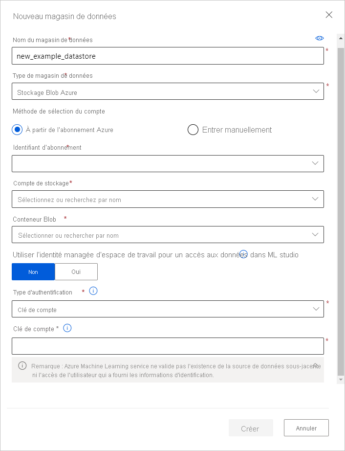

# <a name="connect-to-azure-storage-services"></a>Se connecter aux services de stockage Azure
[!INCLUDE [aml-applies-to-basic-enterprise-sku](../../includes/aml-applies-to-basic-enterprise-sku.md)]

Dans cet article, découvrez comment vous connecter aux services de stockage Azure par le biais des magasins de données Azure Machine Learning. Les magasins de données stockent des informations de connexion, comme votre ID d’abonnement et votre autorisation de jeton, dans votre [Key Vault](https://azure.microsoft.com/services/key-vault/) associé à l’espace de travail, de sorte que vous pouvez accéder à votre stockage en toute sécurité sans avoir à coder en dur ces informations dans vos scripts. Pour comprendre où les magasins de données interviennent dans flux de travail d’accès aux données d’Azure Machine Learning, consultez l’article [Accéder en toute sécurité aux données](concept-data.md#data-workflow).

Vous pouvez créer des magasins de données à partir de ces [solutions de stockage Azure](#matrix). Pour les solutions de stockage non prises en charge, nous vous recommandons de [déplacer vos données](#move) vers nos solutions de stockage Azure prises en charge afin de réduire le coût de sortie des données pendant les expériences de Machine Learning. 

## <a name="prerequisites"></a>Prérequis

Vous devez disposer des éléments suivants :
- Un abonnement Azure. Si vous n’avez pas d’abonnement Azure, créez un compte gratuit avant de commencer. Essayez la [version gratuite ou payante d’Azure Machine Learning](https://aka.ms/AMLFree).

- Un compte de stockage Azure avec un [conteneur d’objets blob Azure](https://docs.microsoft.com/azure/storage/blobs/storage-blobs-overview) ou un [partage de fichiers Azure](https://docs.microsoft.com/azure/storage/files/storage-files-introduction).

- Le [Kit de développement logiciel (SDK) Azure Machine Learning pour Python](https://docs.microsoft.com/python/api/overview/azure/ml/intro?view=azure-ml-py) ou l’accès à [Azure Machine Learning studio](https://ml.azure.com/).

- Un espace de travail Azure Machine Learning.
  
  [Créez un espace de travail Azure Machine Learning](how-to-manage-workspace.md) ou utilisez un espace de travail existant via le Kit de développement logiciel (SDK) Python. Importez les classes `Workspace` et `Datastore`, puis chargez vos informations d’abonnement à partir du fichier `config.json` à l’aide de la fonction `from_config()`. Cette fonction recherche le fichier JSON dans le répertoire actif par défaut, mais vous pouvez également spécifier un paramètre de chemin d’accès pour pointer vers le fichier à l’aide de `from_config(path="your/file/path")`.

   ```Python
   import azureml.core
   from azureml.core import Workspace, Datastore
        
   ws = Workspace.from_config()
   ```
<a name="matrix"></a>

## <a name="supported-data-storage-service-types"></a>Types de services de stockage de données pris en charge

Les magasins de données prennent actuellement en charge le stockage des informations de connexion dans les services de stockage figurant dans la matrice suivante.

| Type de&nbsp;stockage | Type&nbsp;d’authentification | [Azure&nbsp;Machine&nbsp;Learning studio](https://ml.azure.com/) | [SDK Azure&nbsp;Machine&nbsp;Learning&nbsp; Python](https://docs.microsoft.com/python/api/overview/azure/ml/intro?view=azure-ml-py) |  [CLI Azure&nbsp;Machine&nbsp;Learning](reference-azure-machine-learning-cli.md) | [API REST Azure&nbsp;Machine&nbsp;Learning&nbsp;](https://docs.microsoft.com/rest/api/azureml/)
---|---|---|---|---|---
[Stockage&nbsp;Blob&nbsp;Azure](https://docs.microsoft.com/azure/storage/blobs/storage-blobs-overview)| Clé de compte <br> Jeton SAS | ✓ | ✓ | ✓ |✓
[Partage&nbsp;de fichiers&nbsp;Azure](https://docs.microsoft.com/azure/storage/files/storage-files-introduction)| Clé de compte <br> Jeton SAS | ✓ | ✓ | ✓ |✓
[Azure&nbsp;Data Lake&nbsp;Storage Gen&nbsp;1](https://docs.microsoft.com/azure/data-lake-store/)| Principal du service| ✓ | ✓ | ✓ |✓
[Azure&nbsp;Data Lake&nbsp;Storage Gen&nbsp;2](https://docs.microsoft.com/azure/storage/blobs/data-lake-storage-introduction)| Principal du service| ✓ | ✓ | ✓ |✓
[Azure&nbsp;SQL&nbsp;Database](https://docs.microsoft.com/azure/sql-database/sql-database-technical-overview)| Authentification SQL <br>Principal du service| ✓ | ✓ | ✓ |✓
[Azure&nbsp;PostgreSQL](https://docs.microsoft.com/azure/postgresql/overview) | Authentification SQL| ✓ | ✓ | ✓ |✓
[Azure&nbsp;Database&nbsp;pour&nbsp;MySQL](https://docs.microsoft.com/azure/mysql/overview) | Authentification SQL|  | ✓* | ✓* |✓*
[Databricks&nbsp;File&nbsp;System](https://docs.microsoft.com/azure/databricks/data/databricks-file-system)| Aucune authentification | | ✓** | ✓ ** |✓** 

* MySQL est uniquement pris en charge pour le pipeline [DataTransferStep](https://docs.microsoft.com/python/api/azureml-pipeline-steps/azureml.pipeline.steps.datatransferstep?view=azure-ml-py). <br>
** Databricks est uniquement pris en charge pour le pipeline [DatabricksStep](https://docs.microsoft.com/python/api/azureml-pipeline-steps/azureml.pipeline.steps.databricks_step.databricksstep?view=azure-ml-py).

### <a name="storage-guidance"></a>Conseils liés au stockage

Nous vous recommandons de créer un magasin de données pour un [conteneur Blob Azure](https://docs.microsoft.com/azure/storage/blobs/storage-blobs-introduction). Les stockages Standard et Premium sont tous deux disponibles pour les objets blob. Le stockage Premium est plus cher, mais ses vitesses de débit supérieures vous feront gagner du temps sur vos exécutions d’entraînement, en particulier si vous effectuez l’entraînement sur un jeu de données volumineux. Pour plus d’informations sur le coût des comptes de stockage, consultez la [calculatrice de prix Azure](https://azure.microsoft.com/pricing/calculator/?service=machine-learning-service).

[Azure Data Lake Storage Gen2](https://docs.microsoft.com/azure/storage/blobs/data-lake-storage-introduction?toc=/azure/storage/blobs/toc.json) s’appuie sur le stockage Blob Azure et a été conçu pour l’analytique Big Data des entreprises. Une caractéristique fondamentale de Data Lake Storage Gen2 est l’ajout d’un [espace de noms hiérarchique](https://docs.microsoft.com/azure/storage/blobs/data-lake-storage-namespace) au stockage Blob. L’espace de noms hiérarchique organise les objets/fichiers dans une hiérarchie de répertoires pour offrir un accès efficace aux données.

Quand vous créez un espace de travail, un conteneur d’objets blob Azure et un partage de fichiers Azure sont inscrits automatiquement dans l’espace de travail, sous les noms `workspaceblobstore` et `workspacefilestore` respectivement. `workspaceblobstore` est utilisé pour stocker les artefacts de l’espace de travail et vos journaux d’expérience de Machine Learning. `workspacefilestore` est utilisé pour stocker des notebooks et des scripts R autorisés via une [instance de calcul](https://docs.microsoft.com/azure/machine-learning/concept-compute-instance#accessing-files). Le conteneur `workspaceblobstore` est défini comme magasin de données par défaut.

> [!IMPORTANT]
> Le concepteur Azure Machine Learning (préversion) crée un magasin de données nommé **azureml_globaldatasets** automatiquement lorsque vous ouvrez un exemple dans la page d’accueil du concepteur. Ce magasin de données contient uniquement des exemples de jeux de données. Veuillez **ne pas** utiliser ce magasin de données pour accéder à des données confidentielles.
> 

<a name="access"></a>

## <a name="create-and-register-datastores"></a>Créer et inscrire des magasins de données

Quand vous inscrivez une solution de stockage Azure en tant que magasin de données, ce dernier est automatiquement créé et inscrit dans un espace de travail spécifique. Vous pouvez créer des magasins de données et les inscrire auprès d’un espace de travail en utilisant le [Kit de développement logiciel (SDK) Python](#python-sdk) ou [Azure Machine Learning Studio](#azure-machine-learning-studio).

>[!IMPORTANT]
> Dans le cadre du processus de création et d’inscription du magasin de données initial, Azure Machine Learning vérifie que le service de stockage sous-jacent existe et que le principal fourni par l’utilisateur (nom d’utilisateur, principal de service ou jeton SAS) a accès à ce stockage. Toutefois, pour les magasins de données Azure Data Lake Storage Gen 1 et 2, cette validation se produit plus tard, lorsque des méthodes d’accès aux données comme [`from_files()`](https://docs.microsoft.com/python/api/azureml-core/azureml.data.dataset_factory.filedatasetfactory?view=azure-ml-py) ou [`from_delimited_files()`](https://docs.microsoft.com/python/api/azureml-core/azureml.data.dataset_factory.tabulardatasetfactory?view=azure-ml-py#from-parquet-files-path--validate-true--include-path-false--set-column-types-none--partition-format-none-) sont appelées. 
<br><br>
Après la création du magasin de données, cette validation est effectuée uniquement pour les méthodes qui requièrent l’accès au conteneur de stockage sous-jacent, et **non** chaque fois que des objets du magasin de données sont récupérés. Par exemple, la validation se produit si vous souhaitez télécharger des fichiers à partir de votre magasin de données ; mais si vous souhaitez simplement modifier votre magasin de données par défaut, la validation ne se produit pas.

### <a name="python-sdk"></a>Kit de développement logiciel (SDK) Python

Toutes les méthodes d’inscription se trouvent dans la classe [`Datastore`](https://docs.microsoft.com/python/api/azureml-core/azureml.core.datastore(class)?view=azure-ml-py) et ont le format `register_azure_*`.
> [!IMPORTANT]
> Si votre compte de stockage se trouve sur un réseau virtuel, seule la création de magasins de données **via le kit SDK** est prise en charge.

Vous trouverez les informations dont vous avez besoin pour renseigner la méthode `register_azure_*()` sur le [portail Azure](https://portal.azure.com).

* Si vous envisagez d’utiliser une clé de compte ou un jeton SAP pour l’authentification, sélectionnez **Comptes de stockage** dans le volet gauche, puis choisissez le compte de stockage que vous souhaitez inscrire. 
  * La page **Vue d’ensemble** fournit des informations telles que le nom du compte, le conteneur et le nom du partage de fichiers. 
      1. Pour les clés de compte, accédez à **Clés d’accès** dans le volet **Paramètres**. 
      1. Pour les jetons SAP, accédez à **Signatures d’accès partagé** dans le volet **Paramètres**.

* Si vous projetez d’utiliser un principal du service pour l’authentification, accédez à vos **Inscriptions d’applications**, puis sélectionnez l’application que vous souhaitez utiliser. 
    * La page **Vue d’ensemble** correspondante contient des informations requises comme l’ID de locataire et l’ID de client.

Les exemples suivants montrent comment inscrire un conteneur d’objets blob Azure, un partage de fichiers Azure et Azure Data Lake Storage Gen 2 comme magasin de données. Les paramètres fournis dans ces exemples sont les **paramètres requis** pour créer et inscrire un magasin de données. 

Pour créer des magasins de données pour d’autres services de stockage et voir des paramètres facultatifs pour ces méthodes, consultez la [documentation de référence pour les méthodes `register_azure_*` applicables](https://docs.microsoft.com/python/api/azureml-core/azureml.core.datastore.datastore?view=azure-ml-py#methods).

#### <a name="blob-container"></a>Conteneur d’objets blob

Pour inscrire un conteneur d’objets blob Azure comme magasin de données, utilisez [`register_azure_blob-container()`](https://docs.microsoft.com/python/api/azureml-core/azureml.core.datastore(class)?view=azure-ml-py#register-azure-blob-container-workspace--datastore-name--container-name--account-name--sas-token-none--account-key-none--protocol-none--endpoint-none--overwrite-false--create-if-not-exists-false--skip-validation-false--blob-cache-timeout-none--grant-workspace-access-false--subscription-id-none--resource-group-none-).

Le code suivant crée le magasin de données `blob_datastore_name` et l’inscrit auprès de l’espace de travail `ws`. Ce magasin de données accède au conteneur d'objets blob `my-container-name` sur le compte de stockage `my-account-name` avec la clé d'accès au compte fournie.

```Python
blob_datastore_name='azblobsdk' # Name of the datastore to workspace
container_name=os.getenv("BLOB_CONTAINER", "<my-container-name>") # Name of Azure blob container
account_name=os.getenv("BLOB_ACCOUNTNAME", "<my-account-name>") # Storage account name
account_key=os.getenv("BLOB_ACCOUNT_KEY", "<my-account-key>") # Storage account access key

blob_datastore = Datastore.register_azure_blob_container(workspace=ws, 
                                                         datastore_name=blob_datastore_name, 
                                                         container_name=container_name, 
                                                         account_name=account_name,
                                                         account_key=account_key)
```
Si votre conteneur d’objets blob se trouve dans un réseau virtuel, incluez le paramètre `skip_validation=True` dans votre méthode [`register_azure_blob-container()`](https://docs.microsoft.com/python/api/azureml-core/azureml.core.datastore(class)?view=azure-ml-py#register-azure-blob-container-workspace--datastore-name--container-name--account-name--sas-token-none--account-key-none--protocol-none--endpoint-none--overwrite-false--create-if-not-exists-false--skip-validation-false--blob-cache-timeout-none--grant-workspace-access-false--subscription-id-none--resource-group-none-). 

#### <a name="file-share"></a>Partage de fichiers

Pour inscrire un partage de fichiers Azure comme magasin de données, utilisez [`register_azure_file_share()`](https://docs.microsoft.com/python/api/azureml-core/azureml.core.datastore(class)?view=azure-ml-py#register-azure-file-share-workspace--datastore-name--file-share-name--account-name--sas-token-none--account-key-none--protocol-none--endpoint-none--overwrite-false--create-if-not-exists-false--skip-validation-false-). 

Le code suivant crée le magasin de données `file_datastore_name` et l’inscrit auprès de l’espace de travail `ws`. Ce magasin de données accède au partage de fichiers `my-fileshare-name` sur le compte de stockage `my-account-name` avec la clé d'accès au compte fournie.

```Python
file_datastore_name='azfilesharesdk' # Name of the datastore to workspace
file_share_name=os.getenv("FILE_SHARE_CONTAINER", "<my-fileshare-name>") # Name of Azure file share container
account_name=os.getenv("FILE_SHARE_ACCOUNTNAME", "<my-account-name>") # Storage account name
account_key=os.getenv("FILE_SHARE_ACCOUNT_KEY", "<my-account-key>") # Storage account access key

file_datastore = Datastore.register_azure_file_share(workspace=ws,
                                                     datastore_name=file_datastore_name, 
                                                     file_share_name=file_share_name, 
                                                     account_name=account_name,
                                                     account_key=account_key)
```
Si votre partage de fichiers se trouve dans un réseau virtuel, incluez le paramètre `skip_validation=True` dans votre méthode [`register_azure_file_share()`](https://docs.microsoft.com/python/api/azureml-core/azureml.core.datastore(class)?view=azure-ml-py#register-azure-file-share-workspace--datastore-name--file-share-name--account-name--sas-token-none--account-key-none--protocol-none--endpoint-none--overwrite-false--create-if-not-exists-false--skip-validation-false-). 

#### <a name="azure-data-lake-storage-generation-2"></a>Azure Data Lake Storage Gen 2

Pour un magasin de données Azure Data Lake Storage Gen 2 (ADLS Gen 2), utilisez [register_azure_data_lake_gen2()](https://docs.microsoft.com/python/api/azureml-core/azureml.core.datastore.datastore?view=azure-ml-py#register-azure-data-lake-gen2-workspace--datastore-name--filesystem--account-name--tenant-id--client-id--client-secret--resource-url-none--authority-url-none--protocol-none--endpoint-none--overwrite-false-) pour inscrire un magasin de données d’informations d’identification connecté à un stockage Azure DataLake Gen 2 avec des [autorisations de principal du service](https://docs.microsoft.com/azure/active-directory/develop/howto-create-service-principal-portal). Pour utiliser votre principal de service, vous devez [inscrire votre application](https://docs.microsoft.com/azure/active-directory/develop/app-objects-and-service-principals) et accorder au principal de service l’accès au *Propriétaire des données blob du stockage*. Découvrez-en plus sur la [configuration du contrôle d’accès pour ADLS Gen 2](https://docs.microsoft.com/azure/storage/blobs/data-lake-storage-access-control). 

Pour utiliser votre principal de service, vous devez [inscrire votre application](https://docs.microsoft.com/azure/active-directory/develop/app-objects-and-service-principals) et accorder l’accès aux données approprié au principal de service. Découvrez-en plus sur la [configuration du contrôle d’accès pour ADLS Gen 2](https://docs.microsoft.com/azure/storage/blobs/data-lake-storage-access-control). 

Le code suivant crée le magasin de données `adlsgen2_datastore_name` et l’inscrit auprès de l’espace de travail `ws`. Ce magasin de données accède au système de fichiers `test` dans le compte de stockage `account_name` en utilisant les informations d’identification du principal de service fournies.

```python 
adlsgen2_datastore_name = 'adlsgen2datastore'

subscription_id=os.getenv("ADL_SUBSCRIPTION", "<my_subscription_id>") # subscription id of ADLS account
resource_group=os.getenv("ADL_RESOURCE_GROUP", "<my_resource_group>") # resource group of ADLS account

account_name=os.getenv("ADLSGEN2_ACCOUNTNAME", "<my_account_name>") # ADLS Gen2 account name
tenant_id=os.getenv("ADLSGEN2_TENANT", "<my_tenant_id>") # tenant id of service principal
client_id=os.getenv("ADLSGEN2_CLIENTID", "<my_client_id>") # client id of service principal
client_secret=os.getenv("ADLSGEN2_CLIENT_SECRET", "<my_client_secret>") # the secret of service principal

adlsgen2_datastore = Datastore.register_azure_data_lake_gen2(workspace=ws,
                                                             datastore_name=adlsgen2_datastore_name,
                                                             account_name=account_name, # ADLS Gen2 account name
                                                             filesystem='test', # ADLS Gen2 filesystem
                                                             tenant_id=tenant_id, # tenant id of service principal
                                                             client_id=client_id, # client id of service principal
                                                             client_secret=client_secret) # the secret of service principal
```

### <a name="azure-machine-learning-studio"></a>Azure Machine Learning Studio 

Créez un magasin de données en quelques étapes dans Azure Machine Learning Studio :

> [!IMPORTANT]
> Si votre compte de stockage se trouve sur un réseau virtuel, seule la création de magasins de données [via le kit SDK](#python-sdk) est prise en charge. 

1. Connectez-vous à [Azure Machine Learning Studio](https://ml.azure.com/).
1. Sélectionnez **Magasins de données** dans le volet gauche sous **Gérer**.
1. Sélectionnez **+ Nouveau magasin de données**.
1. Remplissez le formulaire de création d’un magasin de données. Le formulaire est mis à jour intelligemment en fonction du type de stockage Azure et du type d’authentification que vous sélectionnez.
  
Vous pouvez trouver les informations dont vous avez besoin pour renseigner le formulaire sur le [portail Azure](https://portal.azure.com). Sélectionnez **Comptes de stockage** dans le volet gauche, puis choisissez le compte de stockage que vous voulez inscrire. La page **Vue d’ensemble** fournit des informations telles que le nom du compte, le conteneur et le nom du partage de fichiers. 

* Pour obtenir des éléments d'authentification, comme la clé de compte ou le jeton SAS, accédez à **Clés d'accès** dans le volet **Paramètres**. 

* Pour les éléments du principal de service, comme l'ID du locataire et l'ID du client, accédez à **Inscriptions d'applications** et sélectionnez l'application que vous souhaitez utiliser. La **page de présentation** correspondante contiendra ces éléments. 

L’exemple suivant montre à quoi ressemble le formulaire quand vous créez un magasin de données d’objets blob Azure : 
    



<a name="get"></a>

## <a name="get-datastores-from-your-workspace"></a>Récupérer les magasins de données à partir de votre espace de travail

Pour obtenir un magasin de données spécifique inscrit dans l’espace de travail actif, utilisez la méthode statique [`get()`](https://docs.microsoft.com/python/api/azureml-core/azureml.core.datastore(class)?view=azure-ml-py#get-workspace--datastore-name-) sur la classe `Datastore` :

```Python
# Get a named datastore from the current workspace
datastore = Datastore.get(ws, datastore_name='your datastore name')
```
Pour obtenir la liste des banques de données inscrites avec un espace de travail donné, vous pouvez utiliser la propriété [`datastores`](https://docs.microsoft.com/python/api/azureml-core/azureml.core.workspace%28class%29?view=azure-ml-py#datastores) sur un objet d’espace de travail :

```Python
# List all datastores registered in the current workspace
datastores = ws.datastores
for name, datastore in datastores.items():
    print(name, datastore.datastore_type)
```

Pour obtenir le magasin de données par défaut de l’espace de travail, utilisez cette ligne :

```Python
datastore = ws.get_default_datastore()
```
Vous pouvez également modifier le magasin de données par défaut avec le code suivant. Cette possibilité est prise en charge uniquement via le Kit de développement logiciel (SDK). 

```Python
 ws.set_default_datastore(new_default_datastore)
```
<a name="up-and-down"></a>
## <a name="upload-and-download-data"></a>Charger et télécharger des données

Les méthodes [`upload()`](https://docs.microsoft.com/python/api/azureml-core/azureml.data.azure_storage_datastore.azureblobdatastore?view=azure-ml-py#upload-src-dir--target-path-none--overwrite-false--show-progress-true-) et [`download()`](https://docs.microsoft.com/python/api/azureml-core/azureml.data.azure_storage_datastore.azureblobdatastore?view=azure-ml-py#download-target-path--prefix-none--overwrite-false--show-progress-true-) décrites dans les exemples suivants sont propres aux classes [AzureBlobDatastore](https://docs.microsoft.com/python/api/azureml-core/azureml.data.azure_storage_datastore.azureblobdatastore?view=azure-ml-py) et [AzureFileDatastore](https://docs.microsoft.com/python/api/azureml-core/azureml.data.azure_storage_datastore.azurefiledatastore?view=azure-ml-py), et fonctionnent de la même manière pour les deux.

> [!NOTE]
> Le chargement dans les magasins de données AzureDataLakeGen2 n’est pas pris en charge pour l’instant.

### <a name="upload"></a>Télécharger

Chargez un répertoire ou des fichiers individuels dans le magasin de données à l’aide du SDK Python :

```Python
datastore.upload(src_dir='your source directory',
                 target_path='your target path',
                 overwrite=True,
                 show_progress=True)
```

Le paramètre `target_path` spécifie l’emplacement dans le partage de fichiers (ou le conteneur d’objets blob) à charger. La valeur par défaut est `None` ; les données sont donc chargées à la racine. Quand `overwrite=True` est défini, toutes les données existantes dans `target_path` sont remplacées.

Vous pouvez aussi charger une liste de fichiers individuels dans le magasin de donnés avec la méthode `upload_files()`.

### <a name="download"></a>Téléchargement

Téléchargez des données d’un magasin de données vers votre système de fichiers local :

```Python
datastore.download(target_path='your target path',
                   prefix='your prefix',
                   show_progress=True)
```

Le paramètre `target_path` correspond à l’emplacement du répertoire local dans lequel les données doivent être téléchargées. Pour spécifier un chemin au dossier dans le partage de fichiers (ou le conteneur d’objets blob) où effectuer le téléchargement, fournissez ce chemin à `prefix`. Si `prefix` est défini à `None`, tout le contenu de votre partage de fichiers (ou conteneur d’objets blob) est téléchargé.

<a name="train"></a>

## <a name="access-your-data-during-training"></a>Accédez à vos données pendant la formation

Pour interagir avec les données de vos magasins de données ou pour empaqueter vos données dans un objet consommable pour les tâches de Machine Learning, comme l’entraînement, [créez un jeu de données Azure Machine Learning](how-to-create-register-datasets.md). Les jeux de données fournissent des fonctions qui chargent des données tabulaires dans un dataframe Pandas ou Spark. Ils offrent également la possibilité de télécharger ou monter des fichiers de n’importe quel format à partir des stockages suivants : Stockage Blob Azure, Azure Files, Azure Data Lake Storage Gen1, Azure Data Lake Storage Gen2, Azure SQL Database et Azure Database pour PostgreSQL. [Découvrez-en plus sur l’entraînement avec des jeux de données](how-to-train-with-datasets.md).

### <a name="accessing-source-code-during-training"></a>Accès au code source pendant l’entraînement

Le stockage Blob Azure offre des vitesses de débit supérieures à celles du partage de fichiers Azure et s’adapte à un grand nombre de travaux démarrés en parallèle. C’est pourquoi nous vous recommandons de configurer vos exécutions pour utiliser le stockage Blob pour le transfert des fichiers de code source.

L’exemple de code suivant spécifie dans la configuration d’exécution le magasin de données d’objets blob à utiliser pour les transferts de code source.

```python 
# workspaceblobstore is the default blob storage
run_config.source_directory_data_store = "workspaceblobstore" 
```

## <a name="access-data-during-scoring"></a>Accéder aux données pendant le scoring

Azure Machine Learning offre plusieurs moyens d’utiliser vos modèles pour le scoring. Certaines de ces méthodes ne fournissent pas d’accès aux magasins de données. Utilisez le tableau suivant pour comprendre les méthodes qui vous permettent d’accéder aux magasins de données pendant le scoring :

| Méthode | Accès aux magasins de données | Description |
| ----- | :-----: | ----- |
| [Prédiction par lots](how-to-use-parallel-run-step.md) | ✔ | Effectuez des prédictions sur de grandes quantités de données de façon asynchrone. |
| [Service web](how-to-deploy-and-where.md) | &nbsp; | Déployez des modèles comme un service web. |
| [Module Azure IoT Edge](how-to-deploy-and-where.md) | &nbsp; | Déployez des modèles sur des appareils IoT Edge. |

Dans les situations où le SDK ne fournit pas d’accès aux magasins de données, vous pouvez créer du code personnalisé à l’aide du SDK Azure approprié pour accéder aux données. Par exemple, le [kit de développement logiciel (SDK) de stockage Azure pour Python](https://github.com/Azure/azure-storage-python) est une bibliothèque cliente que vous pouvez utiliser pour accéder aux données stockées dans des objets blob ou des fichiers.

<a name="move"></a>

## <a name="move-data-to-supported-azure-storage-solutions"></a>Déplacer des données vers des solutions de stockage Azure prises en charge

Azure Machine Learning prend en charge l’accès aux données à partir des stockages suivants : Stockage Blob Azure, Azure Files, Azure Data Lake Storage Gen1, Azure Data Lake Storage Gen2, Azure SQL Database et Azure Database pour PostgreSQL. Si vous utilisez un stockage non pris en charge, nous vous recommandons de déplacer vos données vers des solutions de stockage Azure prises en charge en utilisant [Azure Data Factory et ces étapes](https://docs.microsoft.com/azure/data-factory/quickstart-create-data-factory-copy-data-tool). Déplacer vos données vers un stockage pris en charge peut vous aider à réduire les coûts de sortie des données pendant les expériences Machine Learning. 

Azure Data Factory fournit un moyen de transfert des données efficace et résilient avec plus de 80 connecteurs prédéfinis, sans coût supplémentaire. Ces connecteurs incluent les services de données Azure, les sources de données locales, Amazon S3 et Redshift, et Google BigQuery.

## <a name="next-steps"></a>Étapes suivantes

* [Créer un jeu de données Azure Machine Learning](how-to-create-register-datasets.md)
* [Entraîner un modèle](how-to-train-ml-models.md)
* [Déployer un modèle](how-to-deploy-and-where.md)
