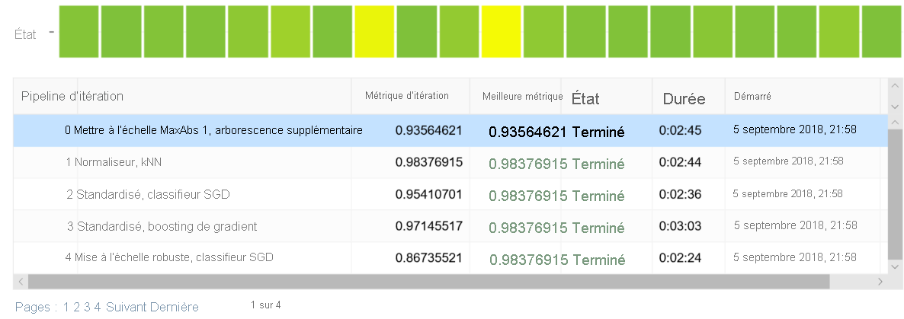
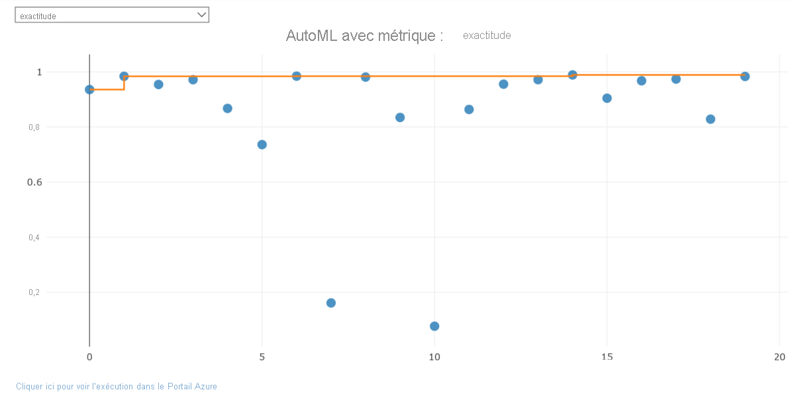

# <a name="train-models-with-automated-machine-learning-in-the-cloud"></a>Entraîner des modèles avec le machine learning automatisé dans le cloud


Dans Azure Machine Learning, vous effectuez l'apprentissage de votre modèle sur différents types de ressources de calcul que vous gérez. La cible de calcul peut être un ordinateur local ou une ressource dans le cloud.

Vous pouvez facilement effectuer un scale-up ou un scale-out de votre expérience de Machine Learning. Pour cela, il vous suffit d’ajouter des cibles de calcul, par exemple Capacité de calcul Machine Learning (AmlCompute). AmlCompute est une infrastructure de capacité de calcul managée qui vous permet de créer facilement une capacité de calcul à un ou plusieurs nœuds.

Dans cet article, vous allez découvrir comment créer un modèle avec le Machine Learning automatisé avec AmlCompute.

## <a name="how-does-remote-differ-from-local"></a>En quoi l’entraînement à distance diffère-t-il de l’entraînement local ?

Des fonctionnalités supplémentaires sont disponibles quand vous utilisez une cible de calcul à distance.  Pour plus d’informations, consultez [Cibles de calcul locales et distantes](concept-automated-ml.md#local-remote).

Le tutoriel [Entraîner un modèle de classification avec le machine learning automatisé](tutorial-auto-train-models.md) vous explique comment utiliser un ordinateur local pour effectuer l’apprentissage d’un modèle avec le machine learning automatisé. Le workflow lors de l’entraînement local s’applique également aux cibles distantes. Pour effectuer l’entraînement à distance, vous créez d’abord une cible de calcul distante, comme AmlCompute. Ensuite, vous configurez la ressource distante et vous y envoyez votre code.

Cet article décrit les étapes supplémentaires nécessaires pour exécuter une expérience de ML automatisé sur une cible AmlCompute distante. L’objet d’espace de travail, `ws`, du tutoriel est utilisé ici dans tout le code.

```python
ws = Workspace.from_config()
```

## <a name="create-resource"></a>Créer une ressource

Créez la cible [`AmlCompute`](https://docs.microsoft.com/python/api/azureml-core/azureml.core.compute.amlcompute%28class%29?view=azure-ml-py&preserve-view=true) dans votre espace de travail (`ws`) si elle n’existe pas encore.

**Durée estimée** : La création de la cible AmlCompute prend environ 5 minutes.

```python
from azureml.core.compute import AmlCompute
from azureml.core.compute import ComputeTarget
import os

# choose a name for your cluster
compute_name = os.environ.get("AML_COMPUTE_CLUSTER_NAME", "cpu-cluster")
compute_min_nodes = os.environ.get("AML_COMPUTE_CLUSTER_MIN_NODES", 0)
compute_max_nodes = os.environ.get("AML_COMPUTE_CLUSTER_MAX_NODES", 4)

# This example uses CPU VM. For using GPU VM, set SKU to STANDARD_NC6
vm_size = os.environ.get("AML_COMPUTE_CLUSTER_SKU", "STANDARD_D2_V2")


if compute_name in ws.compute_targets:
    compute_target = ws.compute_targets[compute_name]
    if compute_target and type(compute_target) is AmlCompute:
        print('found compute target. just use it. ' + compute_name)
else:
    print('creating a new compute target...')
    provisioning_config = AmlCompute.provisioning_configuration(vm_size = vm_size,
                                                                min_nodes = compute_min_nodes, 
                                                                max_nodes = compute_max_nodes)

    # create the cluster
    compute_target = ComputeTarget.create(ws, compute_name, provisioning_config)
    
    # can poll for a minimum number of nodes and for a specific timeout. 
    # if no min node count is provided it will use the scale settings for the cluster
    compute_target.wait_for_completion(show_output=True, min_node_count=None, timeout_in_minutes=20)
    
     # For a more detailed view of current AmlCompute status, use get_status()
    print(compute_target.get_status().serialize())
```

Vous pouvez maintenant utiliser l’objet `compute_target` comme cible de calcul distante.

Voici les restrictions concernant le nom du cluster :
+ Il ne doit pas compter plus de 64 caractères.
+ Il ne doit pas inclure les caractères suivants : `\` ~ ! @ # $ % ^ & * ( ) = + _ [ ] { } \\\\ | ; : \' \\" , < > / ?.`

## <a name="access-data-using-tabulardataset-function"></a>Accéder aux données à l’aide de la fonction TabularDataset

training_data défini en tant que [`TabularDataset`](https://docs.microsoft.com/python/api/azureml-core/azureml.data.tabulardataset?view=azure-ml-py&preserve-view=true) et l’étiquette, qui sont passés au Machine Learning automatisé dans [`AutoMLConfig`](https://docs.microsoft.com/python/api/azureml-train-automl-client/azureml.train.automl.automlconfig.automlconfig?view=azure-ml-py&preserve-view=true). Par défaut, la méthode `TabularDataset` `from_delimited_files` définit `infer_column_types` sur True, ce qui déduit automatiquement le type des colonnes. 

Si vous souhaitez définir manuellement les types de colonnes, vous pouvez configurer l’argument `set_column_types` pour définir manuellement le type de chaque colonne. Dans l’exemple de code suivant, les données proviennent du package sklearn.

```python
from sklearn import datasets
from azureml.core.dataset import Dataset
from scipy import sparse
import numpy as np
import pandas as pd
import os

# Create a project_folder if it doesn't exist
if not os.path.isdir('data'):
    os.mkdir('data')
    
if not os.path.exists('project_folder'):
    os.makedirs('project_folder')

X = pd.DataFrame(data_train.data[100:,:])
y = pd.DataFrame(data_train.target[100:])

# merge X and y
label = "digit"
X[label] = y

training_data = X

training_data.to_csv('data/digits.csv')
ds = ws.get_default_datastore()
ds.upload(src_dir='./data', target_path='digitsdata', overwrite=True, show_progress=True)

training_data = Dataset.Tabular.from_delimited_files(path=ds.path('digitsdata/digits.csv'))
```

## <a name="configure-experiment"></a>Configurer une expérience
Spécifiez les paramètres pour `AutoMLConfig`.  (Consultez la [liste complète des paramètres](how-to-configure-auto-train.md#configure-experiment) et leurs valeurs possibles.)

```python
from azureml.train.automl import AutoMLConfig
import time
import logging

automl_settings = {
    "name": "AutoML_Demo_Experiment_{0}".format(time.time()),
    "experiment_timeout_minutes" : 20,
    "enable_early_stopping" : True,
    "iteration_timeout_minutes": 10,
    "n_cross_validations": 5,
    "primary_metric": 'AUC_weighted',
    "max_concurrent_iterations": 10,
}

automl_config = AutoMLConfig(task='classification',
                             debug_log='automl_errors.log',
                             path=project_folder,
                             compute_target=compute_target,
                             training_data=training_data,
                             label_column_name=label,
                             **automl_settings,
                             )
```

## <a name="submit-training-experiment"></a>Soumettre une expérience d’entraînement

À présent, soumettez la configuration afin de sélectionner automatiquement l’algorithme et les hyper-paramètres, et entraînez le modèle.

```python
from azureml.core.experiment import Experiment
experiment = Experiment(ws, 'automl_remote')
remote_run = experiment.submit(automl_config, show_output=True)
```

Le résultat ressemble à l’exemple suivant :

```output
Running on remote compute: mydsvmParent Run ID: AutoML_015ffe76-c331-406d-9bfd-0fd42d8ab7f6
***********************************************************************************************
ITERATION: The iteration being evaluated.
PIPELINE:  A summary description of the pipeline being evaluated.
DURATION: Time taken for the current iteration.
METRIC: The result of computing score on the fitted pipeline.
BEST: The best observed score thus far.
***********************************************************************************************

 ITERATION     PIPELINE                               DURATION                METRIC      BEST
         2      Standardize SGD classifier            0:02:36                  0.954     0.954
         7      Normalizer DT                         0:02:22                  0.161     0.954
         0      Scale MaxAbs 1 extra trees            0:02:45                  0.936     0.954
         4      Robust Scaler SGD classifier          0:02:24                  0.867     0.954
         1      Normalizer kNN                        0:02:44                  0.984     0.984
         9      Normalizer extra trees                0:03:15                  0.834     0.984
         5      Robust Scaler DT                      0:02:18                  0.736     0.984
         8      Standardize kNN                       0:02:05                  0.981     0.984
         6      Standardize SVM                       0:02:18                  0.984     0.984
        10      Scale MaxAbs 1 DT                     0:02:18                  0.077     0.984
        11      Standardize SGD classifier            0:02:24                  0.863     0.984
         3      Standardize gradient boosting         0:03:03                  0.971     0.984
        12      Robust Scaler logistic regression     0:02:32                  0.955     0.984
        14      Scale MaxAbs 1 SVM                    0:02:15                  0.989     0.989
        13      Scale MaxAbs 1 gradient boosting      0:02:15                  0.971     0.989
        15      Robust Scaler kNN                     0:02:28                  0.904     0.989
        17      Standardize kNN                       0:02:22                  0.974     0.989
        16      Scale 0/1 gradient boosting           0:02:18                  0.968     0.989
        18      Scale 0/1 extra trees                 0:02:18                  0.828     0.989
        19      Robust Scaler kNN                     0:02:32                  0.983     0.989
```

## <a name="explore-results"></a>Explorer les résultats

Vous pouvez utiliser le même [widget Jupyter](https://docs.microsoft.com/python/api/azureml-widgets/azureml.widgets?view=azure-ml-py&preserve-view=true) que celui du [tutoriel de formation](tutorial-auto-train-models.md#explore-the-results) pour afficher un graphique et le tableau des résultats.

```python
from azureml.widgets import RunDetails
RunDetails(remote_run).show()
```

Voici une image statique du widget.  Dans le bloc-notes, vous pouvez cliquer sur n’importe quelle ligne du tableau pour voir les propriétés d’exécution et les journaux d’activité de sortie pour cette série.   Vous pouvez également utiliser la liste déroulante au-dessus du graphe pour afficher un graphe de chaque métrique disponible pour chaque itération.




Le widget affiche une URL qui vous permet de voir et d’explorer les différents détails de l’exécution.  

Si vous n’êtes pas dans un bloc-notes Jupyter, vous pouvez afficher l’URL à partir de l’exécution proprement dite :

```
remote_run.get_portal_url()
```

Les mêmes informations sont disponibles dans votre espace de travail.  Pour en savoir plus sur ces résultats, consultez [Comprendre les résultats du Machine Learning automatisé](how-to-understand-automated-ml.md).

## <a name="example"></a>Exemple

Le [notebook](https://github.com/Azure/MachineLearningNotebooks/blob/master/how-to-use-azureml/automated-machine-learning/regression/auto-ml-regression.ipynb) suivant illustre les concepts de cet article.

[!INCLUDE [aml-clone-in-azure-notebook](../../includes/aml-clone-for-examples.md)]

## <a name="next-steps"></a>Étapes suivantes

* Consultez le [Guide pratique pour configurer les paramètres d’entraînement automatique](how-to-configure-auto-train.md).
* Consultez les [guides pratiques](how-to-machine-learning-interpretability-automl.md) sur l’activation des fonctionnalités d’interprétation de modèle dans les expériences de ML automatisé.
