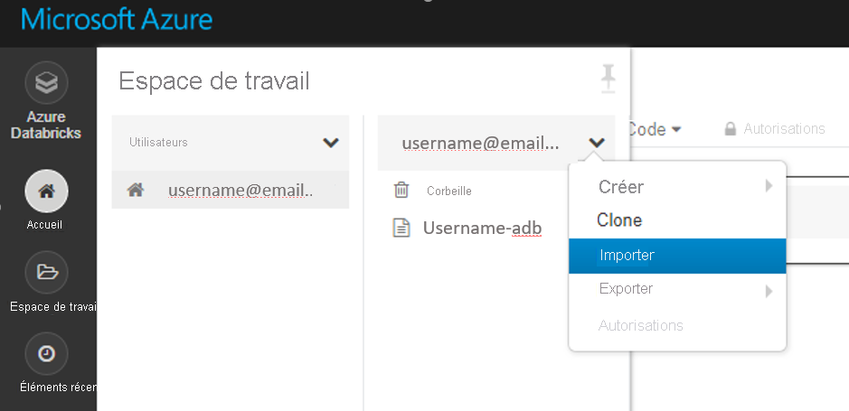

# <a name="set-up-a-development-environment-for-azure-machine-learning"></a>Configurer un environnement de développement pour Azure Machine Learning

Apprenez à configurer un environnement de développement Python pour Azure Machine Learning.

Le tableau suivant présente chaque environnement de développement évoqué dans cet article, ainsi que ses avantages et inconvénients.

| Environnement | Avantages | Inconvénients |
| --- | --- | --- |
| [Environnement local](#local) | Contrôle total de votre environnement de développement et des dépendances. Exécutez avec n’importe quel outil de build, environnement ou IDE de votre choix. | La mise en route prend plus de temps. Les packages de Kit de développement logiciel (SDK) nécessaires doivent être installés, ainsi qu’un environnement si vous n’en avez pas encore. |
| [Instance de calcul Azure Machine Learning](#compute-instance) | Méthode la plus simple pour la mise en route. Le Kit de développement logiciel (SDK) entier est déjà installé sur votre machine virtuelle d’espace de travail, et les didacticiels du Notebook sont pré-clonés et prêts pour exécution. | Manque de contrôle de votre environnement de développement et des dépendances. Coût supplémentaire pour la machine virtuelle Linux (la machine virtuelle peut être arrêtée lorsqu’elle n’est pas utilisée pour éviter des frais). Consultez les [détails de la tarification](https://azure.microsoft.com/pricing/details/virtual-machines/linux/). |
| [Azure Databricks](#aml-databricks) | Idéal pour l'exécution de flux de travail de Machine Learning intensifs à grande échelle sur la plateforme Apache Spark évolutive. | Excessif pour du Machine Learning expérimental ou des expériences et des flux de travail à plus petite échelle. Coût supplémentaire pour Azure Databricks. Consultez les [détails de la tarification](https://azure.microsoft.com/pricing/details/databricks/). |
| [Data Science Virtual Machine (DSVM)](#dsvm) | Similaire à l’instance de calcul basée sur le cloud (Python et le SDK sont préinstallés), mais avec d’autres outils connus de science des données et de machine learning préinstallés. Facile à mettre à l’échelle et à combiner avec d’autres outils et flux de travail personnalisés. | Expérience de démarrage plus lente que celle de l’instance de calcul basée sur le cloud. |

Cet article fournit également des conseils d’utilisation supplémentaires pour les outils suivants :

* Jupyter Notebook : si vous utilisez déjà Jupyter Notebook, le SDK contient des fonctionnalités supplémentaires que vous devez installer.

* Visual Studio Code : si vous utilisez Visual Studio Code, l’[extension Azure Machine Learning](https://marketplace.visualstudio.com/items?itemName=ms-toolsai.vscode-ai) inclut une prise en charge complète du langage Python ainsi que diverses caractéristiques permettant de travailler avec Azure Machine Learning beaucoup plus facilement et rapidement.

## <a name="prerequisites"></a>Prérequis

* Espace de travail Azure Machine Learning. SI vous n’en avez pas, vous pouvez créer un espace de travail Azure Machine Learning via le [Portail Azure](how-to-manage-workspace.md), [Azure CLI](how-to-manage-workspace-cli.md#create-a-workspace) et les [modèles Azure Resource Manager](how-to-create-workspace-template.md).

### <a name="local-and-dsvm-only-create-a-workspace-configuration-file"></a><a id="workspace"></a> (Local et DSVM uniquement) Créer un fichier de configuration d’espace de travail

Le fichier de configuration d’espace de travail est un fichier JSON qui indique au SDK comment communiquer avec votre espace de travail Azure Machine Learning. Le fichier est nommé *config.json*, et il a le format suivant :

```json
{
    "subscription_id": "<subscription-id>",
    "resource_group": "<resource-group>",
    "workspace_name": "<workspace-name>"
}
```

Ce fichier JSON doit se trouver dans la structure de répertoire qui contient vos scripts Python ou vos blocs-notes Jupyter Notebook. Il peut se trouver dans le même répertoire, dans un sous-répertoire nommé *.azureml* ou dans un répertoire parent.

Pour utiliser ce fichier à partir de votre code, utilisez la méthode [`Workspace.from_config`](https://docs.microsoft.com/python/api/azureml-core/azureml.core.workspace.workspace?view=azure-ml-py#from-config-path-none--auth-none---logger-none---file-name-none-&preserve-view=true). Ce code charge les informations à partir du fichier et se connecte à votre espace de travail.

Créez un fichier de configuration d’espace de travail dans l’une des méthodes suivantes :

* Portail Azure

    **Téléchargez le fichier** : Dans le [portail Azure](https://ms.portal.azure.com), sélectionnez **Télécharger config.json** à partir de la section **Vue d’ensemble** de votre espace de travail.

    

* SDK Python Azure Machine Learning

    Créez un script pour vous connecter à votre espace de travail Azure Machine Learning et utilisez la méthode [`write_config`](https://docs.microsoft.com/python/api/azureml-core/azureml.core.workspace.workspace?view=azure-ml-py#write-config-path-none--file-name-none-&preserve-view=true) pour générer votre fichier et l’enregistrer sous *.azureml/config.json*. Assurez-vous de remplacer les valeurs `subscription_id`, `resource_group` et `workspace_name` par les vôtres.

    ```python
    from azureml.core import Workspace

    subscription_id = '<subscription-id>'
    resource_group  = '<resource-group>'
    workspace_name  = '<workspace-name>'

    try:
        ws = Workspace(subscription_id = subscription_id, resource_group = resource_group, workspace_name = workspace_name)
        ws.write_config()
        print('Library configuration succeeded')
    except:
        print('Workspace not found')
    ```

## <a name="local-computer"></a><a id="local"></a>Ordinateur local

Pour configurer un environnement de développement local (qui peut aussi être une machine virtuelle distante telle qu’une instance de calcul Azure Machine Learning ou DSVM) :

1. Créez un environnement virtuel Python (virtualenv, conda).

    > [!NOTE]
    > Bien que cela ne soit pas obligatoire, il est recommandé d’utiliser [Anaconda](https://www.anaconda.com/download/) ou [Miniconda](https://www.anaconda.com/download/) pour gérer les environnements virtuels Python et installer les packages.

    > [!IMPORTANT]
    > Si vous avez un environnement Linux ou macOS et utilisez un interpréteur de commandes autre que Bash (par exemple, zsh), des erreurs peuvent s’afficher lorsque vous exécutez certaines commandes. Pour contourner ce problème, utilisez la commande `bash` pour démarrer un nouveau shell Bash et y exécuter les commandes.

1. Activez votre environnement virtuel Python nouvellement créé.
1. Installez le [Kit SDK Python d’Azure Machine Learning](https://docs.microsoft.com/python/api/overview/azure/ml/install?view=azure-ml-py&preserve-view=true).
1. Pour configurer votre environnement local de sorte qu’il utilise votre espace de travail Azure Machine Learning, [créez un fichier de configuration d’espace de travail](#workspace) ou utilisez un fichier existant.

Maintenant que votre environnement local est configuré, vous pouvez commencer à utiliser Azure Machine Learning. Pour commencer, consultez le [guide de prise en main d’Azure Machine Learning pour Python](tutorial-1st-experiment-sdk-setup-local.md).

### <a name="jupyter-notebooks"></a><a id="jupyter"></a>Jupyter Notebook

Lorsque vous exécutez un serveur Jupyter Notebook local, nous vous recommandons de créer un noyau IPython pour votre environnement virtuel Python. Cela permet de s’assurer du bon déroulement de l’importation du noyau et du package.

1. Activer les noyaux IPython spécifiques à l’environnement

    ```bash
    conda install notebook ipykernel
    ```

1. Créez un noyau pour votre environnement virtuel Python. Veillez à remplacer `<myenv>` par le nom de votre environnement virtuel Python.

    ```bash
    ipython kernel install --user --name <myenv> --display-name "Python (myenv)"
    ```

1. Démarrer le serveur Jupyter Notebook

Pour en savoir plus sur Azure Machine Learning et Jupyter Notebooks, consultez le [référentiel de notebooks Azure Machine Learning](https://github.com/Azure/MachineLearningNotebooks).

### <a name="visual-studio-code"></a><a id="vscode"></a>Visual Studio Code

Pour utiliser Visual Studio Code dans le cadre du développement :

1. Installez [Visual Studio Code](https://code.visualstudio.com/Download).
1. Installer l’[extension Azure Machine Learning de Visual Studio Code](tutorial-setup-vscode-extension.md) (préversion).

Une fois l’extension Visual Studio Code installée, vous pouvez gérer vos [ressources Azure Machine Learning](how-to-manage-resources-vscode.md), [exécuter et déboguer des expériences](how-to-debug-visual-studio-code.md) et [déployer des modèles formés](tutorial-train-deploy-image-classification-model-vscode.md).

## <a name="azure-machine-learning-compute-instance"></a><a id="compute-instance"></a>Instance de calcul Azure Machine Learning

L’[instance de calcul](concept-compute-instance.md) Azure Machine Learning est une station de travail Azure sécurisée et basée sur le cloud, qui fournit aux scientifiques des données un serveur Jupyter Notebook, un JupyterLab et un environnement de Machine Learning entièrement géré.

Vous n’avez rien à installer ou à configurer pour une instance de calcul.  

créez à tout moment depuis votre espace de travail Azure Machine Learning. Indiquez juste un nom et spécifiez un type de machine virtuelle Azure. Essayez dès maintenant avec ce [Didacticiel : Configurer l'environnement et l'espace de travail](tutorial-1st-experiment-sdk-setup.md).

Pour en savoir plus sur les instances de calcul, notamment comment installer des paquets, consultez [instances de calcul](concept-compute-instance.md).

> [!TIP]
> Pour éviter les frais associés à une instance de calcul inutilisée, [arrêtez l’instance de calcul](tutorial-1st-experiment-bring-data.md#clean-up-resources).

En plus d’un serveur Jupyter Notebook et d’un JupyterLab, vous pouvez utiliser des instances de calcul dans la [fonctionnalité de notebook intégrée à Azure Machine Learning Studio](how-to-run-jupyter-notebooks.md).

Vous pouvez également utiliser l’extension Visual Studio Code d’Azure Machine Learning pour [configurer une instance de calcul Azure Machine Learning comme serveur Jupyter Notebook distant](how-to-set-up-vs-code-remote.md#configure-compute-instance-as-remote-notebook-server).

## <a name="data-science-virtual-machine"></a><a id="dsvm"></a>Data Science Virtual Machine

Une Data Science Virtual Machine (DSVM) ou « Machine virtuelle pour la science des données » est une image de machine virtuelle (VM) personnalisée. Elle est conçue pour les travaux de science des données préconfigurés avec les outils et logiciels tels que :

  - Des packages tels que TensorFlow, PyTorch, Scikit-learn, XGBoost et le Kit de développement logiciel (SDK) Azure Machine Learning.
  - Des outils de science des données appréciés tels que Spark Standalone et Drill.
  - Des outils Azure tels que Azure CLI, AzCopy et Explorateur Stockage.
  - Des environnements de développement intégrés (IDE) tels que Visual Studio Code et PyCharm.
  - Serveur Jupyter Notebook

Pour une liste d’outils complète, consultez le [guide des outils inclus dans DSVM](data-science-virtual-machine/tools-included.md).

> [!IMPORTANT]
> Si vous envisagez d’utiliser DSVM comme [cible de calcul](concept-compute-target.md) pour vos tâches d’apprentissage ou d’inférence, seule la version Ubuntu est prise en charge.

Pour utiliser DSVM comme environnement de développement

1. Créez une DSVM au moyen de l’une des méthodes suivantes :

    * Utilisez le Portail Azure pour créer une DSVM [Ubuntu](data-science-virtual-machine/dsvm-ubuntu-intro.md) ou [Windows](data-science-virtual-machine/provision-vm.md).
    * [Créez une DSVM à l’aide de modèles ARM](data-science-virtual-machine/dsvm-tutorial-resource-manager.md).
    * Utiliser Azure CLI

        Pour créer une DSVM Ubuntu, utilisez la commande suivante :

        ```azurecli-interactive
        # create a Ubuntu DSVM in your resource group
        # note you need to be at least a contributor to the resource group in order to execute this command successfully
        # If you need to create a new resource group use: "az group create --name YOUR-RESOURCE-GROUP-NAME --location YOUR-REGION (For example: westus2)"
        az vm create --resource-group YOUR-RESOURCE-GROUP-NAME --name YOUR-VM-NAME --image microsoft-dsvm:linux-data-science-vm-ubuntu:linuxdsvmubuntu:latest --admin-username YOUR-USERNAME --admin-password YOUR-PASSWORD --generate-ssh-keys --authentication-type password
        ```

        Pour créer une DSVM Windows, utilisez la commande suivante :

        ```azurecli-interactive
        # create a Windows Server 2016 DSVM in your resource group
        # note you need to be at least a contributor to the resource group in order to execute this command successfully
        az vm create --resource-group YOUR-RESOURCE-GROUP-NAME --name YOUR-VM-NAME --image microsoft-dsvm:dsvm-windows:server-2016:latest --admin-username YOUR-USERNAME --admin-password YOUR-PASSWORD --authentication-type password
        ```

1. Activez l’environnement conda contenant le Kit SDK Azure Machine Learning.

    * Pour une DSVM Ubuntu :

        ```bash
        conda activate py36
        ```

    * Pour une DSVM Windows :

        ```bash
        conda activate AzureML
        ```

1. Pour configurer la DSVM de manière à utiliser votre espace de travail Azure Machine Learning, [créez un fichier de configuration d’espace de travail](#workspace) ou utilisez un fichier existant.

À l’instar des environnements locaux, vous pouvez utiliser Visual Studio Code et l’[extension Visual Studio Code d’Azure Machine Learning](#vscode) pour interagir avec Azure Machine Learning.

Pour plus d’informations, consultez la page [Machines virtuelles Science des données](https://azure.microsoft.com/services/virtual-machines/data-science-virtual-machines/).

## <a name="azure-databricks"></a><a name="aml-databricks"></a> Azure Databricks

Azure Databricks est un environnement basé sur Apache Spark dans le cloud Azure. Il fournit un environnement basé sur Notebook collaboratif avec un cluster de calcul basé sur l’UC ou le GPU.

Comment Azure Databricks fonctionne avec Azure Machine Learning :

+ Vous pouvez effectuer l’apprentissage d’un modèle à l’aide de Spark MLlib et déployer le modèle sur ACI/AKS à partir d’Azure Databricks.
+ Vous pouvez également utiliser les fonctionnalités [d’apprentissage automatique automatisées](concept-automated-ml.md) dans un Kit de développement logiciel (SDK) Azure ML spécial avec Azure Databricks.
+ Vous pouvez utiliser Azure Databricks comme cible de calcul à partir d’un [pipeline Azure Machine Learning](concept-ml-pipelines.md).

### <a name="set-up-your-databricks-cluster"></a>Configuration de votre cluster Databricks

Créez un [cluster Databricks](https://docs.microsoft.com/azure/azure-databricks/quickstart-create-databricks-workspace-portal). Certains paramètres s’appliquent uniquement si vous installez le Kit de développement logiciel (SDK) pour l’apprentissage automatique automatisé sur Databricks.
**La création du cluster prend quelques minutes.**

Utilisez les paramètres suivants :

| Paramètre |S’applique à| Valeur |
|----|---|---|
| Nom du cluster |toujours| Nom de votre cluster |
| Runtime Databricks |toujours|Runtime non-ML 7.1 (Scala 2.21, Spark 3.0.0) |
| Version Python |toujours| 3 |
| Workers |toujours| 2 ou plus |
| Types de machines virtuelles pour les nœuds worker <br>(détermine le nombre maximal d’itérations concurrentes) |ML automatisé<br>uniquement| Machine virtuelle à mémoire optimisé, de préférence |
| Activer la mise à l’échelle automatique |ML automatisé<br>uniquement| Décochez la case |

Attendez que le cluster s’exécute avant de continuer.

### <a name="install-the-correct-sdk-into-a-databricks-library"></a>Installation du Kit de développement logiciel (SDK) correct dans une bibliothèque Databricks

Une fois que le cluster est en cours d’exécution, [créez une bibliothèque](https://docs.databricks.com/user-guide/libraries.html#create-a-library) pour associer le package du Kit de développement logiciel (SDK) Azure Machine Learning approprié à votre cluster. Pour le Machine Learning automatisé, passez à la section [Kit SDK pour Databricks avec Machine Learning automatisé](#sdk-for-databricks-with-automated-machine-learning).

1. Cliquez avec le bouton de droite sur le dossier de l’espace de travail actuel dans lequel vous souhaitez stocker la bibliothèque. Sélectionnez **Créer** > **Bibliothèque**.

1. Choisissez l’option suivante (aucune autre installation de Kit de développement logiciel (SDK) n’est prise en charge)

   |Suppléments de &nbsp;packages&nbsp; de Kit de développement logiciel (SDK)|Source|Nom&nbsp;PyPi&nbsp;&nbsp;&nbsp;&nbsp;&nbsp;&nbsp;|
   |----|---|---|
   |Pour Databricks| Charger Python Egg ou PyPI | azureml-sdk[databricks]|

   > [!Warning]
   > Aucun autre supplément de Kit de développement logiciel (SDK) ne peut être installé. Choisissez uniquement l’option [`databricks`].

   * Ne sélectionnez pas **Attacher automatiquement à tous les clusters**.
   * Sélectionnez **Attacher** en regard du nom de votre cluster.

1. Surveillez les erreurs jusqu’à ce que l’état soit défini sur **Attaché**, ce qui peut prendre plusieurs minutes.  Si cette étape échoue :

   Essayez de redémarrer votre cluster en procédant comme suit :
   1. Dans le volet gauche, sélectionnez **Clusters**.
   1. Sélectionnez le nom de votre cluster dans le tableau.
   1. Sous l’onglet **Bibliothèques**, sélectionnez **Redémarrer**.

   Tenez également compte des aspects ci-dessous :
   + Dans la configuration d'AutoML, lorsque vous utilisez Azure Databricks, ajoutez les paramètres suivants :
       1. ```max_concurrent_iterations``` est basé sur le nombre de nœuds Worker dans votre cluster.
        2. ```spark_context=sc``` est basé sur le contexte spark par défaut.
   + Ou, si vous avez une ancienne version du Kit de développement logiciel (SDK), désélectionnez-la des bibliothèques installées du cluster et déplacez-la vers la corbeille. Installez la nouvelle version du SDK et redémarrez le cluster. En cas de problème après le redémarrage, détachez et rattachez votre cluster.

Si l’installation a réussi, la bibliothèque importée doit ressembler à l’une de celles présentées ci-dessous :

#### <a name="sdk-for-databricks"></a>Kit SDK pour Databricks


#### <a name="sdk-for-databricks-with-automated-machine-learning"></a>Kit de développement logiciel (SDK) pour Databricks avec Machine Learning automatisé
Si le cluster a été créé avec le runtime non-ML 7.1 de Databricks ou une version ultérieure, exécutez la commande suivante dans la première cellule de votre notebook pour installer le Kit SDK AML.

```
%pip install --upgrade --force-reinstall -r https://aka.ms/automl_linux_requirements.txt
```
Pour le runtime non-ML 7.0 de Databricks et les versions inférieures, installez le Kit SDK AML à l’aide du [script init](https://github.com/Azure/MachineLearningNotebooks/blob/master/how-to-use-azureml/azure-databricks/automl/README.md).


### <a name="start-exploring"></a>Commencez à explorer

Lancez-vous :
+ Bien que de nombreux exemples de notebooks soient disponibles, **seuls[ ces exemples ](https://github.com/Azure/MachineLearningNotebooks/blob/master/how-to-use-azureml/azure-databricks) fonctionnent avec Azure Databricks.**

+ Importez ces exemples directement à partir de votre espace de travail. Voir ci-dessous : 


+ Découvrez comment [créer un pipeline avec Databricks en tant que cible de calcul de formation](how-to-create-your-first-pipeline.md).

## <a name="next-steps"></a>Étapes suivantes

- [Entraîner un modèle](tutorial-train-models-with-aml.md) sur Azure Machine Learning avec le jeu de données MNIST
- Voir les informations de référence sur le [Kit SDK Azure Machine Learning pour Python](https://docs.microsoft.com/python/api/overview/azure/ml/intro?view=azure-ml-py&preserve-view=true)
