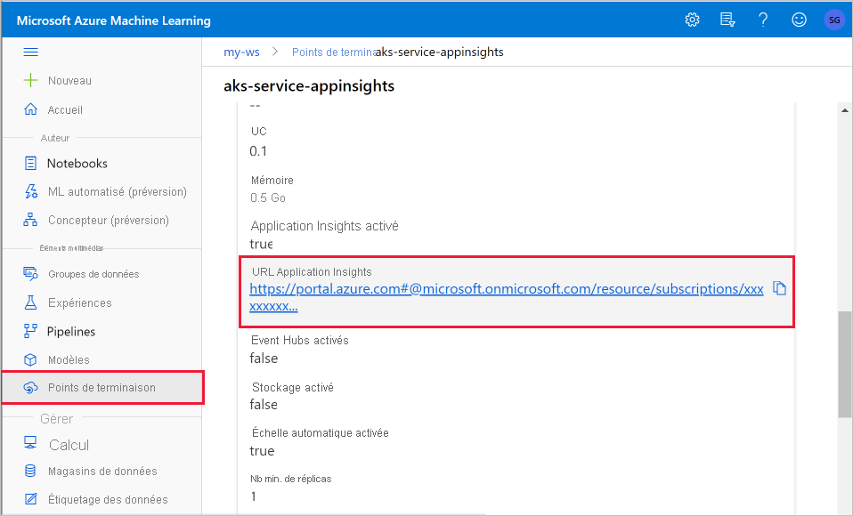
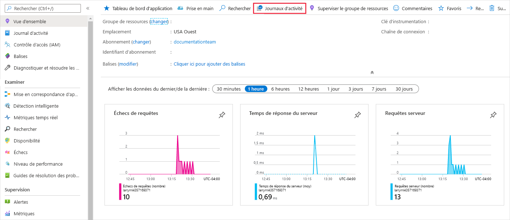
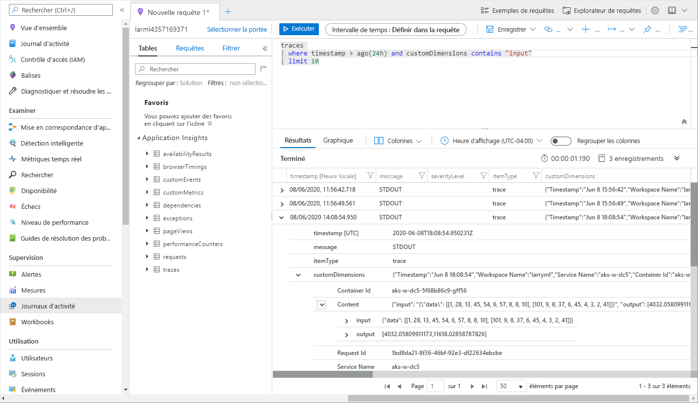

# <a name="monitor-and-collect-data-from-ml-web-service-endpoints"></a>Superviser et collecter des données à partir des points de terminaison de service web Machine Learning


Dans cet article, vous allez apprendre à collecter des données à partir de modèles déployés sur des points de terminaison de service web dans Azure Kubernetes Service (AKS) ou Azure Container Instances (ACI). [Azure Application Insights](../azure-monitor/app/app-insights-overview.md) permet de collecter les données suivantes à partir d’un point de terminaison :
* Données de sortie
* Réponses
* Taux de demande, temps de réponse et taux d’échec
* Taux de dépendance, temps de réponse et taux d’échec
* Exceptions

Le notebook [enable-app-insights-in-production-service.ipynb](https://github.com/Azure/MachineLearningNotebooks/blob/master/how-to-use-azureml/deployment/enable-app-insights-in-production-service/enable-app-insights-in-production-service.ipynb) illustre les concepts présentés dans cet article.
 
[!INCLUDE [aml-clone-in-azure-notebook](../../includes/aml-clone-for-examples.md)]
 
## <a name="prerequisites"></a>Prérequis

* Un abonnement Azure : essayez la [version gratuite ou payante d’Azure Machine Learning](https://aka.ms/AMLFree).

* Un espace de travail Azure Machine Learning, un répertoire local contenant vos scripts, et le SDK Azure Machine Learning pour Python. Pour en savoir plus, voir le [Guide pratique pour configurer un environnement de développement](how-to-configure-environment.md).

* Modèle Machine Learning entraîné. Pour en savoir plus, voir le didacticiel [Entraîner un modèle de classification d’images](tutorial-train-models-with-aml.md).

<a name="python"></a>

## <a name="configure-logging-with-the-python-sdk"></a>Configurer la journalisation avec le Kit de développement logiciel (SDK) Python

Dans cette section, vous allez apprendre à activer la journalisation d’Application Insights à l’aide du Kit de développement logiciel (SDK) Python. 

### <a name="update-a-deployed-service"></a>Mettre à jour un service déployé

La procédure suivante permet de mettre à jour un service web existant :

1. Recherchez le service dans votre espace de travail. La valeur de `ws` correspond au nom de votre espace de travail

    ```python
    from azureml.core.webservice import Webservice
    aks_service= Webservice(ws, "my-service-name")
    ```
2. Mettez à jour votre service et activez Azure Application Insights

    ```python
    aks_service.update(enable_app_insights=True)
    ```

### <a name="log-custom-traces-in-your-service"></a>Journaliser des traces personnalisées dans votre service

> [!IMPORTANT]
> Azure Application Insights ne journalise que les charges utiles jusqu’à 64 Ko. Si cette limite est atteinte, vous risquez de voir des erreurs de type mémoire insuffisante, ou aucune information ne pourrait être enregistrée. Si les données que vous souhaitez consigner sont plus volumineuses, vous devez les stocker dans le stockage d’objets BLOB à l’aide des informations contenues dans [Collecter des données pour des modèles en production](how-to-enable-data-collection.md).
>
> Pour les situations plus complexes, comme le suivi de modèle dans un déploiement AKS, nous vous recommandons d’utiliser une bibliothèque tierce, telle que [OpenCensus](https://opencensus.io).

Pour journaliser des traces personnalisées, suivez le processus de déploiement standard pour AKS ou ACI dans le document [Comment et où déployer](how-to-deploy-and-where.md). Puis, procédez comme suit :

1. Mettez à jour le fichier de scoring en ajoutant des instructions print pour envoyer des données à Application Insights pendant l’inférence. Pour des informations plus complexes, telles que les données de requête et la réponse, utilisez une structure JSON. 

    L’exemple de fichier `score.py` suivant enregistre l’heure à laquelle le modèle est initialisé, l’entrée et la sortie pendant l’inférence et l’heure à laquelle des erreurs se produisent.

    
    ```python
    import pickle
    import json
    import numpy 
    from sklearn.externals import joblib
    from sklearn.linear_model import Ridge
    from azureml.core.model import Model
    import time

    def init():
        global model
        #Print statement for appinsights custom traces:
        print ("model initialized" + time.strftime("%H:%M:%S"))
        
        # note here "sklearn_regression_model.pkl" is the name of the model registered under the workspace
        # this call should return the path to the model.pkl file on the local disk.
        model_path = Model.get_model_path(model_name = 'sklearn_regression_model.pkl')
        
        # deserialize the model file back into a sklearn model
        model = joblib.load(model_path)
    

    # note you can pass in multiple rows for scoring
    def run(raw_data):
        try:
            data = json.loads(raw_data)['data']
            data = numpy.array(data)
            result = model.predict(data)
            # Log the input and output data to appinsights:
            info = {
                "input": raw_data,
                "output": result.tolist()
                }
            print(json.dumps(info))
            # you can return any datatype as long as it is JSON-serializable
            return result.tolist()
        except Exception as e:
            error = str(e)
            print (error + time.strftime("%H:%M:%S"))
            return error
    ```

2. Mettez à jour la configuration du service et veillez à activer Application Insights.
    
    ```python
    config = Webservice.deploy_configuration(enable_app_insights=True)
    ```

3. Générez une image et déployez-la sur AKS ou ACI. Pour plus d’informations, consultez le document [Comment et où déployer](how-to-deploy-and-where.md).


### <a name="disable-tracking-in-python"></a>Désactiver le suivi dans Python

Pour désactiver Azure Application Insights, utilisez le code suivant :

```python 
## replace <service_name> with the name of the web service
<service_name>.update(enable_app_insights=False)
```

<a name="studio"></a>

## <a name="configure-logging-with-azure-machine-learning-studio"></a>Configurer la journalisation avec le studio Azure Machine Learning

Vous pouvez également activer Application Insights à partir du studio Azure Machine Learning. Lorsque vous êtes prêt à déployer votre modèle en tant que service web, procédez comme suit pour activer Application Insights :

1. Connectez-vous au studio à l’adresse https://ml.azure.com.
1. Accédez à **Modèles**, puis sélectionnez le modèle que vous voulez déployer.
1. Sélectionnez **+ Déployer**.
1. Renseignez le formulaire **Déployer le modèle**.
1. Développez le menu **Avancé**.

    
1. Sélectionnez **Activer les diagnostics et la collecte de données Application Insights**.

    

## <a name="view-metrics-and-logs"></a>Afficher les métriques et les journaux

### <a name="query-logs-for-deployed-models"></a>Interroger les journaux pour les modèles déployés

Les journaux des points de terminaison en temps réel sont des données client. La fonction `get_logs()` permet de récupérer les journaux d’un service web déjà déployé. Les journaux d’activité peuvent contenir des informations détaillées sur les éventuelles erreurs qui se seraient produites au cours du déploiement.

```python
from azureml.core import Workspace
from azureml.core.webservice import Webservice

ws = Workspace.from_config()

# load existing web service
service = Webservice(name="service-name", workspace=ws)
logs = service.get_logs()
```

Si vous avez plusieurs locataires, vous devrez peut-être ajouter le code d’authentification suivant devant `ws = Workspace.from_config()`

```python
from azureml.core.authentication import InteractiveLoginAuthentication
interactive_auth = InteractiveLoginAuthentication(tenant_id="the tenant_id in which your workspace resides")
```

### <a name="view-logs-in-the-studio"></a>Afficher les journaux dans le studio

Azure Application Insights stocke les journaux du service dans le même groupe de ressources que l’espace de travail Azure Machine Learning. Effectuez les étapes suivantes pour consulter vos données à l’aide du studio :

1. Accédez à votre espace de travail Azure Machine Learning dans le [studio](https://ml.azure.com/).
1. Sélectionnez **Points de terminaison**.
1. Sélectionnez le service déployé.
1. Sélectionnez le lien **URL d’Application Insights**.

    [](././media/how-to-enable-app-insights/appinsightsloc.png#lightbox)

1. Dans Application Insights, à partir de l’onglet **Vue d’ensemble** ou de la section __Surveillance__, sélectionnez __Journaux__.

    [](./media/how-to-enable-app-insights/overview.png#lightbox)

1. Pour afficher les informations consignées dans le fichier score.py, examinez la table __traces__. La requête suivante recherche les journaux dans lesquels la valeur __input__ a été consignée :

    ```kusto
    traces
    | where customDimensions contains "input"
    | limit 10
    ```

   [](././media/how-to-enable-app-insights/model-data-trace.png#lightbox)

Pour plus d’informations sur l’utilisation d’Azure Application Insights, voir [Présentation d’Application Insights](../azure-monitor/app/app-insights-overview.md).

## <a name="web-service-metadata-and-response-data"></a>Métadonnées de service web et données de réponse

> [!IMPORTANT]
> Azure Application Insights ne journalise que les charges utiles jusqu’à 64 Ko. Si cette limite est atteinte, vous risquez de voir des erreurs de type mémoire insuffisante, ou aucune information ne pourrait être enregistrée.

Pour enregistrer les informations sur la demande du service web, ajoutez des instructions `print` à votre fichier score.py. Chaque instruction `print` génère une entrée dans la table de trace dans Application Insights, sous le message `STDOUT`. Application Insights stocke les sorties de l’instruction `print` dans `customDimensions` et dans la table de trace `Contents`. L’impression de chaînes JSON génère une structure de données hiérarchique dans la sortie de trace sous `Contents`.

## <a name="export-data-for-retention-and-processing"></a>Exporter des données pour la rétention et le traitement

>[!Important]
> Azure Application Insights ne prend en charge que les exportations vers le Stockage Blob. Pour plus d’informations sur les limites de cette implémentation, voir [Exporter la télémétrie depuis Application Insights](../azure-monitor/app/export-telemetry.md#continuous-export-advanced-storage-configuration).

L’[exportation continue](../azure-monitor/app/export-telemetry.md) d’Application Insights permet d’exporter des données vers un compte de stockage d’objets Blob dans lequel vous pouvez définir des paramètres de rétention. Application Insights exporte les données au format JSON. 

:::image type="content" source="media/how-to-enable-app-insights/continuous-export-setup.png" alt-text="Exportation continue":::

## <a name="next-steps"></a>Étapes suivantes

Dans cet article, vous avez appris à activer la journalisation et à consulter les journaux des points de terminaison de service web. Consultez les articles suivants pour les prochaines étapes :


* [Procédure de déploiement d’un modèle dans un cluster AKS](./how-to-deploy-azure-kubernetes-service.md)

* [Procédure de déploiement d’un modèle dans Azure Container Instances](./how-to-deploy-azure-container-instance.md)

* [MLOps : Déployer, gérer et superviser des modèles avec Azure Machine Learning](./concept-model-management-and-deployment.md) pour en savoir plus sur l’exploitation des données collectées à partir des modèles en production. Ces données peuvent vous aider à améliorer continuellement votre processus de Machine Learning.