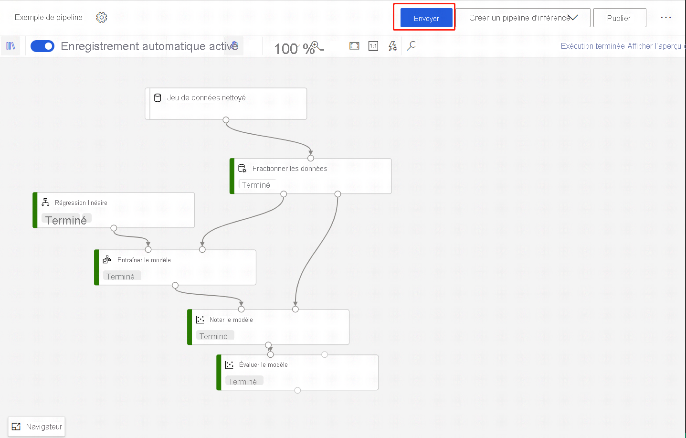
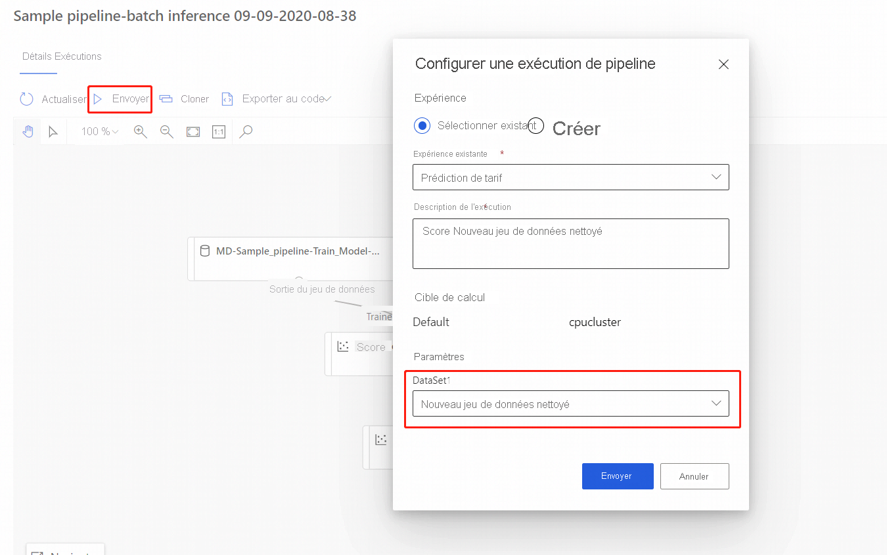

# Exécuter des prédictions par lots à l’aide du concepteur Azure Machine Learning

Dans cet article, vous allez apprendre à utiliser le concepteur pour créer un pipeline de prédiction par lots. La prédiction par lots vous permet de noter en continu et à la demande des jeux de données volumineux via un service web qui peut être déclenché à partir de n'importe quelle bibliothèque HTTP.

Au cours de cette procédure, vous allez apprendre à effectuer les tâches suivantes :

> [!div class="checklist"]
> * Créer et publier un pipeline d'inférence par lots
> * Utiliser un point de terminaison de pipeline
> * Gérer les versions d'un point de terminaison

Pour configurer les services de scoring par lots à l'aide du kit de développement logiciel (SDK), consultez cette [procédure](./tutorial-pipeline-batch-scoring-classification.md).

[!INCLUDE [endpoints-option](../../includes/machine-learning-endpoints-preview-note.md)]

## Prérequis

Cette procédure suppose que vous disposez déjà d'un pipeline de formation. Pour accéder à une présentation guidée du concepteur, suivez la [première partie du tutoriel du concepteur](tutorial-designer-automobile-price-train-score.md). 

[!INCLUDE [machine-learning-missing-ui](../../includes/machine-learning-missing-ui.md)]

## Créer un pipeline d’inférence par lots

Votre pipeline de formation doit être exécuté au moins une fois pour créer un pipeline d'inférence.

1. Accédez à l'onglet **Concepteur** de votre espace de travail.

1. Sélectionnez le pipeline d’entraînement qui entraîne le modèle que vous voulez utiliser pour faire une prédiction.

1. **Envoyez** le pipeline.

    

Maintenant que le pipeline de formation a été exécuté, vous pouvez créer un pipeline d'inférence par lots.

1. En regard de **Envoyer**, sélectionnez le nouveau menu déroulant **Créer un pipeline d’inférence**.

1. Sélectionnez **Pipeline d'inférence par lots**.

    
    
Le résultat est un pipeline d’inférence par lots par défaut. 

### Ajouter un paramètre de pipeline

Pour créer des prédictions sur de nouvelles données, vous pouvez connecter manuellement un autre jeu de données dans le mode Brouillon de ce pipeline ou créer un paramètre pour votre jeu de données. Les paramètres vous permettent de modifier le comportement du processus d'inférence par lots lors de l'exécution.

Dans cette section, vous allez créer un paramètre de jeu de données afin de spécifier un autre jeu de données pour les prédictions.

1. Sélectionnez le module de jeu de données.

1. Un volet s'affiche à droite du canevas. En bas du volet, sélectionnez **Définir en tant que paramètre de pipeline**.
   
    Entrez un nom pour le paramètre, ou acceptez la valeur par défaut.

    > [!div class="mx-imgBorder"]
    > 

## Publier votre pipeline d'inférence par lots

Vous êtes maintenant prêt à déployer le pipeline d'inférence. Cela permettra de déployer le pipeline et de le mettre à la disposition d'autres utilisateurs.

1. Cliquez sur le bouton **Publier**.

1. Dans la boîte de dialogue qui s'affiche, développez la liste déroulante **Point de terminaison de pipeline** et sélectionnez **Nouveau point de terminaison de pipeline**.

1. Attribuez un nom et une description (facultative) au point de terminaison.

    Dans la partie inférieure de la boîte de dialogue, vous pouvez voir le paramètre que vous avez configuré avec une valeur par défaut de l'ID du jeu de données utilisé lors de la formation.

1. Sélectionnez **Publier**.

## Utiliser un point de terminaison

Vous disposez maintenant d'un pipeline publié avec un paramètre de jeu de données. Le pipeline utilisera le modèle formé créé dans le pipeline de formation pour noter le jeu de données que vous fournissez en tant que paramètre.

### Envoyer une exécution de pipeline 

Dans cette section, vous allez configurer une exécution manuelle du pipeline et modifier le paramètre du pipeline pour noter les nouvelles données. 

1. Au terme du déploiement, accédez à la section **Points de terminaison**.

1. Sélectionnez **Points de terminaison de pipeline**.

1. Sélectionnez le nom du point de terminaison que vous avez créé.

1. Sélectionnez **Pipelines publiés**.

    Cet écran affiche tous les pipelines publiés sous ce point de terminaison.

1. Sélectionnez le pipeline que vous avez publié.

    La page Détails du pipeline affiche l'historique détaillé des exécutions ainsi que des informations sur les chaînes de connexion de votre pipeline. 
    
1. Sélectionnez **Envoyer** pour créer une exécution manuelle du pipeline.

    
    
1. Modifiez le paramètre pour utiliser un autre jeu de données.
    
1. Sélectionnez **Envoyer** pour exécuter le pipeline.

### Utiliser le point de terminaison REST

Pour plus d'informations sur l'utilisation des points de terminaison de pipeline et sur le pipeline publié, consultez la section **Points de terminaison**.

Vous trouverez le point de terminaison REST d'un point de terminaison de pipeline dans le panneau Vue d'ensemble de l'exécution. En appelant le point de terminaison, vous utilisez son pipeline publié par défaut.

Vous pouvez également utiliser un pipeline publié sur la page **Pipelines publiés**. Sélectionnez un pipeline publié. Vous pouvez y trouver le point de terminaison REST dans le volet **Vue d’ensemble des pipelines publiés** à droite du graphique. 

Pour procéder à un appel REST, vous devez disposer d'un en-tête d'authentification de type porteur OAuth 2.0. Pour plus d’informations sur la configuration de l’authentification dans votre espace de travail et sur l’exécution d’un appel REST paramétrable, consultez [ce tutoriel](tutorial-pipeline-batch-scoring-classification.md#publish-and-run-from-a-rest-endpoint).

## Contrôle de version des points de terminaison

Le concepteur attribue une version à chacun des pipelines ultérieurs que vous publiez sur un point de terminaison. Vous pouvez spécifier la version du pipeline que vous souhaitez exécuter en tant que paramètre dans votre appel REST. Si vous ne spécifiez aucun numéro de version, le concepteur utilisera le pipeline par défaut.

Lorsque vous publiez un pipeline, vous pouvez choisir de le définir comme nouveau pipeline par défaut du point de terminaison.

Vous pouvez également définir un nouveau pipeline par défaut sous l'onglet **Pipelines publiés** de votre point de terminaison.

## Limites

Si vous apportez des modifications à votre pipeline d’entraînement, vous devez à nouveau le soumettre, **mettre à jour** le pipeline d’inférence et réexécuter ce dernier.

Notez que seuls les modèles sont mis à jour dans le pipeline d’inférence, pas la transformation de données.

Pour utiliser la transformation mise à jour dans le pipeline d’inférence, vous devez inscrire la sortie de transformation du module de transformation en tant que jeu de données.

Ensuite, remplacez manuellement le module **TD-** dans le pipeline d’inférence par le jeu de données inscrit.

Vous pouvez ensuite soumettre le pipeline d’inférence avec le modèle et la transformation mis à jour, puis publier.

## Étapes suivantes

Suivez le [tutoriel](tutorial-designer-automobile-price-train-score.md) sur le concepteur pour entraîner et déployer un modèle de régression.

Pour savoir comment publier et exécuter un pipeline publié à l’aide du kit de développement logiciel (SDK), consultez [cet article](how-to-deploy-pipelines.md).
