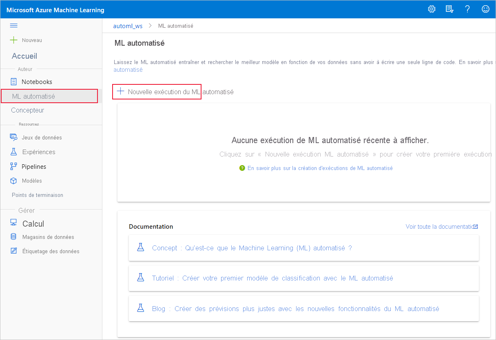

# Créer, examiner et déployer des modèles de machine learning automatisé avec Azure Machine Learning

Dans cet article, vous allez apprendre à créer, à explorer et à déployer des modèles de machine learning automatisé sans la moindre ligne de code dans le studio Azure Machine Learning.

Le machine learning automatisé est un processus dans lequel le meilleur algorithme de machine learning à utiliser pour vos données spécifiques est automatiquement sélectionné. Ce processus vous permet de générer rapidement des modèles Machine Learning. [Apprenez-en davantage sur Machine Learning automatisé](concept-automated-ml.md).
 
Pour obtenir un exemple de bout en bout, consultez le [tutoriel sur la création d’un modèle de classification avec l’interface de ML automatisé d’Azure Machine Learning](tutorial-first-experiment-automated-ml.md). 

Pour une expérience basée sur du code Python, [configurez vos expériences de machine learning automatisé](how-to-configure-auto-train.md) avec le SDK Azure Machine Learning.

## Prérequis

* Un abonnement Azure. Si vous n’avez pas d’abonnement Azure, créez un compte gratuit avant de commencer. Essayez la [version gratuite ou payante d’Azure Machine Learning](https://aka.ms/AMLFree) dès aujourd’hui.

* Un espace de travail Azure Machine Learning. Consultez [Créer un espace de travail Microsoft Azure Machine Learning](how-to-manage-workspace.md). 

## Bien démarrer

1. Connectez-vous à Azure Machine Learning à l’adresse https://ml.azure.com. 

1. Sélectionnez votre abonnement et votre espace de travail. 

1. Accédez au volet gauche. Sélectionnez **Automated ML** (ML automatisé) sous la section **Author** (Auteur).

 S’il s’agit de votre première expérience, vous verrez une liste vide et des liens vers la documentation. 

Dans le cas contraire, vous verrez une liste de vos expériences récentes Machine Learning automatisé, y compris celles créées avec le kit de développement logiciel (SDK). 

## Créer et exécuter une expérience

1. Sélectionnez **+ Nouvelle exécution de ML automatisé** et remplissez le formulaire.

1. Sélectionnez un jeu de données à partir de votre conteneur de stockage ou créez un nouveau jeu de données. Les jeux de données peuvent être créés à partir de fichiers locaux, d’URL Web, de magasins de données ou de Azure Open Datasets. En savoir plus sur la [création de jeux de données](how-to-create-register-datasets.md).  

    >[!Important]
    > Configuration requise pour les données de formation :
    >* Les données doivent être sous forme tabulaire.
    >* La valeur que vous souhaitez prédire (colonne cible) doit être présente dans les données.

    1. Pour créer un jeu de données à partir d’un fichier sur votre ordinateur local, sélectionnez **+Créer un jeu de données**, puis sélectionnez **À partir d’un fichier local**. 

    1. Dans le formulaire **Informations de base**, donnez un nom unique à votre jeu de données et indiquez éventuellement une description. 

    1. Sélectionnez **Suivant** pour ouvrir le **formulaire Sélection d’un magasin de données et de fichiers**. Sur ce formulaire, vous sélectionnez l’emplacement où charger votre jeu de données : choisissez le conteneur de stockage par défaut qui est automatiquement créé avec votre espace de travail ou un conteneur de stockage que vous voulez utiliser pour l’expérience. 
    
        1. Si vos données se trouvent derrière un réseau virtuel, vous devez activer la fonction permettant d’**ignorer la validation** pour vous assurer que l’espace de travail peut accéder à vos données. Pour plus d’informations, consultez [Utiliser Azure Machine Learning Studio dans un réseau virtuel Azure](how-to-enable-studio-virtual-network.md). 
    
    1. Sélectionnez **Parcourir** pour charger le fichier de données de votre jeu de données. 

    1. Vérifiez l’exactitude du formulaire **Settings and preview** (Paramètres et aperçu). Le formulaire est rempli intelligemment en fonction du type de fichier. 

        Champ| Description
        ----|----
        Format de fichier| Définit la disposition et le type des données stockées dans un fichier.
        Délimiteur| Un ou plusieurs caractères utilisés pour spécifier la limite entre des régions indépendantes et séparées dans du texte brut ou d’autres flux de données.
        Encodage| Identifie la table de schéma bits/caractères à utiliser pour lire votre jeu de données.
        En-têtes de colonne| Indique la façon dont les éventuels en-têtes du jeu de données sont traités.
        Ignorer les lignes | Indique le nombre éventuel de lignes ignorées dans le jeu de données.
    
        Sélectionnez **Suivant**.

    1. Le formulaire **Schéma** est rempli intelligemment en fonction des sélections effectuées dans le formulaire **Paramètres et aperçu**. Ici, configurez le type de données pour chaque colonne, passez en revue les noms des colonnes et sélectionnez celles à **ne pas inclure** dans votre expérience. 
            
        Sélectionnez **Next** (Suivant).

    1. Le formulaire **Confirmer les détails** est un résumé des informations précédemment renseignées sur les formulaires **Informations de base** et **Paramètres et aperçu**. Vous avez également la possibilité de créer un profil de données pour votre jeu de données à l’aide d’un calcul activé pour le profilage. En savoir plus sur le [profilage des données](how-to-connect-data-ui.md#profile).

        Sélectionnez **Suivant**.
1. Sélectionnez votre jeu de données récemment créé une fois qu’il apparaît. Vous pouvez également afficher un aperçu du jeu de données et des exemples de statistiques. 

1. Dans le formulaire **Configurer l’exécution**, sélectionnez **Créer** , puis entrez **didacticiel-automl-deploy** pour le nom de l’expérience.

1. Sélectionnez une colonne cible ; il s’agit de la colonne sur laquelle vous voulez effectuer des prédictions.

1. Sélectionnez un calcul pour le profilage de données et le travail de formation. Vos calculs existants sont disponibles dans la liste déroulante. Pour créer un calcul, suivez les instructions de l’étape 7.

1. Sélectionnez **Créer un nouveau calcul** afin de configurer votre contexte de calcul pour cette expérience.

    Champ|Description
    ---|---
    Nom du calcul| Entrez un nom unique qui identifie votre contexte de calcul.
    Priorité de machine virtuelle| Les machines virtuelles basse priorité sont moins chères, mais ne garantissent pas les nœuds de calcul. 
    Type de machine virtuelle| Sélectionnez l’UC ou le GPU pour le type de machine virtuelle.
    Taille de la machine virtuelle| Sélectionnez la taille de la machine virtuelle pour votre calcul.
    Nombre minimal/maximal de nœuds| Pour profiler des données, vous devez spécifier un ou plusieurs nœuds. Entrez le nombre maximal de nœuds pour votre calcul. La valeur par défaut est de 6 nœuds pour un calcul AML.
    Paramètres avancés | Ces paramètres vous permettent de configurer un compte d’utilisateur et un réseau virtuel existant pour votre expérience. 
    
    Sélectionnez **Create** (Créer). La création d’un calcul peut prendre quelques minutes.

    >[!NOTE]
    > Le nom de votre calcul indique si le *profilage est activé* pour le calcul que vous sélectionnez/créez. (Pour plus d’informations, consultez la section sur le [profilage des données](how-to-connect-data-ui.md#profile)).

    Sélectionnez **Suivant**.

1. Dans le formulaire **Type de tâche et paramètres**, sélectionnez le type de tâche : classification, régression ou prévision. Pour plus d’informations, consultez [Types de tâches pris en charge](concept-automated-ml.md#when-to-use-automl-classify-regression--forecast).

    1. Pour la **classification**, vous pouvez également activer le deep learning.
    
        Si le deep learning est activé, la validation est limitée à la _division train_validation_. [Découvrez-en plus sur les options de validation](how-to-configure-cross-validation-data-splits.md).

    1. Pour les **prévisions** : 
    
        1. Activez le deep learning.
    
        1. Sélectionnez la *colonne d'heure* : cette colonne contient les données d'heure à utiliser.

        1. Sélectionnez l'*horizon de prévision* : Indiquez le nombre d’unités de temps (minutes/heures/jours/semaines/mois/années) que le modèle sera en mesure de prédire. Plus le modèle doit prédire dans un avenir lointain, moins il sera précis. [En savoir plus sur les prévisions et l'horizon de prévision](how-to-auto-train-forecast.md).

1. (Facultatif) Voir des paramètres de configuration supplémentaires : paramètres supplémentaires que vous pouvez utiliser pour mieux contrôler la tâche d’entraînement. Sinon, les valeurs par défaut sont appliquées en fonction de la sélection de l’expérience et des données. 

    Configurations supplémentaires|Description
    ------|------
    Métrique principale| Métrique principale utilisée pour évaluer votre modèle. [En savoir plus sur les métriques du modèle](how-to-configure-auto-train.md#primary-metric).
    Expliquer le meilleur modèle | Sélectionnez cette option pour activer ou désactiver l’affichage d’explications du meilleur modèle recommandé.   Cette fonctionnalité n’est actuellement pas disponible pour [certains algorithmes de prévision](how-to-machine-learning-interpretability-automl.md#interpretability-during-training-for-the-best-model). 
    Algorithme bloqué| Sélectionnez les algorithmes que vous souhaitez exclure du travail de formation.    L’autorisation des algorithmes est disponible uniquement pour les [expériences SDK](how-to-configure-auto-train.md#supported-models).   Consultez les [modèles pris en charge pour chaque type de tâche](/python/api/azureml-automl-core/azureml.automl.core.shared.constants.supportedmodels?preserve-view=true&view=azure-ml-py).
    Critère de sortie| Quand l’un de ces critères est satisfait, le travail d’entraînement s’arrête.   *Durée du travail de formation (heures)*  : Délai d'exécution du travail de formation.   *Seuil de score de métrique* :  Score de métrique minimal pour tous les pipelines. Ainsi, si vous avez défini une métrique cible que vous souhaitez atteindre, vous ne passez pas plus de temps sur le travail de formation que nécessaire.
    Validation| Sélectionnez une des options de validation croisée à utiliser dans le travail de formation.   [En savoir plus sur la validation croisée](how-to-configure-cross-validation-data-splits.md#prerequisites).   Les prévisions prennent uniquement en charge la validation croisée k-fold.
    Accès concurrentiel| *Nombre maximal d'itérations simultanées* : Nombre maximal de pipelines (itérations) à tester dans le travail de formation. Le travail ne s'exécutera pas au-delà du nombre d’itérations spécifié. Apprenez-en davantage sur la manière dont le Machine Learning automatisé effectue [plusieurs exécutions enfants sur des clusters](how-to-configure-auto-train.md#multiple-child-runs-on-clusters).

1. (Facultatif) Afficher les paramètres de caractérisation : si vous choisissez d’activer **Caractérisation automatique** dans le formulaire **Paramètres de configuration supplémentaires** formulaire, les techniques caractérisation par défaut sont appliquées. Dans **Afficher les paramètres de caractérisation**, vous pouvez modifier ces valeurs par défaut et les personnaliser en conséquence. Découvrez comment [personnaliser la caractérisation](#customize-featurization). 

    

## Personnaliser la caractérisation

Dans le formulaire **Caractérisation**, vous pouvez activer/désactiver la caractérisation automatique et personnaliser les paramètres correspondants pour votre expérience. Pour ouvrir ce formulaire, reportez-vous à l’étape 10 de la section [Créer et exécuter une expérience](#create-and-run-experiment). 

Le tableau suivant récapitule les personnalisations actuellement disponibles via le studio. 

Colonne| Personnalisation
---|---
Inclus | Spécifie les colonnes à inclure pour la formation.
Type de caractéristique| Modifiez le type valeur de la colonne sélectionnée.
Imputer avec| Sélectionnez la valeur à imputer aux valeurs manquantes dans vos données.

## Exécuter une expérience et afficher les résultats

Sélectionnez **Terminer** pour exécuter votre expérience. Le processus de préparation de l’expérience peut prendre jusqu’à 10 minutes. Les travaux de formation peuvent prendre 2 à 3 minutes supplémentaires pour que chaque pipeline se termine.

> [!NOTE]
> Les algorithmes utilisés par le ML automatisé présentent un fonctionnement aléatoire inhérent qui peut provoquer de légères variations dans un score de métrique final de modèle recommandé, comme la précision. Le ML automatisé exécute également des opérations au niveau des données, telles que le fractionnement de test de formation, le fractionnement de validation de formation ou la validation croisée, le cas échéant. Par conséquent, si vous exécutez plusieurs fois une expérience avec les mêmes paramètres de configuration et la même métrique principale, vous constaterez probablement des variations dans chaque score de métrique finale d’expériences, en raison de ces facteurs. 

### Afficher les détails de l'expérience

L’écran **Détails de l’exécution** ouvre l’onglet **Détails**. Cet écran vous montre un récapitulatif de l’exécution de l’expérience, notamment une barre d’état en haut à côté du numéro de l’exécution. 

L’onglet **Modèles** contient une liste des modèles créés affichés selon leur score de métrique. Par défaut, le modèle qui obtient la valeur la plus élevée d’après la métrique choisie figure en haut de la liste. À mesure que le travail de formation essaie plus de modèles, ceux-ci sont ajoutés à la liste. Utilisez cela pour obtenir une comparaison rapide des métriques des modèles déjà produits.

### Afficher les détails de l'exécution de formation

Explorez les modèles terminés pour voir les détails de l’exécution de la formation, par exemple un résumé du modèle sous l’onglet **Modèle** ou les graphiques des mesures de performance sous l’onglet **Mesures**. [En savoir plus sur les graphiques](how-to-understand-automated-ml.md).

## Explications de modèle

Pour mieux comprendre votre modèle, identifiez les caractéristiques de données (brutes ou traitées) qui ont influencé les prédictions du modèle avec le tableau de bord des explications de modèle. 

Le tableau de bord des explications de modèle fournit une analyse globale du modèle qui a fait l'objet de l'apprentissage, avec ses prédictions et explications. Il vous permet également d'explorer un point de données particulier et l'importance des caractéristiques individuelles. [En savoir plus sur les visualisations du tableau de bord des explications et les tracés spécifiques](how-to-machine-learning-interpretability-aml.md#visualizations).

Pour obtenir des explications sur un modèle particulier : 

1. Dans l'onglet **Modèles**, sélectionnez le modèle que vous souhaitez utiliser. 
1. Sélectionnez le bouton **Expliquer le modèle** et fournissez un calcul utilisable pour générer les explications.
1. Consultez l'état dans l'onglet **Exécutions enfants**. 
1. Accédez ensuite à l'onglet **Explications (préversion)** qui contient le tableau de bord des explications. 

    

## Déployer votre modèle

Une fois le meilleur modèle disponible, déployez-le en tant que service web pour prédire de nouvelles données.

Machine Learning automatisé vous aide à déployer le modèle sans écrire de code :

1. Vous disposez de plusieurs options pour le déploiement. 

    + Option 1 : Déployez le meilleur modèle en fonction des critères de mesure que vous avez définis. 
        1. Une fois l’expérience terminée, revenez à la page d’exécution du parent en sélectionnant **Exécution 1** en haut de votre écran. 
        1.  Sélectionnez le modèle figurant dans la section **Résumé du meilleur modèle**. 
        1. Sélectionnez **Déployer** en haut à gauche de la fenêtre. 

    + Option n°2 : Pour déployer une itération de modèle spécifique à partir de cette expérience.
        1. Sélectionner le modèle souhaité sous l’onglet **Modèles**
        1. Sélectionnez **Déployer** en haut à gauche de la fenêtre.

1. Renseignez le volet **Déployer le modèle**.

    Champ| Valeur
    ----|----
    Nom| Entrez un nom unique pour votre déploiement.
    Description| Entrez une description pour mieux identifier le but de ce déploiement.
    Type de capacité de calcul| Sélectionnez le type de point de terminaison que vous voulez déployer : *Azure Kubernetes Service (AKS)* ou *Azure Container Instance (ACI)* .
    Nom du calcul| *S’applique uniquement à AKS :* Sélectionnez le nom du cluster AKS sur lequel vous voulez effectuer le déploiement.
    Activer l’authentification | Sélectionnez cette option pour l’authentification basée sur des jetons ou sur des clés.
    Utiliser les ressources d’un déploiement personnalisé| Activez cette fonctionnalité si vous voulez télécharger votre propre script de scoring et votre propre fichier d’environnement. [Découvrez plus d’informations sur les scripts de scoring](how-to-deploy-and-where.md).

    >[!Important]
    > Les noms de fichiers sont limités à 32 caractères et doivent commencer et se terminer par des caractères alphanumériques. Ils peuvent inclure des tirets, des traits de soulignement, des points et des caractères alphanumériques. Les espaces ne sont pas autorisés.

    Le menu *Avancé* offre des fonctionnalités de déploiement par défaut, comme la [collecte de données](how-to-enable-app-insights.md) et des paramètres d’utilisation des ressources. Si vous souhaitez remplacer ces valeurs par défaut, faites-le dans ce menu.

1. Sélectionnez **Déployer**. Le déploiement peut prendre environ 20 minutes.
    Une fois le déploiement commencé, l’onglet **Résumé du modèle** s’affiche. Consultez la progression du déploiement sous la section **État du déploiement**. 

Vous disposez maintenant d’un service web opérationnel pour générer des prédictions ! Vous pouvez tester les prédictions en interrogeant le service à partir du [support Azure Machine Learning intégré de Power BI](/power-bi/connect-data/service-aml-integrate?context=azure%2fmachine-learning%2fcontext%2fml-context).

## Étapes suivantes

* [En savoir plus sur l'utilisation d'un service web](how-to-consume-web-service.md).
* [Comprendre les résultats du Machine Learning](how-to-understand-automated-ml.md).
* [En savoir plus sur Machine Learning automatisé](concept-automated-ml.md) et Azure Machine Learning.