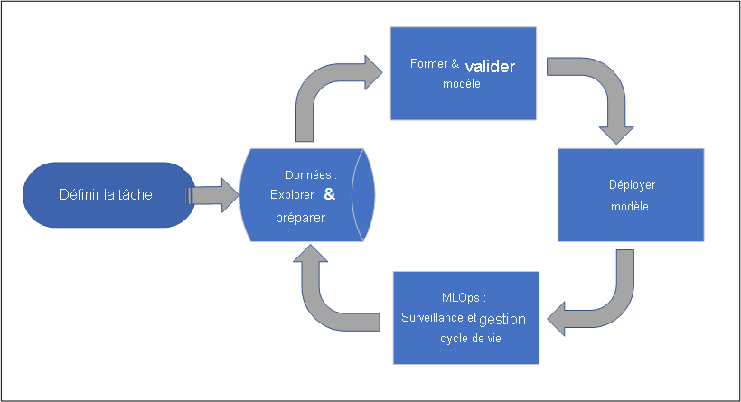
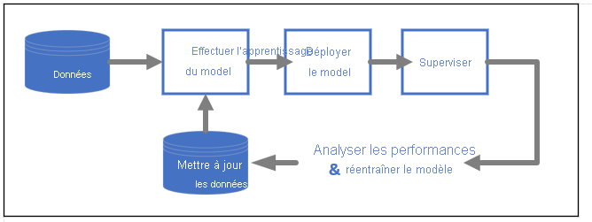

# Qu'est-ce que Azure Machine Learning ?

Azure Machine Learning est un service cloud permettant d’accélérer et de gérer le cycle de vie des projets de Machine Learning. Les professionnels du Machine Learning, les scientifiques des données et les ingénieurs peuvent l’utiliser dans leurs flux de travail quotidiens : apprentissage et déploiement des modèles, et gestion du MLOps.

Vous pouvez créer un modèle dans Azure Machine Learning ou utiliser un modèle conçu à partir d’une plateforme open source comme PyTorch, TensorFlow ou scikit-learn. Les outils MLOps vous permettent d’effectuer un monitoring des modèles, de les recycler et de les redéployer. 

> [!Tip]
> **Version d’évaluation gratuite !**  Si vous n’avez pas d’abonnement Azure, créez un compte gratuit avant de commencer. [Essayez la version gratuite ou payante d’Azure Machine Learning](https://azure.microsoft.com/free/machine-learning/search/). Vous obtenez des crédits à dépenser en services Azure. Une fois ceux-ci épuisés, vous pouvez conserver le compte et utiliser les [services Azure gratuits](https://azure.microsoft.com/free/). Votre carte de crédit n’est pas débitée tant que vous n’avez pas explicitement modifié vos paramètres pour demander à l’être.

## La fonction d’Azure Machine Learning

Azure Machine Learning est destiné aux personnes et aux équipes qui implémentent le MLOps au sein de leur organisation pour mettre les modèles Machine Learning en production dans un environnement de production sécurisé et vérifiable.

Les scientifiques des données et les ingénieurs ML y trouveront des outils permettant d’accélérer et d’automatiser leurs flux de travail quotidiens. Les développeurs d’applications, eux, auront accès à des outils grâce auxquels ils pourront intégrer des modèles dans des applications ou des services. En ce qui concerne les développeurs de plateformes, ils bénéficieront d’un ensemble d’outils robustes, reposant sur des API Azure Resource Manager durables, pour la création d’outils de ML avancés.

Les entreprises qui travaillent dans le cloud Microsoft Azure retrouveront une sécurité familière et un contrôle d’accès en fonction du rôle (RBAC, Role-Based Access Control) pour l’infrastructure. Il est possible de configurer un projet de façon à refuser l’accès aux données protégées et à certaines opérations.

### Collaboration pour les équipes Machine Learning

Les projets de Machine Learning exigent souvent une équipe disposant d’un ensemble de compétences varié qu’il faut développer et entretenir. Azure Machine Learning comporte des outils qui favorisent la collaboration :

- Blocs-notes partagés, ressources de calcul, données et environnements
- Suivi et vérifiabilité indiquant l’auteur et la date des modifications
- Gestion des versions des ressources

### Outils pour les développeurs

Les développeurs trouveront des interfaces familières dans Azure Machine Learning :

- [Kit de développement logiciel (SDK) Python](/python/api/overview/azure/ml/)
- [API REST Azure Resource Manager (préversion)](/rest/api/azureml/)
- [CLI v2 (préversion)](/cli/azure/ml)

### Interface utilisateur du studio 

[Azure Machine Learning studio](https://ml.azure.com) est une interface graphique utilisateur utilisée pour l’espace de travail d’un projet. Il permet d’effectuer les actions suivantes :

- Afficher les exécutions, les métriques, les journaux, les sorties, etc.
- Créer et modifier des blocs-notes et des fichiers
- Gérer les ressources courantes :
    - Informations d’identification des données
    - Calcul
    - Environnements
- Visualiser les métriques d’exécution, les résultats et les rapports
- Visualiser les pipelines créés sur des interfaces de développement
- Créer des tâches AutoML

En outre, le concepteur comporte une interface de type glisser-déplacer permettant d’effectuer l’apprentissage des modèles et de les déployer. 

Si vous êtes un utilisateur de ML Studio (classique), [obtenez des informations sur la dépréciation de Studio (classique) et sur ce qui le différencie d’Azure Machine Learning Studio](overview-what-is-machine-learning-studio.md#ml-studio-classic-vs-azure-machine-learning-studio).

## Préparation pour l’entreprise et sécurité

Azure Machine Learning s’intègre à la plateforme cloud Azure pour ajouter un niveau de sécurité supplémentaire aux projets de ML. 

Les intégrations de sécurité sont les suivantes :

- Réseaux virtuels Azure avec groupes de sécurité réseau 
- Azure Key Vault pour enregistrer les secrets de sécurité, par exemple les informations d’accès des comptes de stockage
- Azure Container Registry configuré derrière un réseau virtuel

Cf. [Tutoriel : Configuration d’un espace de travail sécurisé](tutorial-create-secure-workspace.md).

## Intégrations Azure pour des solutions complètes

D’autres intégrations avec les services Azure permettent de prendre en charge un projet de Machine Learning de bout en bout. Notamment :

- Azure Synapse Analytics pour traiter et diffuser des données avec Spark
- Azure Arc pour exécuter des services Azure dans un environnement Kubernetes
- Options de stockage et de base de données, par exemple Azure SQL Database et Azure Storage Blob
- Azure App Service permettant de déployer et de gérer des applications ML

## Flux de travail des projets de Machine Learning

En général, les modèles sont développés dans le cadre d’un projet qui présente un objectif et des buts. Les projets impliquent souvent plusieurs personnes. Les expérimentations avec des données, des algorithmes et des modèles impliquent un développement itératif. 

### Cycle de vie des projets

Le cycle de vie peut varier selon les projets. Cependant, il se présente souvent comme suit :

Un espace de travail organise un projet et permet la collaboration de nombreux utilisateurs vers un objectif commun. Ceux-ci peuvent partager facilement les résultats de leurs exécutions issues de l’expérimentation dans l’interface utilisateur du studio. Ils ont également la possibilité d’utiliser des ressources versionnées pour différentes tâches, notamment des environnements et des références de stockage.

Pour plus d’informations, consultez [Gestion des espaces de travail Azure Machine Learning](how-to-manage-workspace.md?tabs=python).

Lorsqu’un projet est prêt pour l’opérationnalisation, le travail des utilisateurs peut être automatisé dans un pipeline Machine Learning et déclenché selon une planification ou par une requête HTTPS.

Les modèles peuvent être déployés dans la solution d’inférence gérée, pour les déploiements en temps réel comme pour les déploiements par lots, en éliminant la gestion de l’infrastructure généralement requise pour le déploiement de modèles.

## Entraîner des modèles

Dans Azure Machine Learning, vous pouvez exécuter votre script d’apprentissage dans le cloud ou créer un modèle à partir de zéro. Les clients apportent souvent des modèles qu’ils ont conçus et entraînés dans des frameworks open source. Ils peuvent ainsi les opérationnaliser dans le cloud. 

### Ouverture et interopérabilité

Les scientifiques des données peuvent utiliser des modèles Azure Machine Learning qu’ils ont créés dans des frameworks Python courants : 

- PyTorch
- TensorFlow
- scikit-learn
- XGBoost
- LightGBM

D’autres langages et frameworks sont également pris en charge : 
- R
- .NET

Consultez [Intégration open source avec Azure Machine Learning](concept-open-source.md).

### Caractérisation et sélection de l’algorithme automatiques (AutoML)

Dans le processus répétitif et fastidieux du Machine Learning classique, les scientifiques des données s’appuient sur leur expérience et leur intuition pour sélectionner la caractérisation de données et l’algorithme adaptés à l’apprentissage. Le ML automatisé (AutoML) permet d’accélérer ce processus. Il peut être utilisé par le biais de l’interface utilisateur du studio ou du kit SDK Python.

Cf. [Présentation du Machine Learning automatisé](concept-automated-ml.md).

### Optimisation des hyperparamètres

L’optimisation des hyperparamètres, ou réglage des hyperparamètres, peut représenter une tâche fastidieuse. Azure Machine Learning vous permet d’automatiser cette tâche pour des commandes paramétrables arbitraires en apportant peu de modifications à votre définition de tâche. Les résultats sont visualisés dans le studio.

Cf. [Guide pratique pour régler les hyperparamètres](how-to-tune-hyperparameters.md).

### Apprentissage distribué multinœud

L’efficacité des tâches d’apprentissage du Deep Learning et parfois du Machine Learning classique peut être considérablement améliorée grâce à l’apprentissage distribué multinœud. Les clusters de calcul Azure Machine Learning proposent les dernières options GPU.

Voici les solutions prises en charge par le biais de clusters de calcul Kubernetes joints à Azure Arc (préversion) et Azure ML :

- PyTorch
- TensorFlow
- MPI

La distribution MPI peut être utilisée pour Horovod ou la logique multinœud personnalisée. En outre, Apache Spark est pris en charge au moyen des clusters Azure Synapse Analytics Spark (préversion).

Cf. [Apprentissage distribué avec Azure Machine Learning](concept-distributed-training.md).

### Parallélisme embarrassant de l’apprentissage

La mise à l’échelle d’un projet de Machine Learning peut impliquer de faire évoluer l’apprentissage de modèles avec parallélisme embarrassant. Ce cas de figure est courant dans des scénarios comme la prévision de la demande, où l’apprentissage d’un modèle peut être effectué pour de nombreux magasins.

## Déployer des modèles

Pour mettre un modèle en production, il faut le déployer. Les points de terminaison gérés d’Azure Machine Learning éliminent l’infrastructure requise pour le scoring (inférence) de modèles par lots ou en temps réel (en ligne).

### Scoring en temps réel et par lots (inférence)

Le *scoring par lots*, ou *inférence par lots*, implique d’appeler un point de terminaison avec une référence à des données. Le point de terminaison de traitement par lots exécute les tâches de manière asynchrone pour traiter les données en parallèle sur les clusters de calcul et les stocker en vue d’une analyse plus poussée.

Le *scoring en temps réel*, ou *inférence en ligne*, suppose d’appeler un point de terminaison avec un ou plusieurs déploiements de modèles et de recevoir une réponse en quasi-temps réel via HTTPS. Le trafic peut être réparti entre plusieurs déploiements. Cela permet de tester les nouvelles versions des modèles en détournant initialement un certain volume de trafic et en l’augmentant une fois la confiance dans le nouveau modèle établie.    

Consultez l'article :
 - [Déploiement d’un modèle avec un point de terminaison géré en temps réel](how-to-deploy-managed-online-endpoints.md)
 - [Utilisation de points de terminaison de traitement par lots pour le scoring par lots](how-to-use-batch-endpoint.md) 

## MLOps : le DevOps pour le Machine Learning 

Le DevOps pour les modèles Machine Learning, souvent appelé MLOps, est un processus de développement de modèles pour la production. Le cycle de vie d’un modèle, de l’apprentissage au déploiement, doit être, sinon reproductible, du moins auditable.

### Cycle de vie des modèles ML 

Cf. [MLOps dans Azure Machine Learning](concept-model-management-and-deployment.md).

### Intégrations permettant le MLOps

Azure Machine Learning est conçu dans l’optique du cycle de vie des modèles. Vous pouvez auditer ce cycle de vie jusqu’au niveau d’une validation et d’un environnement spécifiques. 

Voici quelques-unes des fonctionnalités clés permettant le MLOps :

- Intégration de `git`
- Intégration de MLflow
- Planification des pipelines Machine Learning
- Intégration d’Azure Event Grid pour les déclencheurs personnalisés
- Facilité d’utilisation avec des outils CI/CD comme GitHub Actions et Azure DevOps

Par ailleurs, Azure Machine Learning comprend des fonctionnalités de monitoring et d’audit :
- Artefacts de tâches, par exemple instantanés de code, journaux et autres sorties
- Traçabilité entre les tâches et les ressources, notamment les conteneurs, les données et les ressources de calcul

## Étapes suivantes

Commencez à utiliser Azure Machine Learning :
- [Configuration d’un espace de travail Azure Machine Learning](quickstart-create-resources.md)
- [Tutoriel : Création d’un premier projet de Machine Learning](tutorial-1st-experiment-hello-world.md)
- [Préversion : Exécution de tâches d’apprentissage de modèles avec l’interface CLI v2](how-to-train-cli.md)
