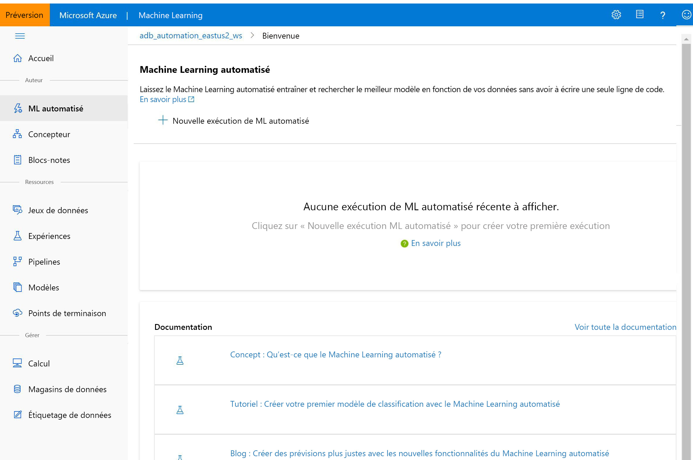

# Qu’est-ce que le studio Azure Machine Learning ?

Cet article vous fait découvrir le studio Azure Machine Learning, qui est le portail web destiné aux développeurs et scientifiques des données dans [Azure Machine Learning](overview-what-is-azure-ml.md). Le studio combine des expériences sans code et Code First pour offrir une plateforme de science des données inclusive.

Dans cet article, vous apprenez :
>[!div class="checklist"]
> - Comment [créer des projets de machine learning](#author-machine-learning-projects) dans le studio.
> - Comment [gérer les ressources et les actifs](#manage-assets-and-resources) dans le studio.
> - Les différences entre le [studio Azure Machine Learning et MS Studio (classique)](#ml-studio-classic-vs-azure-machine-learning-studio).

Nous vous recommandons d’utiliser le navigateur le plus récent compatible avec votre système d’exploitation. Les opérateurs suivants sont pris en charge :
  * Microsoft Edge (le nouveau Microsoft Edge, dernière version. Pas Microsoft Edge hérité)
  * Safari (dernière version, Mac uniquement)
  * Chrome (version la plus récente)
  * Firefox (version la plus récente)

## Créer des projets de machine learning

Le studio propose plusieurs expériences de création en fonction du type du projet et du niveau de l’expérience utilisateur.

+ **Blocs-notes**

  Écrivez et exécutez votre propre code dans les [serveurs Jupyter Notebook](how-to-run-jupyter-notebooks.md) managés qui sont directement intégrés au studio. 

:::image type="content" source="media/overview-what-is-azure-ml-studio/notebooks.gif" alt-text="Capture d’écran : écrire et exécuter du code dans un notebook":::

+ **Concepteur Azure Machine Learning**

  Utilisez le concepteur pour entraîner et déployer des modèles Machine Learning sans écrire de code. Faites un glisser-déposer des jeux de données et des modules pour créer des pipelines ML. Essayez le [didacticiel du concepteur](tutorial-designer-automobile-price-train-score.md).

    

+ **IU de Machine Learning automatisé**

  Découvrez comment créer des [expériences de ML automatisé](tutorial-first-experiment-automated-ml.md) avec une interface simple à utiliser. 

  

+ **Étiquetage des données**

    Utilisez l’[étiquetage des données Azure Machine Learning](how-to-create-labeling-projects.md) pour coordonner efficacement les projets d’étiquetage des données.

## Gérer les ressources et les actifs

Gérez vos ressources Machine Learning directement dans votre navigateur. Les ressources sont partagées dans le même espace de travail entre le SDK et le studio pour une expérience simplifiée. Utilisez le studio pour gérer les ressources suivantes :

- Modèles
- Groupes de données
- Magasins de données
- Ressources de calcul
- Notebooks
- Expériences
- Journaux d’exécution
- Pipelines 
- Points de terminaison de pipeline

Même si vous êtes un développeur expérimenté, le studio peut vous aider à gérer les ressources de l’espace de travail.

## ML Studio (classique) et studio Azure Machine Learning

Lancé en 2015, **ML Studio (classique)** a été notre premier concepteur Machine Learning de type glisser-déposer. C’est un service autonome qui offre seulement une expérience visuelle. Studio (classique) n’interagit pas avec Azure Machine Learning.

**Azure Machine Learning** est un service distinct et moderne qui fournit une plateforme de science des données complète. Il prend en charge à la fois les expériences Code First et celles avec peu de code.

Le **studio Azure Machine Learning** est un portail web *dans* Azure Machine Learning qui propose des options sans code ou avec peu de code pour créer des projets et gérer les ressources. 

Nous recommandons aux nouveaux utilisateurs de choisir **Azure Machine Learning** au lieu de ML Studio (classique) pour bénéficier de tous les outils de science des données les plus récents.

### Comparaison des fonctionnalités

Le tableau suivant récapitule les principales différences entre ML Studio (classique) et Azure Machine Learning.

| Fonctionnalité | ML Studio (classique) | Azure Machine Learning |
|---| --- | --- |
| Interface de glisser-déplacer | Expérience classique | Expérience mise à jour : [concepteur Azure Machine Learning](concept-designer.md)| 
| SDK de code | Non pris en charge | Intégration totale aux SDK [R](/python/api/overview/azure/ml/) et [Python pour Azure Machine Learning](tutorial-1st-r-experiment.md) |
| Expérience | Évolutive (limite de 10 Go de données de formation) | Mise à l’échelle avec cible de calcul |
| Cibles de calcul d’entraînement | Cible de calcul propriétaire, prise en charge CPU uniquement | Vaste gamme de [cibles de calcul d’entraînement](concept-compute-target.md#train) personnalisables. Processeurs et processeurs graphiques pris en charge | 
| Cibles de calcul de déploiement | Format de service web propriétaire, non personnalisable | Vaste gamme de [cibles de calcul de déploiement](concept-compute-target.md#deploy) personnalisables. Processeurs et processeurs graphiques pris en charge |
| Pipeline ML | Non pris en charge | Création de [pipelines](concept-ml-pipelines.md) modulaires et flexibles pour automatiser les workflows |
| MLOps | Gestion et déploiement des modèles de base ; déploiement de processeur uniquement | Gestion de versions des entités (modèle, données, workflows), automatisation des workflows, intégration aux outils CI/CD, déploiements de processeur et de GPU, [etc.](concept-model-management-and-deployment.md) |
| Format de modèle | Format propriétaire, Studio (classique) uniquement | Plusieurs formats pris en charge selon le type de tâche d’entraînement |
| Entraînement de modèle automatisé et optimisation des hyperparamètres |  Non pris en charge | [Pris en charge](concept-automated-ml.md). Options Code First et sans code. | 
| Détection de la dérive de données | Non pris en charge | [Pris en charge](how-to-monitor-datasets.md) |
| Projets d'étiquetage de données | Non pris en charge | [Pris en charge](how-to-create-labeling-projects.md) |

## Résolution des problèmes

* **Éléments de l’interface utilisateur manquants dans Studio** Le contrôle d’accès en fonction du rôle Azure peut permettre de limiter les actions possibles avec Azure Machine Learning. Ces restrictions sont susceptibles d’empêcher l’affichage d’éléments de l’interface utilisateur dans Azure Machine Learning studio. Par exemple, si le rôle qui vous est attribué ne permet pas de créer d’instance de calcul, l’option de création d’une instance de calcul n’apparaîtra pas dans Studio. Pour plus d’informations, consultez [Gestion des utilisateurs et des rôles](how-to-assign-roles.md).

## Étapes suivantes

Visitez le [studio](https://ml.azure.com), ou explorez les différentes options de création avec ces tutoriels :  

- + [Bien démarrer avec votre propre environnement de développement](tutorial-1st-experiment-sdk-setup-local.md)
  + [Utiliser des notebooks Jupyter sur une instance de calcul pour entraîner et déployer des modèles](tutorial-1st-experiment-sdk-setup.md)
  + [Utiliser le Machine Learning automatisé pour entraîner et déployer des modèles](tutorial-first-experiment-automated-ml.md)  
  + [Utiliser le concepteur pour entraîner et déployer des modèles](tutorial-designer-automobile-price-train-score.md)
  + [Utiliser le studio dans un réseau virtuel sécurisé](how-to-enable-studio-virtual-network.md)