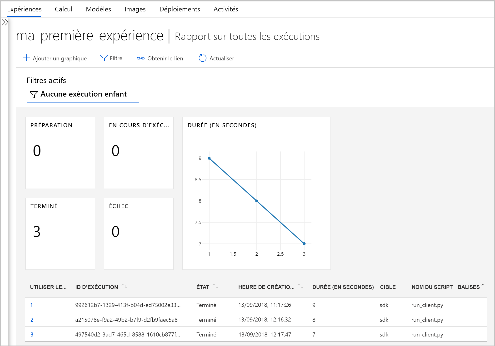

# <a name="what-happened-to-azure-machine-learning-workbench"></a>Qu’est-il arrivé à Azure Machine Learning Workbench ?

L’application Azure Machine Learning Workbench et d’autres fonctionnalités d’origine ont été dépréciées et remplacées dans la version de **septembre 2018** pour faire place à une [architecture](concept-azure-machine-learning-architecture.md) améliorée.

Pour améliorer votre expérience, la version contient de nombreuses mises à jour importantes demandées par les clients dans leurs commentaires. Les fonctionnalités principales qui englobent les exécutions expérimentales jusqu’au déploiement de modèles n’ont pas changé. Toutefois, maintenant, vous pouvez utiliser le <a href="https://docs.microsoft.com/python/api/overview/azure/ml/intro?view=azure-ml-py" target="_blank">SDK Python</a> robuste, le SDK R et l’interface [Azure CLI](reference-azure-machine-learning-cli.md) pour accomplir vos tâches et pipelines de Machine Learning.

La plupart des artefacts créés dans la version précédente d’Azure Machine Learning sont stockés dans votre propre stockage local ou cloud. Ces artefacts ne disparaîtront jamais.

Dans cet article, vous découvrez ce qui a changé et comment cela affecte votre travail préexistant avec Azure Machine Learning Workbench et ses API.

>[!Warning]
>Cet article ne concerne pas les utilisateurs d’Azure Machine Learning Studio. Il est destiné aux clients d’Azure Machine Learning qui ont installé l’application Workbench (préversion) et/ou qui ont des comptes de préversion de gestion des modèles et d’expérimentation.


## <a name="what-changed"></a>Qu’est ce qui a changé ?

La dernière version d’Azure Machine Learning comprend les fonctionnalités suivantes :
+ Un [modèle de ressources Azure simplifié](concept-azure-machine-learning-architecture.md).
+ Une [nouvelle interface utilisateur du portail](how-to-track-experiments.md) pour gérer vos expériences et vos cibles de calcul.
+ Un nouveau <a href="https://docs.microsoft.com/python/api/overview/azure/ml/intro?view=azure-ml-py" target="_blank">SDK</a> Python plus complet.
+ Une nouvelle [extension Azure CLI](reference-azure-machine-learning-cli.md) enrichie pour le machine learning.

L’[architecture](concept-azure-machine-learning-architecture.md) a été repensée pour faciliter l’utilisation. Les ressources et comptes Azure multiples ont laissé la place à un [espace de travail Azure Machine Learning](concept-workspace.md). Vous pouvez rapidement créer des espaces de travail dans le [portail Azure](how-to-manage-workspace.md). Avec un espace de travail, plusieurs utilisateurs peuvent stocker des cibles de calcul d’entraînement et de déploiement, des expériences de modèle, des images Docker, des modèles déployés, etc.

Bien que la version actuelle comprenne de nouveaux clients CLI et SDK améliorés, l’application Workbench de bureau elle-même a été mise hors service. Les expériences peuvent être gérées dans le [tableau de bord de l’espace de travail dans Azure Machine Learning Studio](how-to-track-experiments.md#view-the-experiment-in-the-web-portal). Utilisez le tableau de bord pour obtenir l’historique de vos expériences, gérer les cibles de calcul attachées à votre espace de travail, gérer vos modèles et images Docker, voire déployer des services web.

<a name="timeline"></a>

## <a name="support-timeline"></a>Chronologie de prise en charge

Depuis le 9 janvier 2019, les comptes Machine Learning Workbench, Azure Machine Learning - Expérimentation et Gestion des modèles, et leurs SDK et interfaces CLI associés, ne sont plus pris en charge.

Toutes les fonctionnalités les plus récentes sont disponibles dans ce <a href="https://docs.microsoft.com/python/api/overview/azure/ml/intro?view=azure-ml-py" target="_blank">SDK</a>, l’[interface CLI](reference-azure-machine-learning-cli.md) et le [portail](how-to-manage-workspace.md).

## <a name="what-about-run-histories"></a>Qu’en est-il des historiques des exécutions ?

Les anciens historiques des exécutions ne sont plus disponibles, mais vous pouvez toujours voir les exécutions dans la dernière version.

Les historiques des exécutions sont maintenant dénommés **expériences**. Vous pouvez collecter les expériences de votre modèle et les explorer à l’aide du SDK, de l’interface CLI ou d’Azure Machine Learning Studio.

Le tableau de bord d’espace de travail du portail est pris en charge uniquement sur les navigateurs Microsoft Edge, Chrome et Firefox :

[](./media/overview-what-happened-to-workbench/image001.png#lightbox)

Commencez à entraîner vos modèles et à effectuer le suivi des historiques d’exécutions à l’aide de la nouvelle interface CLI et du nouveau SDK. Pour découvrir comment faire, consultez [Tutoriel : Entraîner des modèles avec Azure Machine Learning](tutorial-train-models-with-aml.md).

## <a name="can-i-still-prep-data"></a>Puis-je toujours préparer les données ?

Vos fichiers de préparation de données préexistants ne sont pas portables vers la dernière version dans la mesure où Machine Learning Workbench n’existe plus. Toutefois, vous pouvez toujours préparer des jeux de données de toute taille en vue de la modélisation.

Avec des jeux de données de toute taille, vous pouvez utiliser le [package de préparation des données pour Azure Machine Learning](https://aka.ms/data-prep-sdk) afin de préparer rapidement vos données avant la modélisation en écrivant du code Python.

## <a name="will-projects-persist"></a>Les projets existeront-ils toujours ?

Vous ne perdez aucun code ni travail. Dans la version antérieure, les projets sont des entités de cloud avec un répertoire local. Dans la version la plus récente, vous attachez des répertoires locaux à l’espace de travail Azure Machine Learning à l’aide d’un fichier de configuration local. Consultez un [diagramme de l’architecture la plus récente](concept-azure-machine-learning-architecture.md).

La majorité du contenu de projet est déjà sur votre ordinateur local. Vous devez simplement créer un fichier config dans ce répertoire et le référencer dans votre code pour vous connecter à votre espace de travail. Pour continuer à utiliser le répertoire local contenant vos fichiers et scripts, spécifiez le nom du répertoire dans la commande Python [« experiment.submit »](https://docs.microsoft.com/python/api/azureml-core/azureml.core.experiment.experiment?view=azure-ml-py) ou à l’aide de la commande CLI `az ml project attach`.  Par exemple :
```python
run = exp.submit(source_directory=script_folder,
                 script='train.py', run_config=run_config_system_managed)
```

[Créez un espace de travail](how-to-manage-workspace.md) pour commencer.

## <a name="what-about-my-registered-models-and-images"></a>Qu’en est-il de mes modèles et images inscrits ?

Les modèles que vous avez enregistrés dans votre ancien registre de modèles doivent être migrés vers votre nouvel espace de travail si vous voulez continuer à les utiliser. Pour migrer vos modèles, téléchargez les modèles et réinscrivez-les dans votre nouvel espace de travail.

Les images que vous avez créées dans votre ancien registre d’images ne peuvent pas être directement migrées vers le nouvel espace de travail. Dans la plupart des cas, le modèle peut être déployé sans avoir à créer une image. Si nécessaire, vous pouvez créer une image pour le modèle dans le nouvel espace de travail. Pour plus d’informations, consultez [Gérer, inscrire, déployer et surveiller des modèles Machine Learning](concept-model-management-and-deployment.md).

## <a name="what-about-deployed-web-services"></a>Qu’en est-il des services web déployés ?

L’ancienne interface CLI n’étant plus prise en charge, vous ne pouvez plus redéployer de modèles ni gérer les services web que vous aviez déployés avec votre compte Gestion des modèles. Toutefois, ces services web continueront à fonctionner tant qu’Azure Container Service (ACS) sera pris en charge.

Dans la dernière version, les modèles sont déployés en tant que services web sur des clusters Azure Container Instances (ACI) ou Azure Kubernetes Service (AKS). Vous pouvez également déployer les modèles sur des FPGA et sur Azure IoT Edge.

Pour en savoir plus, consultez les articles suivants :
+ [Où et comment déployer des modèles ?](how-to-deploy-and-where.md)
+ [Tutoriel : Déployer des modèles avec Azure Machine Learning](tutorial-deploy-models-with-aml.md)

## <a name="what-about-the-old-sdk-and-cli"></a>Qu’en est-il de l’ancien kit SDK et de l’ancienne interface CLI ?

Consultez la [chronologie](#timeline) précédente. Nous vous recommandons de commencer à créer vos modèles et expériences avec le dernier SDK et/ou la dernière interface CLI.

En utilisant le nouveau SDK Python dans la dernière version, vous pouvez interagir avec Azure Machine Learning dans n’importe quel environnement Python. Découvrez comment installer le dernier <a href="https://docs.microsoft.com/python/api/overview/azure/ml/intro?view=azure-ml-py" target="_blank">kit SDK</a>. Vous pouvez également utiliser l’[extension CLI d’Azure Machine Learning](reference-azure-machine-learning-cli.md) mise à jour avec les nombreuses commandes `az ml` pour interagir avec le service dans n’importe quel environnement de ligne de commande, dont Azure Cloud Shell.

## <a name="what-about-visual-studio-code-tools-for-ai"></a>Qu’en est-il de Visual Studio Code Tools for AI ?

Dans cette dernière version, l’extension a été renommée en Azure Machine Learning pour Visual Studio Code, et a été développée et améliorée de manière à être compatible avec les nouvelles fonctionnalités précédentes.

[](./media/overview-what-happened-to-workbench/vscode-big.png#lightbox)

## <a name="what-about-domain-packages"></a>Qu’en est-il des packages de domaine ?

Les packages de domaine pour la vision par ordinateur, l’analyse de texte et les prévisions ne peuvent pas être utilisés avec la dernière version d’Azure Machine Learning. Toutefois, vous pouvez toujours créer et entraîner des modèles de vision par ordinateur, d’analyse de texte et de prévisions avec le dernier <a href="https://docs.microsoft.com/python/api/overview/azure/ml/intro?view=azure-ml-py" target="_blank">SDK</a> Python d’Azure Machine Learning.

## <a name="next-steps"></a>Étapes suivantes

Découvrez plus d’informations sur la [dernière architecture d’Azure Machine Learning](concept-azure-machine-learning-architecture.md).

Pour avoir une vue d’ensemble du service, consultez [Qu’est-ce qu’Azure Machine Learning ?](overview-what-is-azure-ml.md).

Créez votre première expérience avec la méthode de votre choix :
  + [Utiliser des notebooks Python pour entraîner et déployer des modèles ML](tutorial-1st-experiment-sdk-setup.md)
  + [Utiliser R Markdown pour entraîner et déployer des modèles ML]( tutorial-1st-r-experiment.md) 
  + [Utiliser le Machine Learning automatisé pour entraîner et déployer des modèles ML](ui-tutorial-automobile-price-train-score.md) 
  + [Utiliser les fonctionnalités glisser-déplacer du concepteur pour entraîner et déployer](tutorial-first-experiment-automated-ml.md) 
  + [Utiliser l’interface CLI Machine Learning pour entraîner et déployer un modèle](tutorial-train-deploy-model-cli.md)