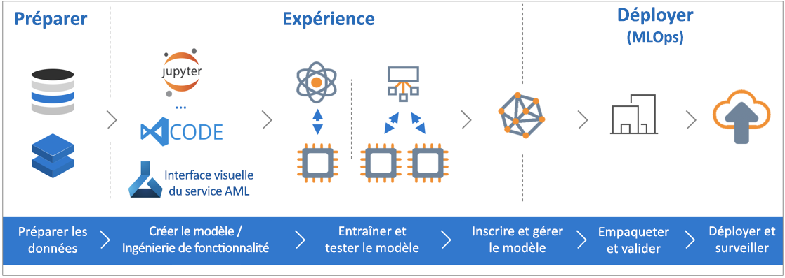

# Qu'est-ce que le service Azure Machine Learning ?

Le service Azure Machine Learning est un service cloud que vous pouvez utiliser pour entraîner, déployer, automatiser et gérer des modèles Machine Learning, le tout à l’échelle vaste qu’offre le cloud.

## Qu’est-ce que le machine learning ?

Le machine learning est une technique de science des données qui permet aux ordinateurs d’utiliser des données existantes afin de prévoir les tendances, les résultats et les comportements futurs. Avec le machine learning, les ordinateurs apprennent sans être explicitement programmés.

Les prévisions ou prédictions générées à partir du machine learning peuvent rendre les applications et les appareils plus intelligents. Par exemple, lorsque vous faites vos achats en ligne, le machine learning permet de recommander d’autres produits que vous êtes susceptible d’aimer, en fonction de ce que vous avez acheté. Ou, lorsque vous utilisez votre carte de crédit, le machine learning compare la transaction à une base de données de transactions et aide la banque à détecter des fraudes. Et lorsque votre robot aspirateur nettoie une pièce, le machine learning l’aide à déterminer si le travail est terminé.

## Qu'est-ce que le service Azure Machine Learning ?

Le service Azure Machine Learning fournit un environnement cloud que vous pouvez utiliser pour développer, entraîner, tester, déployer, gérer et suivre des modèles Machine Learning.

[  ] (./media/overview-what-is-azure-ml/aml.png#lightbox)

Le service Azure Machine Learning prend entièrement en charge les technologies open source. Vous pouvez donc utiliser des dizaines de milliers de packages Python open source avec des composants de machine learning comme TensorFlow et scikit-learn.
La prise en charge d’outils avancés, tels que [Jupyter Notebooks](http://jupyter.org) ou l’extension [Azure Machine Learning pour Visual Studio Code](https://visualstudio.microsoft.com/downloads/ai-tools-vscode/), facilite l’exploration interactive des données et leur transformation, puis le développement et le test de modèles.
Le service Azure Machine Learning comprend également des fonctionnalités qui [automatisent la génération et le réglage de modèles](tutorial-auto-train-models.md), ce qui vous permet de facilement créer des modèles efficaces et précis.

Avec le service Azure Machine Learning, vous pouvez commencer l’entraînement sur votre ordinateur local, puis faire un scale-out dans le cloud. Avec les nombreuses [cibles de calcul](how-to-set-up-training-targets.md) disponibles, comme Capacité de calcul Azure Machine Learning et [Azure Databricks](/azure/azure-databricks/what-is-azure-databricks), et les [services de réglage d’hyperparamètres avancés](how-to-tune-hyperparameters.md), vous pouvez générer de meilleurs modèles plus rapidement en tirant parti de la puissance du cloud.

Une fois que vous disposez du modèle approprié, vous pouvez facilement le déployer dans un conteneur tel que Docker. Il sera alors simple à déployer sur [Azure Container Instances](how-to-deploy-to-aci.md) ou [Azure Kubernetes Service](how-to-deploy-to-aks.md), ou vous pouvez utiliser le conteneur dans vos propres déploiements, que ce soit localement ou dans le cloud.
Vous pouvez gérer les modèles déployés et suivre plusieurs exécutions pendant les essais pour trouver la meilleure solution.
Une fois déployé, votre modèle peut retourner des prédictions [en temps réel](how-to-consume-web-service.md) ou [de manière asynchrone](how-to-run-batch-predictions.md) sur de grandes quantités de données.

Et avec les [pipelines de machine learning](concept-ml-pipelines.md) avancés, vous pouvez collaborer sur toutes les étapes de préparation des données et d’entraînement, d’évaluation et de déploiement du modèle.

## Que faire avec Azure Machine Learning ?

Le service Azure Machine Learning peut entraîner automatiquement un modèle et le régler automatiquement pour vous.
Par consulter un exemple, voir [Tutoriel : entraîner automatiquement un modèle de classification avec le machine learning automatisé dans Azure Machine Learning](tutorial-auto-train-models.md).

À l’aide du <a href="https://aka.ms/aml-sdk" target="_blank">SDK</a> Azure Machine Learning pour Python et des packages Python open source, vous pouvez créer et entraîner vous-même des modèles Machine Learning extrêmement précis et des modèles d’apprentissage profond (deep learning) dans un espace de travail du service Azure Machine Learning.
Vous pouvez choisir parmi les nombreux composants de machine learning disponibles dans les packages Python open source, comme les suivants :

- <a href="https://scikit-learn.org/stable/" target="_blank">Scikit-learn</a>
- <a href="https://www.tensorflow.org" target="_blank">Tensorflow</a>
- <a href="https://pytorch.org" target="_blank">PyTorch</a>
- <a href="https://www.microsoft.com/en-us/cognitive-toolkit/" target="_blank">CNTK</a>
- <a href="http://mxnet.io" target="_blank">MXNet</a>

Une fois que vous avez un modèle, utilisez-le pour créer un conteneur (par exemple Docker) qui peut être déployé localement à des fins de test. Une fois les tests effectués, le modèle peut être déployé en tant que service web de production dans [Azure Container Instances](how-to-deploy-to-aci.md) ou [Azure Kubernetes Service](how-to-deploy-to-aks.md).

Vous pouvez ensuite gérer vos modèles déployés à l’aide du [SDK Azure Machine Learning pour Python](https://docs.microsoft.com/python/api/overview/azure/ml/intro?view=azure-ml-py) ou du [portail Azure](https://portal.azure.com/).
Vous pouvez évaluer les métriques du modèle, réentraîner et redéployer de nouvelles versions du modèle, tout en suivant les expériences du modèle.

Pour commencer à utiliser le service Azure Machine Learning, consultez [Étapes suivantes](#next-steps).

## En quoi le service Azure Machine Learning est-il différent de Studio ?

Azure Machine Learning Studio est un espace de travail collaboratif visuel par glisser-déplacer dans lequel vous pouvez créer, tester et déployer des solutions de machine learning sans avoir besoin d’écrire du code. Il utilise des algorithmes de machine learning prédéfinis et préconfigurés, ainsi que des modules de gestion des données.

Utilisez Machine Learning Studio lorsque vous souhaitez essayer rapidement et simplement des modèles Machine Learning et que les algorithmes de machine learning intégrés sont suffisants pour vos solutions.

Utilisez le service Machine Learning si vous travaillez dans un environnement Python, si vous souhaitez davantage de contrôle sur vos algorithmes de machine learning ou si vous souhaitez utiliser des bibliothèques de machine learning open source.

> [!NOTE]
> Les modèles créés dans Azure Machine Learning Studio ne peuvent pas être déployés ni gérés par le service Azure Machine Learning.

## Essai gratuit
Si vous n’êtes pas abonné, vous pouvez [ouvrir gratuitement un compte Azure](https://aka.ms/amlfree). Vous obtenez des crédits à dépenser en services Azure. Une fois ceux-ci épuisés, vous pouvez conserver le compte et utiliser les [services Azure gratuits](https://azure.microsoft.com/free/). Votre carte de crédit n’est pas débitée tant que vous n’avez pas explicitement modifié vos paramètres pour demander à l’être. Vous pouvez aussi [activer les avantages de l’abonnement MSDN](https://azure.microsoft.com/pricing/member-offers/msdn-benefits-details/?WT.mc_id=A261C142F), qui vous donnent droit chaque mois à des crédits dont vous pouvez vous servir pour les services Azure payants.

## Étapes suivantes

- Créez un espace de travail de service Machine Learning pour commencer [à l’aide du portail Azure](quickstart-get-started.md) ou [dans Python](quickstart-create-workspace-with-python.md).

- Suivez l’intégralité du tutoriel [Entraîner un modèle de classification d’images avec Azure Machine Learning](tutorial-train-models-with-aml.md).

- [Utiliser Azure Machine Learning pour générer et régler automatiquement un modèle](tutorial-auto-train-models.md).

- Découvrez les [pipelines de machine learning](/azure/machine-learning/service/concept-ml-pipelines) pour générer, optimiser et gérer vos scénarios d’apprentissage.

- Consultez l’article approfondi sur les [concepts et l’architecture du service Azure Machine Learning](concept-azure-machine-learning-architecture.md).

- Pour plus d’informations sur d’autres produits Machine Learning proposés par Microsoft, consultez [Autres produits de machine learning de Microsoft](./overview-more-machine-learning.md).

<!-- 

An intro to AML or an end-to-end quickstart video could go here.

In this 9-minute video, learn how you can benefit your app. You'll learn about key features and what a typical workflow looks like. 

>[!VIDEO https://channel9.msdn.com/Events/Connect/2016/138/player]
 
+ 0-3 minutes covers key features and use-cases.
+ 3-4 minutes covers service provisioning. 
+ 4-6 minutes covers Import Data wizard used to create an index using the built-in real estate dataset.

-->
