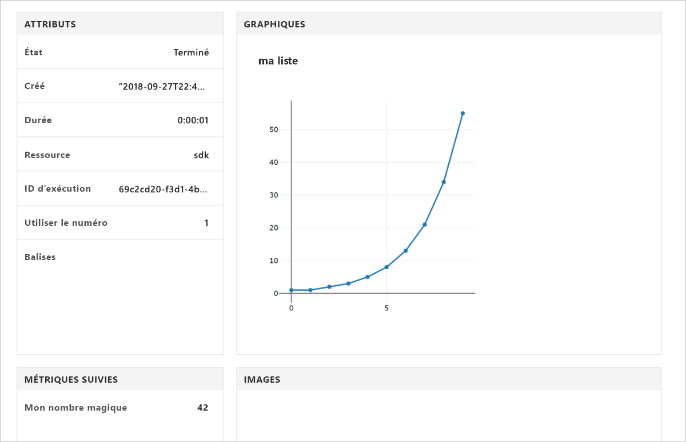

# <a name="quickstart-use-python-to-get-started-with-azure-machine-learning"></a>Démarrage rapide : Utilisation de Python pour démarrer avec Azure Machine Learning

Dans ce démarrage rapide, vous allez utiliser le Kit de développement logiciel (SDK) Python d’Azure Machine Learning pour créer et utiliser un [espace de travail](concept-azure-machine-learning-architecture.md) destiné au service Machine Learning. Cet espace de travail est le socle permettant l’expérimentation, l’entraînement et le déploiement de modèles d’apprentissage automatique dans le cloud avec le service Azure Machine Learning.

Dans ce didacticiel, vous allez installer le Kit de développement logiciel (SDK) Python et :
* Créer un espace de travail dans votre abonnement Azure
* Créer un fichier de configuration pour cet espace de travail qui servira plus tard dans les autres blocs-notes et scripts
* Écrire un code qui enregistre les valeurs dans l’espace de travail
* Afficher les valeurs journalisées dans votre espace de travail

L’espace de travail et son fichier de configuration que vous créez dans ce démarrage rapide peuvent servir de prérequis à d’autres didacticiels et guides pratiques sur Azure Machine Learning. À l’instar des autres services Azure, des limites et des quotas sont associés au service Azure Machine Learning. [En savoir plus sur les quotas et comment demander à les relever.](how-to-manage-quotas.md)

Pour des raisons pratiques, les ressources Azure suivantes sont automatiquement ajoutées à votre espace de travail, si elles sont disponibles dans votre région : [Container Registry](https://azure.microsoft.com/services/container-registry/), [Stockage](https://azure.microsoft.com/services/storage/), [Application Insights](https://azure.microsoft.com/services/application-insights/) et [Key Vault](https://azure.microsoft.com/services/key-vault/).

Si vous n’avez pas d’abonnement Azure, créez un [compte gratuit](https://azure.microsoft.com/free/?WT.mc_id=A261C142F) avant de commencer.


##  <a name="install-the-sdk"></a>Installer le Kit de développement logiciel (SDK)

**Passez cette section si vous utilisez** une Data Science Virtual Machine (DSVM) créée après le 27 septembre 2018. En effet, ces DSVM sont livrés avec le Kit de développement logiciel (SDK) Python préinstallé.

Avant d’installer le Kit de développement logiciel (SDK), nous vous recommandons de créer au préalable un environnement Python isolé. Bien que ce démarrage rapide utilise [Miniconda](https://conda.io/docs/user-guide/install/index.html), vous pouvez également utiliser [Anaconda](https://www.anaconda.com/) complet installé ou un [environnement virtuel Python](https://virtualenv.pypa.io/en/stable/).

### <a name="install-miniconda"></a>Installation de Miniconda


[Téléchargez](https://conda.io/miniconda.html) et installez Miniconda. Choisissez la version 3.7 de Python ou une version ultérieure. Ne choisissez pas la version 2.x de Python.

### <a name="create-an-isolated-python-environment"></a>Création d’un environnement isolé de Python 

Lancez une fenêtre en ligne de commande et créez un nouvel environnement conda nommé `myenv` avec Python 3.6.

```sh
conda create -n myenv -y Python=3.6
```

Active l’environnement.

  ```sh
  conda activate myenv
  ```

### <a name="install-the-sdk"></a>Installer le Kit de développement logiciel (SDK)

Dans l’environnement conda activé, installez le Kit de développement logiciel (SDK). Ce code installe les composants principaux du Kit de développement logiciel (SDK) Azure Machine Learning, ainsi qu’un serveur Jupyter Notebook dans l’environnement conda `myenv`.  L’installation prend **environ 4 minutes**.

```sh
pip install azureml-sdk[notebooks]
```

## <a name="create-a-workspace"></a>Créer un espace de travail

Lancez Jupyter Notebook avec cette commande.
```sh
jupyter notebook
```

Dans la fenêtre du navigateur, créez un nouveau bloc-notes avec le noyau `Python 3` par défaut. 

Affichez la version du Kit de développement logiciel (SDK) en entrant le code Python suivant dans une cellule de bloc-notes et en l’exécutant.

```python
import azureml.core
print(azureml.core.VERSION)
```

Créez un nouveau groupe de ressources Azure et un nouvel espace de travail.

Recherchez une valeur pour `<azure-subscription-id>` dans la [liste des abonnements dans le Portail Azure](https://ms.portal.azure.com/#blade/Microsoft_Azure_Billing/SubscriptionsBlade). Utilisez n’importe quel abonnement dans lequel votre rôle est propriétaire ou contributeur.

```python
from azureml.core import Workspace
ws = Workspace.create(name='myworkspace',
                      subscription_id='<azure-subscription-id>',
                      resource_group='myresourcegroup',
                      create_resource_group=True,
                      location='eastus2' # or other supported Azure region
                     )
```

Il se peut qu’une nouvelle fenêtre de navigateur s’ouvre à l’exécution du code précédent pour que vous puissiez vous connecter à votre compte Azure. Une fois la connexion effectuée, le jeton d’authentification est mis en cache localement.

Pour afficher les détails de l’espace de travail, notamment le stockage associé, le registre des conteneurs et le coffre de clés, entrez ce qui suit :

```python
ws.get_details()
```

## <a name="write-a-configuration-file"></a>Création d’un fichier de configuration

Enregistrez les détails de votre espace de travail dans un fichier de configuration se trouvant dans le répertoire courant. Ce fichier s’appelle « aml_config\config.json ».  

Ce fichier de configuration de l’espace de travail facilite son chargement ultérieur avec d’autres blocs-notes et scripts situés dans le même répertoire ou dans un sous-répertoire. 

```python
# Create the configuration file.
ws.write_config()

# Use this code to load the workspace from 
# other scripts and notebooks in this directory.
# ws = Workspace.from_config()
```

L’appel d’API `write_config()` crée le fichier de configuration dans le répertoire courant. Le fichier `config.json` contient les éléments suivants :

```json
{
    "subscription_id": "<azure-subscription-id>",
    "resource_group": "myresourcegroup",
    "workspace_name": "myworkspace"
}
```

## <a name="use-the-workspace"></a>Utiliser l'espace de travail

Créez un code qui se sert des API de base du Kit de développement logiciel (SDK) pour suivre les exécutions des essais.

```python
from azureml.core import Experiment

# create a new experiemnt
exp = Experiment(workspace=ws, name='myexp')

# start a run
run = exp.start_logging()

# log a number
run.log('my magic number', 42)

# log a list (Fibonacci numbers)
run.log_list('my list', [1, 1, 2, 3, 5, 8, 13, 21, 34, 55]) 

# finish the run
run.complete()
```

## <a name="view-logged-results"></a>Afficher les résultats enregistrés
Une fois l’exécution terminée, vous pouvez afficher l’essai sur le Portail Azure. Utilisez le code suivant pour imprimer l’URL des résultats de la dernière exécution.

```python
print(run.get_portal_url())
```

Utilisez le lien pour afficher les valeurs enregistrées dans le Portail Azure sur votre navigateur.



## <a name="clean-up-resources"></a>Supprimer des ressources 
>[!IMPORTANT]
>Les ressources que vous avez créées peuvent être utilisées comme conditions préalables pour d’autres didacticiels de Azure Machine Learning et des articles de procédure.

Si vous ne prévoyez pas d’utiliser ce que vous avez créé ici, supprimez les ressources que vous venez de créer avec ce démarrage rapide afin d’éviter des frais.

```python
ws.delete(delete_dependent_resources=True)
```

## <a name="next-steps"></a>Étapes suivantes

Vous venez de créer les ressources nécessaires pour commencer à expérimenter et à déployer des modèles. Vous avez également exécuté du code dans un bloc-notes et exploré l’historique des exécutions de ce code dans votre espace de travail dans le cloud.

Vous avez besoin de quelques packages supplémentaires dans votre environnement pour vous en servir avec les didacticiels Azure Machine Learning :

1. Dans votre navigateur, fermez votre bloc-notes.
1. Dans la fenêtre de ligne de commande, utilisez `Ctrl`+`C` pour arrêter le serveur de bloc-notes.
1. Installez les packages supplémentaires.

    ```sh
    conda install -y cython matplotlib scikit-learn pandas numpy
    pip install azureml-sdk[automl]
    ```

Après avoir installé les packages, suivez les didacticiels pour entraîner et déployer un modèle.  

> [!div class="nextstepaction"]
> [Tutoriel : entraîner un modèle de classification d’images](tutorial-train-models-with-aml.md)

Vous pouvez aussi consulter des [exemples plus avancés sur GitHub](https://aka.ms/aml-notebooks).
