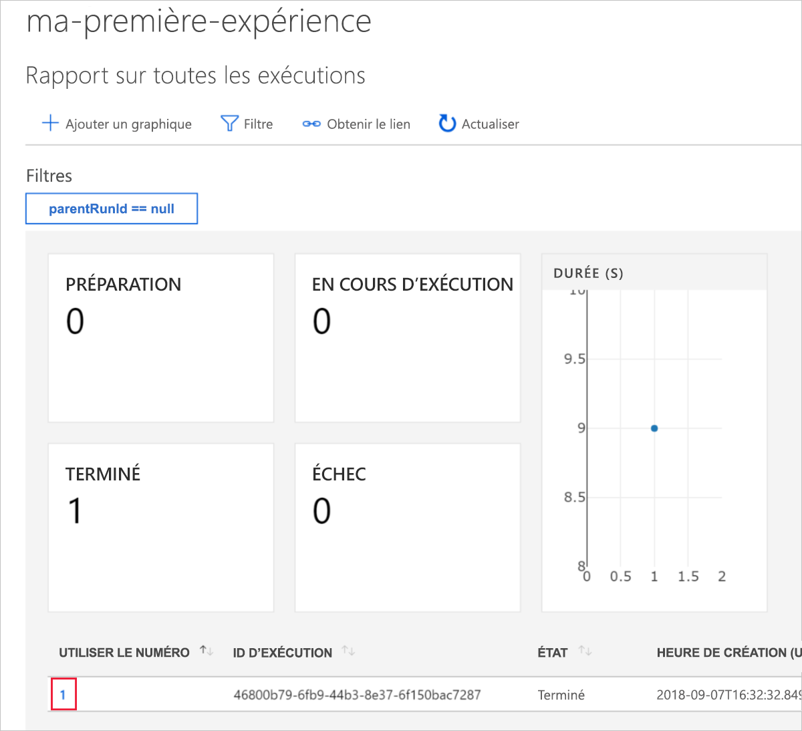
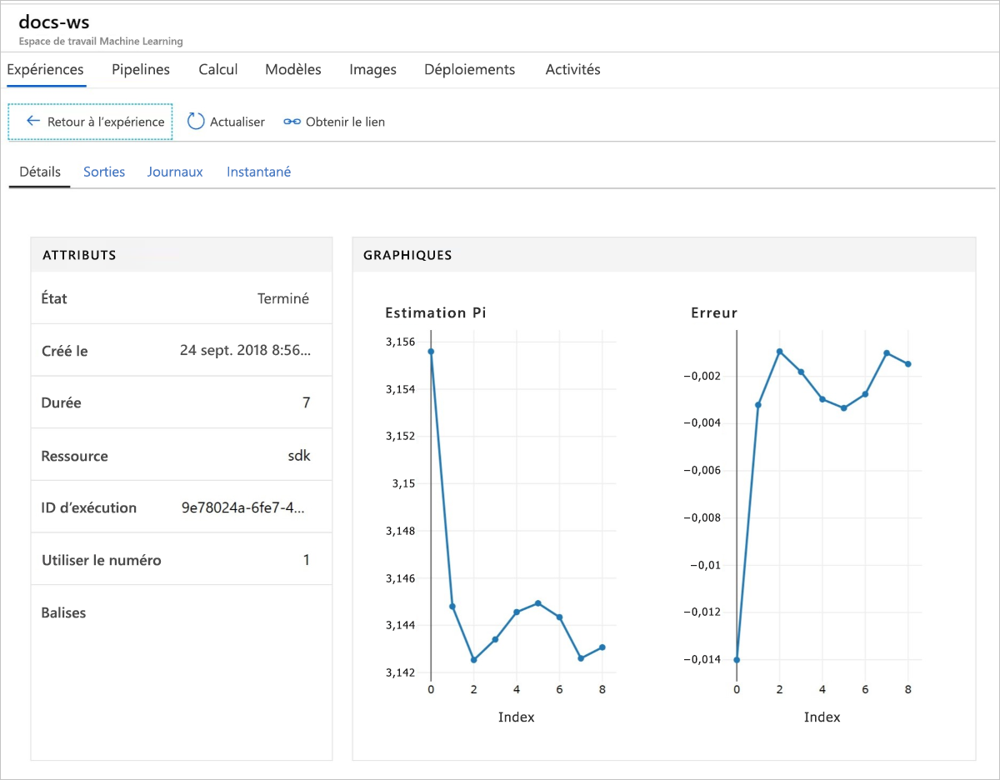

# <a name="quickstart-use-the-azure-portal-to-get-started-with-azure-machine-learning"></a>Démarrage rapide : Utiliser le Portail Azure pour bien démarrer avec Azure Machine Learning

Dans ce démarrage rapide, vous utilisez le Portail Azure pour créer un espace de travail Azure Machine Learning. Dans le cloud, cet espace de travail est le socle que vous utilisez pour expérimenter, effectuer l’apprentissage et déployer des modèles Machine Learning avec Machine Learning. 

> [!VIDEO https://www.microsoft.com/en-us/videoplayer/embed/RE2F9Ad]

Dans ce guide de démarrage rapide, vous allez :

* Créer un espace de travail dans votre abonnement Azure.
* Essayer cet espace de travail avec Python dans un bloc-notes Azure et journaliser les valeurs sur plusieurs itérations.
* Afficher les valeurs journalisées dans votre espace de travail.

Les ressources Azure suivantes sont automatiquement ajoutées à votre espace de travail lorsqu’elles sont disponibles au niveau régional :

  - [Azure Container Registry](https://azure.microsoft.com/services/container-registry/)
  - [Stockage Azure](https://azure.microsoft.com/services/storage/)
  - [Azure Application Insights](https://azure.microsoft.com/services/application-insights/) 
  - [Azure Key Vault](https://azure.microsoft.com/services/key-vault/)

Les ressources que vous créez peuvent être utilisées comme prérequis dans d’autres didacticiels et guides pratiques du service Machine Learning. Comme avec d’autres services Azure, il existe des limites concernant certaines ressources associées à Machine Learning. La taille du cluster Azure Batch AI en est un exemple. Pour plus d’informations sur les limites par défaut et la façon d’augmenter votre quota, consultez [cet article](how-to-manage-quotas.md).

Si vous n’avez pas d’abonnement Azure, créez un [compte gratuit](https://azure.microsoft.com/free/?WT.mc_id=A261C142F) avant de commencer.


## <a name="create-a-workspace"></a>Créer un espace de travail 

[!INCLUDE [aml-create-portal](../../../includes/aml-create-in-portal.md)]

Sur la page de l’espace de travail, sélectionnez `Explore your Azure Machine Learning service workspace`.

 


## <a name="use-the-workspace"></a>Utiliser l'espace de travail

Voyons maintenant comme un espace de travail vous permet de gérer vos scripts d’apprentissage automatique. Dans cette section, vous allez :

* Ouvrir un bloc-notes dans Azure Notebooks.
* Exécuter le code qui crée certaines valeurs journalisées.
* Afficher les valeurs journalisées dans votre espace de travail.

Cet exemple montre comment l’espace de travail peut vous aider à suivre les informations générées dans un script. 

### <a name="open-a-notebook"></a>Ouvrir un bloc-notes 

Azure Notebooks offre une plateforme cloud gratuite pour les blocs-notes Jupyter, préconfigurés avec tout ce dont vous avez besoin pour exécuter Machine Learning.  

Sélectionnez `Open Azure Notebooks` pour tester votre première expérience.

 

Votre organisation peut exiger le [consentement de l’administrateur](https://notebooks.azure.com/help/signing-up/work-or-school-account/admin-consent) avant que vous puissiez vous connecter.

Une fois que vous êtes connecté, un nouvel onglet s’ouvre et une invite `Clone Library` s’affiche. Sélectionnez `Clone`.


### <a name="run-the-notebook"></a>Exécuter le bloc-notes

En plus des deux blocs-notes, vous voyez un fichier `config.json`. Ce fichier config contient des informations sur l’espace de travail que vous venez de créer.  

Sélectionnez `01.run-experiment.ipynb` pour ouvrir le bloc-notes.

Pour exécuter les cellules une par une, utilisez `Shift`+`Enter`. Ou sélectionnez `Cells` > `Run All` pour exécuter tout le bloc-notes. Lorsque vous voyez un astérisque [*] en regard d’une cellule, cela signifie qu’elle est en cours d’exécution. À la fin de l’exécution du code de cette cellule, un numéro s’affiche.

Vous pouvez être invité à vous connecter. Copiez le code dans le message. Sélectionnez ensuite le lien, puis collez le code dans la nouvelle fenêtre. Veillez à ne pas copier un espace avant ou après le code. Connectez-vous avec le même compte que celui que vous avez utilisé sur le Portail Azure.

 

Dans le bloc-notes, la deuxième cellule lit le contenu de `config.json` afin de vous connecter à votre espace de travail.
```
ws = Workspace.from_config()
```

La troisième cellule de code démarre une expérience nommée « my-first-experience ». Utilisez ce nom pour rechercher des informations sur l’exécution une fois revenu dans votre espace de travail.

```
experiment = Experiment(workspace_object=ws, name = "my-first-experiment")
```

Dans la dernière cellule du bloc-notes, notez les valeurs qui sont écrites dans un fichier journal.

```
# Log final results
run.log("Final estimate: ",pi_estimate)
run.log("Final error: ",math.pi-pi_estimate)
```

Une fois le code exécuté, vous pouvez afficher ces valeurs dans votre espace de travail.

## <a name="view-logged-values"></a>Afficher les valeurs journalisées

Une fois toutes les cellules du bloc-notes exécutées, revenez à la page du portail.  

Sélectionnez `View Experiments`.


Fermez la fenêtre contextuelle `Reports`.

Sélectionnez `my-first-experiment`.

Consultez des informations sur l’exécution que vous venez de réaliser. Faites défiler la page vers le bas pour trouver la table des exécutions. Sélectionnez le lien du numéro de l’exécution.

 

Vous voyez les tracés qui ont été créés automatiquement à partir des valeurs journalisées.  

   

Étant donné que le code pour se rapprocher de pi utilise des valeurs aléatoires, vos tracés affichent des valeurs différentes.

## <a name="clean-up-resources"></a>Supprimer des ressources 

[!INCLUDE [aml-delete-resource-group](../../../includes/aml-delete-resource-group.md)]

Vous pouvez également conserver le groupe de ressources mais supprimer un espace de travail unique. Affichez les propriétés de l’espace de travail, puis sélectionnez **Supprimer**.

## <a name="next-steps"></a>Étapes suivantes

Vous avez créé les ressources nécessaires pour expérimenter des modèles et les déployer. Vous avez également exécuté du code dans un bloc-notes. Enfin, vous avez exploré l’historique des exécutions de ce code dans votre espace de travail dans le cloud.

Pour une expérience approfondie du flux de travail, suivez les didacticiels Machine Learning relatifs à l’apprentissage et au déploiement d’un modèle.  

> [!div class="nextstepaction"]
> [Tutoriel : entraîner un modèle de classification d’images](tutorial-train-models-with-aml.md)
