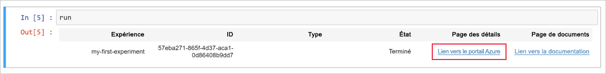
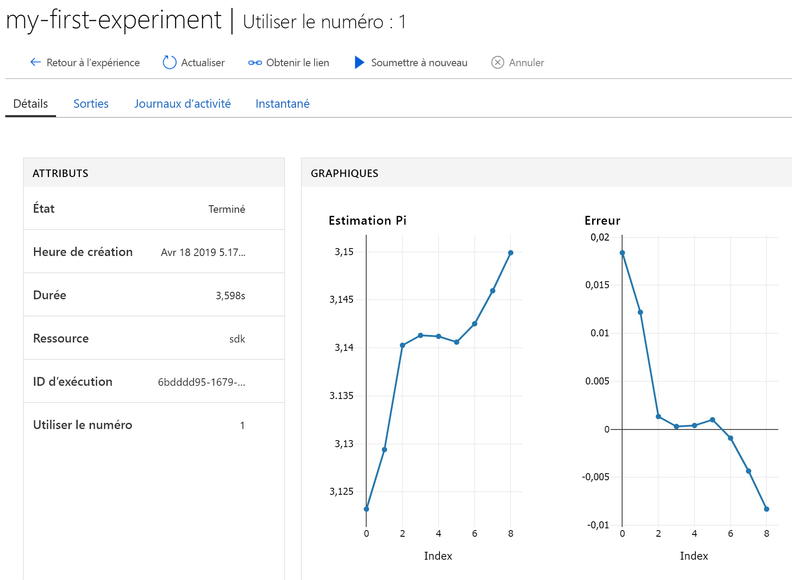

# Démarrage rapide : Utiliser un serveur de notebooks cloud pour démarrer avec Azure Machine Learning

Dans cet article, vous utilisez Azure Notebooks pour exécuter du code qui est enregistré dans l’[espace de travail](concept-azure-machine-learning-architecture.md) Azure Machine Learning service. Votre espace de travail est le socle que vous utilisez pour expérimenter, effectuer l’apprentissage et déployer des modèles Machine Learning avec Machine Learning. 

Ce démarrage rapide utilise des ressources cloud et ne requiert aucune installation. Pour utiliser à la place votre propre environnement, consultez [Démarrage rapide : Utiliser votre propre serveur de notebooks pour démarrer avec Azure Machine Learning](quickstart-run-local-notebook.md).  
 
Ce démarrage rapide décrit les actions suivantes :

* Connectez-vous à votre espace de travail avec Python dans un notebook Jupyter. Le bloc-notes contient du code pour estimer pi et consigne les erreurs à chaque itération. 
* Affichez les valeurs d’erreur journalisées dans votre espace de travail.

Si vous n’avez pas d’abonnement Azure, créez un compte gratuit avant de commencer. Essayez dès aujourd'hui la [version gratuite ou payante d’Azure Machine Learning service](https://aka.ms/AMLFree).

## Configuration requise

1. [Créez un espace de travail Azure Machine Learning](setup-create-workspace.md#portal) si vous n’en avez pas déjà un.

1. Ouvrez votre espace de travail dans le [portail Azure](https://portal.azure.com/).  Découvrez comment [trouver votre espace de travail](how-to-manage-workspace.md#view).

## Utiliser votre espace de travail

> [!VIDEO https://www.microsoft.com/en-us/videoplayer/embed/RE2F9Ad]

Découvrez comment un espace de travail vous permet de gérer vos scripts de machine learning. Dans cette section, vous allez exécuter les étapes suivantes :

* Ouvrir un bloc-notes dans Azure Notebooks.
* Exécuter le code qui crée certaines valeurs journalisées.
* Afficher les valeurs journalisées dans votre espace de travail.

Cet exemple montre comment l’espace de travail peut vous aider à suivre les informations générées dans un script. 

### Ouvrir un bloc-notes 

[Azure Notebooks](https://notebooks.azure.com) offre une plateforme cloud gratuite pour les notebooks Jupyter, préconfigurée avec tout ce dont vous avez besoin pour exécuter Machine Learning. À partir de votre espace de travail, vous pouvez lancer cette plateforme pour commencer à utiliser votre espace de travail du service Azure Machine Learning.

1. Dans la page Vue d’ensemble de l’espace de travail, sélectionnez **Prise en main d’Azure Notebooks** pour effectuer votre première expérience dans Azure Notebooks.  Azure Notebooks est un service distinct qui vous permet d’exécuter des notebooks Jupyter gratuitement dans le cloud.  Quand vous utilisez ce lien vers le service, des informations sur la façon de se connecter à votre espace de travail sont ajoutées à la bibliothèque que vous créez dans Azure Notebooks.

   

1. Connectez-vous à Azure Notebooks.  Veillez à vous connecter avec le même compte que celui que vous avez utilisé pour vous connecter au portail Azure. Votre organisation peut exiger le [consentement de l’administrateur](https://notebooks.azure.com/help/signing-up/work-or-school-account/admin-consent) avant que vous puissiez vous connecter.

1. Une fois que vous êtes connecté, un nouvel onglet s’ouvre et une invite `Clone Library` s’affiche. Le clonage de cette bibliothèque charge un ensemble de notebooks et d’autres fichiers dans votre compte Azure Notebooks.  Ces fichiers vous aident à explorer les fonctionnalités d’Azure Machine Learning.

1. Décochez la case **Public**, afin de ne pas partager les informations de votre espace de travail avec d’autres utilisateurs.

1. Sélectionnez **Cloner**.

   

1. Si vous voyez que l’état du projet est « arrêté », cliquez sur **Exécuter sur la ressource de calcul gratuite** pour utiliser le serveur de notebooks gratuit.

    

### Exécuter le bloc-notes

Dans la liste des fichiers de ce projet, vous voyez un fichier `config.json`. Ce fichier config contient des informations sur l’espace de travail que vous avez créé dans le portail Azure.  Ce fichier permet à votre code de se connecter à votre espace de travail et d’y ajouter des informations.

1. Sélectionnez **01.run-experiment.ipynb** pour ouvrir le notebook.

1. La zone d’état vous indique d’attendre le démarrage du noyau.  Le message disparaît une fois que le noyau est prêt.

    

1. Une fois que le noyau a démarré, exécutez les cellules une à la fois en utilisant **Maj+Entrée**. Vous pouvez aussi sélectionner **Cellules** > **Exécuter tout** pour exécuter tout le notebook. Quand vous voyez un astérisque, __*__ à côté d’une cellule, cela signifie qu’elle est en cours d’exécution. À la fin de l’exécution du code de cette cellule, un numéro s’affiche. 

1. Suivez les instructions dans le notebook pour authentifier votre abonnement Azure.

Une fois que vous avez fini d’exécuter toutes les cellules dans le notebook, vous pouvez afficher les valeurs enregistrées dans votre espace de travail.

## Afficher les valeurs journalisées

1. La sortie de la cellule `run` contient un lien qui ramène au portail Azure pour voir les résultats de l’expérience dans votre espace de travail. 

    

1. Cliquez sur le **lien vers le portail Azure** pour voir des informations sur l’exécution dans votre espace de travail.  Le lien ouvre votre espace de travail dans le portail Azure.

1. Les tracés des valeurs consignées que vous voyez ont été créés automatiquement dans l’espace de travail. Chaque fois que vous consignez plusieurs valeurs avec le même paramètre de nom, un tracé est généré automatiquement pour vous.

   

Étant donné que le code pour se rapprocher de pi utilise des valeurs aléatoires, vos tracés affichent des valeurs différentes.  

## Supprimer des ressources 

[!INCLUDE [aml-delete-resource-group](../../../includes/aml-delete-resource-group.md)]

Vous pouvez également conserver le groupe de ressources mais supprimer un espace de travail unique. Affichez les propriétés de l’espace de travail, puis sélectionnez **Supprimer**.

## Étapes suivantes

Vous avez créé les ressources nécessaires pour expérimenter des modèles et les déployer. Vous avez également exécuté du code dans un bloc-notes. Enfin, vous avez exploré l’historique des exécutions de ce code dans votre espace de travail dans le cloud.

Pour une expérience approfondie du flux de travail, suivez les didacticiels Machine Learning relatifs à l’apprentissage et au déploiement d’un modèle :  

> [!div class="nextstepaction"]
> [Didacticiel : Entraîner un modèle de classification d’images](tutorial-train-models-with-aml.md)