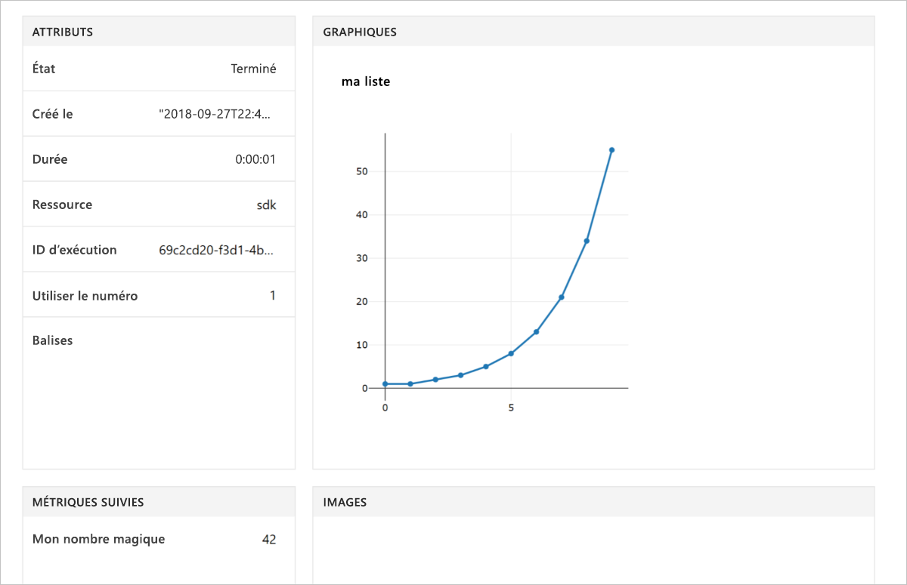

# <a name="quickstart-use-your-own-notebook-server-to-get-started-with-azure-machine-learning"></a>Démarrage rapide : Utiliser votre propre serveur de notebooks pour démarrer avec Azure Machine Learning

Utiliser votre propre environnement Python et le serveur Jupyter Notebook pour prendre en main Azure Machine Learning service.  Pour lire un guide de démarrage rapide sans installer de SDK, consultez [Démarrage rapide : Utiliser un serveur Notebook cloud pour prendre en main Azure Machine Learning](quickstart-run-cloud-notebook.md).

Ce guide de démarrage rapide montre comment vous pouvez utiliser l’[espace de travail Azure Machine Learning service](concept-azure-machine-learning-architecture.md) pour suivre les expériences d’apprentissage automatique de votre machine. Vous allez exécuter du code Python qui enregistre des valeurs dans l’espace de travail.

Regardez une vidéo de ce guide de démarrage rapide :

> [!VIDEO https://www.microsoft.com/en-us/videoplayer/embed/RE2G9N6]

Si vous n’avez pas d’abonnement Azure, créez un compte gratuit avant de commencer. Essayez dès aujourd'hui la [version gratuite ou payante d’Azure Machine Learning service](https://aka.ms/AMLFree).

## <a name="prerequisites"></a>Prérequis

* Un serveur de notebooks Python 3.6 avec le SDK Azure Machine Learning installé
* Un espace de travail Azure Machine Learning service
* Un fichier de configuration d’espace de travail ( **.azureml/config.json**).

Obtenez tous ces prérequis à partir de [Créer un espace de travail Azure Machine Learning service](setup-create-workspace.md#sdk).


## <a name="use-the-workspace"></a>Utiliser l'espace de travail

Créez un script ou démarrez un notebook dans le même répertoire que votre fichier de configuration d’espace de travail ( **.azureml/config.json**).

### <a name="attach-to-workspace"></a>Attacher à l’espace de travail

Ce code lit les informations du fichier de configuration à attacher à votre espace de travail.

```
from azureml.core import Workspace

ws = Workspace.from_config()
```

### <a name="log-values"></a>Journaliser les valeurs

Exécutez du code qui utilise les API de base du SDK pour suivre les exécutions des expériences.

1. Créer une expérience dans l’espace de travail.
1. Journaliser une valeur unique dans l’expérience.
1. Journaliser une liste de valeurs dans l’expérience.

[!code-python[](~/aml-sdk-samples/ignore/doc-qa/quickstart-create-workspace-with-python/quickstart.py?name=useWs)]

## <a name="view-logged-results"></a>Afficher les résultats enregistrés

Une fois l’exécution terminée, vous pouvez afficher l’essai sur le Portail Azure. Pour imprimer une URL permettant d’accéder aux résultats de la dernière exécution, utilisez le code suivant :

```python
print(run.get_portal_url())
```

Ce code retourne un lien que vous pouvez utiliser pour afficher les valeurs enregistrées sur le portail Azure dans votre navigateur.



## <a name="clean-up-resources"></a>Supprimer des ressources 

>[!IMPORTANT]
>Vous pouvez utiliser les ressources que vous avez créées ici comme conditions préalables à l’utilisation d’autres didacticiels Machine Learning et articles de procédure.

Si vous ne souhaitez pas utiliser les ressources que vous avez créées dans cet article, supprimez-les pour éviter des frais inutiles.

[!code-python[](~/aml-sdk-samples/ignore/doc-qa/quickstart-create-workspace-with-python/quickstart.py?name=delete)]

## <a name="next-steps"></a>Étapes suivantes

Dans cet article, vous avez créé les ressources dont vous avez besoin pour expérimenter des modèles et les déployer. Vous avez exécuté du code dans un bloc-notes et exploré l’historique des exécutions de ce code dans votre espace de travail dans le cloud.

> [!div class="nextstepaction"]
> [Tutoriel : Entraîner un modèle de classification d’images](tutorial-train-models-with-aml.md)

Vous pouvez aussi explorer des [exemples plus avancés sur GitHub](https://aka.ms/aml-notebooks) ou consulter le [guide utilisateur du SDK](https://docs.microsoft.com/python/api/overview/azure/ml/intro?view=azure-ml-py).
