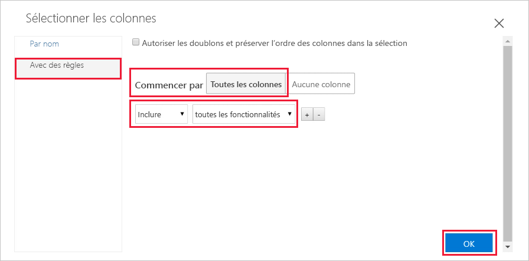
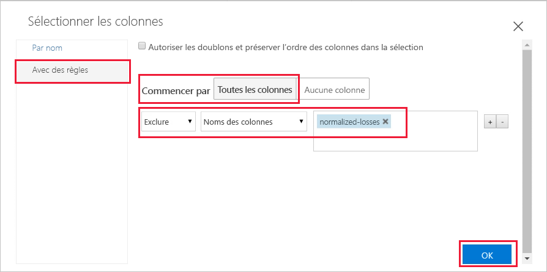
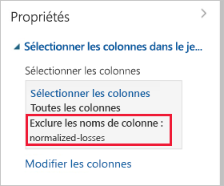
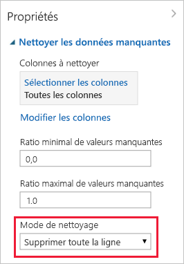

# Démarrage rapide : Préparer et visualiser des données sans écrire de code dans Azure Machine Learning

Préparez et visualisez vos données dans l’interface visuelle par glisser-déplacer (préversion) d’Azure Machine Learning. Les données que vous allez utiliser sont constituées d’entrées sur différentes voitures, notamment des informations sur la marque, le modèle, les caractéristiques techniques et le prix.  

Dans ce guide de démarrage rapide, vous allez explorer et préparer les données :

- Créer votre première expérience pour ajouter et prévisualiser des données
- Préparer les données en supprimant les valeurs manquantes
- Exécuter l’expérience
- Visualiser les données résultantes

Si vous débutez dans le machine learning, la série de vidéos [Data Science for Beginners](https://docs.microsoft.com/azure/machine-learning/studio/data-science-for-beginners-the-5-questions-data-science-answers) offre une excellente introduction au machine learning.

## Prérequis

Si vous n’avez pas d’abonnement Azure, créez un compte gratuit avant de commencer. Essayez la [version gratuite ou payante d’Azure Machine Learning service](https://aka.ms/AMLFree) dès aujourd’hui.

### Créer un espace de travail

Si vous disposez d’un espace de travail Azure Machine Learning service, passez à la [section suivante](#start). Dans le cas contraire, créez-en un maintenant.

[!INCLUDE [aml-create-portal](../../../includes/aml-create-in-portal.md)]

##  Ouvrir la page web de l’interface visuelle

1. Ouvrez votre espace de travail dans le [portail Azure](https://portal.azure.com/).  

1. Dans votre espace de travail, sélectionnez **Interface visuelle**.  Sélectionnez ensuite **Lancer l’interface visuelle**.  
 
    

    La page web d’interface s’ouvre dans une nouvelle page de navigateur.  

## Créer votre première expérience

L’outil d’interface visuelle offre un espace visuel interactif qui vous permet de générer, tester et répéter facilement un modèle d’analyse prédictive. Vous allez faire glisser des jeux de données et des modules d’analyse sur un canevas interactif, en les connectant ensemble pour former une _expérience_.  Créez votre première expérience maintenant.

1. En bas à gauche, sélectionnez **Ajouter nouveau**.

1. Sélectionnez **Blank Experiment**.

1. Un nom par défaut est attribué à votre expérience. Sélectionnez le texte et renommez-le « Quickstart-explore data ». Ce nom n’a pas besoin d’être unique.

1. La **minicarte** au bas de l’écran est utile pour voir des grandes expériences.  Comme vous n’en aurez pas besoin dans ce guide de démarrage rapide, cliquez sur la flèche du haut pour la réduire.  

    

## Ajout de données

Les données sont la première chose dont vous avez besoin pour le machine learning. Vous pouvez utiliser plusieurs exemples de jeux de données inclus dans cette interface ou importer les données de diverses sources. Pour les besoins de cet exemple, vous allez utiliser le jeu de données **Automobile price data (Raw)** . 

1. Sur la gauche de la zone de dessin de l’expérience se trouve une palette de jeux de données et de modules. Sélectionnez **Saved Datasets** (Jeux de données enregistrés), puis **Samples** (Exemples) pour voir les exemples de jeux de données disponibles.

1. Sélectionnez le jeu de données **Automobile price data (raw)** , puis faites-le glisser jusqu’au canevas.

   

## Select columns

Sélectionner les colonnes de données à utiliser.  Pour commencer, configurez le module pour qu’il affiche toutes les colonnes disponibles.

> [!TIP]
> Si vous connaissez le nom des données ou du module que vous voulez, utilisez la barre de recherche en haut de la palette pour les retrouver rapidement.  Ce raccourci sera utilisé dans les étapes restantes du démarrage rapide.

1. Tapez **Select** dans la zone de recherche pour trouver le module **Select Columns in Dataset**.

1. Cliquez sur **Select Columns in Dataset** et faites-glisser le module jusqu’au canevas. Déposez-le en dessous du jeu de données que vous avez ajouté précédemment.

1. Connectez le jeu de données à **Select Columns in Dataset** : cliquez sur le port de sortie du jeu de données, faites glisser la souris jusqu’au port d’entrée de **Select Columns in Dataset**, puis relâchez le bouton de la souris. Le jeu de données et le module restent connectés même si vous opérez des déplacements sur le canevas.

    > [!TIP]
    > Les jeux de données et les modules disposent de ports d’entrée et de sortie représentés par de petits cercles : les ports d’entrée se situent en haut, tandis que les ports de sortie se situent en bas. Vous créez un flux de données dans votre expérience quand vous connectez le port de sortie d’un module au port d’entrée d’un autre module.
    >
    > Si vous avez des difficultés à connecter des modules, essayez de faire glisser la souris jusqu’au nœud que vous connectez.

     

    Le point d’exclamation rouge indique que vous n’avez pas encore défini les propriétés du module. Ce sera votre prochaine tâche.
   
1. Sélectionnez le module **Select Columns in Dataset**.

1. Dans le volet **Propriétés** à droite du canevas, sélectionnez **Modifier les colonnes**.

    Dans la boîte de dialogue **Select columns** (Sélectionner les colonnes), sélectionnez **ALL COLUMNS** (TOUTES LES COLONNES) et incluez **toutes les fonctionnalités**. La boîte de dialogue doit ressembler à ceci :

     

1. En bas à droite, sélectionnez le bouton **OK** pour fermer le sélecteur de colonne.

## Exécuter l’expérience

À tout moment, cliquez sur le port de sortie d’un jeu de données ou d’un module pour examiner l’aspect des données à ce stade dans le flux de données.  Si l’option **Visualize** (Visualiser) est désactivée, vous devez d’abord exécuter l’expérience.  Ce sera votre prochaine tâche.

[!INCLUDE [aml-ui-create-training-compute](../../../includes/aml-ui-create-training-compute.md)]

Une fois que la cible de calcul est disponible, l’expérience s’exécute. Quand l’exécution est terminée, une coche verte apparaît dans chaque module.

## Prévisualiser les données

Maintenant que vous avez exécuté votre expérience initiale, vous pouvez visualiser les données pour mieux comprendre les informations que vous devez utiliser.

1. Sélectionnez le port de sortie au bas du module **Select Columns in Dataset**, puis sélectionnez **Visualize**.

1. Cliquez sur différentes colonnes dans la fenêtre de données pour afficher des informations les concernant.  

    Dans ce jeu de données, chaque ligne représente un véhicule automobile et chaque colonne représente une variable associée au véhicule automobile.    Ce jeu de données contient 205 lignes et 26 colonnes.

     Chaque fois que vous cliquez sur une colonne de données, les informations **statistiques** et l’image de **visualisation** de la colonne en question s’affichent à gauche.  Par exemple, quand vous cliquez sur **num-of-doors** (nombre de portes), vous constatez qu’elle contient 2 valeurs uniques et 2 valeurs manquantes.  Faites défiler vers le bas pour afficher les valeurs : deux et quatre (portes).

     

1. Cliquez sur chaque colonne pour mieux comprendre votre jeu de données.

## Préparer les données

Pour pouvoir être analysé, un jeu de données nécessite généralement un traitement préalable. Vous avez peut-être remarqué l'absence de certaines valeurs dans les colonnes des différentes lignes. Pour que vous puissiez analyser les données correctement, ces valeurs manquantes doivent être nettoyées. Vous allez supprimer les lignes dans lesquelles il manque des valeurs. Par ailleurs, la colonne **normalized-losses** (pertes normalisées) contient une grande proportion de valeurs manquantes. Vous allez donc l’exclure du modèle.

> [!TIP]
> Le nettoyage des valeurs manquantes des données d’entrée est un prérequis pour l’utilisation de la plupart des modules.  

### Supprimer une colonne

Tout d’abord, supprimez entièrement la colonne **normalized-losses**.

1. Sélectionnez le module **Select Columns in Dataset**.

1. Dans le volet **Propriétés** à droite du canevas, sélectionnez **Modifier les colonnes**.

    * Laissez **with rules** (avec règles) et **ALL COLUMNS** (TOUTES LES COLONNES) sélectionnés.

    * Dans les listes déroulantes, sélectionnez **Exclure** et **Noms des colonnes**, puis cliquez dans la zone de texte. Tapez **normalized-losses**.

    * En bas à droite, sélectionnez le bouton **OK** pour fermer le sélecteur de colonne.

    
        
    À présent, le volet de propriétés du module Select Columns in Dataset indique qu’il transmettra toutes les colonnes du jeu de données, à l’exception de **normalized-losses**.
        
    Le volet de propriétés montre que la colonne **normalized-losses** est exclue.
        
    
        
    Vous pouvez ajouter un commentaire dans un module en double-cliquant sur ce module, puis en saisissant du texte. Ceci peut vous aider à voir d'un seul coup d'œil ce que fait chaque module dans votre expérience. 

1. Double-cliquez sur le module **Select Columns in Dataset** et tapez le commentaire « Exclude normalized losses ». 
    
    Après avoir tapé le commentaire, cliquez à l’extérieur du module.  Une flèche vers le bas s’affiche pour indiquer que le module contient un commentaire.

1. Cliquez sur la flèche vers le bas pour afficher le commentaire.

    Le module présente maintenant une flèche vers le haut pour masquer le commentaire.
        
    

### Nettoyage des données manquantes

Ajoutez maintenant un module qui supprime toutes les lignes restantes dans lesquelles il manque des données.

1. Tapez **Clean** dans la zone de recherche pour trouver le module **Clean Missing Data**.

1. Faites glisser le module **Clean Missing Data** jusqu’au canevas de l’expérience et connectez-le au module **Select Columns in Dataset**. 

1. Dans le volet des propriétés, sélectionnez **Remove entire row** (Supprimer la ligne entière) sous **Cleaning mode** (Mode nettoyage).

    Ces options indiquent au module **Clean Missing Data** de nettoyer les données en supprimant les lignes dans lesquelles il manque des valeurs.

1. Double-cliquez sur le module et saisissez le commentaire suivant : « Supprimer les lignes de valeur manquantes ».
 
    

    Votre expérience doit maintenant se présenter comme suit :
    
    

## Visualiser les résultats

Comme vous avez apporté des modifications aux modules de votre expérience, l’état est passé à « In draft » (Brouillon).  Pour visualiser les nouvelles données nettoyées, vous devez d’abord réexécuter l’expérience.

1. Sélectionnez **Run** (Exécuter) au bas pour exécuter l’expérience.

    Cette fois, vous pouvez réutiliser la cible de calcul que vous avez créée précédemment.  

1. Sélectionnez **Run** (Exécuter) dans la boîte de dialogue.

   

1. Quand l’exécution se termine, cliquez sur le module **Clean Missing Data** pour visualiser les nouvelles données nettoyées.  

    

1. Cliquez sur différentes colonnes dans la fenêtre des données nettoyées pour voir comment les données ont changé.  

    

    Il existe désormais 193 lignes et 25 colonnes.

    Quand vous cliquez sur **num-of-doors**, vous constatez qu’il reste 2 valeurs uniques mais aucune valeur manquante.  

## Supprimer des ressources

[!INCLUDE [aml-ui-cleanup](../../../includes/aml-ui-cleanup.md)]

## Étapes suivantes

Dans ce démarrage rapide, vous avez appris comment :

- Créer votre première expérience pour ajouter et prévisualiser des données
- Préparer les données en supprimant les valeurs manquantes
- Visualiser les données résultantes

Passez au tutoriel pour prédire le prix d’une voiture en utilisant ces données.

> [!div class="nextstepaction"]
> [Tutoriel : Prédire le prix de voitures à l’aide de l’interface visuelle](ui-tutorial-automobile-price-train-score.md)
