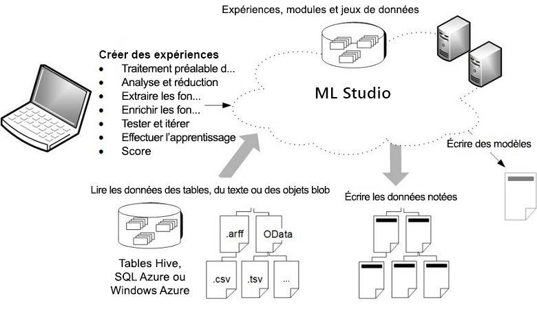

# Qu'est-ce que Machine Learning Studio (classique) ?

**S’APPLIQUE À :**  Machine Learning Studio (classique)   [Azure Machine Learning](../compare-azure-ml-to-studio-classic.md)

[!INCLUDE [Designer notice](../../../includes/designer-notice.md)]

Microsoft Azure Machine Learning Studio (classique) est un outil collaboratif fonctionnant par glisser-déplacer qui vous permet de générer, tester et déployer des solutions d'analyse prédictive à partir de vos données. Azure Machine Learning Studio (classique) publie des modèles en tant que services web pouvant facilement être consommés par des applications personnalisées ou des outils décisionnels tels qu’Excel.

Machine Learning Studio (classique) : là où convergent votre connaissance des données, l'analyse prédictive, les ressources cloud et vos données.

## Espace de travail interactif de Machine Learning Studio (classique)

Pour développer un modèle d’analyse prédictive, vous utilisez généralement les données d’une ou plusieurs sources que vous transformez et analysez par diverses manipulations de données et fonctions statistiques. Vous générez ensuite un ensemble de résultats. Le développement d'un modèle de ce type est un processus itératif. Quand vous modifiez les diverses fonctions et leurs paramètres, vos résultats convergent jusqu'à ce que l'efficacité du modèle formé vous donne satisfaction.

Azure Machine Learning Studio (classique) offre un espace de travail visuel et interactif qui vous permet de générer, tester et répéter facilement un modèle d’analyse prédictive. Vous faites glisser des ***jeux de données*** et des ***modules*** d’analyse sur un canevas interactif, en les connectant ensemble pour former une ***expérience***, que vous exécutez dans Machine Learning Studio (classique). Pour affiner votre modèle, vous modifiez l’expérience, enregistrez une copie si vous le souhaitez et l’exécutez de nouveau. Quand vous êtes prêt, vous pouvez convertir votre ***expérience de formation*** en une ***expérience prédictive***, puis la publier en tant que ***service web*** afin que votre modèle soit accessible à d’autres.

Aucune programmation n'est nécessaire : visualisez la connexion des jeux de données et des modules pour construire votre modèle d'analyse prédictive.

## Téléchargez le diagramme de vue d’ensemble de Machine Learning Studio (classique)
Téléchargez le diagramme **Vue d’ensemble des capacités de Microsoft Azure Machine Learning Studio (classique)** et obtenez une vue d’ensemble des fonctionnalités de Machine Learning Studio (classique). Imprimez le diagramme au format tabloïd (11 x 17 pouces) pour le conserver à portée de main.

**Téléchargez le diagramme ici : [Vue d’ensemble des fonctionnalités de Microsoft Azure Machine Learning Studio (classique)](https://download.microsoft.com/download/C/4/6/C4606116-522F-428A-BE04-B6D3213E9E52/ml_studio_overview_v1.1.pdf)** 

## Composants d’une expérience Studio (classique)
Une expérience se compose de jeux de données qui fournissent des données aux modules d'analyse que vous connectez ensemble pour construire un modèle d'analyse prédictive. En particulier, une expérience valide a les caractéristiques suivantes :

* L'expérience comporte au moins un jeu de données et un module
* Il est possible de connecter des jeux de données uniquement à des modules
* Les modules peuvent être connectés à des jeux de données ou à d'autres modules
* Tous les ports d'entrée des modules doivent comporter une connexion au flux de données
* Tous les paramètres obligatoires de chaque module doivent être configurés

Vous pouvez créer une expérience à partir de zéro, ou utiliser un exemple d’expérience existante comme modèle. Pour plus d’informations, consultez [Copier des exemples d’expérience pour créer des expériences d’apprentissage automatique](sample-experiments.md).

Pour obtenir un exemple de création d'une expérience, consultez la rubrique [Création d'une expérience simple dans Azure Machine Learning Studio (classique)](create-experiment.md).

Pour obtenir une procédure pas à pas expliquant de manière plus complète comment créer une solution d’analyse prédictive, consultez [Développer une solution prédictive avec Azure Machine Learning Studio (classique)](tutorial-part1-credit-risk.md).

### Groupes de données
Un jeu de données représente des données téléchargées dans Machine Learning Studio (classique) de façon à les utiliser dans la procédure de modélisation. Machine Learning Studio (classique) fournit divers exemples de jeux de données utilisables pour vos expériences ; vous pouvez télécharger vers le serveur d'autres jeux de données si vous en avez besoin. Voici quelques exemples de jeux de données fournis :

* **Données sur la quantité de litres au 100 pour différents véhicules automobiles** : valeurs de quantité de litres au 100 pour des automobiles identifiées par leur nombre de cylindres, leur puissance, etc.
* **Données sur le cancer du sein** : données de diagnostics sur le cancer du sein.
* **Données sur les feux de forêts** : tailles des incendies de forêts au nord-est du Portugal.

Au moment de créer une expérience, vous pouvez effectuer un choix dans la liste des jeux de données disponibles à gauche du canevas.

Pour obtenir une liste des exemples de jeux de données inclus dans Machine Learning Studio (classique), consultez [Utilisation des exemples de jeux de données dans Azure Machine Learning Studio (classique)](use-sample-datasets.md).

### Modules
Un module est un algorithme que vous appliquez à vos données. Azure Machine Learning Studio (classique) comporte divers modules, allant de fonctions d’entrée des données à des procédures de formation, de notation et de validation. Voici quelques exemples de modules fournis :

* [Convertir en ARFF][convert-to-arff] : convertit un jeu de données sérialisé .NET au format ARFF (Attribute-Relation File Format).
* [Statistiques élémentaires de calcul][elementary-statistics] : calcule des statistiques élémentaires (par exemple, moyenne, écart type, etc.).
* [Régression linéaire][linear-regression] : crée un modèle en ligne de régression linéaire basée sur une descente de gradient.
* [Noter le modèle][score-model] : note un modèle de classification ou de régression formé.

Lorsque vous créez une expérience, vous pouvez utiliser la liste des modules à gauche du canevas.

Un module peut comporter un ensemble de paramètres utilisables pour configurer les algorithmes internes du module. Quand vous sélectionnez un module dans le canevas, ses paramètres sont affichés dans le volet **Propriétés** à droite du canevas. Vous pouvez modifier les paramètres figurant dans ce volet pour affiner votre modèle.

Pour savoir comment parcourir la vaste bibliothèque d’algorithmes de machine learning disponibles, consultez [Guide pratique pour choisir des algorithmes pour Microsoft Azure Machine Learning Studio (classique)](algorithm-choice.md).

## Déploiement d'un service web d'analyse prédictive
Une fois votre modèle d'analyse prédictive prêt, vous pouvez le déployer comme un service web directement à partir de Machine Learning Studio (classique). Pour plus d’informations sur ce processus, consultez [Déploiement d’un service web Azure Machine Learning](deploy-a-machine-learning-web-service.md).

## Étapes suivantes
Apprenez les principes de base de l’analyse prédictive et de l’apprentissage automatique en suivant un [guide de démarrage rapide](create-experiment.md) pas à pas et en [développant à partir d’exemples](sample-experiments.md).

<!-- Module References -->
[convert-to-arff]: https://msdn.microsoft.com/library/azure/62d2cece-d832-4a7a-a0bd-f01f03af0960/
[elementary-statistics]: https://msdn.microsoft.com/library/azure/3086b8d4-c895-45ba-8aa9-34f0c944d4d3/
[linear-regression]: https://msdn.microsoft.com/library/azure/31960a6f-789b-4cf7-88d6-2e1152c0bd1a/
[score-model]: https://msdn.microsoft.com/library/azure/401b4f92-e724-4d5a-be81-d5b0ff9bdb33/
