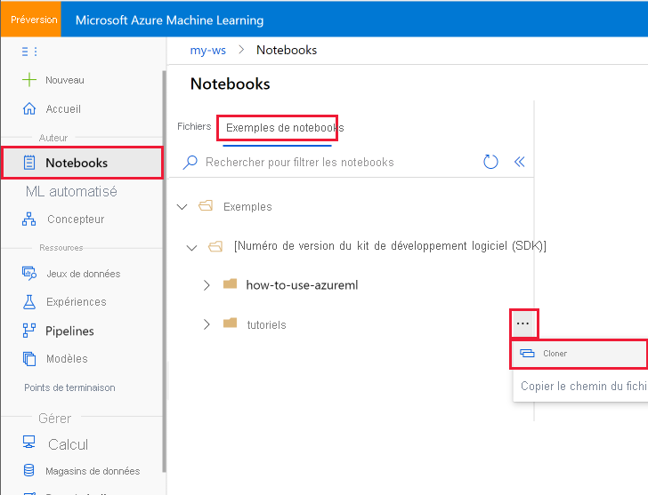
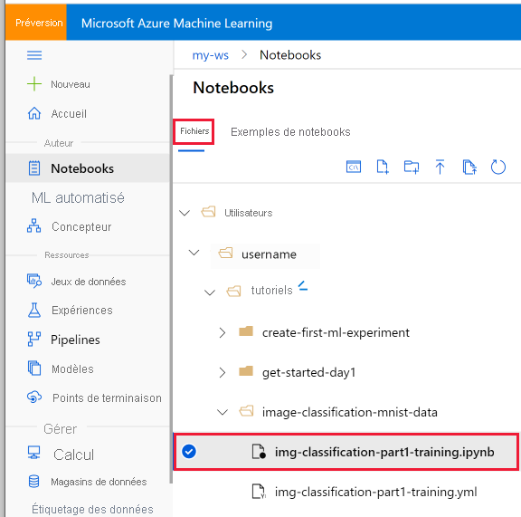

# Tutoriel : Bien démarrer avec la création de votre première expérience ML avec le SDK Python
[!INCLUDE [applies-to-skus](../../includes/aml-applies-to-basic-enterprise-sku.md)]

Dans ce tutoriel, vous allez effectuer des étapes de bout en bout pour vous familiariser avec le kit de développement logiciel (SDK) Python pour Azure Machine Learning s’exécutant dans des notebooks Jupyter. Ce tutoriel **fait partie d’une série de tutoriels en deux parties** et aborde l’installation et la configuration de l’environnement Python, ainsi que la création d’un espace de travail pour gérer vos expériences et vos modèles Machine Learning. La [**deuxième partie**](tutorial-1st-experiment-sdk-train.md) se poursuit avec l’entraînement de plusieurs modèles Machine Learning et présente le processus de gestion des modèles avec Azure Machine Learning Studio et le Kit de développement logiciel (SDK).

Dans ce tutoriel, vous allez :

> [!div class="checklist"]
> * Créer un [espace de travail Azure Machine Learning](concept-workspace.md) à utiliser dans le tutoriel suivant.
> * Clonez le notebook des tutoriels dans votre dossier au sein de l’espace de travail.
> * Préinstallez et préconfigurez le Kit de développement logiciel (SDK) Python Azure Machine Learning, puis créez une instance de calcul basée sur le cloud.

Si vous n’avez pas d’abonnement Azure, créez un compte gratuit avant de commencer. Essayez la [version gratuite ou payante d’Azure Machine Learning](https://aka.ms/AMLFree) dès aujourd’hui.

## Créer un espace de travail

Un espace de travail Azure Machine Learning est une ressource fondamentale du cloud que vous utilisez pour expérimenter, entraîner et déployer des modèles Machine Learning. Il lie votre abonnement Azure et votre groupe de ressources à un objet facile à consommer dans le service. 

Vous créez un espace de travail par le biais du portail Azure, une console web pour la gestion de vos ressources Azure. 

[!INCLUDE [aml-create-portal](../../includes/aml-create-in-portal.md)]

>[!IMPORTANT] 
> Prenez note de votre **espace de travail** et de votre **abonnement**. Vous en aurez besoin pour être sûr de créer votre expérience au bon endroit. 

## Exécuter un notebook dans votre espace de travail

Ce tutoriel utilise le serveur de notebook cloud dans votre espace de travail pour une expérience préconfigurée sans installation. Utilisez [votre propre environnement](how-to-configure-environment.md#local) si vous préférez contrôler votre environnement, vos packages et vos dépendances.

Suivez cette vidéo ou suivez les étapes détaillées ci-dessous pour cloner et exécuter le tutoriel à partir de votre espace de travail. 

> [!VIDEO https://www.microsoft.com/en-us/videoplayer/embed/RE4mTUr]

### Cloner un dossier de notebooks

Vous effectuez les étapes de configuration et d’exécution d’expérience suivantes dans Azure Machine Learning Studio, une interface centralisée qui comprend des outils de Machine Learning permettant de mettre en œuvre des scénarios de science des données pour les utilisateurs de science des données de tous niveaux de compétence.

1. Connectez-vous à [Azure Machine Learning Studio](https://ml.azure.com/).

1. Sélectionnez votre abonnement et l’espace de travail que vous avez créé.

1. Sélectionnez **Notebooks** à gauche.

1. Ouvrez le dossier **Samples**.

1. Ouvrez le dossier **Python**.

1. Ouvrez le dossier contenant un numéro de version.  Ce numéro représente la version actuelle du Kit de développement logiciel (SDK) Python.

1. Sélectionnez **« ... »** à droite du dossier **tutorials** (tutoriels), puis sélectionnez **Clone** (Cloner).

    

1. Une liste de dossiers indiquant tous les utilisateurs qui accèdent à l’espace de travail s’affiche.  Sélectionnez le dossier où cloner le dossier **tutorials**.

### <a name="open">Ouvrir le notebook cloné

1. Sous **User Files** (Fichiers utilisateur), ouvrez votre dossier, puis ouvrez le dossier **tutorials** cloné.

    

    > [!IMPORTANT]
    > Vous pouvez voir les notebooks présents dans le dossier **samples** (exemples), mais vous ne pouvez pas exécuter de notebook à partir de cet emplacement.  Pour exécuter un notebook, veillez à ouvrir sa version clonée dans la section **User Files**.
    
1. Sélectionnez le fichier **tutorial-1st-experiment-sdk-train.ipynb** dans votre dossier **tutorials**.

1. Dans la barre supérieure, sélectionnez une instance de calcul à utiliser pour exécuter le notebook. Ces machines virtuelles sont préconfigurées avec [tout ce dont vous avez besoin pour exécuter Azure Machine Learning](concept-compute-instance.md#contents). Vous pouvez sélectionner une machine virtuelle créée par n’importe quel utilisateur de votre espace de travail. 

1. Si aucune machine virtuelle n’est trouvée, sélectionnez **+ Ajouter** pour créer la machine virtuelle d’instance de calcul. 

    1. Quand vous créez une machine virtuelle, indiquez un nom.  Le nom doit être compris entre 2 et 16 caractères. Les caractères valides sont les lettres, les chiffres et le caractère« - ». De plus, les noms doivent être uniques dans votre abonnement Azure.

    1.  Sélectionnez la taille de la machine virtuelle parmi les options disponibles.

    1. Sélectionnez ensuite **Créer**. Environ 5 minutes sont nécessaires pour configurer votre machine virtuelle.

1. Une fois la machine virtuelle disponible, elle s’affiche dans la barre d’outils supérieure.  Vous pouvez maintenant exécuter le notebook à l’aide de **Run all** (Tout exécuter) dans la barre d’outils, ou à l’aide de **Maj+Entrée** dans les cellules de code du notebook.

Si vous avez des widgets personnalisés ou préférez utiliser Jupyter/JupyterLab, sélectionnez la liste déroulante **Jupyter** à l’extrême droite, puis sélectionnez **Jupyter** ou **JupyterLab**. La nouvelle fenêtre de navigateur s’ouvre.

> [!NOTE]
> Les instances de calcul (préversion) sont actuellement disponibles uniquement pour les espaces de travail situés dans les régions **USA Centre Nord** ou **Royaume-Uni Sud**. D’autres régions seront bientôt prises en charge.
>Si votre espace de travail se trouve dans une autre région, vous pouvez continuer à créer et à utiliser une [machine virtuelle Notebook](concept-compute-instance.md#notebookvm) à la place.  Vous pouvez utiliser une machine virtuelle Notebook ou une instance de calcul pour exécuter votre notebook. Une machine virtuelle continue à s’exécuter et à engendrer des frais, sauf si vous l’arrêtez. Vous pouvez l’arrêter manuellement à partir de l’onglet **Calcul** dans Studio ou consulter le [billet de blog](https://techcommunity.microsoft.com/t5/educator-developer-blog/azure-virtual-machine-auto-shutdown/ba-p/379342) sur l’activation de l’arrêt automatique planifié pour les machines virtuelles Azure.

## Étapes suivantes

Dans ce tutoriel, vous avez effectué les tâches suivantes :

* Création d’un espace de travail Azure Machine Learning
* Utiliser et configurer un serveur de notebooks cloud dans votre espace de travail.

Dans la **deuxième partie** du tutoriel, vous exécutez le code dans `tutorial-1st-experiment-sdk-train.ipynb` pour entraîner un modèle Machine Learning. 

> [!div class="nextstepaction"]
> [Tutoriel : effectuer l’apprentissage de votre premier modèle](tutorial-1st-experiment-sdk-train.md)

> [!IMPORTANT]
> Si vous ne prévoyez pas de suivre la deuxième partie de ce tutoriel ou tout autre tutoriel, vous devez [arrêter la machine virtuelle du serveur de notebooks cloud](tutorial-1st-experiment-sdk-train.md#clean-up-resources) quand vous ne l’utilisez pas, afin de réduire les coûts.

