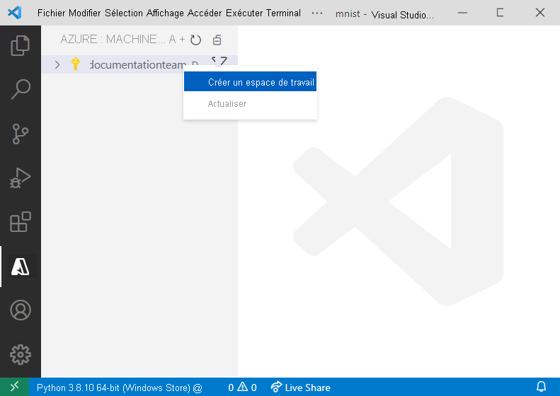
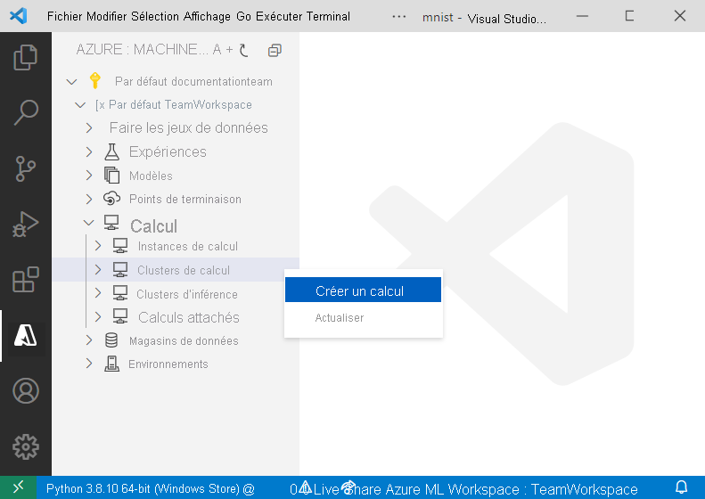

# <a name="train-and-deploy-an-image-classification-tensorflow-model-using-the-azure-machine-learning-visual-studio-code-extension"></a>Entraîner et déployer un modèle de classification d’images TensorFlow à l’aide de l’extension Azure Machine Learning de Visual Studio Code

Découvrez comment entraîner un modèle de classification d’images pour reconnaître des chiffres écrits à la main à l’aide de TensorFlow et de l’extension Azure Machine Learning de Visual Studio Code.

Dans ce tutoriel, vous allez apprendre à effectuer les tâches suivantes :

> [!div class="checklist"]
> * Comprendre le code
> * Créer un espace de travail
> * Créer une expérience
> * Configurer des cibles de calcul
> * Utiliser un fichier de configuration
> * Entraîner un modèle
> * Inscrire un modèle
> * Déployer un modèle

## <a name="prerequisites"></a>Prérequis

- Abonnement Azure. Si vous n’en avez pas, inscrivez-vous ou essayez la [version gratuite ou payante d’Azure Machine Learning](https://aka.ms/AMLFree)
- Installez [Visual Studio Code](https://code.visualstudio.com/docs/setup/setup-overview), éditeur de code léger et multiplateforme
- Extension Azure Machine Learning de Visual Studio Code. Pour obtenir des instructions d’installation, consultez le tutoriel [Configurer l’extension Azure Machine Learning de Visual Studio Code](./tutorial-setup-vscode-extension.md)

## <a name="understand-the-code"></a>Comprendre le code

Le code de ce tutoriel utilise TensorFlow pour entraîner un modèle Machine Learning de classification d’images qui classe les chiffres manuscrits de 0 à 9. Pour ce faire, il crée un réseau neuronal qui prend les valeurs de pixel d’une image 28 px x 28 px comme entrée, et génère une liste de 10 probabilités, une pour chacun des chiffres classifiés. Vous trouverez ci-dessous un exemple de ce à quoi ressemblent les données.  


Pour obtenir le code de ce tutoriel, téléchargez et décompressez le [dépôt VS Code Tools for AI](https://github.com/microsoft/vscode-tools-for-ai/archive/master.zip) n’importe où sur votre ordinateur.

## <a name="create-a-workspace"></a>Créer un espace de travail

La première chose à faire pour générer une application dans Azure Machine Learning consiste à créer un espace de travail. Un espace de travail contient les ressources nécessaires pour entraîner des modèles ainsi que les modèles entraînés proprement dits. Pour plus d’informations, consultez [Qu’est-ce qu’un espace de travail ?](./concept-workspace.md). 

1. Dans la barre d’activité Visual Studio Code, sélectionnez l’icône **Azure** pour ouvrir la vue Azure Machine Learning.
1. Cliquez avec le bouton droit sur votre abonnement Azure et sélectionnez **Créer un espace de travail**. 
    
    > [!div class="mx-imgBorder"]
    > 

1. Par défaut, un nom est généré, indiquant la date et l’heure de création. Dans la palette de commandes, remplacez le nom par « TeamWorkspace », puis appuyez sur **Entrée**.
1. Sélectionnez **Créer un groupe de ressources** dans la palette de commandes. 
1. Entrez « TeamWorkspace-rg » dans la zone de texte de la palette de commandes, puis appuyez sur **Entrée**. 
1. Dans la palette de commandes, choisissez un emplacement pour votre espace de travail. Nous vous recommandons de choisir un emplacement le plus proche possible de celui où vous comptez déployer votre modèle. Pour ce tutoriel, choisissez **USA Ouest 2**.
1. Quand vous êtes invité à sélectionner une référence (SKU) d’espace de travail, sélectionnez **De base** pour créer un espace de travail de base. Pour plus d’informations sur les différentes offres d’espace de travail, consultez [Vue d’ensemble d’Azure Machine Learning](./overview-what-is-azure-ml.md#sku).

À ce stade, une demande est envoyée à Azure afin de créer un nouvel espace de travail dans votre compte. Après quelques minutes, le nouvel espace de travail apparaît dans votre nœud d’abonnement. 

## <a name="create-an-experiment"></a>Créer une expérience

Vous pouvez créer une ou plusieurs expériences dans votre espace de travail pour suivre et analyser individuellement les exécutions d’entraînement du modèle. Les exécutions peuvent être effectuées dans le cloud Azure ou sur votre machine locale.

1. Dans la barre d’activités Visual Studio Code, sélectionnez l’icône **Azure**. La vue Azure Machine Learning apparaît.
1. Développez votre nœud d’abonnement.
1. Développez le nœud **TeamWorkspace**. 
1. Cliquez avec le bouton droit sur le nœud **Expériences**.
1. Sélectionnez **Créer une expérience** dans le menu contextuel.

    > [!div class="mx-imgBorder"]
    > 

1. À l’invite de la palette de commandes, nommez votre expérience « MNIST » et appuyez sur **Entrée** pour créer la nouvelle expérience. 

Comme pour l’espace de travail, une demande est envoyée à Azure afin de créer une expérience avec les configurations fournies. Après quelques minutes, la nouvelle expérience apparaît dans le nœud *Expériences* de votre espace de travail. 

## <a name="configure-compute-targets"></a>Configurer les cibles de calcul

Une cible de calcul est la ressource ou l’environnement informatique où vous exécutez des scripts et déployez des modèles entraînés. Pour plus d’informations, consultez la [documentation sur les cibles de calcul Azure Machine Learning](./concept-compute-target.md).

Pour créer une cible de calcul :

1. Dans la barre d’activités Visual Studio Code, sélectionnez l’icône **Azure**. La vue Azure Machine Learning apparaît. 
1. Développez votre nœud d’abonnement. 
1. Développez le nœud **TeamWorkspace**. 
1. Sous le nœud de l’espace de travail, cliquez avec le bouton droit sur le nœud **Calcul**, puis choisissez **Create Compute** (Créer un calcul). 

    > [!div class="mx-imgBorder"]
    > 

1. Sélectionnez **Capacité de calcul Azure Machine Learning (AmlCompute)** . Capacité de calcul Azure Machine Learning est une infrastructure de capacité de calcul managée qui permet à l’utilisateur de créer facilement une capacité de calcul à un ou plusieurs nœuds pouvant être utilisée par d’autres utilisateurs dans votre espace de travail.
1. Choisissez une taille de machine virtuelle. À l’invite de la palette de commandes, sélectionnez **Standard_F2s_v2**. La taille de votre machine virtuelle a un impact sur la durée nécessaire à l’entraînement de vos modèles. Pour plus d’informations sur les tailles de machine virtuelle, consultez [Tailles des machines virtuelles Linux dans Azure](https://docs.microsoft.com/azure/virtual-machines/linux/sizes).
1. À l’invite de la palette de commandes, nommez votre calcul « TeamWkspc-com » et appuyez sur **Entrée** pour créer votre calcul.

Après quelques minutes, la nouvelle cible de calcul apparaît dans le nœud *Compute* de votre espace de travail.

## <a name="create-a-run-configuration"></a>Créer une configuration de série de tests

Quand vous soumettez une série d’entraînement à une cible de calcul, vous soumettez également la configuration nécessaire pour exécuter le travail d’entraînement, par exemple le script qui contient le code d’entraînement et les dépendances Python nécessaires à son exécution.

Pour créer une configuration de série de tests

1. Dans la barre d’activités Visual Studio Code, sélectionnez l’icône **Azure**. La vue Azure Machine Learning apparaît. 
1. Développez votre nœud d’abonnement. 
1. Développez le nœud **TeamWorkspace**. 
1. Sous le nœud de l’espace de travail, cliquez avec le bouton droit sur le nœud de calcul **TeamWkspc-com** et choisissez **Créer une configuration d’exécution**.

    > [!div class="mx-imgBorder"]
    > 

1. À l’invite de la palette de commandes, nommez votre exécution « MNIST-rc » et appuyez sur **Entrée** pour créer votre calcul.
1. Ensuite, sélectionnez **Entraînement à nœud unique TensorFlow** comme type de travail d’entraînement.
1. Appuyez sur **Entrée** pour naviguer jusqu’au fichier de script à exécuter sur le calcul. En l’occurrence, le script pour l’entraînement du modèle est le fichier `train.py` dans le répertoire `vscode-tools-for-ai/mnist-vscode-docs-sample`.
1. Entrez ce qui suit à l’invite de la palette de commandes pour spécifier les packages requis.
    
    ```text
    pip: azureml-defaults; conda: python=3.6.2, tensorflow=1.15.0
    ```
    
    Un fichier nommé `MNIST-rc.runconfig` s’affiche dans VS Code avec un contenu similaire à celui ci-dessous :

    ```json
    {
        "script": "train.py",
        "framework": "Python",
        "communicator": "None",
        "target": "TeamWkspc-com",
        "environment": {
            "python": {
                "userManagedDependencies": false,
                "condaDependencies": {
                    "dependencies": [
                        "python=3.6.2",
                        "tensorflow=1.15.0",
                        {
                            "pip": [
                                "azureml-defaults"
                            ]
                        }
                    ]
                }
            },
            "docker": {
                "baseImage": "mcr.microsoft.com/azureml/base:0.2.4",
                "enabled": true,
                "baseImageRegistry": {
                    "address": null,
                    "username": null,
                    "password": null
                }
            }
        },
        "nodeCount": 1,
        "history": {
            "outputCollection": true,
            "snapshotProject": false,
            "directoriesToWatch": [
                "logs"
            ]
        }
    }
    ```

1. Quand vous êtes satisfait de la configuration, ouvrez la palette de commandes en sélectionnant **Affichage > Palette de commandes**.
1. Entrez la commande suivante dans la palette de commandes pour enregistrer votre fichier de configuration de série de tests.

    ```text
    Azure ML: Save and Continue
    ```

La configuration de série de tests `MNIST-rc` est ajoutée sous le nœud de calcul *TeamWkspc-com*.

## <a name="train-the-model"></a>Entraîner le modèle

Pendant le processus d’entraînement, un modèle TensorFlow est créé en traitant les données d’entraînement et les patterns d’entraînement incorporés pour chacun des chiffres classifiés. 

Pour exécuter une expérience Azure Machine Learning :

1. Dans la barre d’activités Visual Studio Code, sélectionnez l’icône **Azure**. La vue Azure Machine Learning apparaît. 
1. Développez votre nœud d’abonnement. 
1. Développez le nœud **TeamWorkspace > Expériences**. 
1. Cliquez avec le bouton droit sur l’expérience **MNIST**.
1. Sélectionnez **Run Experiment** (Exécuter l’expérience).

    > [!div class="mx-imgBorder"]
    > 

1. Dans la palette de commandes, sélectionnez la cible de calcul **TeamWkspc-com**.
1. Ensuite, sélectionnez la configuration de série de tests **MNIST-rc**.
1. À ce stade, une demande est envoyée à Azure pour exécuter votre expérience sur la cible de calcul sélectionnée dans votre espace de travail. Cette opération prend plusieurs minutes. La durée d’exécution du travail d’entraînement est influencée par plusieurs facteurs tels que le type de calcul et la taille des données d’entraînement. Pour suivre la progression de votre expérience, cliquez avec le bouton droit sur le nœud d’exécution actif et sélectionnez **Afficher l’exécution dans le portail Azure**.
1. Quand la boîte de dialogue vous invitant à ouvrir un site web externe s’affiche, sélectionnez **Ouvrir**.

    > [!div class="mx-imgBorder"]
    > 

Une fois l’entraînement du modèle terminé, l’étiquette d’état en regard du nœud d’exécution est mise à jour avec la valeur « Terminé ».

## <a name="register-the-model"></a>Inscrire le modèle

Maintenant que vous avez entraîné votre modèle, vous pouvez l’inscrire dans votre espace de travail. 

Pour enregistrer votre modèle :

1. Dans la barre d’activités Visual Studio Code, sélectionnez l’icône **Azure**. La vue Azure Machine Learning apparaît.
1. Développez votre nœud d’abonnement. 
1. Développez le nœud **TeamWorkspace > Expériences > MNIST**.
1. Obtenez les sorties de modèle générées à partir de l’entraînement du modèle. Cliquez avec le bouton droit sur le nœud d’exécution **Exécution 1**, puis sélectionnez **Télécharger les sorties**. 

    > [!div class="mx-imgBorder"]
    > 

1. Sélectionnez le répertoire où enregistrer les sorties téléchargées. Par défaut, les sorties sont placées dans le répertoire actuellement ouvert dans Visual Studio Code.
1. Cliquez avec le bouton droit sur le nœud **Modèles** et choisissez **Inscrire un modèle**.

    > [!div class="mx-imgBorder"]
    > 

1. Dans la palette de commandes, nommez votre modèle « MNIST-TensorFlow-model » et appuyez sur **Entrée**.
1. Un modèle TensorFlow est constitué de plusieurs fichiers. Sélectionnez **Dossier de modèle** comme format du chemin de modèle dans la palette de commandes. 
1. Sélectionner le répertoire `azureml_outputs/Run_1/outputs/Run_1/outputs/outputs/model`.

    Un fichier contenant vos configurations de modèle apparaît dans Visual Studio Code, avec du contenu similaire à celui ci-dessous :

    ```json
    {
        "modelName": "MNIST-TensorFlow-model",
        "tags": {
            "": ""
        },
        "modelPath": "c:\\Dev\\vscode-tools-for-ai\\mnist-vscode-docs-sample\\azureml_outputs\\Run_1\\outputs\\Run_1\\outputs\\outputs\\model",
        "description": ""
    }
    ```

1. Une fois satisfait de votre configuration, enregistrez-la en ouvrant la palette de commandes et en entrant la commande suivante :

    ```text
    Azure ML: Save and Continue
    ```

Après quelques minutes, le modèle apparaît sous le nœud *Modèles*.

## <a name="deploy-the-model"></a>Déployer le modèle

Dans Visual Studio Code, vous pouvez déployer votre modèle en tant que service web sur :

+ Azure Container Instances (ACI).
+ Azure Kubernetes Service (AKS).

Vous n’avez pas besoin de créer un conteneur ACI en vue de le tester au préalable, car les conteneurs ACI sont créés au fur et à mesure des besoins. Toutefois, vous devez configurer les clusters AKS à l’avance. Pour plus d’informations sur les options de déploiement, consultez [Déployer des modèles avec Azure Machine Learning](how-to-deploy-and-where.md).

Pour déployer un service web en tant qu’ACI :

1. Dans la barre d’activités Visual Studio Code, sélectionnez l’icône **Azure**. La vue Azure Machine Learning apparaît.
1. Développez votre nœud d’abonnement. 
1. Développez le nœud **TeamWorkspace > Modèles**. 
1. Cliquez avec le bouton droit sur **MNIST-TensorFlow-model**, puis sélectionnez **Déployer le service à partir d’un modèle inscrit**.

    > [!div class="mx-imgBorder"]
    > 

1. Dans la palette de commandes, sélectionnez **Azure Container Instances**.
1. Nommez votre service « mnist-tensorflow-svc » et appuyez sur **Entrée** dans la palette de commandes.
1. Sélectionnez le script à exécuter dans le conteneur en appuyant sur **Entrée** dans la palette de commandes et en naviguant jusqu’au fichier `score.py` dans le répertoire `mnist-vscode-docs-sample`.
1. Spécifiez les dépendances nécessaires pour exécuter le script en appuyant sur **Entrée** dans la palette de commandes et en naviguant jusqu’au fichier `env.yml` dans le répertoire `mnist-vscode-docs-sample`.

    Un fichier contenant vos configurations de modèle apparaît dans Visual Studio Code, avec du contenu similaire à celui ci-dessous :

    ```json
    {
        "name": "mnist-tensorflow-svc",
        "imageConfig": {
            "runtime": "python",
            "executionScript": "score.py",
            "dockerFile": null,
            "condaFile": "env.yml",
            "dependencies": [],
            "schemaFile": null,
            "enableGpu": false,
            "description": ""
        },
        "deploymentConfig": {
            "cpu_cores": 1,
            "memory_gb": 10,
            "tags": {
                "": ""
            },
            "description": ""
        },
        "deploymentType": "ACI",
        "modelIds": [
            "MNIST-TensorFlow-model:1"
        ]
    }
    ```
1. Une fois satisfait de votre configuration, enregistrez-la en ouvrant la palette de commandes et en entrant la commande suivante :

    ```text
    Azure ML: Save and Continue
    ```

À ce stade, une demande est envoyée à Azure pour déployer votre service web. Cette opération prend plusieurs minutes. Une fois déployé, le nouveau service apparaît sous le nœud *Points de terminaison*.

## <a name="next-steps"></a>Étapes suivantes

* Pour une procédure détaillée de l’entraînement avec Azure Machine Learning en dehors de Visual Studio Code, consultez le [tutoriel : Entraîner des modèles avec Azure Machine Learning](tutorial-train-models-with-aml.md).
* Pour une procédure détaillée sur la modification, l’exécution et le débogage de code localement, consultez le [tutoriel Python Hello World](https://code.visualstudio.com/docs/Python/Python-tutorial).

