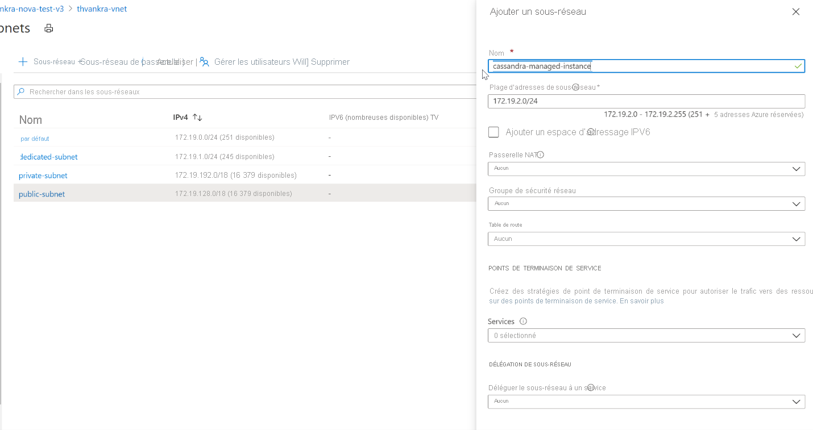

# <a name="quickstart-configure-a-hybrid-cluster-with-azure-managed-instance-for-apache-cassandra-preview"></a>Démarrage rapide : Configurer un cluster hybride avec Azure Managed Instance pour Apache Cassandra (préversion)

Azure Managed Instance pour Apache Cassandra offre des opérations de déploiement et de mise à l’échelle automatisées pour les centres de données Apache Cassandra open source managés. Ce service vous aide à accélérer les scénarios hybrides et à réduire la maintenance en cours.

> [!IMPORTANT]
> Azure Managed Instance pour Apache Cassandra est actuellement disponible en préversion publique.
> Cette préversion est fournie sans contrat de niveau de service et n’est pas recommandée pour les charges de travail de production. Certaines fonctionnalités peuvent être limitées ou non prises en charge.
> Pour plus d’informations, consultez [Conditions d’Utilisation Supplémentaires relatives aux Évaluations Microsoft Azure](https://azure.microsoft.com/support/legal/preview-supplemental-terms/).

Ce guide de démarrage rapide montre comment utiliser les commandes Azure CLI pour configurer un cluster hybride. Si vous avez déjà des centres de données dans un environnement local ou autohébergé, vous pouvez ajouter d’autres centres de données à ce cluster et gérer tous les clusters avec Azure Managed Instance pour Apache Cassandra.

[!INCLUDE [azure-cli-prepare-your-environment.md](../../includes/azure-cli-prepare-your-environment.md)]

* Pour cet article, vous avez besoin d’Azure CLI version 2.12.1 ou ultérieure. Si vous utilisez Azure Cloud Shell, sachez que la version la plus récente est déjà installée.

* Un [réseau virtuel Azure](../virtual-network/virtual-networks-overview.md) connecté à votre environnement autohébergé ou local. Pour plus d’informations sur la connexion d’environnements locaux à Azure, consultez l’article [Connecter un réseau local à Azure](https://docs.microsoft.com/azure/architecture/reference-architectures/hybrid-networking/).

## <a name="configure-a-hybrid-cluster"></a><a id="create-account"></a>Configurer un cluster hybride

1. Connectez-vous au [portail Azure](https://portal.azure.com/) et accédez à votre ressource de réseau virtuel.

1. Ouvrez l’onglet **Sous-réseaux** et créez un sous-réseau. Pour en savoir plus sur les champs du formulaire **Ajouter un sous-réseau**, consultez l’article [Réseau virtuel](../virtual-network/virtual-network-manage-subnet.md#add-a-subnet) :

   :::image type="content" source="./media/configure-hybrid-cluster/subnet.png" alt-text="Ajouter un sous-réseau à votre réseau virtuel." lightbox="./media/configure-hybrid-cluster/subnet.png" border="true":::
    <!--  -->

1. À présent, nous allons utiliser Azure CLI pour appliquer certaines autorisations spéciales, qui sont requises par Cassandra Managed Instance, au réseau virtuel et au sous-réseau. Utilisez la commande `az role assignment create`, en remplaçant `<subscription ID>`, `<resource group name>`, `<VNet name>` et `<subnet name>` par les valeurs appropriées :

   ```azurecli-interactive
   az role assignment create --assignee e5007d2c-4b13-4a74-9b6a-605d99f03501 --role 4d97b98b-1d4f-4787-a291-c67834d212e7 --scope /subscriptions/<subscription ID>/resourceGroups/<resource group name>/providers/Microsoft.Network/virtualNetworks/<VNet name>/subnets/<subnet name>
   ```

   > [!NOTE]
   > Les valeurs `assignee` et `role` dans la commande précédente correspondent aux identificateurs fixes du principal de service et du rôle, respectivement.

1. Nous allons ensuite configurer des ressources pour le cluster hybride. Dans la mesure où vous avez déjà un cluster, le nom du cluster est ici simplement une ressource logique permettant d’identifier le nom de votre cluster existant. Veillez à spécifier le nom du cluster existant quand vous définissez les variables `clusterName` et `clusterNameOverride` dans le script suivant.

   Vous devez également indiquer les nœuds seed, les certificats clients publics (si vous avez configuré une clé publique/privée sur votre point de terminaison Cassandra) et les certificats gossip de votre cluster existant. Indiquez aussi l’ID de ressource, que vous avez précédemment noté, pour définir la variable `delegatedManagementSubnetId`.

   ```azurecli-interactive
   resourceGroupName='MyResourceGroup'
   clusterName='cassandra-hybrid-cluster-legal-name'
   clusterNameOverride='cassandra-hybrid-cluster-illegal-name'
   location='eastus2'
   delegatedManagementSubnetId='<Resource ID>'
    
   # You can override the cluster name if the original name is not legal for an Azure resource:
   # overrideClusterName='ClusterNameIllegalForAzureResource'
   # the default cassandra version will be v3.11
    
   az managed-cassandra cluster create \
      --cluster-name $clusterName \
      --resource-group $resourceGroupName \
      --location $location \
      --delegated-management-subnet-id $delegatedManagementSubnetId \
      --external-seed-nodes 10.52.221.2,10.52.221.3,10.52.221.4
      --client-certificates 'BEGIN CERTIFICATE-----\n...PEM format..\n-----END CERTIFICATE-----','BEGIN CERTIFICATE-----\n...PEM format...\n-----END CERTIFICATE-----' \
      --external-gossip-certificates 'BEGIN CERTIFICATE-----\n...PEM format 1...\n-----END CERTIFICATE-----','BEGIN CERTIFICATE-----\n...PEM format 2...\n-----END CERTIFICATE-----'
   ```

    > [!NOTE]
    > En principe, vous savez où les certificats publics et/ou gossip existants sont conservés. Si ce n’est pas le cas, essayez d’exécuter `keytool -list -keystore <keystore-path> -rfc -storepass <password>` pour lister les certificats. 

1. Une fois la ressource cluster créée, exécutez la commande suivante pour afficher les détails de l’installation du cluster :

   ```azurecli-interactive
   resourceGroupName='MyResourceGroup'
   clusterName='cassandra-hybrid-cluster'
    
   az managed-cassandra cluster show \
       --cluster-name $clusterName \
       --resource-group $resourceGroupName \
   ```

1. La commande ci-dessus retourne des informations sur l’environnement Managed Instance. Vous avez besoin des détails des certificats gossip pour pouvoir installer ces derniers sur les nœuds dans votre centre de données existant. La capture d’écran suivante montre la sortie de la commande précédente et le format des certificats :

   :::image type="content" source="./media/configure-hybrid-cluster/show-cluster.png" alt-text="Obtenir les détails des certificats à partir du cluster." lightbox="./media/configure-hybrid-cluster/show-cluster.png" border="true":::
    <!--  -->

1. Créez maintenant un centre de données dans le cluster hybride. Veillez à remplacer les valeurs des variables par les détails de votre cluster :

   ```azurecli-interactive
   resourceGroupName='MyResourceGroup'
   clusterName='cassandra-hybrid-cluster'
   dataCenterName='dc1'
   dataCenterLocation='eastus2'
   delegatedSubnetId= '<Resource ID>'
    
   az managed-cassandra datacenter create \
       --resource-group $resourceGroupName \
       --cluster-name $clusterName \
       --data-center-name $dataCenterName \
       --data-center-location $dataCenterLocation \
       --delegated-subnet-id $delegatedSubnetId \
       --node-count 9 
   ```

1. Une fois le centre de données créé, exécutez la commande datacenter show pour voir les détails du centre de données :

   ```azurecli-interactive
   resourceGroupName='MyResourceGroup'
   clusterName='cassandra-hybrid-cluster'
   dataCenterName='dc1'
    
   az managed-cassandra datacenter show \
       --resource-group $resourceGroupName \
       --cluster-name $clusterName \
       --data-center-name $dataCenterName 
   ```

1. La commande précédente retourne les nœuds seed du nouveau centre de données. Ajoutez ces nœuds à la configuration du centre de données existant dans le fichier *cassandra.yaml*. Installez les certificats gossip de Managed Instance que vous avez collectés précédemment :

   :::image type="content" source="./media/configure-hybrid-cluster/show-datacenter.png" alt-text="Obtenir les détails du centre de données." lightbox="./media/configure-hybrid-cluster/show-datacenter.png" border="true":::
    <!--  -->

    > [!NOTE]
    > Si vous souhaitez ajouter d’autres centres de données, répétez les étapes ci-dessus, mais uniquement pour les nœuds seed. 

1. Pour finir, exécutez la requête CQL suivante pour mettre à jour la stratégie de réplication dans chaque espace de clés et inclure ainsi tous les centres de données dans le cluster :

   ```bash
   ALTER KEYSPACE "ks" WITH REPLICATION = {'class': 'NetworkTopologyStrategy', ‘on-premise-dc': 3, ‘managed-instance-dc': 3};
   ```
   Vous devez également mettre à jour les tables de mots de passe :

   ```bash
    ALTER KEYSPACE "system_auth" WITH REPLICATION = {'class': 'NetworkTopologyStrategy', ‘on-premise-dc': 3, ‘managed-instance-dc': 3}
   ```

## <a name="clean-up-resources"></a>Nettoyer les ressources

Si vous ne comptez pas continuer à utiliser ce cluster Managed Instance, supprimez-le en effectuant les étapes suivantes :

1. Dans le menu de gauche du portail Azure, sélectionnez **Groupes de ressources**.
1. Dans la liste, sélectionnez le groupe de ressources créé pour ce guide de démarrage rapide.
1. Dans le volet **Vue d’ensemble** du groupe de ressources, sélectionnez **Supprimer un groupe de ressources**.
3. Dans la fenêtre suivante, entrez le nom du groupe de ressources à supprimer, puis sélectionnez **Supprimer**.

## <a name="next-steps"></a>Étapes suivantes

Dans ce guide de démarrage rapide, vous avez appris à créer un cluster hybride en utilisant Azure CLI et Azure Managed Instance pour Apache Cassandra. Vous pouvez maintenant commencer à utiliser le cluster.

> [!div class="nextstepaction"]
> [Gérer les ressources Azure Managed Instance pour Apache Cassandra à l’aide d’Azure CLI](manage-resources-cli.md)