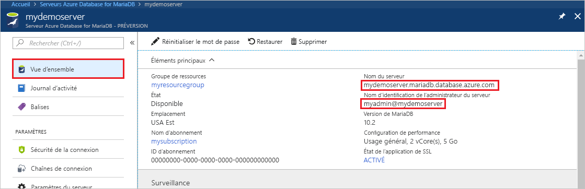
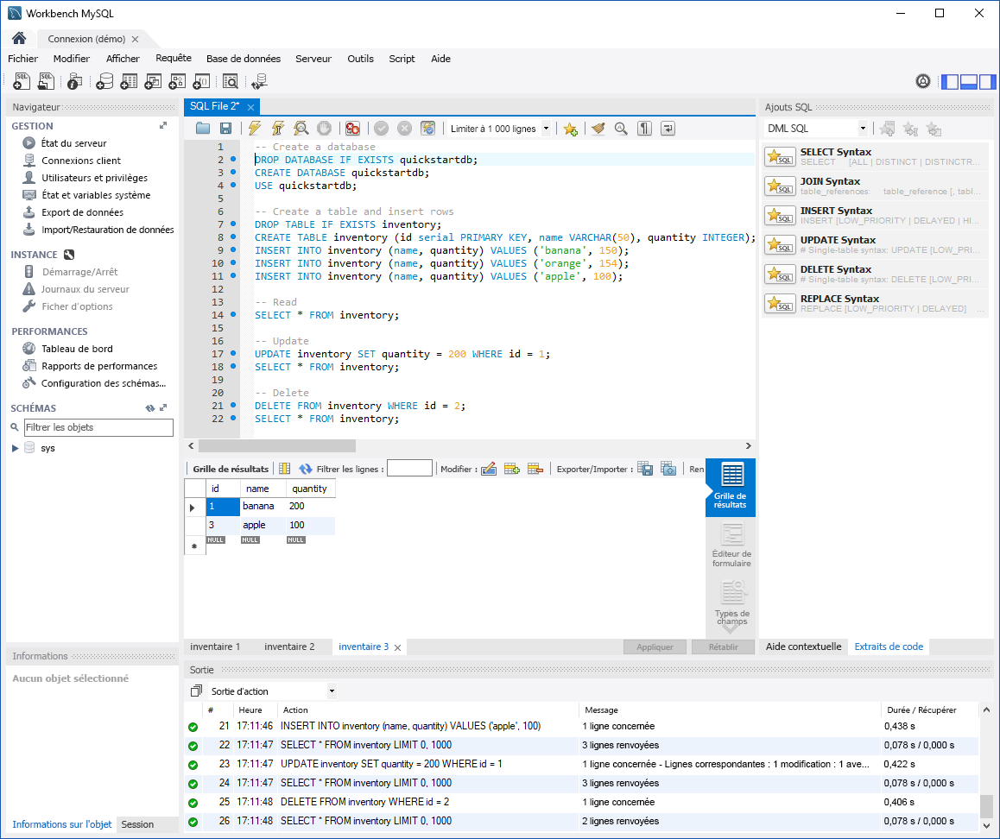

# <a name="quickstart-azure-database-for-mariadb-use-mysql-workbench-to-connect-and-query-data"></a>Démarrage rapide : Azure Database for MariaDB : Utiliser MySQL Workbench pour se connecter et interroger des données

Ce démarrage rapide explique comment se connecter à une instance d’Azure Database for MariaDB en utilisant MySQL Workbench. 

## <a name="prerequisites"></a>Prérequis

Ce démarrage rapide s’appuie sur les ressources créées dans l’un des guides suivants :

- [Créer un serveur Azure Database for MariaDB à l’aide du portail Azure](./quickstart-create-mariadb-server-database-using-azure-portal.md)
- [Créer un serveur Azure Database for MariaDB à l’aide d’Azure CLI](./quickstart-create-mariadb-server-database-using-azure-cli.md)

## <a name="install-mysql-workbench"></a>Installer MySQL Workbench

[Téléchargez MySQL Workbench](https://dev.mysql.com/downloads/workbench/) et installez-le sur votre ordinateur.

## <a name="get-connection-information"></a>Obtenir des informations de connexion

Récupérez les informations de connexion nécessaires pour vous connecter à l’instance Azure Database for MariaDB. Vous devez disposer du nom du serveur complet et des informations d’identification.

1. Connectez-vous au [portail Azure](https://portal.azure.com/).

2. Dans le menu de gauche du Portail Azure, sélectionnez **Toutes les ressources**. Recherchez le serveur que vous avez créé (par exemple **mydemoserver**).

3. Sélectionnez le nom du serveur.

4. Sur la page **Vue d’ensemble** du serveur, notez les valeurs des champs **Nom du serveur** et **Nom de connexion de l’administrateur du serveur**. Si vous avez oublié votre mot de passe, vous pouvez également le réinitialiser sur cette page.

   

## <a name="connect-to-the-server-by-using-mysql-workbench"></a>Se connecter au serveur à l’aide de MySQL Workbench

Pour vous connecter à un serveur Azure Database for MariaDB avec MySQL Workbench :

1. Ouvrez MySQL Workbench sur votre ordinateur. 

2. Dans la boîte de dialogue **Configurer une nouvelle connexion**, entrez les informations suivantes dans l’onglet **Paramètres** :

   | Paramètre | Valeur suggérée | Description du champ |
   |---|---|---|
   |   Nom de connexion | **Connexion démo** | Spécifiez une étiquette pour cette connexion. |
   | Méthode de connexion | **Standard (TCP/IP)** | Standard (TCP/IP) est suffisant. |
   | HostName | *nom du serveur* | Spécifiez la valeur correspondant au nom du serveur utilisé pour créer l’instance Azure Database for MariaDB. Le serveur que nous utilisons dans notre exemple est **mydemoserver.mariadb.database.azure.com**. Utilisez le nom de domaine complet (\*.mariadb.database.azure.com), comme indiqué dans l’exemple. Si vous ne vous souvenez pas du nom de votre serveur, effectuez la procédure de la section précédente pour obtenir les informations de connexion.  |
   | Port | **3306** | Utilisez toujours le port 3306 lorsque vous vous connectez à Azure Database for MariaDB. |
   | Nom d’utilisateur |  *nom de connexion d’administrateur du serveur* | Entrez le nom d’utilisateur du compte d’administrateur du serveur que vous avez utilisé pour créer l’instance Azure Database for MariaDB. Le nom d’utilisateur dans notre exemple est **myadmin\@mydemoserver**. Si vous ne vous souvenez pas de l’ID de connexion d’administrateur du serveur, effectuez la procédure de la section précédente pour obtenir les informations de connexion. Le format est *nom_utilisateur\@nom_serveur*.
   | Mot de passe | *votre mot de passe* | Pour enregistrer le mot de passe, sélectionnez **Stocker dans le coffre-fort**. |

   

3. Sélectionnez **Tester la connexion** pour vérifier que tous les paramètres sont correctement configurés. 

4. Sélectionnez **OK** pour enregistrer la connexion. 

5. Sous **MySQL Connections** (Connexions MySQL), sélectionnez la vignette qui correspond à votre serveur. Attendez que la connexion soit établie.

   Un nouvel onglet SQL s’ouvre avec un éditeur vide où vous pouvez saisir vos requêtes.
    
   > [!NOTE]
   > Par défaut, la sécurité de la connexion SSL est exigée et appliquée sur votre serveur Azure Database for MariaDB. Habituellement, bien qu’aucune configuration supplémentaire pour les certificats SSL ne soit requise pour MySQL Workbench afin de vous connecter à votre serveur, nous recommandons de lier la certification d’autorité de certification SSL à MySQL Workbench. Si vous devez désactiver le protocole SSL, sur la page de vue d’ensemble du serveur dans le Portail Azure, sélectionnez **Sécurité de la connexion** dans le menu. Pour **Appliquer une connexion SSL**, sélectionnez **Désactivé**.

## <a name="create-table-and-insert-read-update-and-delete-data"></a>Créer une table et insérer, lire, mettre à jour et supprimer des données

1. Copiez et collez l’exemple de code SQL suivant sur la page d’un onglet SQL vide pour illustrer des exemples de données.

    Ce code crée une base de données vide nommée **quickstartdb**. Ensuite, il crée un exemple de table nommé **inventory**. Le code insère des lignes, puis les lit. Il modifie les données avec une instruction de mise à jour, puis lit de nouveau les lignes. Enfin, le code supprime une ligne, puis lit de nouveau les lignes.
    
    ```sql
    -- Create a database
    -- DROP DATABASE IF EXISTS quickstartdb;
    CREATE DATABASE quickstartdb;
    USE quickstartdb;
    
    -- Create a table and insert rows
    DROP TABLE IF EXISTS inventory;
    CREATE TABLE inventory (id serial PRIMARY KEY, name VARCHAR(50), quantity INTEGER);
    INSERT INTO inventory (name, quantity) VALUES ('banana', 150);
    INSERT INTO inventory (name, quantity) VALUES ('orange', 154);
    INSERT INTO inventory (name, quantity) VALUES ('apple', 100);
    
    -- Read
    SELECT * FROM inventory;
    
    -- Update
    UPDATE inventory SET quantity = 200 WHERE id = 1;
    SELECT * FROM inventory;
    
    -- Delete
    DELETE FROM inventory WHERE id = 2;
    SELECT * FROM inventory;
    ```

    La capture d’écran montre un exemple de code SQL dans MySQL Workbench et la sortie obtenue après son exécution :
    
    

2. Pour exécuter l’exemple de code SQL, sélectionnez l’icône d’éclair dans la barre d’outils de l’onglet **Fichier SQL**.
3. Observez les trois onglets de résultats dans la section **Grille de résultats** au milieu de la page. 
4. Observez la liste **Sortie** en bas de la page. L’état de chaque commande s’affiche. 

Dans ce démarrage rapide, vous vous êtes connecté à Azure Database for MariaDB à l’aide de MySQL Workbench et avez interrogé des données en utilisant le langage SQL.

<!--
## Next steps
> [!div class="nextstepaction"]
> [Migrate your database using Export and Import](./concepts-migrate-import-export.md)
-->
