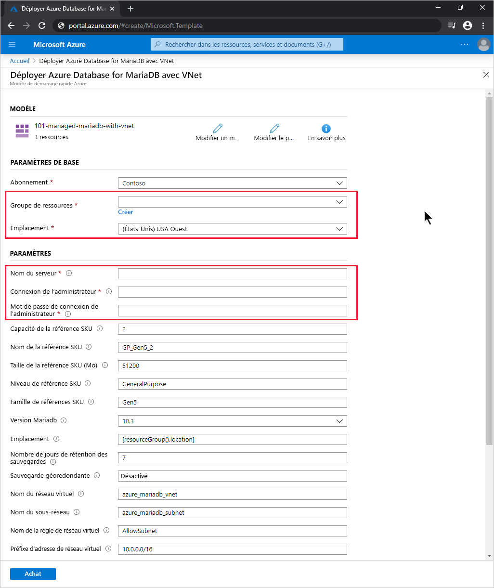

# <a name="quickstart-use-an-arm-template-to-create-an-azure-database-for-mariadb-server"></a>Démarrage rapide : Création d’un serveur Azure Database for MariaDB à l’aide d’un modèle ARM

Azure Database for MariaDB est un service géré qui vous permet d’exécuter, de gérer et de mettre à l’échelle des bases de données MariaDB hautement disponibles dans le cloud. Ce guide de démarrage rapide utilise un modèle Azure Resource Manager (modèle ARM) pour créer un serveur Azure Database for MariaDB dans le portail Azure, PowerShell ou Azure CLI.

[!INCLUDE [About Azure Resource Manager](../../includes/resource-manager-quickstart-introduction.md)]

Si votre environnement remplit les prérequis et que vous êtes déjà familiarisé avec l’utilisation des modèles ARM, sélectionnez le bouton **Déployer sur Azure**. Le modèle s’ouvre dans le portail Azure.

[](https://portal.azure.com/#create/Microsoft.Template/uri/https%3a%2f%2fraw.githubusercontent.com%2fAzure%2fazure-quickstart-templates%2fmaster%2f101-managed-mariadb-with-vnet%2fazuredeploy.json)

## <a name="prerequisites"></a>Prérequis

# <a name="portal"></a>[Portail](#tab/azure-portal)

Compte Azure avec un abonnement actif. [Créez-en un gratuitement](https://azure.microsoft.com/free/).

# <a name="powershell"></a>[PowerShell](#tab/PowerShell)

* Compte Azure avec un abonnement actif. [Créez-en un gratuitement](https://azure.microsoft.com/free/).
* Si vous souhaitez exécuter le code localement, [Azure PowerShell](/powershell/azure/).

# <a name="cli"></a>[INTERFACE DE LIGNE DE COMMANDE](#tab/CLI)

* Compte Azure avec un abonnement actif. [Créez-en un gratuitement](https://azure.microsoft.com/free/).
* Si vous souhaitez exécuter le code localement, [Azure CLI](/cli/azure/).

---

## <a name="review-the-template"></a>Vérifier le modèle

Vous créez un serveur Azure Database for MariaDB avec un ensemble défini de ressources de calcul et de stockage. Pour en savoir plus, consultez [Niveaux tarifaires Azure Database for MariaDB](concepts-pricing-tiers.md). Vous créez ce serveur dans un [groupe de ressources Azure](../azure-resource-manager/management/overview.md).

Le modèle utilisé dans ce démarrage rapide est tiré des [modèles de démarrage rapide Azure](https://azure.microsoft.com/resources/templates/101-managed-mariadb-with-vnet/).

:::code language="json" source="~/quickstart-templates/101-managed-mariadb-with-vnet/azuredeploy.json" range="001-231" highlight="149,162,176,199,213":::

Le modèle définit cinq ressources Azure :

* [**Microsoft.Network/virtualNetworks**](/azure/templates/microsoft.network/virtualnetworks)
* [**Microsoft.Network/virtualNetworks/subnets**](/azure/templates/microsoft.network/virtualnetworks/subnets)
* [**Microsoft.DBforMariaDB/servers**](/azure/templates/microsoft.dbformariadb/servers)
* [**Microsoft.DBforMariaDB/servers/virtualNetworkRules**](/azure/templates/microsoft.dbformariadb/servers/virtualnetworkrules)
* [**Microsoft.DBforMariaDB/servers/firewallRules**](/azure/templates/microsoft.dbformariadb/servers/firewallrules)

Pour voir d’autres exemples de modèles Azure Database for MariaDB, consultez [Modèles de démarrage rapide Azure](https://azure.microsoft.com/resources/templates/?resourceType=Microsoft.Dbformariadb&pageNumber=1&sort=Popular).

## <a name="deploy-the-template"></a>Déployer le modèle

# <a name="portal"></a>[Portail](#tab/azure-portal)

Sélectionnez le lien suivant afin de déployer le modèle de serveur Azure Database for MariaDB dans le portail Azure :

[](https://portal.azure.com/#create/Microsoft.Template/uri/https%3a%2f%2fraw.githubusercontent.com%2fAzure%2fazure-quickstart-templates%2fmaster%2f101-managed-mariadb-with-vnet%2fazuredeploy.json)

Dans la page **Déployer Azure Database for MariaDB avec un réseau virtuel** :

1. Pour **Groupe de ressources**, sélectionnez **Créer**, entrez un nom pour le nouveau groupe de ressources, puis sélectionnez **OK**.

2. Si vous avez créé un groupe de ressources, sélectionnez une **Localisation** pour le groupe de ressources et le nouveau serveur.

3. Entrez un **Nom de serveur**, une **Connexion de l’administrateur** et un **Mot de passe de connexion de l’administrateur**.

    

4. Changez les autres paramètres par défaut si vous le souhaitez :

    * **Abonnement** : sélectionnez l’abonnement Azure que vous souhaitez utiliser pour le serveur.
    * **Capacité de la référence** : capacité vCore, qui peut être *2* (valeur par défaut), *4*, *8*, *16*, *32* ou *64*.
    * **Nom de la référence** : préfixe du niveau de référence, famille de références et capacité de référence, joints par des traits de soulignement, par exemple, *B_Gen5_1*, *GP_Gen5_2* (valeur par défaut) ou *MO_Gen5_32*.
    * **Taille de la référence (Mo)**  : taille de stockage, en mégaoctets, du serveur Azure Database for MariaDB (par défaut, *51200*).
    * **Niveau de référence SKU** : niveau de déploiement, tel que *Basic*, *GeneralPurpose* (valeur par défaut) ou *MemoryOptimized*.
    * **Famille de références** : *Gen4* ou *Gen5* (valeur par défaut), qui indique la génération du matériel pour le déploiement du serveur.
    * **Version de Mariadb** : version du serveur MariaDB à déployer, par exemple *10.2* ou *10.3* (valeur par défaut).
    * **Nombre de jours de conservation de la sauvegarde** : période souhaitée pour la conservation des sauvegardes géoredondantes, en jours (par défaut, *7*).
    * **Sauvegarde géoredondante** : *Activé* ou *Désactivé* (valeur par défaut), en fonction des exigences de géo-reprise d’activité après sinistre.
    * **Nom du réseau virtuel** : nom du réseau virtuel (par défaut, *azure_mariadb_vnet*).
    * **Nom du sous-réseau** : nom du sous-réseau (par défaut, *azure_mariadb_subnet*).
    * **Nom de la règle de réseau virtuel** : nom de la règle de réseau virtuel autorisant le sous-réseau (par défaut, *AllowSubnet*).
    * **Préfixe d’adresse de réseau virtuel** : préfixe d’adresse du réseau virtuel (par défaut, *10.0.0.0/16*).
    * **Préfixe de sous-réseau** : préfixe de l’adresse du sous-réseau (par défaut, *10.0.0.0/16*).

5. Lisez les conditions générales, puis cochez la case **J’accepte les conditions générales mentionnées ci-dessus**.

6. Sélectionnez **Achat**.

# <a name="powershell"></a>[PowerShell](#tab/PowerShell)

Utilisez le code interactif suivant pour créer un serveur Azure Database for MariaDB à l’aide du modèle. Le code vous invite à entrer le nom du nouveau serveur, le nom et la localisation d’un nouveau groupe de ressources ainsi qu’un nom et un mot de passe de compte d’administrateur.

Pour exécuter le code dans Azure Cloud Shell, sélectionnez **Essayer** dans le coin supérieur de n’importe quel bloc de code.

```azurepowershell-interactive
$serverName = Read-Host -Prompt "Enter a name for the new Azure Database for MariaDB server"
$resourceGroupName = Read-Host -Prompt "Enter a name for the new resource group where the server will exist"
$location = Read-Host -Prompt "Enter an Azure region (for example, centralus) for the resource group"
$adminUser = Read-Host -Prompt "Enter the Azure Database for MariaDB server's administrator account name"
$adminPassword = Read-Host -Prompt "Enter the administrator password" -AsSecureString

New-AzResourceGroup -Name $resourceGroupName -Location $location # Use this command when you need to create a new resource group for your deployment
New-AzResourceGroupDeployment -ResourceGroupName $resourceGroupName `
    -TemplateUri https://raw.githubusercontent.com/Azure/azure-quickstart-templates/master/101-managed-mariadb-with-vnet/azuredeploy.json `
    -serverName $serverName `
    -administratorLogin $adminUser `
    -administratorLoginPassword $adminPassword

Read-Host -Prompt "Press [ENTER] to continue: "
```

# <a name="cli"></a>[INTERFACE DE LIGNE DE COMMANDE](#tab/CLI)

Utilisez le code interactif suivant pour créer un serveur Azure Database for MariaDB à l’aide du modèle. Le code vous invite à entrer le nom du nouveau serveur, le nom et la localisation d’un nouveau groupe de ressources ainsi qu’un nom et un mot de passe de compte d’administrateur.

Pour exécuter le code dans Azure Cloud Shell, sélectionnez **Essayer** dans le coin supérieur de n’importe quel bloc de code.

```azurecli-interactive
read -p "Enter a name for the new Azure Database for MariaDB server:" serverName &&
read -p "Enter a name for the new resource group where the server will exist:" resourceGroupName &&
read -p "Enter an Azure region (for example, centralus) for the resource group:" location &&
read -p "Enter the Azure Database for MariaDB server's administrator account name:" adminUser &&
read -p "Enter the administrator password:" adminPassword &&
params='serverName='$serverName' administratorLogin='$adminUser' administratorLoginPassword='$adminPassword &&
az group create --name $resourceGroupName --location $location &&
az deployment group create --resource-group $resourceGroupName --parameters $params --template-uri https://raw.githubusercontent.com/Azure/azure-quickstart-templates/master/101-managed-mariadb-with-vnet/azuredeploy.json &&
read -p "Press [ENTER] to continue: "
```

---

## <a name="review-deployed-resources"></a>Vérifier les ressources déployées

# <a name="portal"></a>[Portail](#tab/azure-portal)

Pour obtenir une vue d’ensemble de votre nouveau serveur Azure Database for MariaDB, procédez comme suit :

1. Dans le [portail Azure](https://portal.azure.com), cherchez et sélectionnez **Serveurs Azure Database for MariaDB**.

2. Dans la liste des bases de données, sélectionnez votre nouveau serveur. La page **Vue d’ensemble** de votre nouveau serveur Azure Database for MariaDB s’affiche.

# <a name="powershell"></a>[PowerShell](#tab/PowerShell)

Exécutez le code interactif suivant pour afficher les détails de votre serveur Azure Database for MariaDB. Vous devrez entrer le nom du nouveau serveur.

```azurepowershell-interactive
$serverName = Read-Host -Prompt "Enter the name of your Azure Database for MariaDB server"
Get-AzResource -ResourceType "Microsoft.DbForMariaDB/servers" -Name $serverName | ft
Read-Host -Prompt "Press [ENTER] to continue: "
```

# <a name="cli"></a>[INTERFACE DE LIGNE DE COMMANDE](#tab/CLI)

Exécutez le code interactif suivant pour afficher les détails de votre serveur Azure Database for MariaDB. Vous devrez entrer le nom et le groupe de ressources du nouveau serveur.

```azurecli-interactive
read -p "Enter your Azure Database for MariaDB server name: " serverName &&
read -p "Enter the resource group where the Azure Database for MariaDB server exists: " resourcegroupName &&
az resource show --resource-group $resourcegroupName --name $serverName --resource-type "Microsoft.DbForMariaDB/servers" &&
read -p "Press [ENTER] to continue: "
```

---

## <a name="clean-up-resources"></a>Nettoyer les ressources

Quand vous n’en avez plus besoin, supprimez le groupe de ressources, ce qui supprime également les ressources qu’il contient.

# <a name="portal"></a>[Portail](#tab/azure-portal)

1. Dans le [portail Azure](https://portal.azure.com), recherchez et sélectionnez **Groupes de ressources**.

2. Dans la liste des groupes de ressources, choisissez le nom de votre groupe de ressources.

3. Dans la page **Vue d’ensemble** de votre groupe de ressources, sélectionnez **Supprimer le groupe de ressources**.

4. Dans la boîte de dialogue de confirmation, entrez le nom de votre groupe de ressources, puis sélectionnez **Supprimer**.

# <a name="powershell"></a>[PowerShell](#tab/PowerShell)

```azurepowershell-interactive
$resourceGroupName = Read-Host -Prompt "Enter the Resource Group name"
Remove-AzResourceGroup -Name $resourceGroupName
Read-Host -Prompt "Press [ENTER] to continue: "
```

# <a name="cli"></a>[INTERFACE DE LIGNE DE COMMANDE](#tab/CLI)

```azurecli-interactive
read -p "Enter the Resource Group name: " resourceGroupName &&
az group delete --name $resourceGroupName &&
read -p "Press [ENTER] to continue: "
```

---

## <a name="next-steps"></a>Étapes suivantes

Pour obtenir un tutoriel pas à pas expliquant comment créer un modèle ARM, consultez :

> [!div class="nextstepaction"]
> [Tutoriel : Créer et déployer votre premier modèle Resource Manager](../azure-resource-manager/templates/template-tutorial-create-first-template.md)
