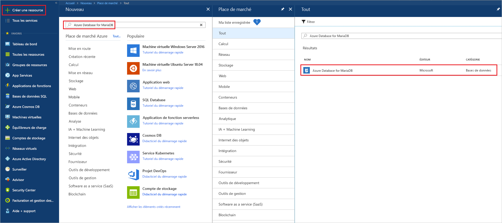
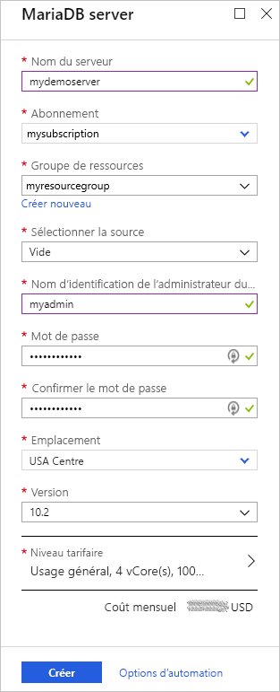
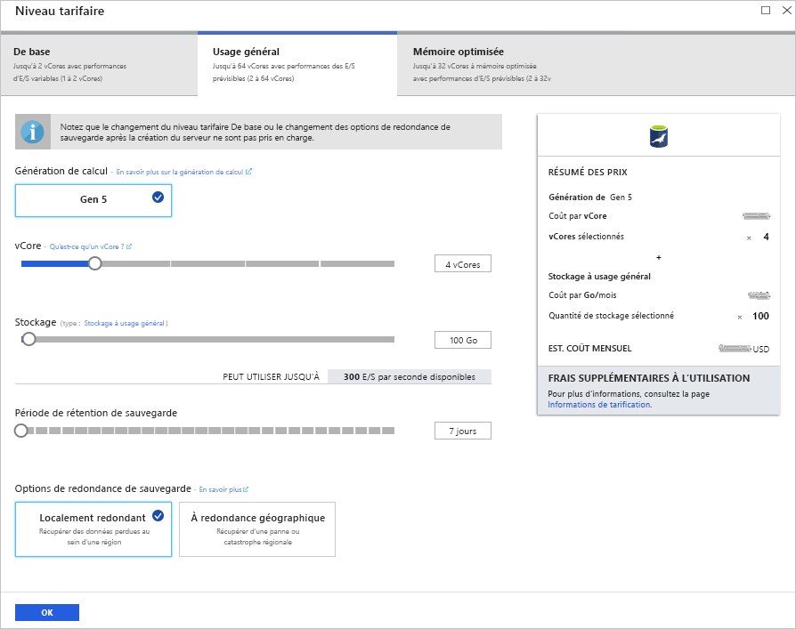
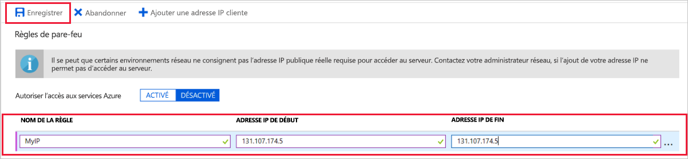
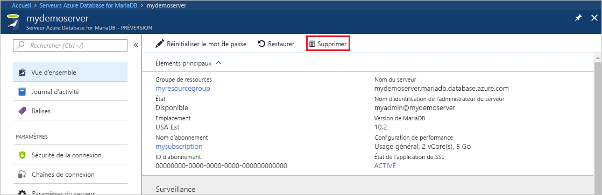

# <a name="create-an-azure-database-for-mariadb-server-by-using-the-azure-portal"></a>Créer un serveur Azure Database for MariaDB à l’aide du portail Azure

Azure Database for MariaDB est un service managé qui vous permet d’exécuter, de gérer et de mettre à l’échelle des bases de données MariaDB hautement disponibles dans le cloud. Ce guide de démarrage rapide vous montre comment créer un serveur Azure Database for MariaDB en quelques minutes à l’aide du Portail Azure.  

Si vous n’avez pas d’abonnement Azure, créez un [compte Azure gratuit](https://azure.microsoft.com/free/) avant de commencer.

## <a name="sign-in-to-the-azure-portal"></a>Connectez-vous au portail Azure.

Dans votre navigateur web, accédez au [Portail Azure](https://portal.azure.com/). Entrez vos informations d’identification pour vous connecter au portail. Il s’ouvre par défaut sur le tableau de bord des services.

## <a name="create-an-azure-database-for-mariadb-server"></a>Créer un serveur Azure Database for MariaDB

Vous créez un serveur Azure Database for MariaDB avec un ensemble défini de [ressources de calcul et de stockage](concepts-pricing-tiers.md). Vous créez ce serveur dans un [groupe de ressources Azure](../azure-resource-manager/management/overview.md).

Pour créer un serveur Azure Database for MariaDB :

1. Cliquez sur le bouton **Créer une ressource** (+) dans le coin supérieur gauche du portail.

2. Sélectionnez **Bases de données** > **Azure Database for MariaDB**. Vous pouvez également taper **MariaDB** dans la zone de recherche pour trouver le service.

   

3. Entrez ou sélectionnez les détails de serveur suivants :

   

    Paramètre | Valeur suggérée | Description
    ---|---|---
    Nom du serveur | *un nom de serveur unique* | Choisissez un nom unique qui identifie votre serveur Azure Database for MariaDB. Par exemple, **mydemoserver**. Le nom de domaine *.mariadb.database.azure.com* est ajouté au nom du serveur que vous entrez. Le nom de serveur ne peut contenir que des lettres minuscules, des chiffres et le caractère de trait d’union (-). Il doit contenir entre 3 et 63 caractères.
    Abonnement | *votre abonnement* | Sélectionnez l’abonnement Azure que vous souhaitez utiliser pour votre serveur. Si vous avez plusieurs abonnements, choisissez celui dans lequel la ressource est facturée.
    Resource group | **myresourcegroup** | Entrez le nom d’un nouveau groupe de ressources, ou sélectionnez un groupe de ressources existant. 
    Sélectionner une source | **Vide** | Sélectionnez **Vide** pour créer un nouveau serveur à partir de zéro. (Sélectionnez **Sauvegarde** si vous créez un serveur à partir d’une géosauvegarde d’un serveur Azure Database for MariaDB existant.)
    Connexion d’administrateur serveur | **myadmin** | Un compte de connexion à utiliser lors de la connexion au serveur. Le nom de connexion d’administrateur ne doit pas être **azure_superuser**, **admin**, **administrator**, **root**, **guest** ou **public**.
    Mot de passe | *votre choix* | Entrez un nouveau mot de passe pour le compte d’administrateur du serveur. Il doit contenir entre 8 et 128 caractères. Votre mot de passe doit contenir des caractères de trois des catégories suivantes : Lettres majuscules, lettres minuscules, chiffres (0-9) et caractères non alphanumériques (comme !, $, #, %, etc.).
    Confirmer le mot de passe | *votre choix*| Confirmez le mot de passe du compte d’administrateur.
    Emplacement | *La région la plus proche de vos utilisateurs*| Choisissez l’emplacement le plus proche de vos utilisateurs ou de vos autres applications Azure.
    Version | *La version la plus récente*| La version la plus récente (sauf si vous avez des exigences spécifiques pour utiliser une autre version).
    Niveau tarifaire | Consultez la description. | Les configurations de calcul, de stockage et de sauvegarde pour votre nouveau serveur. Sélectionnez **Niveau tarifaire** > **Usage général**. Conservez les valeurs par défaut des paramètres suivants :<br><ul><li>**Génération de calcul** (Gen 5)</li><li>**vCore** (4 vCores)</li><li>**Stockage** (100 Go)</li><li>**Période de rétention de sauvegarde** (7 jours)</li></ul><br>Pour activer les sauvegardes de votre serveur dans le stockage géoredondant, sélectionnez **Géographiquement redondant** pour **Options de redondance de sauvegarde**. <br><br>Pour enregistrer cette sélection du niveau tarifaire, sélectionnez **OK**. La capture d’écran suivante capture ces sélections.
  
   > [!NOTE]
   > Choisissez le niveau tarifaire De base si votre charge de travail n’a pas besoin d’une grande capacité de calcul et d’E/S. Notez que les serveurs créés avec le niveau tarifaire De base ne peuvent plus ensuite être mis à l’échelle vers le niveau Usage général ou Mémoire optimisée. Pour plus d’informations, consultez la [page des tarifs](https://azure.microsoft.com/pricing/details/mariadb/).

   

4. Sélectionnez **Vérifier + créer** pour provisionner le serveur. L’approvisionnement peut durer jusqu’à 20 minutes.

5. Pour surveiller le processus de déploiement, sélectionnez **Notifications** dans la barre d’outils (icône de cloche).

Par défaut, les bases de données suivantes sont créées sous votre serveur : **information_schema**, **mysql**, **performance_schema**, et **sys**.

## <a name="configure-a-server-level-firewall-rule"></a><a name="configure-firewall-rule"></a>Configurer une règle de pare-feu au niveau du serveur

Le service Azure Database for MariaDB crée un pare-feu au niveau du serveur. Le pare-feu empêche les applications et les outils externes de se connecter au serveur ou à toute base de données sur le serveur, sauf si une règle de pare-feu est créée pour ouvrir le pare-feu à des adresses IP spécifiques. 

Pour créer une règle de pare-feu au niveau du serveur :

1. Une fois le déploiement terminé, localisez votre serveur. Si nécessaire, vous pouvez le rechercher. Par exemple, dans le menu de gauche, sélectionnez **Toutes les ressources**. Ensuite, saisissez le nom du serveur. Par exemple, entrez **mydemoserver** pour rechercher le serveur que vous venez de créer. Sélectionnez le nom du serveur dans la liste des résultats. La page **Vue d’ensemble** de votre serveur s’ouvre. Vous pouvez modifier d’autres paramètres sur cette page.

2. Sur la page de vue d’ensemble du serveur, sélectionnez **Sécurité de la connexion**.

3. Sous **Règles de pare-feu**, sélectionnez la zone de texte vide de la colonne **Nom de la règle** pour commencer à créer la règle de pare-feu. Spécifiez la plage exacte d’adresses IP des clients qui se connecteront à ce serveur.

   

4. Dans la barre d’outils supérieure de la page **Sécurité de la connexion**, sélectionnez **Enregistrer**. Avant de continuer, attendez de voir la notification indiquant que la mise à jour s’est terminée avec succès.

   > [!NOTE]
   > Les connexions à Azure Database for MariaDB communiquent sur le port 3306. Si vous essayez de vous connecter depuis un réseau d’entreprise, le trafic sortant sur le port 3306 peut être bloqué. Dans ce cas, pour vous connecter à votre serveur, votre service informatique doit ouvrir le port 3306.

## <a name="get-connection-information"></a>Obtenir des informations de connexion

Pour vous connecter à votre serveur de base de données, il vous faut le nom de serveur complet et les informations d’identification de connexion d’administrateur. Il est possible que vous ayez noté ces valeurs précédemment dans cet article. Si vous ne l’avez pas fait, vous pouvez facilement localiser le nom du serveur et les informations de connexion sur la page **Vue d’ensemble** ou sur la page **Propriétés** du serveur sur le Portail Azure :

1. Accédez à la page **Vue d’ensemble** de votre serveur. Prenez note des valeurs du **nom du serveur** et du **nom de connexion d’administrateur du serveur**.

2. Pour copier les valeurs, placez votre curseur sur la zone à copier. L’icône de copie s’affiche à droite du texte. Sélectionnez l’icône de copie appropriée pour copier les valeurs qui vous intéressent.

Dans notre exemple, le nom du serveur est **mydemoserver.mariadb.database.azure.com** et le nom de connexion d’administrateur du serveur est **myadmin\@mydemoserver**.

## <a name="connect-to-azure-database-for-mariadb-by-using-the-mysql-command-line"></a>Se connecter à Azure Database for MariaDB à l’aide de la ligne de commande mysql

Vous pouvez utiliser différentes applications pour vous connecter à votre serveur Azure Database for MariaDB.

Tout d’abord, nous allons utiliser l’outil de ligne de commande [mysql](https://dev.mysql.com/doc/refman/5.7/en/mysql.html) pour illustrer la procédure de connexion au serveur. Vous pouvez également utiliser un navigateur web et Azure Cloud Shell sans avoir besoin d’installer de logiciel. Si vous avez installé l’utilitaire mysql en local, vous pouvez également vous y connecter depuis cet emplacement.

1. Lancez Azure Cloud Shell via l’icône de la console ( **>_** ) située dans la barre d’outils en haut à droite sur le Portail Azure.
   

2. Azure Cloud Shell s’ouvre dans votre navigateur. Vous pouvez vous servir des commandes de l’interpréteur Bash dans Cloud Shell.

   

3. À l’invite Cloud Shell, connectez-vous à votre serveur Azure Database for MariaDB en entrant la ligne de commande mysql.

    Pour vous connecter à un serveur Azure Database for MariaDB à l’aide de l’utilitaire mysql, utilisez le format suivant :

    ```cmd
    mysql --host <fully qualified server name> --user <server admin login name>@<server name> -p
    ```

    Par exemple, la commande ci-après permet de se connecter au serveur de notre exemple :

    ```cmd
    mysql --host mydemoserver.mariadb.database.azure.com --user myadmin@mydemoserver -p
    ```

    Paramètre mysql |Valeur suggérée|Description
    ---|---|---
    --host | *nom du serveur* | La valeur du nom du serveur que vous avez utilisée pour créer le serveur Azure Database for MariaDB. Le serveur que nous utilisons dans notre exemple est **mydemoserver.mariadb.database.azure.com**. Utilisez le nom de domaine complet ( **\*.mariadb.database.azure.com**), comme indiqué dans l’exemple. Si vous ne vous souvenez pas du nom de votre serveur, effectuez la procédure de la section précédente pour obtenir les informations de connexion.
    --user | *nom de connexion d’administrateur du serveur* |Le nom d’utilisateur de connexion administrateur du serveur que vous avez utilisé pour créer le serveur Azure Database for MariaDB. Si vous ne vous souvenez pas du nom d’utilisateur, effectuez la procédure de la section précédente pour obtenir les informations de connexion. Le format est *nom_utilisateur\@nom_serveur*.
    -p | *votre mot de passe*<br>(patienter jusqu’à être invité) |Lorsque vous y êtes invité, entrez le mot de passe que vous avez utilisé pour créer le serveur. Les caractères du mot de passe que vous tapez ne sont pas visibles au niveau de l’invite bash. Après avoir entré le mot de passe, appuyez sur Entrée.

   Une fois l’utilitaire mysql connecté, une invite `mysql>` s’affiche. Vous pouvez entrer des commandes à l’invite.

   Voici un exemple de sortie mysql :

    ```output
    Welcome to the MySQL monitor.  Commands end with ; or \g.
    Your MySQL connection id is 65505
    Server version: 5.6.39.0 MariaDB Server
    
    Copyright (c) 2000, 2017, Oracle and/or its affiliates. All rights reserved.
    
    Oracle is a registered trademark of Oracle Corporation and/or its
    affiliates. Other names may be trademarks of their respective
    owners.

    Type 'help;' or '\h' for help. Type '\c' to clear the current input statement.
    
    mysql>
    ```
    
    > [!TIP]
    > Si le pare-feu n’est pas configuré pour autoriser l’adresse IP d’Azure Cloud Shell, l’erreur suivante se produit :
    >
    >   ERROR 2003 (28000) : Le client avec l’adresse IP 123.456.789.0 n’est pas autorisé à accéder au serveur.
    >
    > Pour résoudre l’erreur, assurez-vous que la configuration du serveur correspond à celle décrite dans la section [Configurer une règle pare-feu au niveau du serveur](#configure-firewall-rule).

4. Pour vérifier la connexion, entrez **status** à l’invite `mysql>` pour vérifier l’état du serveur.

    ```sql
    status
    ```

   > [!TIP]
   > Pour les autres commandes, consultez le [Manuel de référence de MySQL 5.7 - Chapitre 4.5.1](https://dev.mysql.com/doc/refman/5.7/en/mysql.html).

5. Créez une base de données vide à l’invite `mysql>` en entrant la commande suivante :

   ```sql
   CREATE DATABASE quickstartdb;
   ```
   La commande peut prendre quelques instants pour se terminer. 

   Vous pouvez créer une ou plusieurs bases de données sur un serveur Azure Database for MariaDB. Vous pouvez créer une seule base de données par serveur pour utiliser toutes les ressources, ou créer plusieurs bases de données pour partager les ressources. Il n’existe aucune limite au nombre de bases de données que vous pouvez créer, mais plusieurs bases de données partagent les mêmes ressources de serveur. 

6. Pour répertorier les bases de données, entrez la commande suivante à l’invite `mysql>` :

    ```sql
    SHOW DATABASES;
    ```

7. Entrez **\q**, puis appuyez sur Entrée pour fermer l’outil mysql. Ensuite, vous pouvez fermer Azure Cloud Shell.

Vous venez de vous connecter au serveur Azure Database for MariaDB et de créer une base de données utilisateur vide. Dans la section suivante, vous vous connecterez au même serveur à l’aide d’un autre outil commun, MySQL Workbench.

## <a name="connect-to-the-server-by-using-mysql-workbench"></a>Se connecter au serveur à l’aide de MySQL Workbench

Pour se connecter au serveur à l’aide de MySQL Workbench :

1. Ouvrez MySQL Workbench sur votre ordinateur client. Pour télécharger et installer MySQL Workbench, accédez à la page [Télécharger MySQL Workbench](https://dev.mysql.com/downloads/workbench/).

2. Pour créer une nouvelle connexion, sélectionnez l’icône plus ( **+** ) à côté du titre **Connexions MySQL**.

3. Dans la boîte de dialogue **Configurer une nouvelle connexion**, entrez les informations de votre connexion au serveur dans l’onglet **Paramètres**. Les valeurs d’espace réservé sont affichées à titre d’exemple. Remplacez **Nom d’hôte**, **Nom d’utilisateur** et **Mot de passe** par vos propres valeurs.

   

    |Paramètre |Valeur suggérée|Description du champ|
    |---|---|---|
     Nom de la connexion | **Connexion démo** | Une étiquette pour cette connexion. |
    Méthode de connexion | **Standard (TCP/IP)** | Standard (TCP/IP) est suffisant. |
    HostName | *nom du serveur* | La valeur du nom du serveur que vous avez utilisée pour créer le serveur Azure Database for MariaDB. Le serveur que nous utilisons dans notre exemple est **mydemoserver.mariadb.database.azure.com**. Utilisez le nom de domaine complet ( **\*.mariadb.database.azure.com**), comme indiqué dans l’exemple. Si vous ne vous souvenez plus du nom de votre serveur, effectuez la procédure décrite précédemment dans cet article pour obtenir les informations de connexion.|
     Port | 3306 | Le port à utiliser lorsque vous vous connectez au serveur Azure Database for MariaDB. |
    Nom d’utilisateur |  *nom de connexion d’administrateur du serveur* | Les informations de connexion de l’administrateur du serveur que vous avez utilisées pour créer le serveur Azure Database for MariaDB. Le nom d’utilisateur dans notre exemple est **myadmin\@mydemoserver**. Si vous ne vous souvenez pas du nom d’utilisateur, effectuez la procédure décrite précédemment dans cet article pour obtenir les informations de connexion. Le format est *nom_utilisateur\@nom_serveur*.
    Mot de passe | *votre mot de passe* | Pour enregistrer le mot de passe, sélectionnez **Stocker dans le coffre-fort**. |

4. Sélectionnez **Tester la connexion** pour vérifier que tous les paramètres sont correctement configurés. Sélectionnez ensuite **OK** pour enregistrer la connexion. 

    > [!NOTE]
    > Le protocole SSL est appliqué par défaut sur votre serveur. Une configuration supplémentaire est nécessaire pour que la connexion soit réussie. Pour plus d’informations, voir [Configuration de la connectivité SSL dans votre application pour se connecter de manière sécurisée à Azure Database for MariaDB](./howto-configure-ssl.md). Pour désactiver le protocole SSL de ce guide de démarrage rapide, sélectionnez **Sécurité de la connexion** dans le menu sur la page de vue d’ensemble du serveur dans le Portail Azure. Pour **Appliquer une connexion SSL**, sélectionnez **Désactivé**.

## <a name="clean-up-resources"></a>Nettoyer les ressources

Vous disposez de deux moyens de supprimer les ressources que vous avez créées dans ce guide de démarrage rapide. Vous pouvez supprimer le [groupe de ressources Azure](../azure-resource-manager/management/overview.md). Cette option supprime toutes les ressources du groupe de ressources. Si vous souhaitez conserver les autres ressources, supprimez uniquement la ressource d’un serveur.

> [!TIP]
> Les autres guides de démarrage rapide de cette collection reposent sur ce guide. Si vous souhaitez continuer à utiliser les guides de démarrage rapide d’Azure Database for MariaDB, ne supprimez pas les ressources créées au cours de ce guide. Sinon, procédez comme suit pour supprimer toutes les ressources que vous avez créées dans le cadre de ce guide de démarrage rapide.

Pour supprimer l’intégralité du groupe de ressources, y compris le serveur nouvellement créé :

1. Dans le Portail Azure, localisez votre groupe de ressources. Dans le menu de gauche, sélectionnez **Groupes de ressources**, puis le nom de votre groupe de ressources (dans notre exemple, **myresourcegroup**).

2. Dans la page du groupe de ressources, sélectionnez **Supprimer**. Ensuite, entrez le nom de votre groupe de ressources (dans notre exemple, **myresourcegroup**) pour confirmer la suppression. Sélectionnez **Supprimer**.

Pour ne supprimer que le serveur nouvellement créé :

1. Dans le Portail Azure, localisez votre serveur s’il n’est pas déjà ouvert. Dans le menu de gauche, sélectionnez **Toutes les ressources**. Recherchez ensuite le serveur que vous avez créé.

2. Dans la page **Vue d’ensemble**, sélectionnez **Supprimer**.

   

3. Confirmez le nom du serveur à supprimer. Affichez en dessous les bases de données concernées par la suppression. Entrez le nom de votre serveur (dans notre exemple, **mydemoserver**) pour confirmer la suppression. Sélectionnez **Supprimer**.

## <a name="next-steps"></a>Étapes suivantes

- [Concevoir votre première base de données Azure Database for MariaDB](./tutorial-design-database-using-portal.md)
