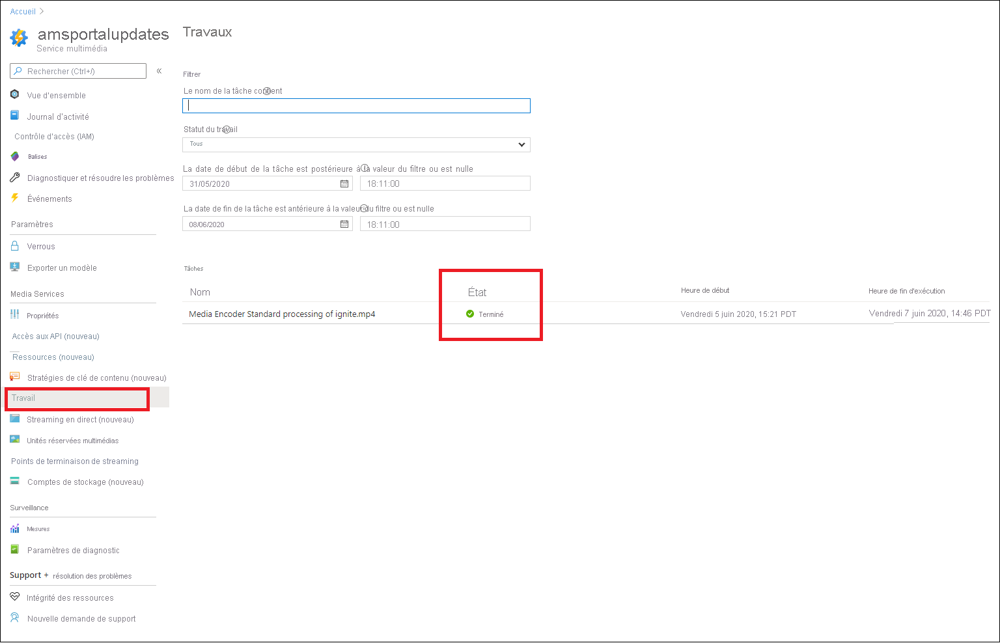

# Démarrage rapide : Charger, encoder et diffuser en streaming du contenu via le portail

[!INCLUDE [media services api v3 logo](./includes/v3-hr.md)]

Ce guide de démarrage rapide vous montre comment utiliser le portail Azure pour charger, encoder et diffuser en streaming du contenu avec Azure Media Services.
  
## Vue d’ensemble

* Pour commencer à gérer, chiffrer, encoder, analyser et diffuser en streaming du contenu multimédia dans Azure, vous devez créer un compte Media Services et charger votre fichier de contenu multimédia numérique de haute qualité dans un **actif multimédia**. 
    
    > [!NOTE]
    > Si votre vidéo a été chargée dans le compte Media Services à l’aide de l’API Media Services v3, ou si du contenu a été généré à partir d’une sortie en direct, vous ne verrez pas les boutons **Encoder**, **Analyser** ou **Chiffrer** dans le portail Azure. Utilisez les API Media Services v3 pour effectuer ces tâches.

    Consultez les pages suivantes : 

  * [Chargement et stockage cloud](storage-account-concept.md)
  * [Concept des éléments multimédias](assets-concept.md)
* Une fois que vous avez chargé votre fichier de contenu multimédia numérique de haute qualité dans un actif multimédia (actif multimédia d’entrée), vous pouvez le traiter (encoder ou analyser). Le contenu traité passe dans un autre actif multimédia (actif multimédia de sortie). 
    * [Encodez](encode-concept.md) votre fichier chargé dans des formats pouvant être lus sur une grande variété de navigateurs et d’appareils.
    * [Analysez](analyze-video-audio-files-concept.md) votre fichier chargé. 

        Quand vous utilisez le portail Azure, vous pouvez effectuer les opérations suivantes : générer un fichier de sous-titres codés TTML et WebVTT. Vous pouvez utiliser les fichiers ayant ces formats pour rendre les fichiers audio et vidéo accessibles aux personnes malentendantes. Vous pouvez également extraire des mots clés de votre contenu.

        Pour une expérience riche qui vous permet d’extraire des insights de vos fichiers vidéo et audio, utilisez les présélections Media Services v3 (décrites dans [Tutoriel : Analyser des vidéos avec Media Services v3](analyze-videos-tutorial.md).  Si vous souhaitez obtenir des informations plus détaillées, utilisez directement [Azure Video Analyzer](../../azure-video-analyzer/video-analyzer-for-media-docs/index.yml).    
* Une fois votre contenu traité, vous pouvez distribuer du contenu multimédia aux lecteurs clients. Pour permettre aux clients d’accéder en lecture aux vidéos de l’actif multimédia de sortie, vous devez créer un **localisateur de streaming**. Durant la création du **localisateur de streaming**, vous devez spécifier une **stratégie de streaming**. Les **stratégies de streaming** vous permettent de définir des protocoles de streaming et des options de chiffrement (le cas échéant) pour vos **localisateurs de streaming**.
    
    Révision :

    * [Localisateurs de Streaming](stream-streaming-locators-concept.md)
    * [Stratégies de streaming](stream-streaming-policy-concept.md)
    * [Empaquetage et distribution](encode-dynamic-packaging-concept.md)
    * [Filtres](filters-concept.md)
* Vous pouvez protéger votre contenu en le chiffrant avec la norme AES-128 (Advanced Encryption Standard) et/ou l’un des trois principaux systèmes DRM : Microsoft PlayReady, Google Widevine et Apple FairPlay. Le guide de démarrage rapide [Chiffrer du contenu via le portail Azure](drm-encrypt-content-how-to.md) montre comment configurer la protection du contenu.
        
## Prérequis

[!INCLUDE [quickstarts-free-trial-note](../../../includes/quickstarts-free-trial-note.md)]

[Créer un compte Media Services](account-create-how-to.md)

## Télécharger

1. Connectez-vous au [portail Azure](https://portal.azure.com/).
1. Recherchez votre compte Media Services, puis cliquez sur celui-ci.
1. Sélectionnez **Actifs multimédias (nouveaux)** .
1. Appuyez sur **Charger** en haut de la fenêtre. 
1. Effectuez un glisser-déposer, ou recherchez un fichier à charger.

Si vous accédez à la fenêtre de vos actifs multimédias, vous voyez qu’un nouvel actif multimédia a été ajouté à la liste :

## Encoder

1. Sélectionnez **Actifs multimédias (nouveaux)** .
1. Sélectionnez votre nouvel actif multimédia (ajouté à la dernière étape).
1. Cliquez sur **Encoder** en haut de la fenêtre.

    Appuyez sur ce bouton pour démarrer le travail d’encodage. Une fois l’opération réussie, un actif multimédia de sortie contenant le contenu encodé est généré.

Si vous accédez à la fenêtre de vos actifs multimédias, vous voyez que le nouvel actif multimédia de sortie a été ajouté à la liste :

## Superviser la progression des travaux

Pour voir l’état des travaux, accédez à **Travaux**. Le travail passe généralement par les états suivants : Planifié, En attente, Traitement en cours, Terminé (l’état final). Si le travail a rencontré une erreur, vous obtenez l’état Erreur.

## Publier et diffuser en streaming

Pour publier un actif multimédia, vous devez désormais lui ajouter un localisateur de streaming.

### Localisateur de streaming 

1. Dans la section **Localisateur de streaming**, appuyez sur **+ Ajouter un localisateur de streaming**.
    Cela entraîne la publication de l’actif multimédia et la génération des URL de streaming.

    > [!NOTE]
    > Si vous souhaitez que votre flux soit chiffré, vous devez créer une stratégie de clé de contenu et l’affecter au localisateur de streaming. Pour plus d’informations, consultez [Chiffrer du contenu via le portail Azure](drm-encrypt-content-how-to.md).
1. Dans la fenêtre **Ajouter un localisateur de streaming**, choisissez l’une des stratégies de streaming prédéfinies. Pour plus d’informations, consultez les [stratégies de streaming](stream-streaming-policy-concept.md)

    

Une fois que l’actif multimédia a été publié, vous pouvez le diffuser par streaming directement dans le portail. 

Sinon, copiez l’URL de streaming, puis utilisez-la dans votre lecteur client.

> [!NOTE]
> Vérifiez que le [point de terminaison de streaming](stream-streaming-endpoint-concept.md) est en cours d’exécution. Quand vous créez un compte Media Services pour la première fois, le point de terminaison de streaming par défaut est créé et se trouve à l’état arrêté. Vous devez donc le démarrer avant de pouvoir diffuser votre contenu en streaming. Vous êtes facturé uniquement quand votre point de terminaison de streaming est à l’état en cours d’exécution.

## Nettoyer les ressources

Si vous envisagez d’essayer les autres démarrages rapides, vous devez vous en tenir aux ressources créées. Dans le cas contraire, accédez au Portail Azure et à vos groupes de ressources, sélectionnez le groupe de ressources sous lequel vous avez exécuté ce guide de démarrage rapide, puis supprimez toutes les ressources.

## Étapes suivantes

[Utiliser le portail pour chiffrer du contenu](drm-encrypt-content-how-to.md)
