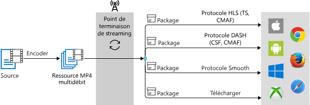

# <a name="dynamic-packaging-in-media-services-v3"></a>Empaquetage dynamique dans Media Services v3

[!INCLUDE [media services api v3 logo](./includes/v3-hr.md)]

Microsoft Azure Media Services peut être utilisé pour encoder de nombreux formats de fichier multimédia source. Il les remet via différents protocoles de diffusion en continu, avec ou sans protection de contenu, pour atteindre tous les appareils principaux (comme les appareils iOS et Android). Ces clients comprennent différents protocoles. Par exemple, iOS demande que les flux soient remis au format HTTP Live Streaming (HLS) et que les appareils Android prennent en charge TLS et MPEG DASH.

Dans Media Services, un [point de terminaison de streaming](streaming-endpoint-concept.md) (origine) représente un service d’empaquetage dynamique (juste-à-temps) à l’origine qui permet de distribuer votre contenu en direct et à la demande directement à une application de lecture cliente. Il utilise un des protocoles de diffusion multimédia en continu courants mentionnés dans la section suivante. L’*empaquetage dynamique* est une fonctionnalité standard sur tous les points de terminaison de streaming.

> [!NOTE]
> Vous pouvez utiliser le [portail Azure](https://portal.azure.com/) pour gérer les [événements en direct](live-events-outputs-concept.md) v3, voir des [actifs multimédias](assets-concept.md) v3 et obtenir des informations sur l’accès aux API. Pour toutes les autres tâches de gestion (par exemple les transformations et les travaux), utilisez l’[API REST](/rest/api/media/), l’[interface CLI](https://aka.ms/ams-v3-cli-ref) ou l’un des [kits SDK](media-services-apis-overview.md#sdks) pris en charge.

## <a name="to-prepare-your-source-files-for-delivery"></a>Pour préparer vos fichiers sources en vue de leur distribution

Pour bénéficier de l’empaquetage dynamique, vous devez [encoder](encoding-concept.md) votre fichier mezzanine (source) en un ensemble de fichiers MP4 à vitesse de transmission multiple (format ISO Base Media 14496-12). Vous devez avoir un [actif multimédia](assets-concept.md) avec les fichiers MP4 encodés et les fichiers config de streaming nécessaires à l’empaquetage dynamique de Media Services. À partir de cet ensemble de fichiers MP4, vous pouvez utiliser l’empaquetage dynamique pour distribuer du contenu vidéo via les protocoles de streaming multimédia décrits ci-dessous.

L’empaquetage dynamique d’Azure Media Services prend en charge seulement les fichiers audio et vidéo au format de conteneur MP4. Les fichiers audio doivent également être encodés dans un conteneur MP4 lors de l’utilisation d’autres codecs, comme Dolby.  

> [!TIP]
> Pour obtenir les fichiers MP4 et les fichiers de configuration de streaming, vous pouvez, par exemple, [encoder votre fichier mezzanine avec Media Services](#encode-to-adaptive-bitrate-mp4s). 

Pour rendre les vidéos dans l’élément multimédia encodé disponibles en lecture pour les clients, vous devez créer un [localisateur de streaming](streaming-locators-concept.md) et générer des URL de diffusion en continu. Ensuite, en fonction du format spécifié dans le manifeste du client de streaming (HLS, MPEG DASH ou Smooth Streaming), vous recevez le flux dans le protocole que vous avez choisi.

Par conséquent, il vous suffit de stocker et de payer les fichiers dans un seul format de stockage. Le service Media Services se charge de créer et de fournir la réponse appropriée en fonction des demandes des clients.

Si vous envisagez de protéger votre contenu à l’aide du chiffrement dynamique Media Services, consultez [Protocoles de streaming et types de chiffrement](content-protection-overview.md#streaming-protocols-and-encryption-types).

### <a name="hls-protocol"></a>Protocole HLS

Votre client de streaming peut spécifier les formats HLS suivants :

|Protocol|Exemple|
|---|---|
|HLS V4 |`https://amsv3account-usw22.streaming.media.azure.net/21b17732-0112-4d76-b526-763dcd843449/ignite.ism/manifest(format=m3u8-aapl)`||
|HLS V3 |`https://amsv3account-usw22.streaming.media.azure.net/21b17732-0112-4d76-b526-763dcd843449/ignite.ism/manifest(format=m3u8-aapl-v3)`||
|HLS CMAF| `https://amsv3account-usw22.streaming.media.azure.net/21b17732-0112-4d76-b526-763dcd843449/ignite.ism/manifest(format=m3u8-cmaf)`||

> [!NOTE]
> Les recommandations spécifiées dans les instructions précédentes d’Apple indiquaient que la solution de secours pour les réseaux à faible bande passante était de fournir un flux audio uniquement.  À l’heure actuelle, l’encodeur Media Services génère automatiquement une piste audio uniquement.  Les instructions Apple stipulent à présent que la piste audio uniquement ne doit *pas* être incluse, en particulier pour la distribution Apple TV.  Afin d’éviter que le joueur n’ait pas par défaut une piste audio uniquement, nous vous suggérons d’utiliser la balise « audio-only = false » dans l’URL, ce qui supprime le rendu audio uniquement dans le format TLS, ou utiliser simplement HLS-v3. Par exemple : `http://host/locator/asset.ism/manifest(format=m3u8-aapl,audio-only=false)`.

### <a name="mpeg-dash-protocol"></a>Protocole MPEG-DASH

Votre client de streaming peut spécifier les formats MPEG-DASH suivants :

|Protocol|Exemple|
|---|---|
|MPEG-DASH CSF| `https://amsv3account-usw22.streaming.media.azure.net/21b17732-0112-4d76-b526-763dcd843449/ignite.ism/manifest(format=mpd-time-csf)` ||
|MPEG-DASH CMAF|`https://amsv3account-usw22.streaming.media.azure.net/21b17732-0112-4d76-b526-763dcd843449/ignite.ism/manifest(format=mpd-time-cmaf)` ||

### <a name="smooth-streaming-protocol"></a>Protocole Smooth Streaming

Votre client de streaming peut spécifier les formats Smooth Streaming suivants :

|Protocol|Remarques/Exemples| 
|---|---|
|Smooth Streaming| `https://amsv3account-usw22.streaming.media.azure.net/21b17732-0112-4d76-b526-763dcd843449/ignite.ism/manifest`||
|Smooth Streaming 2.0 (manifeste hérité)|Par défaut, le manifeste Smooth Streaming contient la balise de répétition (r-tag). Toutefois, certains lecteurs ne prennent pas en charge la balise `r-tag`. Les clients disposant de ces lecteurs peuvent utiliser un format qui désactive la balise r-tag :<br/><br/>`https://amsv3account-usw22.streaming.media.azure.net/21b17732-0112-4d76-b526-763dcd843449/ignite.ism/manifest(format=fmp4-v20)`|

> [!NOTE]
> Smooth Streaming nécessite la présence d’audio et de vidéo dans votre flux.

## <a name="on-demand-streaming-workflow"></a>Workflow du streaming à la demande

Les étapes qui suivent présentent un workflow de streaming Media Services courant dans lequel l’empaquetage dynamique est utilisé avec l’Encodeur Standard dans Azure Media Services.

1. [Charger un fichier d'entrée](job-input-from-http-how-to.md), tel qu’un fichier MP4, QuickTime/MOV, ou d’un autre format de fichier pris en charge. On parle également dans ce cas de fichier source ou mezzanine. Pour obtenir la liste des formats pris en charge, consultez [Formats pris en charge par l’encodeur standard](media-encoder-standard-formats.md).
1. [Encodez](#encode-to-adaptive-bitrate-mp4s) votre fichier mezzanine en un ensemble de fichiers MP4 à vitesse de transmission adaptative H.264/AAC.

    Si vous avez déjà encodé des fichiers et voulez simplement les copier et les diffuser, utilisez : les API [CopyVideo](https://docs.microsoft.com/rest/api/media/transforms/createorupdate#copyvideo) et [CopyAudio](https://docs.microsoft.com/rest/api/media/transforms/createorupdate#copyaudio). Par conséquent, un nouveau fichier MP4 avec un manifeste de diffusion en continu (fichier. ISM) sera créé.
1. Publier l’élément multimédia de sortie qui contient le fichier au débit adaptatif MP4 défini. Vous publiez en créant un [localisateur de streaming](streaming-locators-concept.md).
1. Générez des URL qui ciblent différents formats (HLS, MPEG-DASH et Smooth Streaming). Le *point de terminaison de streaming* s’occupe de distribuer le manifeste et les requêtes appropriés pour tous ces différents formats.
    
Le diagramme suivant illustre le flux de travail du streaming à la demande avec l’empaquetage dynamique.



Le chemin de téléchargement est présent dans l’image ci-dessus juste pour vous montrer que vous pouvez télécharger un fichier MP4 directement via le *point de terminaison de streaming* (origine). (Vous spécifiez la [stratégie de streaming](streaming-policy-concept.md) téléchargeable sur le localisateur de streaming).<br/>L’empaqueteur dynamique ne modifie pas le fichier. Vous avez la possibilité d’utiliser les API Stockage Blob Azure pour accéder directement à un MP4 pour un téléchargement progressif si vous voulez ignorer les fonctionnalités (d’origine) du *point de terminaison de streaming*. 

### <a name="encode-to-adaptive-bitrate-mp4s"></a>Encoder en fichiers MP4 à débit adaptatif

Les articles suivants donnent des exemples de l’[encodage d’une vidéo avec Media Services](encoding-concept.md) :

* [Encoder à partir d’une URL HTTPS à l’aide de préréglages intégrés](job-input-from-http-how-to.md).
* [Encoder un fichier local à l’aide de préréglages intégrés](job-input-from-local-file-how-to.md).
* [Créer un préréglage intégré pour les besoins de votre scénario ou votre appareil](customize-encoder-presets-how-to.md).

Consultez la liste des [formats et codecs](media-encoder-standard-formats.md) de l’encodeur standard.

## <a name="live-streaming-workflow"></a>Workflow de streaming en direct

Un événement en direct peut être défini sur *Pass-through* (un encodeur live local envoie un flux à vitesse de transmission multiple) ou sur *Live Encoding* (un encodeur live local envoie un flux à vitesse de transmission unique). 

Voici un workflow courant pour le streaming en direct avec l’*empaquetage dynamique* :

1. Créez un [événement en direct](live-events-outputs-concept.md).
1. Récupérez l’URL d’ingestion et configurez votre encodeur local afin qu’il utilise cette URL pour envoyer le flux de contribution.
1. Récupérez l’URL d’aperçu et utilisez-la pour vérifier que l’entrée de l’encodeur est bien reçue.
1. Créez un actif multimédia.
1. Créez une sortie en direct et utilisez le nom de l’actif multimédia que vous venez de créer.<br />La sortie en direct archive le flux dans l’actif multimédia.
1. Créez un localisateur de streaming avec les types intégrés de la stratégie de streaming.<br />Pour chiffrer le contenu, voir [Vue d’ensemble de la protection du contenu](content-protection-overview.md).
1. Listez les chemins dans le localisateur de streaming pour obtenir les URL à utiliser.
1. Récupérez le nom d’hôte du point de terminaison de streaming à partir duquel vous souhaitez effectuer le streaming.
1. Générez des URL qui ciblent différents formats (HLS, MPEG-DASH et Smooth Streaming). Le *point de terminaison de streaming* s’occupe de distribuer le manifeste et les requêtes appropriés pour les différents formats.

Ce diagramme montre le workflow du streaming en direct avec l’*empaquetage dynamique* :


Pour plus d’informations sur le streaming en direct dans Media Services v3, consultez [Vue d’ensemble du streaming en direct](live-streaming-overview.md).

## <a name="video-codecs-supported-by-dynamic-packaging"></a>Codecs vidéo pris en charge par l’empaquetage dynamique

L’empaquetage dynamique prend en charge les fichiers vidéo qui sont à un format de fichier de conteneur MP4 et qui contiennent de la vidéo encodée avec [H.264](https://en.m.wikipedia.org/wiki/H.264/MPEG-4_AVC) (MPEG-4 AVC ou AVC1) ou [H.265](https://en.m.wikipedia.org/wiki/High_Efficiency_Video_Coding) (HEVC, hev1 ou hvc1).

> [!NOTE]
> Des résolutions allant jusqu’à 4K et des fréquences d’images allant jusqu’à 60 images/seconde ont été testées avec l’*empaquetage dynamique*.

## <a name="audio-codecs-supported-by-dynamic-packaging"></a>Codecs audio pris en charge par l’empaquetage dynamique

L’empaquetage dynamique prend également en charge les fichiers audio stockés au format de conteneur de fichier MP4 contenant un flux audio encodé dans un des codecs suivants :

* [AAC](https://en.wikipedia.org/wiki/Advanced_Audio_Coding) (AAC-LC, HE-AAC v1 ou HE-AAC v2). 
* [Dolby Digital Plus](https://en.wikipedia.org/wiki/Dolby_Digital_Plus) (Enhanced AC-3 ou E-AC3).  L’audio encodé doit être stocké au format de conteneur MP4 pour fonctionner avec l’empaquetage dynamique.
* Dolby Atmos

   Le streaming de contenu Dolby Atmos est pris en charge pour les normes telles que le protocole MPEG-DASH avec MP4 fragmenté au format CSF (Common Streaming Format) ou CMAF (Common Media Application Format), et via HLS (HTTP Live Streaming) avec CMAF.
* [DTS](https://en.wikipedia.org/wiki/DTS_%28sound_system%29)<br />
   Les codecs DTS pris en charge par les formats d’empaquetage DASH-CSF, DASH-CMAF, HLS-M2TS et HLS-CMAF sont :  

    * DTS Digital Surround (dtsc)
    * DTS-HD High Resolution et DTS-HD Master Audio (dtsh)
    * DTS Express (dtse)
    * DTS-HD Lossless (pas de cœur) (dtsl)

L’empaquetage dynamique prend en charge plusieurs pistes audio avec DASH ou HLS (version 4 ou ultérieure) pour le streaming d’actifs multimédias ayant plusieurs pistes audio avec plusieurs langues et codecs.

Pour tous les codecs audio ci-dessus, l’audio encodé doit être stocké au format de conteneur MP4 pour fonctionner avec l’empaquetage dynamique. Le service ne prend pas en charge les formats de fichiers de flux élémentaires bruts sur Stockage Blob (par exemple, les formats suivants ne sont pas pris en charge : .dts, .ac3). 

Seuls les fichiers avec l’extension .mp4 de l’extension .mp4a sont pris en charge pour l’empaquetage audio. 

### <a name="limitations"></a>Limites

#### <a name="ios-limitation-on-aac-51-audio"></a>Limitation iOS sur l’audio AAC 5.1

Les appareils iOS d’Apple ne prennent pas en charge le codec audio AAC 5.1. L’audio multicanal doit être encodé à l’aide des codecs Dolby Digital ou Dolby Digital Plus.

Pour plus d’informations, consultez la [spécification de création de contenu HLS pour les appareils Apple](https://developer.apple.com/documentation/http_live_streaming/hls_authoring_specification_for_apple_devices).

> [!NOTE]
> Media Services ne prend pas en charge l’encodage des formats audio multicanaux Dolby Digital, Dolby Digital Plus ou Dolby Digital Plus avec Dolby Atmos.

#### <a name="dolby-digital-audio"></a>Audio Dolby Digital

L’empaquetage dynamique Media Services ne prend pas en charge les fichiers contenant de l’audio [Dolby Digital](https://en.wikipedia.org/wiki/Dolby_Digital) (AC3) (car cela est considéré comme un codec hérité par Dolby).

## <a name="manifests"></a>Manifestes

Dans l’*empaquetage dynamique* Media Services, les manifestes du client de streaming pour HLS, MPEG-DASH et Smooth Streaming sont générés dynamiquement selon le sélecteur de format dans l’URL.  

Un fichier manifeste inclut des métadonnées de streaming telles que les suivantes : type de piste (audio, vidéo ou texte), nom de piste, heure de début et de fin, débit (qualités), langues de piste, fenêtre de présentation (fenêtre glissante de durée fixe) et codec vidéo (FourCC). Il indique également au lecteur de récupérer le fragment suivant en fournissant des informations sur les fragments vidéo pouvant être lus suivants disponibles et leur emplacement. Les fragments (ou segments) correspondent aux « blocs » réels d’un contenu vidéo.

### <a name="examples"></a>Exemples

#### <a name="hls"></a>HLS

Voici un exemple d’un fichier manifeste HLS, également appelé liste de lectures principale HLS : 

```
#EXTM3U
#EXT-X-VERSION:4
#EXT-X-MEDIA:TYPE=AUDIO,GROUP-ID="audio",NAME="aac_eng_2_128041_2_1",LANGUAGE="eng",DEFAULT=YES,AUTOSELECT=YES,URI="QualityLevels(128041)/Manifest(aac_eng_2_128041_2_1,format=m3u8-aapl)"
#EXT-X-STREAM-INF:BANDWIDTH=536608,RESOLUTION=320x180,CODECS="avc1.64000d,mp4a.40.2",AUDIO="audio"
QualityLevels(381048)/Manifest(video,format=m3u8-aapl)
#EXT-X-I-FRAME-STREAM-INF:BANDWIDTH=536608,RESOLUTION=320x180,CODECS="avc1.64000d",URI="QualityLevels(381048)/Manifest(video,format=m3u8-aapl,type=keyframes)"
#EXT-X-STREAM-INF:BANDWIDTH=884544,RESOLUTION=480x270,CODECS="avc1.640015,mp4a.40.2",AUDIO="audio"
QualityLevels(721495)/Manifest(video,format=m3u8-aapl)
#EXT-X-I-FRAME-STREAM-INF:BANDWIDTH=884544,RESOLUTION=480x270,CODECS="avc1.640015",URI="QualityLevels(721495)/Manifest(video,format=m3u8-aapl,type=keyframes)"
#EXT-X-STREAM-INF:BANDWIDTH=1327398,RESOLUTION=640x360,CODECS="avc1.64001e,mp4a.40.2",AUDIO="audio"
QualityLevels(1154816)/Manifest(video,format=m3u8-aapl)
#EXT-X-I-FRAME-STREAM-INF:BANDWIDTH=1327398,RESOLUTION=640x360,CODECS="avc1.64001e",URI="QualityLevels(1154816)/Manifest(video,format=m3u8-aapl,type=keyframes)"
#EXT-X-STREAM-INF:BANDWIDTH=2413312,RESOLUTION=960x540,CODECS="avc1.64001f,mp4a.40.2",AUDIO="audio"
QualityLevels(2217354)/Manifest(video,format=m3u8-aapl)
#EXT-X-I-FRAME-STREAM-INF:BANDWIDTH=2413312,RESOLUTION=960x540,CODECS="avc1.64001f",URI="QualityLevels(2217354)/Manifest(video,format=m3u8-aapl,type=keyframes)"
#EXT-X-STREAM-INF:BANDWIDTH=3805760,RESOLUTION=1280x720,CODECS="avc1.640020,mp4a.40.2",AUDIO="audio"
QualityLevels(3579827)/Manifest(video,format=m3u8-aapl)
#EXT-X-I-FRAME-STREAM-INF:BANDWIDTH=3805760,RESOLUTION=1280x720,CODECS="avc1.640020",URI="QualityLevels(3579827)/Manifest(video,format=m3u8-aapl,type=keyframes)"
#EXT-X-STREAM-INF:BANDWIDTH=139017,CODECS="mp4a.40.2",AUDIO="audio"
QualityLevels(128041)/Manifest(aac_eng_2_128041_2_1,format=m3u8-aapl)
```

#### <a name="mpeg-dash"></a>MPEG-DASH

Voici un exemple d’un fichier manifeste MPEG-DASH, également appelé fichier MPEG-DASH MPD (Media Presentation Description) :

```xml
<?xml version="1.0" encoding="UTF-8"?>
<MPD xmlns="urn:mpeg:dash:schema:mpd:2011" xmlns:xsi="https://www.w3.org/2001/XMLSchema-instance" profiles="urn:mpeg:dash:profile:isoff-live:2011" type="static" mediaPresentationDuration="PT1M10.315S" minBufferTime="PT7S">
   <Period>
      <AdaptationSet id="1" group="5" profiles="ccff" bitstreamSwitching="false" segmentAlignment="true" contentType="audio" mimeType="audio/mp4" codecs="mp4a.40.2" lang="en">
         <SegmentTemplate timescale="10000000" media="QualityLevels($Bandwidth$)/Fragments(aac_eng_2_128041_2_1=$Time$,format=mpd-time-csf)" initialization="QualityLevels($Bandwidth$)/Fragments(aac_eng_2_128041_2_1=i,format=mpd-time-csf)">
            <SegmentTimeline>
               <S d="60160000" r="10" />
               <S d="41386666" />
            </SegmentTimeline>
         </SegmentTemplate>
         <Representation id="5_A_aac_eng_2_128041_2_1_1" bandwidth="128041" audioSamplingRate="48000" />
      </AdaptationSet>
      <AdaptationSet id="2" group="1" profiles="ccff" bitstreamSwitching="false" segmentAlignment="true" contentType="video" mimeType="video/mp4" codecs="avc1.640020" maxWidth="1280" maxHeight="720" startWithSAP="1">
         <SegmentTemplate timescale="10000000" media="QualityLevels($Bandwidth$)/Fragments(video=$Time$,format=mpd-time-csf)" initialization="QualityLevels($Bandwidth$)/Fragments(video=i,format=mpd-time-csf)">
            <SegmentTimeline>
               <S d="60060000" r="10" />
               <S d="42375666" />
            </SegmentTimeline>
         </SegmentTemplate>
         <Representation id="1_V_video_1" bandwidth="3579827" width="1280" height="720" />
         <Representation id="1_V_video_2" bandwidth="2217354" codecs="avc1.64001F" width="960" height="540" />
         <Representation id="1_V_video_3" bandwidth="1154816" codecs="avc1.64001E" width="640" height="360" />
         <Representation id="1_V_video_4" bandwidth="721495" codecs="avc1.640015" width="480" height="270" />
         <Representation id="1_V_video_5" bandwidth="381048" codecs="avc1.64000D" width="320" height="180" />
      </AdaptationSet>
   </Period>
</MPD>
```
#### <a name="smooth-streaming"></a>Smooth Streaming

Voici un exemple d’un fichier manifeste Smooth Streaming :

```xml
<?xml version="1.0" encoding="UTF-8"?>
<SmoothStreamingMedia MajorVersion="2" MinorVersion="2" Duration="703146666" TimeScale="10000000">
   <StreamIndex Chunks="12" Type="audio" Url="QualityLevels({bitrate})/Fragments(aac_eng_2_128041_2_1={start time})" QualityLevels="1" Language="eng" Name="aac_eng_2_128041_2_1">
      <QualityLevel AudioTag="255" Index="0" BitsPerSample="16" Bitrate="128041" FourCC="AACL" CodecPrivateData="1190" Channels="2" PacketSize="4" SamplingRate="48000" />
      <c t="0" d="60160000" r="11" />
      <c d="41386666" />
   </StreamIndex>
   <StreamIndex Chunks="12" Type="video" Url="QualityLevels({bitrate})/Fragments(video={start time})" QualityLevels="5">
      <QualityLevel Index="0" Bitrate="3579827" FourCC="H264" MaxWidth="1280" MaxHeight="720" CodecPrivateData="0000000167640020ACD9405005BB011000003E90000EA600F18319600000000168EBECB22C" />
      <QualityLevel Index="1" Bitrate="2217354" FourCC="H264" MaxWidth="960" MaxHeight="540" CodecPrivateData="000000016764001FACD940F0117EF01100000303E90000EA600F1831960000000168EBECB22C" />
      <QualityLevel Index="2" Bitrate="1154816" FourCC="H264" MaxWidth="640" MaxHeight="360" CodecPrivateData="000000016764001EACD940A02FF9701100000303E90000EA600F162D960000000168EBECB22C" />
      <QualityLevel Index="3" Bitrate="721495" FourCC="H264" MaxWidth="480" MaxHeight="270" CodecPrivateData="0000000167640015ACD941E08FEB011000003E90000EA600F162D9600000000168EBECB22C" />
      <QualityLevel Index="4" Bitrate="381048" FourCC="H264" MaxWidth="320" MaxHeight="180" CodecPrivateData="000000016764000DACD941419F9F011000003E90000EA600F14299600000000168EBECB22C" />
      <c t="0" d="60060000" r="11" />
      <c d="42375666" />
   </StreamIndex>
</SmoothStreamingMedia>
```

### <a name="naming-of-tracks-in-the-manifest"></a>Dénomination des pistes dans le manifeste

Si un nom de piste audio est spécifié dans le fichier .ism, Media Services ajoute un élément `Label` dans un `AdaptationSet` pour spécifier les informations de texture pour la piste audio spécifique. Voici un exemple de manifeste DASH de sortie :

```xml
<AdaptationSet codecs="mp4a.40.2" contentType="audio" lang="en" mimeType="audio/mp4" subsegmentAlignment="true" subsegmentStartsWithSAP="1">
  <Label>audio_track_name</Label>
  <Role schemeIdUri="urn:mpeg:dash:role:2011" value="main"/>
  <Representation audioSamplingRate="48000" bandwidth="131152" id="German_Forest_Short_Poem_english-en-68s-2-lc-128000bps_seg">
    <BaseURL>German_Forest_Short_Poem_english-en-68s-2-lc-128000bps_seg.mp4</BaseURL>
  </Representation>
</AdaptationSet>
```

Le lecteur peut utiliser l'élément `Label` pour l’afficher sur son interface utilisateur.

### <a name="signaling-audio-description-tracks"></a>Signalisation des pistes de description audio

Vous pouvez ajouter une piste de narration à votre vidéo pour aider les clients malvoyants à suivre l’enregistrement vidéo en écoutant la narration. Vous devez annoter une piste audio en tant que description audio dans le manifeste. Pour ce faire, ajoutez les paramètres « accessibility » et « role » au fichier .ism. C’est à vous qu’il incombe de définir correctement ces paramètres pour signaler une piste audio en tant que description audio. Par exemple, ajoutez `<param name="accessibility" value="description" />` et `<param name="role" value="alternate"` au fichier .ism pour une piste audio spécifique. 

Pour plus d’informations, consultez l’exemple [Guide pratique pour signaler des pistes audio descriptives](signal-descriptive-audio-howto.md).

#### <a name="smooth-streaming-manifest"></a>Manifeste Smooth Streaming

Si vous lisez un flux Smooth Streaming, le manifeste transmet des valeurs dans les attributs `Accessibility` et `Role` pour cette piste audio. Par exemple, `Role="alternate" Accessibility="description"` est ajouté à l’élément `StreamIndex` pour indiquer qu’il s’agit d’une description audio.

#### <a name="dash-manifest"></a>Manifeste DASH

Pour le manifeste DASH, les deux éléments suivants sont ajoutés pour signaler la description audio :

```xml
<Accessibility schemeIdUri="urn:mpeg:dash:role:2011" value="description"/>
<Role schemeIdUri="urn:mpeg:dash:role:2011" value="alternate"/>
```

#### <a name="hls-playlist"></a>Sélection HLS

Pour HLS v7 et ultérieur `(format=m3u8-cmaf)`, sa sélection transmet `AUTOSELECT=YES,CHARACTERISTICS="public.accessibility.describes-video"` quand la piste de description audio est signalée.

#### <a name="example"></a>Exemple

Pour plus d’informations, consultez [Guide pratique pour signaler des pistes audio descriptives](signal-descriptive-audio-howto.md).

## <a name="dynamic-manifest"></a>Manifeste dynamique

Pour contrôler le nombre de pistes, les formats, les débits et les fenêtres de temps de présentation qui sont envoyés aux lecteurs, vous pouvez utiliser un filtrage dynamique avec l’empaquetage dynamique Media Services. Pour plus d’informations, consultez [Manifestes de filtrage préalable avec l’empaquetage dynamique](filters-dynamic-manifest-overview.md).

## <a name="dynamic-encryption"></a>Chiffrement dynamique

Le *chiffrement dynamique* permet de chiffrer dynamiquement votre contenu en direct ou à la demande avec AES-128 ou l’un des trois systèmes principaux de gestion des droits numériques (DRM) : Microsoft PlayReady, Google Widevine et Apple FairPlay. Media Services fournit également un service de distribution de clés AES et de licences DRM aux clients autorisés. Pour plus d’informations, consultez [Chiffrement dynamique](content-protection-overview.md).

> [!NOTE]
> Widevine est un service fourni par Google Inc. soumis aux conditions de service et à la politique de confidentialité de Google, Inc.

## <a name="more-information"></a>Informations complémentaires

Consultez [Communauté Azure Media Services](media-services-community.md) pour découvrir les différentes façons dont vous pouvez poser des questions, faire des commentaires et obtenir des mises à jour sur Media Services.

## <a name="need-help"></a>Vous avez besoin d’aide ?

Vous pouvez ouvrir un ticket de support en accédant à [Nouvelle demande de support](https://portal.azure.com/#blade/Microsoft_Azure_Support/HelpAndSupportBlade/newsupportrequest).

## <a name="next-steps"></a>Étapes suivantes

[Charger, encoder et diffuser des vidéos en continu](stream-files-tutorial-with-api.md)
